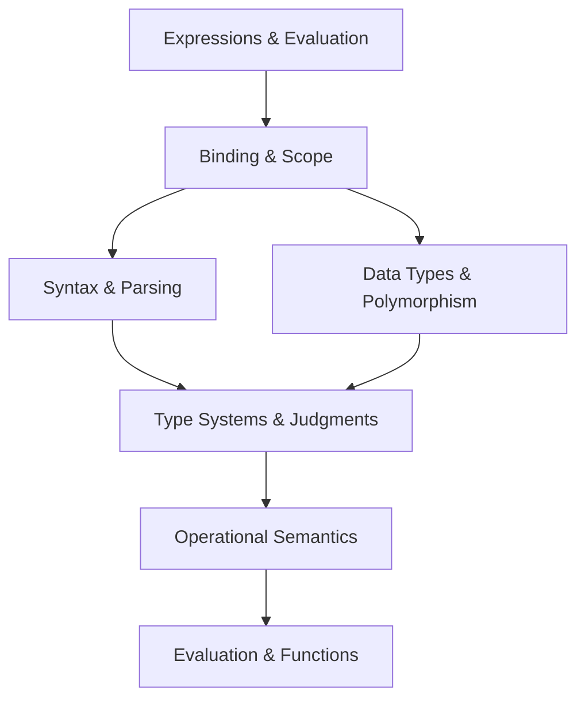

# Programming Language Theory — Overview

> **Source:** *Principles and Practice of Programming Language*

## What Is This?

This vault covers **programming language theory** — the principles, concepts, and ideas that underlie programming languages. It fills SWEBOK's Computing Foundations KA for language design, type systems, semantics, and implementation.

## Files

| File | Topics | Source |
|---|---|---|
| [[01_Expressions_and_Evaluation]] | Values, types, expressions, static type checking, evaluation | Ch 3 |
| [[02_Binding_and_Scope]] | Value/type bindings, scoping, shadowing, closures, pattern matching | Ch 4 |
| [[03_Data_Types_and_Polymorphism]] | Collections, algebraic data types, parametric polymorphism | Ch 6 |
| [[04_Syntax_and_Parsing]] | Concrete syntax, CFGs, abstract syntax, parsing, ASTs | Ch 11–13 |
| [[05_Type_Systems_and_Judgments]] | Static scoping, judgments, inference rules, type systems | Ch 14–17 |
| [[06_Operational_Semantics]] | Big-step semantics, evaluation judgments, closures, recursion | Ch 18–20 |
| [[07_Evaluation_and_Functions]] | Small-step semantics, evaluation order, substitution, non-determinism | Ch 21–22 |

## How These Topics Relate

## Reading Paths

| Your Goal | Start Here |
|---|---|
| **Language fundamentals** | [[01_Expressions_and_Evaluation]] → [[02_Binding_and_Scope]] → [[03_Data_Types_and_Polymorphism]] |
| **Parsing & grammars** | [[04_Syntax_and_Parsing]] |
| **Type theory** | [[05_Type_Systems_and_Judgments]] |
| **Formal semantics** | [[06_Operational_Semantics]] → [[07_Evaluation_and_Functions]] |
| **Building interpreters** | [[04_Syntax_and_Parsing]] → [[06_Operational_Semantics]] → [[07_Evaluation_and_Functions]] |

## Related

- [[Computing Foundation Overview]] — All computing foundation topics
- [[Fundamental/Fundamental Overview|Programming Fundamentals]] — Practical programming concepts
- [[Design Patterns Simplify/Design Pattern Overview|Design Patterns]] — OOP design patterns
