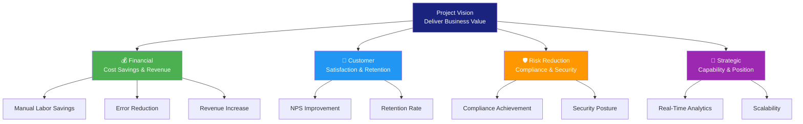
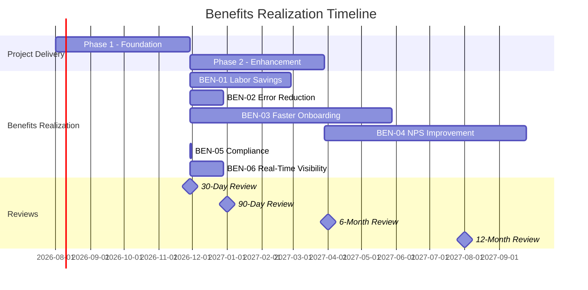

# Benefits Management Plan

> **Project:** [Project Name]
> **Version:** [X.Y] | **Status:** [Draft | Under Review | Approved | Archived]
> **Last Updated:** [YYYY-MM-DD]

---

## Document Control

| Field | Value |
|-------|-------|
| Document Owner | [Name / Role] |
| Sponsor | [Name / Role] |
| Business Analyst | [Name / Role] |
| Finance Analyst | [Name / Role] |

### Revision History

| Version | Date | Author | Change Description |
|---------|------|--------|--------------------|
| 0.1 | [YYYY-MM-DD] | [Name] | Initial draft |
| 1.0 | [YYYY-MM-DD] | [Name] | Approved version |

### Approvals

| Role | Name | Signature | Date |
|------|------|-----------|------|
| Project Sponsor | | | |
| Finance Director | | | |
| Business Owner | | | |
| BA Lead | | | |

---

## Table of Contents

1. [Executive Summary](#1-executive-summary)
2. [Benefits Register](#2-benefits-register)
3. [Benefits Categorization](#3-benefits-categorization)
4. [Benefits Measurement](#4-benefits-measurement)
5. [Benefits Realization Timeline](#5-benefits-realization-timeline)
6. [Benefits Ownership](#6-benefits-ownership)
7. [Dependencies & Assumptions](#7-dependencies--assumptions)
8. [Risks to Benefits](#8-risks-to-benefits)
9. [Monitoring & Reporting](#9-monitoring--reporting)
10. [Post-Project Benefits Review](#10-post-project-benefits-review)

---

## 1. Executive Summary

| Field | Detail |
|-------|--------|
| Total Expected Annual Benefits | $[X] |
| Financial Benefits | $[X] — cost savings + revenue |
| Non-Financial Benefits | [Qualitative — customer satisfaction, compliance, capability] |
| Benefits Realization Period | [X months post go-live] |
| Investment | $[X] |
| Expected ROI | [X%] |
| Benefits Owner | [Name / Role] |
| Review Cadence | [Monthly during project, quarterly post-project] |

---

## 2. Benefits Register

### 2.1 Benefits Inventory

| ID | Benefit | Category | Type | Expected Value | Measurement Method | Baseline | Target | Realization Date | Owner | Priority |
|----|---------|----------|------|---------------|-------------------|----------|--------|-----------------|-------|----------|
| BEN-01 | [Reduced manual labor] | Financial | Tangible | $[X]/year | [Hours saved × hourly rate] | [X hrs/week] | [Y hrs/week] | [Go-live + 3 months] | [Ops Manager] | 🔴 |
| BEN-02 | [Error reduction] | Financial | Tangible | $[X]/year | [Rework cost reduction] | [8% error rate] | [<1%] | [Go-live + 1 month] | [QA Lead] | 🔴 |
| BEN-03 | [Faster onboarding] | Financial | Tangible | $[X]/year | [Additional customers × revenue] | [12 days] | [1 day] | [Go-live + 6 months] | [Sales Lead] | 🔴 |
| BEN-04 | [Customer satisfaction] | Customer | Intangible | [NPS +25] | [Quarterly survey] | [NPS 35] | [NPS 60] | [Go-live + 6 months] | [Product Owner] | 🟡 |
| BEN-05 | [Compliance readiness] | Risk | Intangible | [Avoided fines] | [Audit pass rate] | [Non-compliant] | [100% compliant] | [Go-live] | [Compliance] | 🔴 |
| BEN-06 | [Real-time visibility] | Strategic | Intangible | [Faster decisions] | [Decision cycle time] | [Weekly] | [Real-time] | [Go-live + 1 month] | [Management] | 🟡 |
| BEN-07 | | | | | | | | | | |

### 2.2 Benefits Summary

| Category | Count | Total Annual Value | % of Total |
|----------|-------|-------------------|-----------|
| 💰 Financial (Tangible) | [X] | $[X] | [X%] |
| 👥 Customer | [X] | [Qualitative] | — |
| 🛡️ Risk Reduction | [X] | $[X] | [X%] |
| 🎯 Strategic | [X] | [Qualitative] | — |
| **Total** | **[X]** | **$[X]** | **100%** |

---

## 3. Benefits Categorization

### 3.1 Benefits Hierarchy



### 3.2 Benefits by Stakeholder

| Stakeholder Group | Benefits | Impact |
|-------------------|---------|--------|
| [Operations Team] | [Less manual work, fewer errors] | [Higher job satisfaction, capacity for growth] |
| [Customers] | [Faster service, self-service, transparency] | [Higher satisfaction, retention] |
| [Management] | [Real-time visibility, data-driven decisions] | [Better strategic decisions] |
| [Compliance] | [Audit trail, automated controls] | [Reduced compliance risk] |
| [Finance] | [Cost reduction, predictable expenses] | [Improved margins] |

---

## 4. Benefits Measurement

### 4.1 Measurement Framework

| Benefit | KPI | Formula | Data Source | Collection Method | Frequency | Owner |
|---------|-----|---------|------------|------------------|-----------|-------|
| BEN-01 | [Hours saved/week] | [Old hours - New hours] | [Time tracking system] | [Automated report] | Weekly | [Ops Manager] |
| BEN-02 | [Error rate %] | [Errors / Transactions × 100] | [Quality system] | [Automated dashboard] | Weekly | [QA Lead] |
| BEN-03 | [Customer onboarding time] | [Activation date - Application date] | [CRM] | [Automated report] | Weekly | [Sales Lead] |
| BEN-04 | [NPS score] | [Promoters% - Detractors%] | [Survey tool] | [Quarterly survey] | Quarterly | [Product Owner] |
| BEN-05 | [Compliance audit findings] | [Count of findings] | [Audit system] | [Audit report] | Per audit | [Compliance] |
| BEN-06 | [Decision cycle time] | [Time from data need to decision] | [Management survey] | [Survey] | Monthly | [Management] |

### 4.2 Leading vs Lagging Indicators

| Type | Indicator | Predicts / Confirms | Measurement |
|------|----------|--------------------| ------------|
| **Leading** | [Training completion rate] | [Predicts adoption → benefits] | [X% trained before go-live] |
| **Leading** | [System usage rate] | [Predicts benefit realization] | [Daily active users] |
| **Leading** | [Process automation rate] | [Predicts efficiency gains] | [% processes automated] |
| **Lagging** | [Cost savings realized] | [Confirms financial benefit] | [Actual vs projected savings] |
| **Lagging** | [Customer NPS] | [Confirms customer benefit] | [Quarterly survey score] |
| **Lagging** | [Revenue increase] | [Confirms revenue benefit] | [Monthly revenue vs baseline] |

### 4.3 Baseline Measurements

> **Critical:** Baselines must be captured BEFORE go-live to enable before/after comparison.

| Benefit | Baseline Metric | Baseline Value | Measurement Date | Measurement Method | Confidence |
|---------|----------------|---------------|-----------------|-------------------|-----------|
| BEN-01 | [Manual hours/week] | [X hours] | [YYYY-MM-DD] | [Time study, 4-week average] | 🟢 High |
| BEN-02 | [Error rate] | [8%] | [YYYY-MM-DD] | [Quality report, 3-month average] | 🟢 High |
| BEN-03 | [Onboarding time] | [12 days] | [YYYY-MM-DD] | [CRM pipeline report] | 🟢 High |
| BEN-04 | [NPS score] | [35] | [YYYY-MM-DD] | [Quarterly survey] | 🟢 High |

---

## 5. Benefits Realization Timeline

### 5.1 Realization Phases



### 5.2 Realization Milestones

| Milestone | Date | Benefits Expected | Review Criteria |
|-----------|------|------------------|----------------|
| **Go-Live** | [YYYY-MM-DD] | [Compliance achieved] | [System operational] |
| **30-Day Review** | [Go-live + 30] | [Error reduction visible] | [KPIs trending positive] |
| **90-Day Review** | [Go-live + 90] | [Labor savings, error reduction confirmed] | [Actual ≥ 80% of target] |
| **6-Month Review** | [Go-live + 180] | [Onboarding improvement, NPS uptick] | [Actual ≥ 70% of target] |
| **12-Month Review** | [Go-live + 365] | [Full benefits realization] | [Actual ≥ 90% of target] |

---

## 6. Benefits Ownership

### 6.1 Ownership Matrix

| Benefit | Business Owner | Accountability | Responsibility |
|---------|---------------|---------------|---------------|
| BEN-01 | [Ops Manager] | [Ensure savings are captured and sustained] | [Track, report, optimize] |
| BEN-02 | [QA Lead] | [Ensure error rate stays below target] | [Monitor, investigate, improve] |
| BEN-03 | [Sales Lead] | [Ensure onboarding improvement translates to revenue] | [Track, report, optimize] |
| BEN-04 | [Product Owner] | [Ensure customer satisfaction improves] | [Survey, analyze, act] |
| BEN-05 | [Compliance] | [Ensure compliance is maintained] | [Audit, monitor, report] |
| BEN-06 | [Management] | [Ensure visibility drives better decisions] | [Use dashboards, provide feedback] |

### 6.2 Ownership Transition

| Phase | Benefits Owner | Responsibility |
|-------|---------------|---------------|
| **During Project** | [BA / PM] | [Define, baseline, plan measurement] |
| **Go-Live → 6 months** | [Business Owner + BA] | [Measure, report, troubleshoot] |
| **6 months → 12 months** | [Business Owner] | [Measure, report, optimize] |
| **Post 12 months** | [Business Owner / Operations] | [Sustain, continuous improvement] |

---

## 7. Dependencies & Assumptions

### 7.1 Benefit Dependencies

| Benefit | Depends On | Dependency Type | Impact if Not Met |
|---------|-----------|----------------|-------------------|
| BEN-01 | [System go-live + user adoption] | Technical + Organizational | [No labor savings] |
| BEN-02 | [Process automation deployed] | Technical | [Error rate unchanged] |
| BEN-03 | [CRM + portal operational] | Technical | [Onboarding unchanged] |
| BEN-04 | [All Phase 2 features live] | Technical | [Partial NPS improvement] |
| BEN-05 | [Audit trail implemented] | Technical | [Compliance risk remains] |

### 7.2 Assumptions

| # | Assumption | Impact if Invalid | Status |
|---|-----------|-------------------|--------|
| A-01 | [Users will adopt new system within 3 months] | [Delayed benefit realization] | ⏳ |
| A-02 | [Current baseline measurements are accurate] | [Benefits may be over/understated] | ✅ |
| A-03 | [No major organizational restructuring during project] | [Benefit owners may change] | ⏳ |
| A-04 | [Market conditions remain stable] | [Revenue projections may change] | ⏳ |

---

## 8. Risks to Benefits

### 8.1 Benefits Risk Register

| ID | Risk | Probability | Impact | Affected Benefits | Mitigation |
|----|------|------------|--------|------------------|-----------|
| BR-01 | [Low user adoption] | High | High | BEN-01, BEN-02, BEN-03 | [Change management, training, champions] |
| BR-02 | [Data quality issues] | Medium | High | BEN-02, BEN-03 | [Data cleansing before migration] |
| BR-03 | [Scope reduction] | Medium | Medium | BEN-01, BEN-06 | [MoSCoW, protect 🔴 items] |
| BR-04 | [Benefits not tracked] | Medium | Medium | All | [Dedicated benefits tracking from Day 1] |
| BR-05 | [Organizational change] | Low | High | All | [Benefits ownership transfer plan] |

### 8.2 Benefits Risk Heat Map

| Impact \ Probability | Low | Medium | High |
|---------------------|-----|--------|------|
| **High** | 🟡 | 🟠 BR-02 | 🔴 BR-01 |
| **Medium** | 🟢 | 🟡 BR-03, BR-04 | 🟠 |
| **Low** | 🟢 | 🟢 | 🟡 |

> **Legend:** 🔴 Critical — Immediate action required | 🟠 High — Mitigation plan required | 🟡 Medium — Monitor and manage | 🟢 Low — Accept and monitor

---

## 9. Monitoring & Reporting

### 9.1 Benefits Dashboard

| Benefit | Baseline | Target | Current | % Realized | Status | Trend |
|---------|----------|--------|---------|-----------|--------|-------|
| BEN-01 Labor Savings | [X hrs/wk] | [Y hrs/wk] | [Z hrs/wk] | [%] | 🟢🟡🔴 | ↑↓→ |
| BEN-02 Error Rate | [8%] | [<1%] | [%] | [%] | 🟢🟡🔴 | ↑↓→ |
| BEN-03 Onboarding | [12 days] | [1 day] | [X days] | [%] | 🟢🟡🔴 | ↑↓→ |
| BEN-04 NPS | [35] | [60] | [X] | [%] | 🟢🟡🔴 | ↑↓→ |
| BEN-05 Compliance | [Non-compliant] | [100%] | [%] | [%] | 🟢🟡🔴 | ↑↓→ |

### 9.2 Reporting Cadence

| Report | Audience | Frequency | Content | Owner |
|--------|----------|-----------|---------|-------|
| [Benefits Dashboard] | [PM, BA, Business Owners] | [Weekly during project] | [KPI status, trends] | [BA] |
| [Benefits Realization Report] | [Sponsor, Steering Committee] | [Monthly] | [Actual vs expected, issues] | [BA] |
| [Post-Project Benefits Review] | [Sponsor, Finance, Business] | [Quarterly post-project] | [Full realization assessment] | [Business Owner] |

### 9.3 Reporting Template

```markdown
## Benefits Realization Report — [Month Year]

### Summary
- Total benefits expected: $[X]/year
- Benefits realized to date: $[Y]
- Realization rate: [Z]%
- Status: 🟢 On Track / 🟡 At Risk / 🔴 Behind

### Benefit Detail
| Benefit | Target | Actual | Variance | Action |
|---------|--------|--------|----------|--------|
| ... | ... | ... | ... | ... |

### Issues & Risks
- [Issue 1]
- [Risk 1]

### Actions Required
- [Action 1 — Owner — Due Date]
```

---

## 10. Post-Project Benefits Review

### 10.1 Review Schedule

| Review | Timing | Purpose | Participants |
|--------|--------|---------|-------------|
| **30-Day Review** | Go-live + 30 days | [Stabilization, quick wins check] | [PM, BA, Business Owner] |
| **90-Day Review** | Go-live + 90 days | [Early benefits validation] | [Sponsor, BA, Business Owner] |
| **6-Month Review** | Go-live + 180 days | [Mid-term realization assessment] | [Steering Committee] |
| **12-Month Review** | Go-live + 365 days | [Full benefits realization report] | [Steering Committee, Finance] |
| **Annual Review** | Every 12 months post-project | [Sustainability check] | [Business Owner, Operations] |

### 10.2 Review Criteria

| Rating | Criteria | Action |
|--------|---------|--------|
| 🟢 **Fully Realized** | [Actual ≥ 90% of target] | [Sustain and optimize] |
| 🟡 **Partially Realized** | [Actual 50-89% of target] | [Investigate barriers, corrective action] |
| 🔴 **Not Realized** | [Actual < 50% of target] | [Root cause analysis, remediation plan] |
| ❌ **Not Measurable** | [No data available] | [Establish measurement, re-assess in 90 days] |

### 10.3 Lessons Learned Integration

| Lesson | Source | Impact on Future Projects |
|--------|--------|--------------------------|
| [e.g., Baseline measurement was delayed] | [This project] | [Start baseline capture earlier] |
| [e.g., User adoption slower than expected] | [This project] | [Allocate more change management budget] |

---

## Related Documents

| Document | Relationship |
|----------|-------------|
| [[Business-Case]] | Benefits justify the investment in the Business Case |
| [[Potential-Value]] | Detailed value analysis that feeds this plan |
| [[Business-Objectives]] | Objectives define what benefits must achieve |
| [[Change-Strategy]] | Strategy defines how benefits will be delivered |
| [[Benefits-Management-Plan]] | Ongoing evaluation of solution performance |
| [[BA-Performance-Assessment]] | Post-implementation performance review |

---

> **Template Standard:** Based on PMBOK v8 (Benefits Management), BABOK v3 (Solution Evaluation), ISO 21502
> **Usage:** This is a *living document* — it must be actively maintained from project start through post-project realization. Benefits that aren't tracked aren't realized. Assign clear owners and measure relentlessly.
