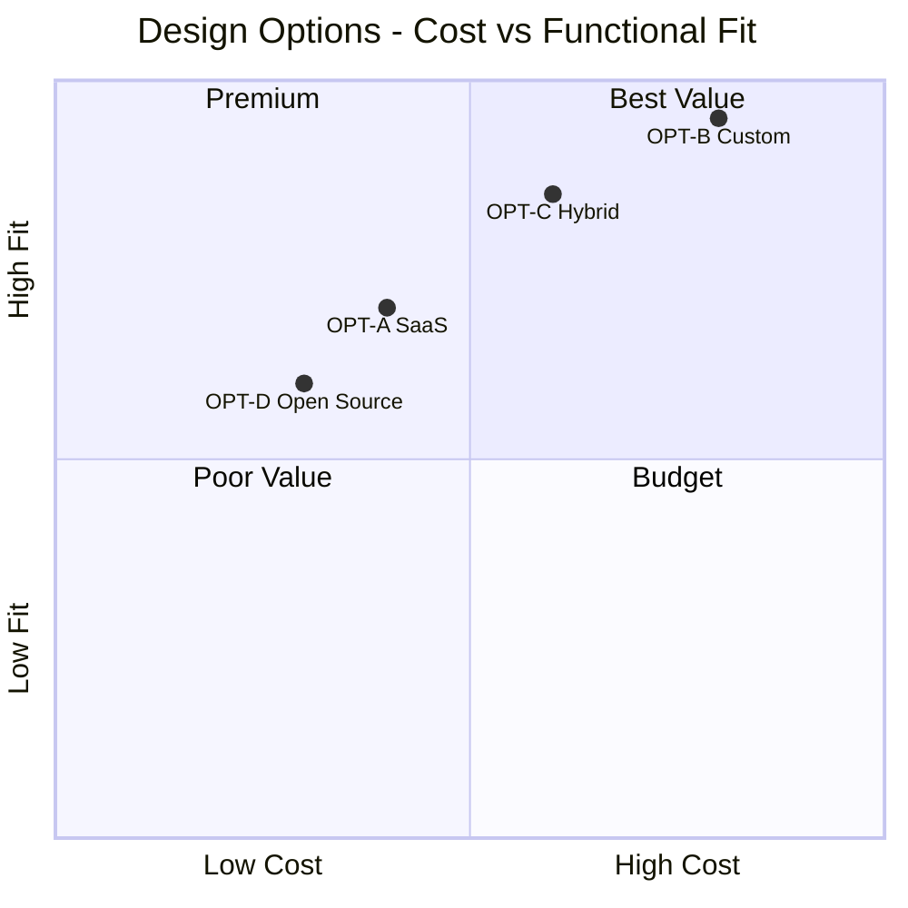

# Design Options

> **Project:** [Project Name]
> **Version:** [X.Y] | **Status:** [Draft | Under Review | Approved | Archived]
> **Last Updated:** [YYYY-MM-DD]

---

## Document Control

| Field | Value |
|-------|-------|
| Document Owner | [Name / Role] |
| Business Analyst | [Name / Role] |
| Solution Architect | [Name / Role] |
| Sponsor | [Name / Role] |

### Revision History

| Version | Date | Author | Change Description |
|---------|------|--------|--------------------|
| 0.1 | [YYYY-MM-DD] | [Name] | Initial draft |
| 1.0 | [YYYY-MM-DD] | [Name] | Approved version |

### Approvals

| Role | Name | Signature | Date |
|------|------|-----------|------|
| Project Sponsor | | | |
| Business Owner | | | |
| Solution Architect | | | |
| BA Lead | | | |

---

## Table of Contents

1. [Executive Summary](#1-executive-summary)
2. [Design Context](#2-design-context)
3. [Design Options](#3-design-options)
4. [Evaluation Criteria](#4-evaluation-criteria)
5. [Options Comparison](#5-options-comparison)
6. [Option Detail Cards](#6-option-detail-cards)
7. [Trade-Off Analysis](#7-trade-off-analysis)
8. [Recommendation Summary](#8-recommendation-summary)

---

## 1. Executive Summary

| Field | Detail |
|-------|--------|
| Options Evaluated | [X] |
| Recommended Option | [Option Name] |
| Key Advantage | [Why this option wins] |
| Key Trade-Off | [What we give up by choosing this] |
| Confidence Level | 🟢 High / 🟡 Medium / 🔴 Low |

---

## 2. Design Context

### 2.1 Problem Statement

> What design challenge are we solving?

[Concise description of the design problem or opportunity]

### 2.2 Design Constraints

| Constraint | Type | Impact on Options |
|-----------|------|------------------|
| [e.g., Must integrate with existing ERP] | Technical | [Limits technology choices] |
| [e.g., Budget cap $500K] | Financial | [Eliminates expensive options] |
| [e.g., Go-live by YYYY-MM-DD] | Time | [Eliminates long-lead options] |
| [e.g., Data sovereignty requirement] | Legal | [Limits hosting options] |
| [e.g., No new headcount] | Resource | [Favors managed/SaaS solutions] |

### 2.3 Requirements Driving Design

| Requirement ID | Requirement | Design Implication |
|---------------|-------------|-------------------|
| BR-01 | [Customer self-service] | [Web portal or mobile app needed] |
| BR-02 | [Real-time processing] | [Event-driven or real-time architecture] |
| NFR-01 | [99.9% availability] | [High availability, redundancy] |
| NFR-02 | [<2s response time] | [Caching, CDN, optimized queries] |
| NFR-03 | [GDPR compliance] | [Data residency, consent management] |

---

## 3. Design Options

### 3.1 Option Overview

| ID | Option | Approach | Description |
|----|--------|----------|-------------|
| OPT-A | [e.g., Buy — SaaS Platform] | Buy | [Implement a commercial SaaS solution] |
| OPT-B | [e.g., Build — Custom Development] | Build | [Develop a custom solution in-house] |
| OPT-C | [e.g., Hybrid — SaaS + Custom] | Hybrid | [SaaS core with custom extensions] |
| OPT-D | [e.g., Open Source + Customize] | Open Source | [Deploy open source and customize] |

### 3.2 Options at a Glance

| Criteria | OPT-A: SaaS | OPT-B: Custom | OPT-C: Hybrid | OPT-D: Open Source |
|----------|------------|--------------|--------------|-------------------|
| **Approach** | Buy | Build | Buy + Build | Open Source + Customize |
| **Estimated Cost** | $[X] | $[Y] | $[Z] | $[W] |
| **Timeline** | [X months] | [Y months] | [Z months] | [W months] |
| **Customization** | Limited | Full | Moderate | Full |
| **Vendor Dependency** | High | None | Medium | Low |
| **Maintenance** | Vendor-managed | Self-managed | Shared | Self-managed |
| **Scalability** | 🟢 Vendor-managed | 🟡 Build for scale | 🟡 Partial | 🟡 Self-managed |

---

## 4. Evaluation Criteria

### 4.1 Criteria Definition

| # | Criterion | Definition | Weight | Measurement |
|---|----------|-----------|--------|-------------|
| C1 | **Strategic Alignment** | How well the option supports organizational strategy | 20% | [1-5 scale] |
| C2 | **Functional Fit** | How well the option meets functional requirements | 20% | [% requirements met] |
| C3 | **Total Cost of Ownership** | Total cost over 5 years (implementation + operations) | 20% | [$ amount] |
| C4 | **Time to Value** | How quickly benefits can be realized | 15% | [Months] |
| C5 | **Technical Fit** | Architecture quality, scalability, maintainability | 10% | [1-5 scale] |
| C6 | **Risk Profile** | Implementation and operational risk level | 10% | [1-5 scale] |
| C7 | **Vendor Viability** | Vendor stability, market position, support quality | 5% | [1-5 scale] |
| **Total** | | | **100%** | |

### 4.2 Scoring Scale

| Score | Rating | Description |
|-------|--------|-------------|
| 5 | Excellent | [Exceeds requirements, best-in-class] |
| 4 | Good | [Meets all requirements with minor gaps] |
| 3 | Adequate | [Meets core requirements, some gaps] |
| 2 | Marginal | [Significant gaps, requires workarounds] |
| 1 | Poor | [Fails to meet requirements] |

---

## 5. Options Comparison

### 5.1 Weighted Scoring Matrix

| Criterion | Weight | OPT-A: SaaS | OPT-B: Custom | OPT-C: Hybrid | OPT-D: Open Source |
|-----------|--------|------------|--------------|--------------|-------------------|
| C1 Strategic Alignment | 20% | [Score] × 0.20 = [W] | [Score] × 0.20 = [W] | [Score] × 0.20 = [W] | [Score] × 0.20 = [W] |
| C2 Functional Fit | 20% | [Score] × 0.20 = [W] | [Score] × 0.20 = [W] | [Score] × 0.20 = [W] | [Score] × 0.20 = [W] |
| C3 Total Cost of Ownership | 20% | [Score] × 0.20 = [W] | [Score] × 0.20 = [W] | [Score] × 0.20 = [W] | [Score] × 0.20 = [W] |
| C4 Time to Value | 15% | [Score] × 0.15 = [W] | [Score] × 0.15 = [W] | [Score] × 0.15 = [W] | [Score] × 0.15 = [W] |
| C5 Technical Fit | 10% | [Score] × 0.10 = [W] | [Score] × 0.10 = [W] | [Score] × 0.10 = [W] | [Score] × 0.10 = [W] |
| C6 Risk Profile | 10% | [Score] × 0.10 = [W] | [Score] × 0.10 = [W] | [Score] × 0.10 = [W] | [Score] × 0.10 = [W] |
| C7 Vendor Viability | 5% | [Score] × 0.05 = [W] | [Score] × 0.05 = [W] | [Score] × 0.05 = [W] | [Score] × 0.05 = [W] |
| **Total** | **100%** | **[Sum]** | **[Sum]** | **[Sum]** | **[Sum]** |
| **Rank** | | **[#]** | **[#]** | **[#]** | **[#]** |

### 5.2 Visual Comparison

### 5.3 Feature Coverage Matrix

| Requirement | Must Have | OPT-A | OPT-B | OPT-C | OPT-D |
|------------|----------|-------|-------|-------|-------|
| BR-01 Customer self-service | 🔴 | ✅ Built-in | ✅ Custom build | ✅ Custom portal | ✅ Custom build |
| BR-02 Real-time processing | 🔴 | ✅ Built-in | ✅ Custom build | ✅ Hybrid | ⚠️ Requires config |
| BR-03 Reporting | 🔴 | ✅ Built-in | ✅ Custom build | ✅ SaaS reporting | ⚠️ Plugin needed |
| NFR-01 99.9% uptime | 🔴 | ✅ SLA-backed | ⚠️ Self-managed | ✅ SLA for SaaS | ⚠️ Self-managed |
| NFR-02 <2s response | 🔴 | ✅ CDN included | ⚠️ Build required | ⚠️ Partial | ⚠️ Build required |
| NFR-03 GDPR compliance | 🔴 | ✅ Certified | ⚠️ Build required | ✅ SaaS compliant | ⚠️ Build required |
| **Coverage** | | **[X%]** | **[Y%]** | **[Z%]** | **[W%]** |

> ✅ = Fully met | ⚠️ = Partially met / requires effort | ❌ = Not met

---

## 6. Option Detail Cards

### OPT-A: [Option Name — e.g., SaaS Platform]

| Aspect | Detail |
|--------|--------|
| **Description** | [Detailed description of the approach] |
| **Approach** | [Buy / Build / Hybrid / Open Source] |
| **Estimated Cost** | [Implementation: $X | Annual: $Y | 5-year TCO: $Z] |
| **Timeline** | [X months to implement] |
| **Key Advantages** | [Bullet list] |
| **Key Disadvantages** | [Bullet list] |
| **Vendor/Product** | [Vendor name, product, version] |
| **Customization** | [Level of customization possible] |
| **Integration** | [Integration approach and complexity] |
| **Scalability** | [How it scales] |
| **Security** | [Security features and certifications] |
| **Support** | [Vendor support model, SLAs] |
| **Lock-In Risk** | [Level of vendor dependency] |
| **Implementation Risk** | [Key risks and mitigations] |

> **Repeat this card for each option (OPT-B, OPT-C, OPT-D)**

---

## 7. Trade-Off Analysis

### 7.1 Key Trade-Offs

| Trade-Off | Option A | Option B | Implication |
|-----------|---------|---------|-------------|
| [Speed vs Customization] | [Fast, limited customization] | [Slow, full customization] | [Choose based on requirements stability] |
| [Cost vs Control] | [Lower upfront, vendor dependency] | [Higher upfront, full control] | [Choose based on strategic importance] |
| [Risk vs Reward] | [Lower risk, moderate reward] | [Higher risk, higher reward] | [Choose based on risk appetite] |
| [Build vs Buy] | [No development needed] | [Full development effort] | [Choose based on team capability] |

### 7.2 Sensitivity Analysis

| Scenario | Impact on Ranking | Best Option |
|----------|------------------|-------------|
| [Budget reduced by 20%] | [Option B drops out] | [Option A or C] |
| [Timeline compressed by 3 months] | [Option B not feasible] | [Option A] |
| [Requirements increase 30%] | [Option A customization limits hit] | [Option B or C] |
| [Vendor exits market] | [Option A at risk] | [Option B or D] |
| [Team capacity doubles] | [Option B becomes more attractive] | [Option B] |

### 7.3 Risk Comparison

| Risk Type | OPT-A | OPT-B | OPT-C | OPT-D |
|-----------|-------|-------|-------|-------|
| Implementation Risk | 🟢 Low | 🔴 High | 🟡 Medium | 🟠 Medium-High |
| Vendor Risk | 🔴 High | 🟢 None | 🟡 Medium | 🟢 Low |
| Technical Risk | 🟢 Low | 🟡 Medium | 🟡 Medium | 🟠 Medium-High |
| Cost Risk | 🟡 Medium | 🔴 High | 🟡 Medium | 🟢 Low |
| Scalability Risk | 🟢 Low | 🟡 Medium | 🟡 Medium | 🟡 Medium |
| **Overall Risk** | **🟡 Medium** | **🟠 Medium-High** | **🟡 Medium** | **🟠 Medium-High** |

---

## 8. Recommendation Summary

### 8.1 Recommendation

**Recommended:** Option [X] — [Option Name]

**Rationale:** [2-3 sentences explaining why this option best balances requirements, cost, risk, and strategic fit]

### 8.2 Decision Matrix Summary

| Rank | Option | Weighted Score | Key Strength | Key Weakness |
|------|--------|---------------|-------------|-------------|
| 1 | [Recommended Option] | [X.X] | [Top strength] | [Main trade-off] |
| 2 | [Runner-up] | [X.X] | [Top strength] | [Main trade-off] |
| 3 | [Third] | [X.X] | [Top strength] | [Main trade-off] |
| 4 | [Fourth] | [X.X] | [Top strength] | [Main trade-off] |

### 8.3 Conditions for Recommendation

1. [e.g., Vendor provides 99.9% SLA in contract]
2. [e.g., Custom portal development budget approved]
3. [e.g., Integration POC completed successfully]

### 8.4 Next Steps

| # | Action | Owner | Deadline |
|---|--------|-------|----------|
| 1 | [Present options to Steering Committee] | [BA] | [Date] |
| 2 | [Obtain approval for recommended option] | [Sponsor] | [Date] |
| 3 | [Initiate vendor negotiations / development planning] | [PM] | [Date] |
| 4 | [Conduct integration POC if required] | [Tech Lead] | [Date] |

---

## Related Documents

| Document | Relationship |
|----------|-------------|
| [[Solution-Recommendation]] | This document feeds the formal recommendation |
| [[Business-Requirements]] | Requirements drive the evaluation criteria |
| [[Business-Case]] | Cost and benefit data for each option |
| [[Risk-Analysis-Results]] | Risk assessment for each option |
| [[Trade-Study-Reports]] | SE-level detailed trade studies |
| [[Architecture-Decision-Records]] | ADRs capture the rationale for chosen option |

---

> **Template Standard:** Based on BABOK v3 (Requirements Analysis & Design Definition), PMBOK v8 (Scope Management)
> **Usage:** This document presents *options*, not a decision. The [[Solution-Recommendation]] captures the formal decision. Always evaluate at least 3 options (including do-nothing) to demonstrate due diligence.
