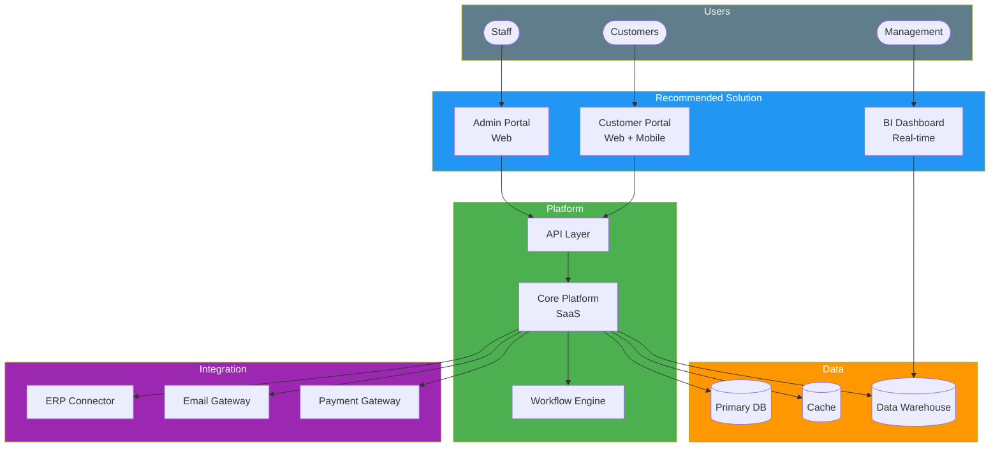
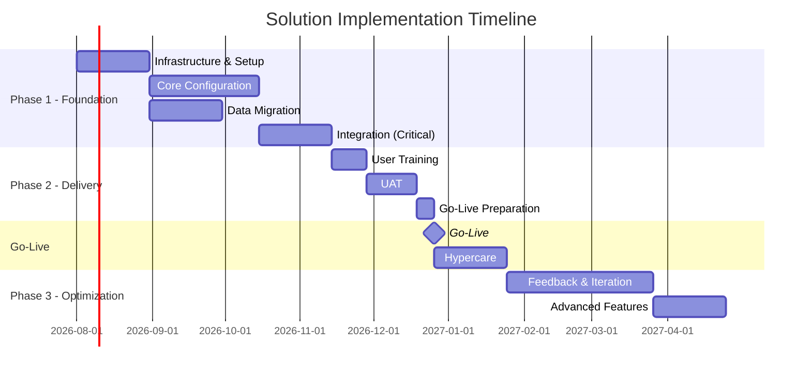

# Solution Recommendation

> **Project:** [Project Name]
> **Version:** [X.Y] | **Status:** [Draft | Under Review | Approved | Archived]
> **Last Updated:** [YYYY-MM-DD]

---

## Document Control

| Field | Value |
|-------|-------|
| Document Owner | [Name / Role] |
| Business Analyst | [Name / Role] |
| Solution Architect | [Name / Role] |
| Sponsor | [Name / Role] |

### Revision History

| Version | Date | Author | Change Description |
|---------|------|--------|--------------------|
| 0.1 | [YYYY-MM-DD] | [Name] | Initial draft |
| 1.0 | [YYYY-MM-DD] | [Name] | Approved version |

### Approvals

| Role | Name | Signature | Date |
|------|------|-----------|------|
| Project Sponsor | | | |
| Business Owner | | | |
| Finance Director | | | |
| Solution Architect | | | |
| BA Lead | | | |

---

## Table of Contents

1. [Decision Summary](#1-decision-summary)
2. [Recommendation](#2-recommendation)
3. [Rationale](#3-rationale)
4. [Solution Overview](#4-solution-overview)
5. [Implementation Approach](#5-implementation-approach)
6. [Investment Summary](#6-investment-summary)
7. [Expected Benefits](#7-expected-benefits)
8. [Risk Summary](#8-risk-summary)
9. [Conditions & Prerequisites](#9-conditions--prerequisites)
10. [Decision Record](#10-decision-record)

---

## 1. Decision Summary

| Field | Detail |
|-------|--------|
| Decision Required | [Approve / Reject / Defer the recommended solution] |
| Options Evaluated | [X] — see [[Design-Options]] |
| Recommended Option | [Option Name] |
| Investment Required | $[Total] |
| Expected ROI | [X%] |
| Payback Period | [X months] |
| Implementation Timeline | [X months] |
| Decision Deadline | [YYYY-MM-DD] |
| Decision Maker | [Sponsor / Steering Committee] |

---

## 2. Recommendation

### 2.1 Recommended Solution

> **We recommend Option [X]: [Solution Name]**

[2-3 sentence summary of the recommended solution and why it was selected]

### 2.2 Recommendation Statement

| Field | Detail |
|-------|--------|
| **What** | [Clear statement of what is being recommended] |
| **Why** | [Primary reason — strategic alignment, cost, risk, feasibility] |
| **How Much** | [Total investment — CAPEX + OPEX] |
| **When** | [Implementation timeline and go-live target] |
| **Expected Outcome** | [Quantified benefits — $X savings, Y% improvement] |

---

## 3. Rationale

### 3.1 Selection Criteria Summary

| Criterion | Weight | Recommended Option Score | Best Alternative Score | Difference |
|-----------|--------|------------------------|----------------------|-----------|
| Strategic Alignment | 20% | [X] | [Y] | [+Z] |
| Functional Fit | 20% | [X] | [Y] | [+Z] |
| Total Cost of Ownership | 20% | [X] | [Y] | [+Z] |
| Time to Value | 15% | [X] | [Y] | [+Z] |
| Technical Fit | 10% | [X] | [Y] | [+Z] |
| Risk Profile | 10% | [X] | [Y] | [+Z] |
| Vendor Viability | 5% | [X] | [Y] | [+Z] |
| **Weighted Total** | **100%** | **[Sum]** | **[Sum]** | **[+Diff]** |

### 3.2 Key Differentiators

| # | Differentiator | Why This Matters |
|---|---------------|-----------------|
| 1 | [e.g., Lowest TCO over 5 years] | [Saves $X compared to next best option] |
| 2 | [e.g., Fastest time to value] | [Benefits start 3 months earlier] |
| 3 | [e.g., Best functional fit] | [Meets 95% of requirements without customization] |
| 4 | [e.g., Lowest implementation risk] | [Proven in similar organizations] |

### 3.3 Trade-Offs Accepted

| Trade-Off | What We Give Up | Why Acceptable |
|-----------|----------------|---------------|
| [e.g., Limited customization] | [Cannot modify core workflows] | [Standard workflows meet 90% of needs; remaining 10% via configuration] |
| [e.g., Vendor dependency] | [Switching cost is high] | [Vendor is market leader, financially stable, 5-year contract provides stability] |
| [e.g., Higher annual cost] | [$X more per year than open source] | [Lower TCO when including self-management costs of open source] |

---

## 4. Solution Overview

### 4.1 Solution Architecture

### 4.2 Key Capabilities

| Capability | Description | Requirement Addressed |
|-----------|-------------|---------------------|
| [e.g., Customer Self-Service Portal] | [Web + mobile portal for account management] | BR-01 |
| [e.g., Automated Workflow Engine] | [Rule-based process automation] | BR-02, BR-03 |
| [e.g., Real-Time Dashboard] | [Live KPIs and analytics] | BR-04 |
| [e.g., API Integration] | [REST APIs for system connectivity] | BR-05 |
| [e.g., Audit Trail] | [Complete logging of all actions] | NFR-03 |

### 4.3 Scope Boundaries

| In Scope | Out of Scope |
|----------|-------------|
| [What the solution delivers] | [What is explicitly excluded] |
| | |
| | |

---

## 5. Implementation Approach

### 5.1 High-Level Timeline

### 5.2 Key Milestones

| Milestone | Date | Deliverable | Gate |
|-----------|------|------------|------|
| Phase 1 Complete | [YYYY-MM-DD] | [Core system operational] | Gate 1 |
| UAT Complete | [YYYY-MM-DD] | [UAT sign-off] | Gate 2 |
| Go-Live | [YYYY-MM-DD] | [System live in production] | Gate 3 |
| Hypercare End | [YYYY-MM-DD] | [Stable operations confirmed] | Gate 4 |

---

## 6. Investment Summary

### 6.1 Cost Breakdown

| Category | One-Time | Annual | 5-Year TCO |
|----------|---------|--------|-----------|
| [Software / Licensing] | $[X] | $[Y] | $[Z] |
| [Implementation Services] | $[X] | — | $[X] |
| [Infrastructure] | $[X] | $[Y] | $[Z] |
| [Data Migration] | $[X] | — | $[X] |
| [Training] | $[X] | $[Y] | $[Z] |
| [Change Management] | $[X] | — | $[X] |
| [Contingency (15%)] | $[X] | — | $[X] |
| **Total** | **$[Sum]** | **$[Sum]** | **$[Sum]** |

### 6.2 Financial Metrics

| Metric | Value |
|--------|-------|
| Total Investment | $[X] |
| Annual Benefits | $[Y] |
| Net Annual Benefit | $[Y - OPEX] |
| ROI | [((Y - X) / X) × 100]% |
| Payback Period | [X months] |
| NPV (5-year, X% discount) | $[Z] |
| IRR | [X%] |

---

## 7. Expected Benefits

| Benefit | Annual Value | Realization Timeline | Confidence |
|---------|-------------|---------------------|-----------|
| [Cost savings — labor] | $[X] | [Go-live + 3 months] | 🟢 High |
| [Cost savings — errors] | $[X] | [Go-live + 1 month] | 🟢 High |
| [Revenue increase] | $[X] | [Go-live + 6 months] | 🟡 Medium |
| [Risk reduction] | $[X] | [Go-live] | 🟡 Medium |
| [Customer satisfaction] | [NPS +X] | [Go-live + 6 months] | 🟡 Medium |
| **Total Annual Value** | **$[Sum]** | | |

---

## 8. Risk Summary

| Risk | Probability | Impact | Level | Mitigation |
|------|------------|--------|-------|-----------|
| [User adoption below target] | High | High | 🔴 | [Change management program] |
| [Integration complexity] | Medium | High | 🟠 | [Early POC, phased integration] |
| [Vendor delivery delays] | Medium | Medium | 🟡 | [SLA penalties, milestone payments] |
| [Data migration quality] | Medium | High | 🟠 | [Parallel run, extensive validation] |
| [Budget overrun] | Medium | Medium | 🟡 | [15% contingency, monthly tracking] |

### Risk Heat Map

| Impact \ Probability | Low | Medium | High |
|---------------------|-----|--------|------|
| **High** | 🟡 | 🟠 Integration, Data Migration | 🔴 User Adoption |
| **Medium** | 🟢 | 🟡 Vendor, Budget | 🟠 |
| **Low** | 🟢 | 🟢 | 🟡 |

> **Legend:** 🔴 Critical — Immediate action required | 🟠 High — Mitigation plan required | 🟡 Medium — Monitor and manage | 🟢 Low — Accept and monitor

---

## 9. Conditions & Prerequisites

### 9.1 Conditions for Approval

| # | Condition | Owner | Deadline | Status |
|---|----------|-------|----------|--------|
| 1 | [e.g., Budget approved by Finance Committee] | [Finance Director] | [YYYY-MM-DD] | ☐ |
| 2 | [e.g., Executive sponsor formally assigned] | [Steering Committee] | [YYYY-MM-DD] | ☐ |
| 3 | [e.g., Vendor contract negotiated and signed] | [Procurement] | [YYYY-MM-DD] | ☐ |
| 4 | [e.g., Integration POC successful] | [Tech Lead] | [YYYY-MM-DD] | ☐ |
| 5 | [e.g., Resource allocation confirmed] | [PM] | [YYYY-MM-DD] | ☐ |

### 9.2 Prerequisites for Implementation

| # | Prerequisite | Owner | Status |
|---|-------------|-------|--------|
| 1 | [e.g., Cloud environment provisioned] | [IT] | ☐ |
| 2 | [e.g., Key staff identified and allocated] | [PM] | ☐ |
| 3 | [e.g., Data cleansing completed] | [Data Team] | ☐ |
| 4 | [e.g., Change management plan approved] | [Change Manager] | ☐ |
| 5 | [e.g., Training materials developed] | [Training Lead] | ☐ |

---

## 10. Decision Record

### 10.1 Decision

| Field | Detail |
|-------|--------|
| Decision Date | [YYYY-MM-DD] |
| Decision Maker | [Name / Role / Committee] |
| Decision | ✅ Approved / ❌ Rejected / ⏸️ Deferred |
| Conditions | [Any conditions attached to approval] |
| Dissenting Opinions | [Any objections noted] |
| Rationale | [Summary of decision rationale] |

### 10.2 Approval Signatures

| Role | Name | Signature | Date | Vote |
|------|------|-----------|------|------|
| Project Sponsor | | | | ✅ / ❌ |
| Finance Director | | | | ✅ / ❌ |
| Business Owner | | | | ✅ / ❌ |
| IT Director | | | | ✅ / ❌ |
| Solution Architect | | | | ✅ / ❌ |

### 10.3 Next Steps (If Approved)

| # | Action | Owner | Deadline |
|---|--------|-------|----------|
| 1 | [Initiate Project Charter] | [PM] | [Date] |
| 2 | [Begin vendor negotiations] | [Procurement] | [Date] |
| 3 | [Assemble project team] | [PM] | [Date] |
| 4 | [Detailed planning] | [PM / BA] | [Date] |
| 5 | [Kickoff meeting] | [PM] | [Date] |

---

## Related Documents

| Document | Relationship |
|----------|-------------|
| [[Design-Options]] | Options evaluated — this document captures the decision |
| [[Business-Case]] | Recommendation delivers the benefits in the Business Case |
| [[Business-Objectives]] | Solution is designed to achieve these objectives |
| [[Risk-Analysis-Results]] | Risks summarized from detailed risk analysis |
| [[Change-Strategy]] | Implementation approach from Change Strategy |
| [[Architecture-Decision-Records]] | ADRs capture detailed technical rationale |

---

> **Template Standard:** Based on BABOK v3 (Requirements Analysis & Design Definition), PMBOK v8 (Integration Management)
> **Usage:** This is the *decision document* — it captures what was recommended, why, and the formal approval. Keep it concise; the supporting detail lives in [[Design-Options]], [[Business-Case]], and [[Risk-Analysis-Results]].
