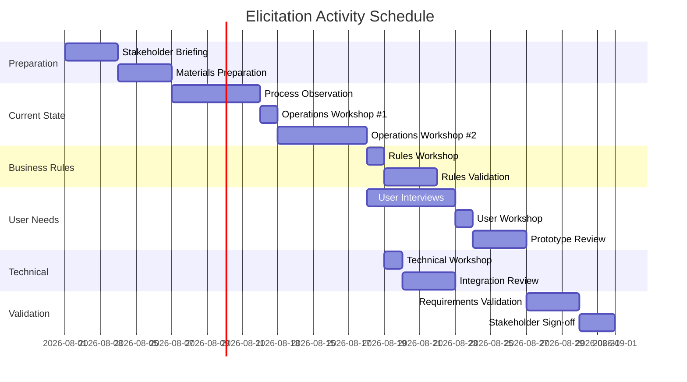

# Elicitation Activity Plan

> **Project:** [Project Name]
> **Version:** [X.Y] | **Status:** [Draft | Under Review | Approved | Archived]
> **Last Updated:** [YYYY-MM-DD]

---

## Document Control

| Field | Value |
|-------|-------|
| Document Owner | [Name / Role] |
| Business Analyst | [Name / Role] |
| Project Manager | [Name / Role] |

### Revision History

| Version | Date | Author | Change Description |
|---------|------|--------|--------------------|
| 0.1 | [YYYY-MM-DD] | [Name] | Initial draft |
| 1.0 | [YYYY-MM-DD] | [Name] | Approved version |

---

## Table of Contents

1. [Executive Summary](#1-executive-summary)
2. [Elicitation Scope](#2-elicitation-scope)
3. [Stakeholder Availability](#3-stakeholder-availability)
4. [Elicitation Techniques](#4-elicitation-techniques)
5. [Elicitation Schedule](#5-elicitation-schedule)
6. [Activity Detail Cards](#6-activity-detail-cards)
7. [Materials & Preparation](#7-materials--preparation)
8. [Logistics](#8-logistics)
9. [Risks & Mitigation](#9-risks--mitigation)

---

## 1. Executive Summary

| Field | Detail |
|-------|--------|
| Elicitation Period | [YYYY-MM-DD] to [YYYY-MM-DD] |
| Total Activities Planned | [X] |
| Stakeholders Involved | [X individuals across Y groups] |
| Primary Techniques | [Workshops, Interviews, Observation] |
| Expected Outputs | [Requirements, process maps, user stories, prototypes] |
| Key Risk | [Stakeholder availability] |

---

## 2. Elicitation Scope

### 2.1 What We Need to Learn

| # | Knowledge Area | Questions to Answer | Priority |
|---|---------------|-------------------|----------|
| 1 | [e.g., Current Process] | [How does the process work today? What are the pain points?] | 🔴 |
| 2 | [e.g., Business Rules] | [What rules govern the process? What are the exceptions?] | 🔴 |
| 3 | [e.g., User Needs] | [What do users need from the new system?] | 🔴 |
| 4 | [e.g., Data Requirements] | [What data is needed? Where does it come from?] | 🟡 |
| 5 | [e.g., Integration] | [What systems must connect? What data flows between them?] | 🟡 |
| 6 | [e.g., Reporting] | [What reports/decisions depend on this data?] | 🟢 |

### 2.2 Elicitation Objectives

| ID | Objective | Success Criteria | Knowledge Area |
|----|-----------|-----------------|---------------|
| E-01 | [Understand current onboarding process] | [Complete process map with pain points] | Current Process |
| E-02 | [Capture business rules for validation] | [Decision table with all rules and exceptions] | Business Rules |
| E-03 | [Define user needs for self-service portal] | [User stories with acceptance criteria] | User Needs |
| E-04 | [Map data flows between systems] | [Data flow diagram with sources and targets] | Data Requirements |
| E-05 | | | |

---

## 3. Stakeholder Availability

### 3.1 Stakeholder Commitment

| Stakeholder | Role | Availability | Time Commitment | Priority Activities |
|------------|------|-------------|----------------|-------------------|
| [e.g., Operations Manager] | SME | [Mon-Wed, 9-12] | [6 hours/week] | Workshops, Interviews |
| [e.g., Customer Service Lead] | SME | [Tue-Thu, 2-5] | [4 hours/week] | Workshops, Observation |
| [e.g., Finance Analyst] | SME | [Wed only] | [2 hours/week] | Interview |
| [e.g., End Users (3)] | Users | [Varies] | [2 hours each] | Workshops, Usability |
| [e.g., IT Architect] | Technical | [Mon-Fri, flexible] | [3 hours/week] | Technical workshops |
| [e.g., Compliance Officer] | SME | [Mon, Thu] | [2 hours/week] | Interview, Review |

### 3.2 Scheduling Constraints

| Constraint | Impact | Mitigation |
|-----------|--------|-----------|
| [e.g., Operations Manager on leave Week 3] | [No workshops that week] | [Front-load operations sessions] |
| [e.g., End users on shift work] | [Limited availability] | [Multiple session times, async options] |
| [e.g., Budget approval pending] | [May delay start] | [Prepare materials, schedule tentatively] |

---

## 4. Elicitation Techniques

### 4.1 Technique Selection Matrix

| Technique | Best For | Participants | Output | Time per Session |
|-----------|---------|-------------|--------|-----------------|
| **Workshop** | [Complex requirements, cross-functional alignment] | [6-10 stakeholders] | [Requirements, decisions, process maps] | [2-3 hours] |
| **Interview** | [Deep-dive, sensitive topics, individual perspectives] | [1-2 stakeholders] | [Detailed requirements, constraints] | [1 hour] |
| **Observation** | [Understanding actual vs documented processes] | [BA + end users] | [Process maps, pain points, workarounds] | [2-4 hours] |
| **Prototyping** | [UI/UX requirements, complex workflows] | [BA + designer + users] | [Wireframes, validated requirements] | [2 hours] |
| **Document Analysis** | [Existing system docs, regulations, standards] | [BA] | [Requirements, constraints, glossary] | [Variable] |
| **Survey** | [Large groups, quantitative validation] | [10+ stakeholders] | [Priorities, satisfaction, preferences] | [Async] |
| **Focus Group** | [User experience, group dynamics] | [5-8 users] | [Insights, requirements] | [1.5 hours] |
| **Brainstorming** | [Solution ideation, creative problem-solving] | [5-8 stakeholders] | [Ideas, options] | [1-2 hours] |

### 4.2 Technique per Knowledge Area

| Knowledge Area | Primary Technique | Secondary Technique | Rationale |
|---------------|------------------|--------------------|-----------| 
| Current Process | Observation + Workshop | Document Analysis | [See actual process, then validate with group] |
| Business Rules | Workshop | Document Analysis | [Rules need group validation] |
| User Needs | Interview + Workshop | Prototyping | [Individual perspectives, then group consensus] |
| Data Requirements | Workshop | Document Analysis | [Data needs cross-functional input] |
| Integration | Interview | Document Analysis | [Technical — smaller group, documented specs] |
| Reporting | Workshop | Prototyping | [Visual dashboards help clarify needs] |

---

## 5. Elicitation Schedule

### 5.1 Master Schedule

### 5.2 Weekly View

| Week | Mon | Tue | Wed | Thu | Fri |
|------|-----|-----|-----|-----|-----|
| **Week 1** | [Stakeholder briefing] | [Materials prep] | [Materials prep] | [Observation] | [Observation] |
| **Week 2** | [Operations WS #1] | [Observation] | [Observation] | [Operations WS #2] | [Document review] |
| **Week 3** | [Rules Workshop] | [Rules validation] | [User interviews] | [User interviews] | [User interviews] |
| **Week 4** | [User Workshop] | [Prototype review] | [Tech Workshop] | [Integration review] | [Integration review] |
| **Week 5** | [Validation WS] | [Validation WS] | [Sign-off prep] | [Stakeholder sign-off] | [Wrap-up] |

---

## 6. Activity Detail Cards

### Activity Template

> **Repeat for each elicitation activity.**

#### Activity: [e.g., Operations Workshop #1]

| Field | Detail |
|-------|--------|
| **Activity ID** | ACT-01 |
| **Type** | Workshop |
| **Objective** | [Map current onboarding process end-to-end] |
| **Date/Time** | [YYYY-MM-DD, 09:00-12:00] |
| **Location** | [Room / Virtual link] |
| **Facilitator** | [BA Name] |
| **Scribe** | [Name] |
| **Participants** | [Operations Manager, Customer Service Lead, 2 End Users] |
| **Preparation** | [Current process documentation, blank process map template, sticky notes] |
| **Agenda** | [09:00 Intro (15m) → 09:15 Current process walkthrough (60m) → 10:15 Break (15m) → 10:30 Pain point identification (45m) → 11:15 Prioritization (30m) → 11:45 Wrap-up (15m)] |
| **Expected Output** | [Draft process map, pain point list, top 3 issues] |
| **Follow-Up** | [Distribute minutes within 24h, validate process map within 1 week] |

---

## 7. Materials & Preparation

### 7.1 Materials Checklist

| Item | Purpose | Prepared | Owner |
|------|---------|----------|-------|
| [Workshop agenda template] | [Structure for sessions] | ☐ | [BA] |
| [Process map templates] | [Blank templates for mapping] | ☐ | [BA] |
| [Stakeholder briefing pack] | [Context for participants] | ☐ | [BA] |
| [Interview question guide] | [Structured questions for interviews] | ☐ | [BA] |
| [Observation checklist] | [What to observe during process shadowing] | ☐ | [BA] |
| [Prototype / wireframes] | [Visual aids for user workshops] | ☐ | [Designer] |
| [Survey questionnaire] | [For quantitative validation] | ☐ | [BA] |
| [Meeting room / virtual link] | [Logistics] | ☐ | [PM] |
| [Recording equipment (if permitted)] | [Capture sessions] | ☐ | [BA] |

### 7.2 Participant Preparation

| Stakeholder Group | Pre-Work | Deadline |
|-------------------|---------|----------|
| [Operations] | [Review current process documentation, list top 3 pain points] | [1 week before workshop] |
| [End Users] | [Think about daily tasks, frustrations, wish list] | [3 days before workshop] |
| [IT] | [Review current system architecture, list integration points] | [1 week before tech workshop] |
| [Compliance] | [List regulatory requirements, audit findings] | [1 week before interview] |

---

## 8. Logistics

### 8.1 Venue & Technology

| Activity Type | Venue | Technology Needed |
|--------------|-------|------------------|
| Workshop | [Meeting room — capacity 10] | [Projector, whiteboard, sticky notes, markers] |
| Interview | [Meeting room — capacity 4 or virtual] | [Laptop, recording app (with consent)] |
| Observation | [Operations floor] | [Laptop, camera (with permission), checklist] |
| Virtual Sessions | [MS Teams / Zoom] | [Screen share, virtual whiteboard, breakout rooms] |

### 8.2 Communication Plan

| Communication | Audience | When | Channel | Owner |
|--------------|----------|------|---------|-------|
| [Session invitation] | [Participants] | [2 weeks before] | [Calendar invite] | [BA] |
| [Pre-work assignment] | [Participants] | [1 week before] | [Email] | [BA] |
| [Reminder] | [Participants] | [1 day before] | [Email / Slack] | [BA] |
| [Session minutes] | [Participants] | [Within 24h] | [Email + Confluence] | [BA] |
| [Follow-up actions] | [Action owners] | [Within 48h] | [Email + Jira] | [BA] |

---

## 9. Risks & Mitigation

| ID | Risk | Probability | Impact | Mitigation |
|----|------|------------|--------|-----------|
| ER-01 | [Key stakeholder unavailable] | High | High | [Schedule backup dates, async alternatives] |
| ER-02 | [Scope creep during sessions] | Medium | Medium | [Clear agenda, parking lot for off-topic items] |
| ER-03 | [Conflicting stakeholder views] | Medium | High | [Document all views, escalate to sponsor] |
| ER-04 | [Low participation] | Medium | Medium | [Executive mandate, manager commitment] |
| ER-05 | [Technical issues (virtual)] | Low | Medium | [Test setup beforehand, backup communication channel] |

---

## Related Documents

| Document | Relationship |
|----------|-------------|
| [[Elicitation-Results-Unconfirmed]] | Raw outputs from these activities |
| [[Elicitation-Results-Confirmed]] | Validated outputs after stakeholder confirmation |
| [[Business-Analysis-Approach]] | Overall BA methodology this plan follows |
| [[Stakeholder-Engagement-Approach]] | Stakeholder management strategy |
| [[Business-Requirements]] | Requirements derived from elicitation results |

---

> **Template Standard:** Based on BABOK v3 (Elicitation & Collaboration), ISO/IEC/IEEE 29148
> **Usage:** Plan elicitation activities *before* starting. This document ensures sessions are well-structured, stakeholders are prepared, and outputs are captured consistently. Update the plan as schedules change.
