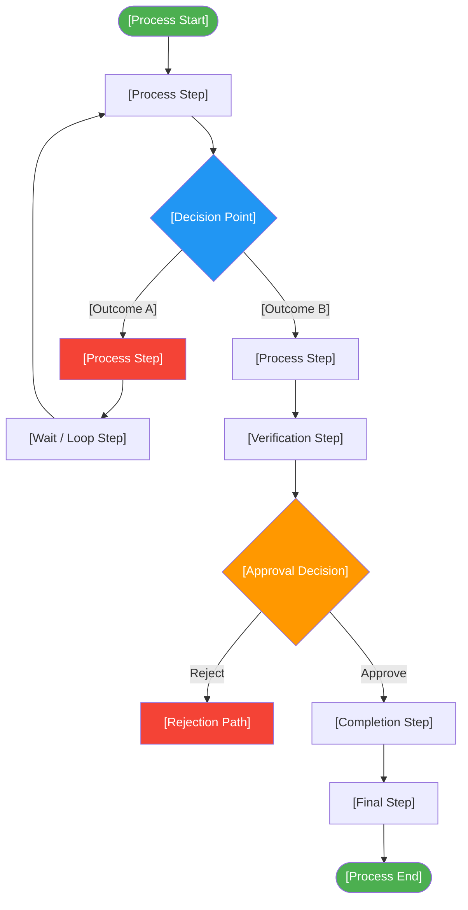

# Elicitation Results (Confirmed)

> **Project:** [Project Name]
> **Version:** [X.Y] | **Status:** [Draft | Under Review | Approved]
> **Last Updated:** [YYYY-MM-DD]
>
> ✅ **Note:** These outputs have been validated with stakeholders and are confirmed as accurate representations of captured information.

---

## Document Control

| Field | Value |
|-------|-------|
| Document Owner | [Name / Role] |
| Business Analyst | [Name / Role] |
| Source Document | [[Elicitation-Results-Unconfirmed]] |

### Revision History

| Version | Date | Author | Change Description |
|---------|------|--------|--------------------|
| 0.1 | [YYYY-MM-DD] | [Name] | Initial compilation from unconfirmed results |
| 1.0 | [YYYY-MM-DD] | [Name] | Confirmed by stakeholders |

### Confirmations

| Output | Confirmed By | Date | Method |
|--------|-------------|------|--------|
| [Process Map] | [Role] | [YYYY-MM-DD] | [Method] |
| [Business Rules] | [Role / Team] | [YYYY-MM-DD] | [Method] |
| [Requirements] | [All Stakeholders] | [YYYY-MM-DD] | [Method] |
| [Pain Points] | [Role] | [YYYY-MM-DD] | [Method] |

---

## Table of Contents

1. [Confirmation Summary](#1-confirmation-summary)
2. [Confirmed Process Map](#2-confirmed-process-map)
3. [Confirmed Requirements](#3-confirmed-requirements)
4. [Confirmed Business Rules](#4-confirmed-business-rules)
5. [Confirmed Pain Points](#5-confirmed-pain-points)
6. [Confirmed Needs](#6-confirmed-needs)
7. [Resolved Questions](#7-resolved-questions)
8. [Changes from Unconfirmed](#8-changes-from-unconfirmed)
9. [Traceability](#9-traceability)

---

## 1. Confirmation Summary

| Field | Detail |
|-------|--------|
| Source Document | [[Elicitation-Results-Unconfirmed]] — ACT-[XX] |
| Original Activity Date | [YYYY-MM-DD] |
| Confirmation Date(s) | [YYYY-MM-DD] |
| Confirmation Method | [Workshop walkthrough + individual review] |
| Participants in Confirmation | [Names and roles] |
| Items Confirmed | [X of Y] |
| Items Changed During Confirmation | [X] |
| Items Still Pending | [X] |

### Confirmation Statistics

| Category | Unconfirmed | Confirmed | Changed | Pending |
|----------|------------|----------|---------|---------|
| Requirements | [X] | [Y] | [Z] | [W] |
| Business Rules | [X] | [Y] | [Z] | [W] |
| Pain Points | [X] | [Y] | [Z] | [W] |
| Needs | [X] | [Y] | [Z] | [W] |
| **Total** | **[Sum]** | **[Sum]** | **[Sum]** | **[Sum]** |

---

## 2. Confirmed Process Map

### 2.1 Current Process (Confirmed)

### 2.2 Process Metrics (Confirmed)

| Metric | Current State | Source | Confidence |
|--------|--------------|--------|-----------|
| [Metric name] | [Measured value] | [Source] | [🟢 High / 🟡 Medium / 🔴 Low] |
| [Metric name] | [Measured value] | [Source] | [Confidence] |
| [Metric name] | [Measured value] | [Source] | [Confidence] |

---

## 3. Confirmed Requirements

| Req ID | Description | Type | Priority | Source | Confirmed By | Date | Traceability |
|--------|-------------|------|----------|--------|-------------|------|-------------|
| BR-[XX] | [System shall ...] | [Functional / Non-Functional] | [Priority] | DREQ-[XX] | [Role] | [YYYY-MM-DD] | OBJ-[XX] |
| BR-[XX] | | | | | | | |

### Changes from Unconfirmed

| Original | Change | Reason |
|---------|--------|--------|
| DREQ-[XX] | [Change made during confirmation] | [Reason] |
| [New] BR-[XX] | [New requirement added] | [Raised during confirmation — missed in original session] |

---

## 4. Confirmed Business Rules

| Rule ID | Rule | Source | Exceptions | Confirmed By | Date |
|---------|------|--------|-----------|-------------|------|
| BUR-[XX] | [Business rule statement] | DBR-[XX] | [Exceptions / None] | [Role] | [YYYY-MM-DD] |
| BUR-[XX] | | | | | |

### Changes from Unconfirmed

| Original | Change | Reason |
|---------|--------|--------|
| DBR-[XX] | [Change made during confirmation] | [Reason] |
| [New] BUR-[XX] | [New rule added] | [Raised during confirmation] |

---

## 5. Confirmed Pain Points

| ID | Pain Point | Severity | Frequency | Impact | Confirmed By | Date |
|----|-----------|----------|-----------|--------|-------------|------|
| PP-[XX] | [Pain point description] | [🔴 High / 🟡 Medium / 🟢 Low] | [Frequency] | [Impact] | [Role] | [YYYY-MM-DD] |

### Pain Point Prioritization (Confirmed)

| Rank | Pain Point | Severity × Frequency | Addressed By |
|------|-----------|---------------------|-------------|
| 1 | [Pain point] | [Severity × Frequency] | BR-[XX] |
| 2 | [Pain point] | [Severity × Frequency] | BR-[XX] |
| 3 | [Pain point] | [Severity × Frequency] | BR-[XX] |

---

## 6. Confirmed Needs

| ID | Need | Stakeholder | Priority | Confirmed By | Addressed By |
|----|------|------------|----------|-------------|-------------|
| N-[XX] | [Need statement] | [Stakeholder group] | [Priority] | [Role] | BR-[XX] |

---

## 7. Resolved Questions

| # | Question (From Unconfirmed) | Answer | Source | Date | Impact |
|---|---------------------------|--------|--------|------|--------|
| Q-[XX] | [Open question] | [Confirmed answer] | [Role] | [YYYY-MM-DD] | [Impact] |
| Q-[XX] | | | | | |

---

## 8. Changes from Unconfirmed

### 8.1 Change Log

| # | Item | Original (Unconfirmed) | Changed To | Reason | Impact |
|---|------|----------------------|-----------|--------|--------|
| 1 | [DREQ-XX] | [Original statement] | [Confirmed statement] | [Reason] | [Impact] |
| 2 | [DBR-XX] | [Original rule] | [Confirmed rule] | [Reason] | [Impact] |
| 3 | [New BR-XX] | [Not captured] | [New requirement] | [Missed in original session] | [New requirement] |

### 8.2 Items Still Pending

| # | Item | Reason | Next Step | Owner | Due Date |
|---|------|--------|-----------|-------|----------|
| 1 | [Pending item] | [Reason] | [Next step] | [Owner] | [YYYY-MM-DD] |
| 2 | [Pending item] | [Reason] | [Next step] | [Owner] | [YYYY-MM-DD] |

---

## 9. Traceability

### 9.1 Source Traceability

| Confirmed Item | Source Activity | Unconfirmed Item | Confirmation Method |
|---------------|----------------|-----------------|-------------------|
| BR-[XX] | ACT-[XX] [Activity type] | DREQ-[XX] | [Method] |
| BR-[XX] | ACT-[XX] [Activity type] | [New] | [Method] |

### 9.2 Forward Traceability

| Confirmed Item | Business Objective | Business Requirement | Solution Component |
|---------------|-------------------|---------------------|-------------------|
| BR-[XX] | OBJ-[XX] | Business Requirements §3 | [Solution component] |

---

## Related Documents

| Document | Relationship |
|----------|-------------|
| [[Elicitation-Activity-Plan]] | Plan that scheduled the source activity |
| [[Elicitation-Results-Unconfirmed]] | Raw outputs that were confirmed here |
| [[Business-Requirements]] | Requirements derived from these confirmed results |
| [[Requirements-Traceability-Matrix]] | Full traceability from objectives to tests |
| [[Current-State-Description]] | Current state data confirmed here |
| [[Gap-Analysis]] | Pain points inform gap identification |

---

> **Template Standard:** Based on BABOK v3 (Elicitation & Collaboration), ISO/IEC/IEEE 29148
> **Usage:** This document transforms raw elicitation outputs into *validated* results. Every item here has been confirmed by at least one stakeholder. Track what changed during confirmation — it reveals elicitation quality and stakeholder alignment.
