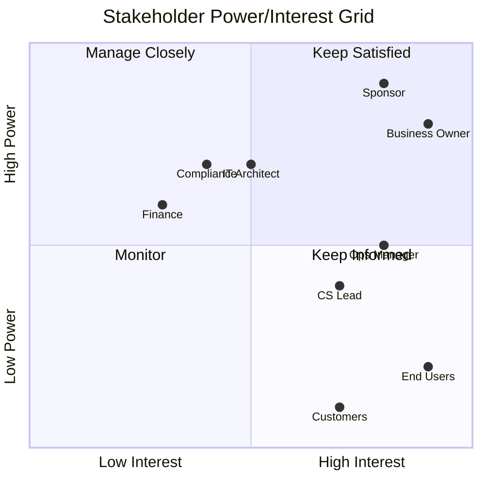
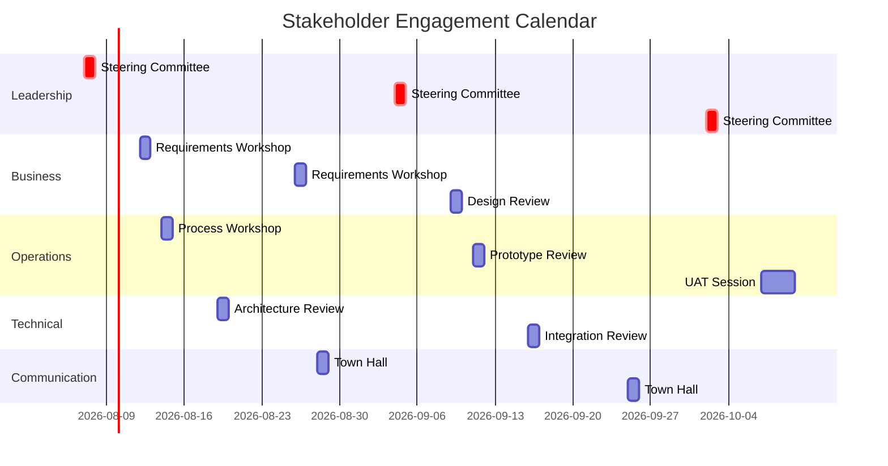

# Stakeholder Engagement Approach

> **Project:** [Project Name]
> **Version:** [X.Y] | **Status:** [Draft | Under Review | Approved | Archived]
> **Last Updated:** [YYYY-MM-DD]

---

## Document Control

| Field | Value |
|-------|-------|
| Document Owner | [Name / Role] |
| Business Analyst | [Name / Role] |
| Project Manager | [Name / Role] |
| Change Manager | [Name / Role] |

### Revision History

| Version | Date | Author | Change Description |
|---------|------|--------|--------------------|
| 0.1 | [YYYY-MM-DD] | [Name] | Initial draft |
| 1.0 | [YYYY-MM-DD] | [Name] | Approved version |

### Approvals

| Role | Name | Signature | Date |
|------|------|-----------|------|
| Project Sponsor | | | |
| Project Manager | | | |
| BA Lead | | | |

---

## Table of Contents

1. [Executive Summary](#1-executive-summary)
2. [Stakeholder Identification](#2-stakeholder-identification)
3. [Stakeholder Analysis](#3-stakeholder-analysis)
4. [Engagement Strategy](#4-engagement-strategy)
5. [Communication Plan](#5-communication-plan)
6. [Collaboration Approach](#6-collaboration-approach)
7. [Engagement Calendar](#7-engagement-calendar)
8. [Engagement Monitoring](#8-engagement-monitoring)

---

## 1. Executive Summary

| Field | Detail |
|-------|--------|
| Total Stakeholders | [X individuals across Y groups] |
| Engagement Period | [YYYY-MM-DD] to [YYYY-MM-DD] |
| Primary Approach | [e.g., High-touch for key stakeholders, low-touch for informed] |
| Key Challenge | [e.g., Limited availability of operations team] |
| Engagement Goal | [e.g., 80% stakeholder satisfaction, 90% meeting attendance] |

---

## 2. Stakeholder Identification

### 2.1 Stakeholder Register

| ID | Name | Role | Group | Interest | Influence | Attitude | Engagement Level |
|----|------|------|-------|----------|----------|---------|-----------------|
| SH-01 | [Name] | [Executive Sponsor] | Leadership | High | High | Supportive | Leading |
| SH-02 | [Name] | [Business Owner] | Business | High | High | Supportive | Leading |
| SH-03 | [Name] | [Operations Manager] | Operations | High | Medium | Neutral | Involving |
| SH-04 | [Name] | [Customer Service Lead] | Operations | High | Medium | Supportive | Involving |
| SH-05 | [Name] | [End User — Team A] | Operations | High | Low | Resistant | Consulting |
| SH-06 | [Name] | [End User — Team B] | Operations | Medium | Low | Neutral | Consulting |
| SH-07 | [Name] | [IT Architect] | Technical | Medium | High | Supportive | Consulting |
| SH-08 | [Name] | [Compliance Officer] | Governance | Medium | High | Neutral | Informed |
| SH-09 | [Name] | [Finance Director] | Finance | Low | High | Neutral | Informed |
| SH-10 | [Name] | [Customer Representative] | External | High | Low | Supportive | Consulting |

### 2.2 Stakeholder Count by Group

| Group | Count | Engagement Level |
|-------|-------|-----------------|
| Leadership | [X] | Leading / Involving |
| Business | [X] | Involving / Consulting |
| Operations | [X] | Consulting / Informed |
| Technical | [X] | Consulting |
| Governance | [X] | Informed |
| External | [X] | Consulting |

---

## 3. Stakeholder Analysis

### 3.1 Power/Interest Grid

### 3.2 Engagement Level Assessment

| Stakeholder | Current Level | Desired Level | Gap | Strategy |
|------------|--------------|--------------|-----|----------|
| SH-01 Sponsor | Leading | Leading | None | Maintain — regular updates, decision involvement |
| SH-03 Ops Manager | Neutral | Involving | ↑2 levels | Involve in workshops, co-design sessions |
| SH-05 End User A | Resistant | Consulting | ↑2 levels | Address concerns, involve in prototyping, show quick wins |
| SH-08 Compliance | Neutral | Informed | ↑1 level | Regular status updates, review sessions |
| SH-09 Finance | Neutral | Informed | ↑1 level | Monthly financial updates |

### 3.3 Stakeholder Concerns & Interests

| Stakeholder | Key Concerns | What They Need | How to Address |
|------------|-------------|---------------|---------------|
| [Sponsor] | [ROI, timeline, risk] | [Regular status, escalation path] | [Weekly dashboard, monthly steering] |
| [Ops Manager] | [Team workload, process disruption] | [Involvement in design, training plan] | [Workshops, phased approach] |
| [End User A] | [Job security, learning curve] | [Clear communication, training, support] | [1:1 sessions, champion program] |
| [IT Architect] | [Integration complexity, technical debt] | [Technical involvement, architecture input] | [Architecture reviews, ADR participation] |
| [Compliance] | [Audit trail, regulatory compliance] | [Compliance requirements addressed] | [Requirements review, compliance checklist] |

---

## 4. Engagement Strategy

### 4.1 Engagement Levels (IAPCICC Framework)

| Level | Definition | When to Use | Stakeholders |
|-------|-----------|------------|-------------|
| **Leading** | Active decision-making, champions the initiative | [Sponsors, key decision makers] | SH-01, SH-02 |
| **Involving** | Active participation in design and decisions | [Key SMEs, process owners] | SH-03, SH-04 |
| **Consulting** | Provides input, reviews, validates | [Domain experts, end users] | SH-05, SH-06, SH-07, SH-10 |
| **Informed** | Receives updates, provides feedback when asked | [Supporting roles, governance] | SH-08, SH-09 |

### 4.2 Engagement Strategy per Stakeholder

| Stakeholder | Level | Strategy | Key Activities | Frequency |
|------------|-------|----------|---------------|-----------|
| SH-01 Sponsor | Leading | [Decision partner, escalation point] | [Steering committee, 1:1 updates] | Weekly |
| SH-02 Business Owner | Leading | [Requirements partner, acceptance authority] | [Workshops, reviews, sign-off] | Weekly |
| SH-03 Ops Manager | Involving | [Co-designer, process expert] | [Workshops, prototyping, UAT] | Bi-weekly |
| SH-04 CS Lead | Involving | [Customer voice, process expert] | [Workshops, observation, UAT] | Bi-weekly |
| SH-05 End User A | Consulting | [User perspective, validation] | [Workshops, usability testing] | Monthly |
| SH-06 End User B | Consulting | [User perspective, validation] | [Workshops, usability testing] | Monthly |
| SH-07 IT Architect | Consulting | [Technical feasibility, integration] | [Architecture reviews, tech workshops] | Bi-weekly |
| SH-08 Compliance | Informed | [Regulatory guidance, audit readiness] | [Status updates, requirements review] | Monthly |
| SH-09 Finance | Informed | [Budget oversight] | [Monthly financial report] | Monthly |
| SH-10 Customer | Consulting | [Customer needs, validation] | [Interviews, UAT, feedback sessions] | As needed |

### 4.3 Resistance Management

| Stakeholder | Current Attitude | Source of Resistance | Strategy | Owner |
|------------|-----------------|---------------------|----------|-------|
| SH-05 End User A | Resistant | [Fear of job displacement, technology anxiety] | [Clarify roles evolve (not eliminated), hands-on training, involve in design] | [Change Manager] |
| SH-03 Ops Manager | Neutral | [Concerned about team workload during transition] | [Phased approach, protected training time, temporary support] | [PM] |
| | | | | |

---

## 5. Communication Plan

### 5.1 Communication Matrix

| Stakeholder | What | When | Channel | Format | Owner |
|------------|------|------|---------|--------|-------|
| SH-01 Sponsor | [Progress, risks, decisions needed] | Weekly | [Email + 1:1 meeting] | [Dashboard + verbal] | PM |
| SH-02 Business Owner | [Requirements status, issues, approvals] | Weekly | [Workshop + email] | [Document + verbal] | BA |
| SH-03 Ops Manager | [Design updates, training schedule] | Bi-weekly | [Team meeting] | [Presentation + verbal] | BA |
| SH-04 CS Lead | [Customer impact, process changes] | Bi-weekly | [Team meeting] | [Presentation + verbal] | BA |
| SH-05,06 End Users | [Project updates, training info] | Monthly | [Newsletter + town hall] | [Email + verbal] | Change Mgr |
| SH-07 IT Architect | [Technical decisions, integration updates] | Bi-weekly | [Tech review meeting] | [ADRs + verbal] | Tech Lead |
| SH-08 Compliance | [Compliance status, regulatory updates] | Monthly | [Email] | [Report] | BA |
| SH-09 Finance | [Budget status, forecast] | Monthly | [Email] | [Report] | PM |
| SH-10 Customer | [Service improvements, timeline] | At milestones | [Email + portal] | [Announcement] | Marketing |

### 5.2 Communication Channels

| Channel | Purpose | Audience | Frequency |
|---------|---------|----------|-----------|
| [Steering Committee Meeting] | [Strategic decisions, escalations] | [Leadership] | Monthly |
| [Project Status Email] | [Progress update] | [All stakeholders] | Weekly |
| [Workshop] | [Requirements, design, validation] | [Involving/Consulting] | Bi-weekly |
| [Town Hall] | [Project overview, Q&A] | [All staff] | Quarterly |
| [Newsletter] | [Updates, milestones, wins] | [All stakeholders] | Monthly |
| [Slack/Teams Channel] | [Quick questions, daily updates] | [Project team] | Daily |
| [1:1 Meeting] | [Individual concerns, deep dives] | [Key stakeholders] | As needed |

### 5.3 Escalation Communication

| Level | Trigger | Communication | Timeline | Channel |
|-------|---------|--------------|----------|---------|
| Level 1 | [Issue within team] | [Team discussion] | [Same day] | [Slack/Teams] |
| Level 2 | [Issue affects schedule/scope] | [PM notification] | [Within 24h] | [Email + meeting] |
| Level 3 | [Issue requires sponsor decision] | [Sponsor briefing] | [Within 48h] | [1:1 meeting] |
| Level 4 | [Issue affects project viability] | [Steering committee] | [Within 1 week] | [Emergency meeting] |

---

## 6. Collaboration Approach

### 6.1 Collaboration Activities

| Activity | Purpose | Participants | Frequency | Tool |
|----------|---------|-------------|-----------|------|
| [Requirements Workshop] | [Elicit and validate requirements] | [BA, SMEs, Users] | Bi-weekly | [Miro, Confluence] |
| [Design Review] | [Validate design decisions] | [BA, Architect, Users] | Per design milestone | [Figma, Confluence] |
| [Sprint Review] | [Demo working software] | [All stakeholders] | Per sprint | [Jira, Demo env] |
| [Feedback Session] | [Gather feedback on deliverables] | [Users, BA] | Monthly | [Survey, Workshop] |
| [Knowledge Sharing] | [Share learnings across team] | [Project team] | Bi-weekly | [Presentation] |

### 6.2 Collaboration Tools

| Tool | Purpose | Access | Training Required |
|------|---------|--------|------------------|
| [Confluence] | [Documentation, knowledge base] | [All stakeholders] | [30 min orientation] |
| [Jira] | [Backlog, tracking] | [Project team] | [1 hour workshop] |
| [Miro/FigJam] | [Visual collaboration, workshops] | [Workshop participants] | [15 min intro] |
| [Figma] | [Design, prototyping] | [BA, Designers, Users] | [30 min orientation] |
| [MS Teams] | [Communication, meetings] | [All stakeholders] | [None — familiar] |

---

## 7. Engagement Calendar

### 7.1 Monthly Engagement View

### 7.2 Engagement Cadence

| Activity | Cadence | Day/Time | Duration | Participants |
|----------|---------|----------|----------|-------------|
| [Daily Standup] | Daily | [09:00] | [15 min] | [Project team] |
| [Sprint Planning] | Bi-weekly | [Monday, 10:00] | [2 hours] | [Project team] |
| [Sprint Review] | Bi-weekly | [Friday, 14:00] | [1 hour] | [All stakeholders] |
| [Requirements Workshop] | Bi-weekly | [Wednesday, 09:00] | [3 hours] | [BA, SMEs, Users] |
| [Steering Committee] | Monthly | [First Thursday, 10:00] | [1 hour] | [Leadership] |
| [Town Hall] | Quarterly | [Last Thursday, 14:00] | [1 hour] | [All staff] |

---

## 8. Engagement Monitoring

### 8.1 Engagement Metrics

| Metric | Target | Current | Status |
|--------|--------|---------|--------|
| [Meeting attendance rate] | [≥80%] | [X%] | 🟢🟡🔴 |
| [Stakeholder satisfaction score] | [≥4/5] | [X/5] | 🟢🟡🔴 |
| [Feedback response rate] | [≥70%] | [X%] | 🟢🟡🔴 |
| [Open issue resolution time] | [≤5 days] | [X days] | 🟢🟡🔴 |
| [Stakeholder escalation count] | [≤2/month] | [X] | 🟢🟡🔴 |
| [Change request from stakeholders] | [Decreasing trend] | [X] | 🟢🟡🔴 |

### 8.2 Engagement Health Check

| Dimension | Assessment | Status | Action |
|-----------|-----------|--------|--------|
| [Awareness] | [% stakeholders aware of project goals] | 🟢🟡🔴 | |
| [Support] | [% stakeholders supportive of initiative] | 🟢🟡🔴 | |
| [Participation] | [% attendance at key sessions] | 🟢🟡🔴 | |
| [Satisfaction] | [% satisfied with engagement approach] | 🟢🟡🔴 | |
| [Trust] | [Qualitative — relationship health] | 🟢🟡🔴 | |

### 8.3 Engagement Adjustment Triggers

| Trigger | Threshold | Action |
|---------|----------|--------|
| [Attendance drops below 60%] | [60%] | [Investigate — timing, content, mandate] |
| [Satisfaction drops below 3/5] | [3/5] | [1:1 conversations, adjust approach] |
| [New stakeholder identified] | [Any] | [Assess, add to register, assign engagement level] |
| [Stakeholder leaves organization] | [Any key stakeholder] | [Identify replacement, transfer knowledge] |
| [Resistance emerges] | [Any] | [Root cause analysis, targeted engagement] |

---

## Related Documents

| Document | Relationship |
|----------|-------------|
| [[Elicitation-Activity-Plan]] | Engagement approach drives elicitation scheduling |
| [[Business-Analysis-Approach]] | Overall BA methodology including stakeholder management |
| [[Governance-Approach]] | Governance defines decision-making stakeholders |
| [[Change-Strategy]] | Change management aligns with engagement strategy |
| [[Communications-Management-Plan]] | Detailed communication procedures |
| [[Stakeholder-Register]] | Detailed stakeholder information |

---

> **Template Standard:** Based on BABOK v3 (BA Planning & Monitoring), PMBOK v8 (Stakeholder Management), ISO 21502
> **Usage:** This is a *living document* — stakeholder attitudes, availability, and influence change throughout the project. Review and update at least monthly or when significant changes occur.
