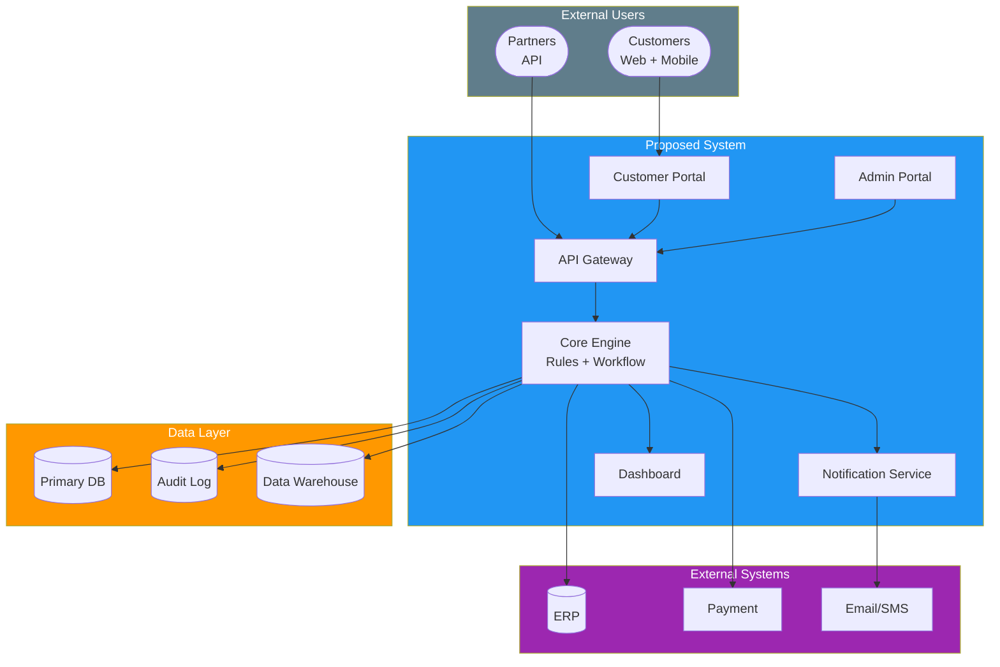
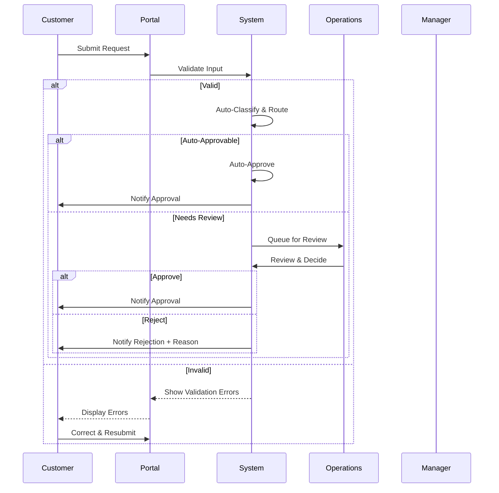
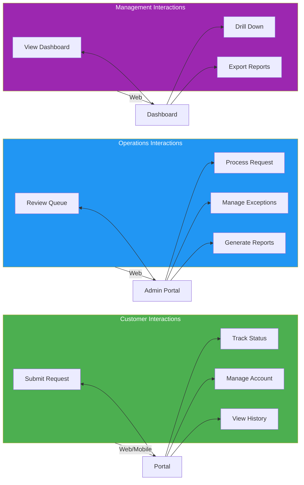

# Concept of Operations (ConOps)

> **Project:** [Project Name]
> **Version:** [X.Y] | **Status:** [Draft | Under Review | Approved | Archived]
> **Last Updated:** [YYYY-MM-DD]

---

## Document Control

| Field | Value |
|-------|-------|
| Document Owner | [Name / Role] |
| Systems Engineer | [Name / Role] |
| Operations Director | [Name / Role] |

### Revision History

| Version | Date | Author | Change Description |
|---------|------|--------|--------------------|
| 0.1 | [YYYY-MM-DD] | [Name] | Initial draft |
| 1.0 | [YYYY-MM-DD] | [Name] | Approved version |

### Approvals

| Role | Name | Signature | Date |
|------|------|-----------|------|
| Project Sponsor | | | |
| Operations Director | | | |
| Systems Engineer | | | |

---

## Table of Contents

1. [Executive Summary](#1-executive-summary)
2. [Current System Overview](#2-current-system-overview)
3. [Justification for Change](#3-justification-for-change)
4. [Proposed System Overview](#4-proposed-system-overview)
5. [Operational Scenarios](#5-operational-scenarios)
6. [User Roles & Interactions](#6-user-roles--interactions)
7. [Operational Environment](#7-operational-environment)
8. [Support Environment](#8-support-environment)
9. [Performance Characteristics](#9-performance-characteristics)
10. [Operational Constraints](#10-operational-constraints)

---

## 1. Executive Summary

| Field | Detail |
|-------|--------|
| System Purpose | [What the system does and for whom] |
| Current State | [Brief description of current operations] |
| Proposed Change | [What will change] |
| Expected Outcome | [Quantified improvement] |
| Operational Concept | [How the system will be used in practice] |

---

## 2. Current System Overview

### 2.1 Current Operations

| Aspect | Current State |
|--------|--------------|
| **Process** | [How operations work today] |
| **Systems** | [Current systems in use] |
| **Staffing** | [Current team structure and size] |
| **Volume** | [Transaction volume — daily, weekly, monthly] |
| **Performance** | [Current KPIs — time, quality, cost] |
| **Pain Points** | [Key operational issues] |

### 2.2 Current Operational Flow

---

## 3. Justification for Change

| # | Issue | Impact | Proposed Resolution |
|---|-------|--------|-------------------|
| 1 | [e.g., 12-day processing time] | [Customer dissatisfaction, lost business] | [Automated processing — target 1 day] |
| 2 | [e.g., 8% error rate] | [Rework cost, customer complaints] | [Automated validation — target <1%] |
| 3 | [e.g., No self-service] | [High support volume, poor experience] | [Customer portal] |
| 4 | [e.g., No audit trail] | [Compliance risk] | [Full audit logging] |

---

## 4. Proposed System Overview

### 4.1 System Concept

### 4.2 Key Capabilities

| Capability | Description | Benefit |
|-----------|-------------|---------|
| [Online Submission] | [Customers submit requests via web/mobile] | [Eliminates paper, 24/7 access] |
| [Automated Validation] | [Real-time input validation against business rules] | [Reduces errors from 8% to <1%] |
| [Workflow Automation] | [Rule-based routing and auto-approval] | [Reduces processing from 12 days to 1 day] |
| [Self-Service Portal] | [Customers track status, manage account] | [Reduces support calls by 70%] |
| [Real-Time Dashboard] | [Live operational metrics for management] | [Enables data-driven decisions] |
| [Audit Trail] | [Complete logging of all actions] | [Full compliance] |

---

## 5. Operational Scenarios

### 5.1 Scenario Matrix

| ID | Scenario | Frequency | Actors | Priority |
|----|----------|-----------|--------|----------|
| OS-01 | Normal Request Processing | Daily (50/day) | Customer, Operations | 🔴 |
| OS-02 | Peak Load Processing | Monthly (120/day) | Customer, Operations | 🔴 |
| OS-03 | Exception — Incomplete Submission | Daily (~30%) | Customer, System | 🔴 |
| OS-04 | Exception — Rejection | Daily (~5%) | Customer, Operations | 🟡 |
| OS-05 | Manager Escalation | Weekly | Manager, Operations | 🟡 |
| OS-06 | System Degradation | Rare | IT, Operations | 🟡 |
| OS-07 | Disaster Recovery | Very Rare | IT, Management | 🟡 |

### 5.2 Scenario: Normal Request Processing (OS-01)

### 5.3 Scenario: Peak Load (OS-02)

| Field | Detail |
|-------|--------|
| **Trigger** | [Month-end, seasonal peak] |
| **Volume** | [120 requests/day vs normal 50] |
| **System Response** | [Auto-scale infrastructure, prioritize queue] |
| **Staff Response** | [Additional staff on standby, overtime if needed] |
| **Performance Target** | [Same SLA as normal — ≤1 hour processing] |
| **Degradation Strategy** | [If overloaded — queue with priority, SLA extension to 4 hours] |

### 5.4 Scenario: Exception Handling (OS-03, OS-04, OS-05)

| Exception | Trigger | System Response | Human Response | Resolution |
|-----------|---------|----------------|---------------|-----------|
| [Incomplete submission] | [Missing required field] | [Reject with specific error message] | [None — customer self-corrects] | [Customer resubmits] |
| [Business rule violation] | [Rule check fails] | [Flag for review, queue to ops] | [Operations reviews, contacts customer if needed] | [Manual resolution] |
| [Manager escalation] | [Amount > threshold] | [Route to manager queue] | [Manager reviews and decides] | [Approve/reject] |
| [System timeout] | [External system unresponsive] | [Queue, retry 3x, then escalate] | [IT investigates] | [Retry or manual fallback] |

---

## 6. User Roles & Interactions

### 6.1 User Role Matrix

| Role | Description | Interactions | Frequency | Training Required |
|------|-------------|-------------|-----------|------------------|
| **Customer** | [External user submitting requests] | [Portal — submit, track, manage] | Daily | [15 min — online guide] |
| **Operations Staff** | [Process and review requests] | [Admin portal — review, decide, manage] | Daily | [2 days — classroom + hands-on] |
| **Operations Manager** | [Oversee operations, handle escalations] | [Admin portal + dashboard — monitor, escalate] | Daily | [1 day — dashboard + escalation] |
| **Management** | [Monitor KPIs, strategic decisions] | [Dashboard — view reports, drill down] | Weekly | [2 hours — dashboard walkthrough] |
| **IT Operations** | [System support, monitoring] | [Admin console — monitor, troubleshoot] | Daily | [3 days — technical training] |
| **System Admin** | [Configure system, manage users] | [Admin console — configure, manage] | Weekly | [5 days — full admin training] |

### 6.2 User Interaction Model

---

## 7. Operational Environment

### 7.1 Operating Conditions

| Condition | Specification |
|----------|--------------|
| **Availability** | [24/7 for portal; Business hours for admin] |
| **Performance** | [<2s page load, <1s API response] |
| **Capacity** | [100 concurrent users, 500 requests/day] |
| **Geographic** | [Domestic only — single country] |
| **Network** | [Internet access required, minimum 5 Mbps] |
| **Devices** | [Desktop, tablet, mobile — responsive] |
| **Browsers** | [Chrome, Firefox, Safari, Edge — latest 2 versions] |

### 7.2 Service Levels

| SLA | Target | Measurement |
|-----|--------|-------------|
| System Availability | [99.9%] | [Monthly uptime] |
| Page Response Time | [<2 seconds] | [95th percentile] |
| API Response Time | [<1 second] | [95th percentile] |
| Data Backup | [Daily] | [Backup completion log] |
| Recovery Time Objective (RTO) | [4 hours] | [DR test] |
| Recovery Point Objective (RPO) | [1 hour] | [DR test] |

---

## 8. Support Environment

### 8.1 Support Model

| Level | Scope | Hours | Response Time | Resolution Target |
|-------|-------|-------|--------------|-------------------|
| **L1 — Help Desk** | [Password reset, basic how-to] | [Business hours] | [<1 hour] | [<4 hours] |
| **L2 — Application Support** | [Configuration, data issues] | [Business hours] | [<4 hours] | [<1 business day] |
| **L3 — Technical Support** | [Code issues, infrastructure] | [Business hours] | [<8 hours] | [<2 business days] |
| **L4 — Vendor Support** | [Platform issues, bugs] | [Per SLA] | [<24 hours] | [Per severity] |

### 8.2 Monitoring & Alerting

| Monitor | Threshold | Alert | Response |
|---------|----------|-------|----------|
| [System availability] | [<99.9%] | [PagerDuty — critical] | [IT — immediate] |
| [Response time] | [>5s] | [Slack — warning] | [IT — investigate] |
| [Error rate] | [>1%] | [Email — warning] | [Dev — investigate] |
| [Disk space] | [>80%] | [Email — info] | [IT — expand] |
| [Queue depth] | [>100 items] | [Slack — warning] | [Ops — prioritize] |

---

## 9. Performance Characteristics

### 9.1 Performance Requirements

| Metric | Normal Load | Peak Load | Degraded Mode |
|--------|------------|----------|---------------|
| [Response time] | [<2s] | [<5s] | [<10s] |
| [Throughput] | [50 req/hr] | [120 req/hr] | [30 req/hr] |
| [Concurrent users] | [50] | [100] | [25] |
| [Data processing] | [Real-time] | [Near real-time] | [Batch — hourly] |

### 9.2 Scalability Approach

| Dimension | Current | Target | Approach |
|-----------|--------|--------|----------|
| [Users] | [50] | [500] | [Horizontal scaling, CDN] |
| [Data] | [500K records] | [5M records] | [Database partitioning, archiving] |
| [Transactions] | [50/day] | [500/day] | [Auto-scaling, queue management] |

---

## 10. Operational Constraints

| ID | Constraint | Type | Impact | Mitigation |
|----|-----------|------|--------|-----------|
| OC-01 | [Business hours support only] | Resource | [No 24/7 support] | [Self-service portal, automated alerts] |
| OC-02 | [Existing ERP integration required] | Technical | [API dependency] | [Fallback to batch file] |
| OC-03 | [Data sovereignty] | Legal | [In-country hosting only] | [Local cloud region] |
| OC-04 | [No new headcount] | Resource | [Current team must absorb new system] | [Automation, training, efficiency gains] |

---

## Related Documents

| Document | Relationship |
|----------|-------------|
| [[Mission-Analysis-Report]] | Mission context and objectives |
| [[Stakeholder-Needs-Document]] | Stakeholder needs addressed by this ConOps |
| [[System-Requirements-Specification]] | System requirements derived from ConOps |
| [[Stakeholder-Register]] | Stakeholder details |
| [[Business-Case]] | Business justification for the change |

---

> **Template Standard:** Based on SEBoK v2 (Concept Definition), ISO/IEC/IEEE 15288 (§6.4.1), ISO/IEC/IEEE 29148
> **Usage:** The ConOps describes *how the system will be used* in operational terms — not how it will be built. It bridges stakeholder needs and system requirements. All stakeholders (including non-technical ones) should be able to understand this document.
