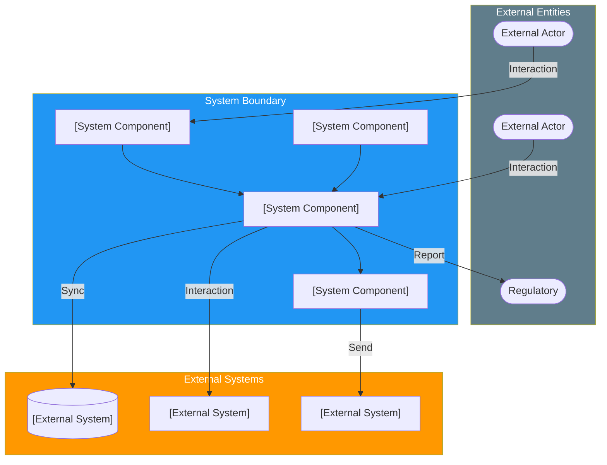

# System Requirements Specification (SyRS)

> **Project:** [Project Name]
> **Version:** [X.Y] | **Status:** [Draft | Under Review | Approved | Archived]
> **Last Updated:** [YYYY-MM-DD]

---

## Document Control

| Field | Value |
|-------|-------|
| Document Owner | [Name / Role] |
| Systems Engineer | [Name / Role] |
| Business Analyst | [Name / Role] |

### Revision History

| Version | Date | Author | Change Description |
|---------|------|--------|--------------------|
| 0.1 | [YYYY-MM-DD] | [Name] | Initial draft |
| 1.0 | [YYYY-MM-DD] | [Name] | Approved version |

### Approvals

| Role | Name | Signature | Date |
|------|------|-----------|------|
| Systems Engineer | | | |
| Solution Architect | | | |
| Operations Director | | | |

---

## Table of Contents

1. [Executive Summary](#1-executive-summary)
2. [System Context](#2-system-context)
3. [Functional Requirements](#3-functional-requirements)
4. [Non-Functional Requirements](#4-non-functional-requirements)
5. [Interface Requirements](#5-interface-requirements)
6. [Constraints](#6-constraints)
7. [Requirements Traceability](#7-requirements-traceability)

---

## 1. Executive Summary

| Field | Detail |
|-------|--------|
| System Purpose | [What the system does and for whom] |
| Total Requirements | [X functional, Y non-functional] |
| Priority Distribution | [🔴 X, 🟡 Y, 🟢 Z] |
| Source Documents | [[Stakeholder-Needs-Document]], [[Concept-of-Operations]] |

---

## 2. System Context

### 2.1 System Boundary

---

## 3. Functional Requirements

### 3.1 Requirement Categories

| Category | Description | Count |
|----------|-------------|-------|
| [Category] | [Description] | [X] |
| [Category] | [Description] | [X] |
| [Category] | [Description] | [X] |

### 3.2 Functional Requirements Register

| Req ID | Requirement | Category | Priority | Source | Status |
|--------|-------------|----------|----------|--------|--------|
| SYRS-[XXX] | [System shall ...] | [Category] | [Priority] | [SN-XX] | [Status] |
| SYRS-[XXX] | | | | | |

### 3.3 Business Rules

| Rule ID | Rule | Category | Exception | Source |
|---------|------|----------|-----------|--------|
| BR-[XX] | [Business rule statement] | [Category] | [Exception / None] | [BUR-XX] |

---

## 4. Non-Functional Requirements

### 4.1 Performance

| Req ID | Requirement | Target | Measurement |
|--------|-------------|--------|-------------|
| NFR-[XXX] | [Page response time] | [Target] | [95th percentile under normal load] |
| NFR-[XXX] | [API response time] | [Target] | [95th percentile under normal load] |
| NFR-[XXX] | [Transaction processing time] | [Target] | [End-to-end measurement basis] |
| NFR-[XXX] | [Concurrent users supported] | [Target] | [Without performance degradation] |
| NFR-[XXX] | [Daily transaction volume] | [Target] | [Without performance degradation] |

### 4.2 Availability & Reliability

| Req ID | Requirement | Target | Measurement |
|--------|-------------|--------|-------------|
| NFR-[XXX] | [System availability] | [Target] | [Monthly uptime, excluding planned maintenance] |
| NFR-[XXX] | [Recovery Time Objective (RTO)] | [Target] | [Time to restore service after failure] |
| NFR-[XXX] | [Recovery Point Objective (RPO)] | [Target] | [Maximum data loss in failure scenario] |
| NFR-[XXX] | [Planned maintenance window] | [Target] | [Maximum window per month] |

### 4.3 Security

| Req ID | Requirement | Target | Standard |
|--------|-------------|--------|---------|
| NFR-[XXX] | [Authentication] | [Authentication mechanism] | [OWASP] |
| NFR-[XXX] | [Authorization] | [Access control model] | [ISO/IEC 27001:2022] |
| NFR-[XXX] | [Data encryption at rest] | [Encryption standard] | [NIST SP 800-57] |
| NFR-[XXX] | [Data encryption in transit] | [Transport security standard] | [NIST SP 800-52] |
| NFR-[XXX] | [Audit logging] | [All actions logged with user, timestamp, action] | [ISO/IEC 27001:2022] |
| NFR-[XXX] | [Session timeout] | [Target] | [OWASP] |

### 4.4 Usability

| Req ID | Requirement | Target | Measurement |
|--------|-------------|--------|-------------|
| NFR-[XXX] | [User-facing task completion time] | [Target] | [First-time user test] |
| NFR-[XXX] | [Staff-facing task completion time] | [Target] | [Trained user test] |
| NFR-[XXX] | [Training time — end users] | [Target] | [Self-service guide] |
| NFR-[XXX] | [Training time — operations staff] | [Target] | [Classroom + hands-on] |
| NFR-[XXX] | [Accessibility] | [Accessibility standard] | [Automated + manual audit] |

### 4.5 Scalability & Maintainability

| Req ID | Requirement | Target | Measurement |
|--------|-------------|--------|-------------|
| NFR-[XXX] | [Horizontal scalability] | [Scaling target without architecture change] | [Load test] |
| NFR-[XXX] | [Code maintainability] | [Complexity threshold per function] | [Static analysis] |
| NFR-[XXX] | [API versioning] | [Backward compatibility policy] | [API contract test] |
| NFR-[XXX] | [Deployment frequency] | [Deployment cadence without downtime] | [CI/CD pipeline] |

---

## 5. Interface Requirements

### 5.1 External Interfaces

| Interface ID | System | Type | Protocol | Data Exchanged | Direction |
|-------------|--------|------|---------|---------------|-----------|
| INT-[XXX] | [External System] | [API / File] | [Protocol] | [Data exchanged] | [Direction] |
| INT-[XXX] | [External System] | [API / File] | [Protocol] | [Data exchanged] | [Direction] |
| INT-[XXX] | [External System] | [API / File] | [Protocol] | [Data exchanged] | [Direction] |

### 5.2 User Interfaces

| Interface | Users | Devices | Requirements |
|-----------|-------|---------|-------------|
| [Interface Name] | [User group] | [Devices] | [UI requirements] |
| [Interface Name] | [User group] | [Devices] | [UI requirements] |
| [Interface Name] | [User group] | [Devices] | [UI requirements] |
| [API] | [Partners, developers] | [Programmatic] | [OpenAPI 3.0 spec, rate limiting] |

---

## 6. Constraints

| ID | Constraint | Type | Source | Impact |
|----|-----------|------|--------|--------|
| CON-[XX] | [Constraint description] | [Technical / Legal / Financial / Time] | [Source] | [Impact] |
| CON-[XX] | [Constraint description] | [Technical / Legal / Financial / Time] | [Source] | [Impact] |
| CON-[XX] | [Budget cap $[X]] | Financial | [Business case] | [Limits scope and technology] |
| CON-[XX] | [Go-live by YYYY-MM-DD] | Time | [Deadline source] | [Limits scope, forces phased approach] |

---

## 7. Requirements Traceability

### 7.1 Traceability Matrix

| System Req | Stakeholder Need | Mission Objective | Test Case | Status |
|-----------|-----------------|------------------|-----------|--------|
| SYRS-[XXX] | SN-[XX] | MO-[XX] | TC-[XXX] | [Status] |

---

## Related Documents

| Document | Relationship |
|----------|-------------|
| [[Stakeholder-Needs-Document]] | Source of stakeholder needs |
| [[Concept-of-Operations]] | Operational scenarios driving these requirements |
| [[Mission-Analysis-Report]] | Mission objectives these requirements support |
| [[Business-Requirements]] | Business-level requirements elaborated here |
| [[Software-Requirements-Specification]] | Software-level requirements derived from this SyRS |
| [[Interface-Control-Document]] | Detailed interface specifications |
| [[Requirements-Traceability-Matrix]] | Full bidirectional traceability |

---

> **Template Standard:** Based on SEBoK v2, ISO/IEC/IEEE 15288 (§6.4.3), ISO/IEC/IEEE 29148
> **Usage:** The SyRS captures *system-level* requirements — what the system must do and how well. It is broader than the SRS (which focuses on software). The SyRS includes hardware, software, data, and interface requirements at the system boundary level.
