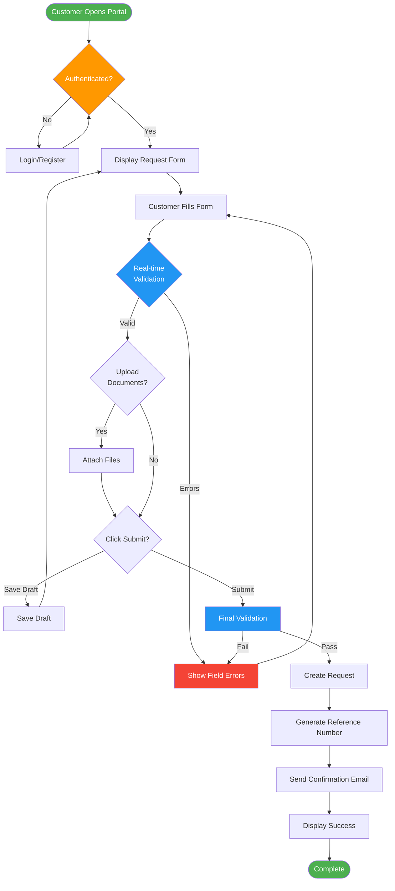
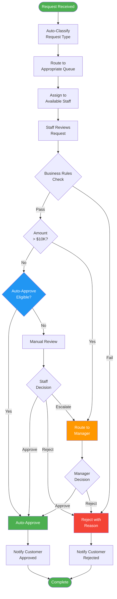
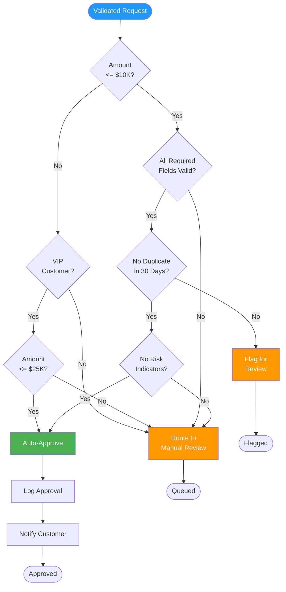
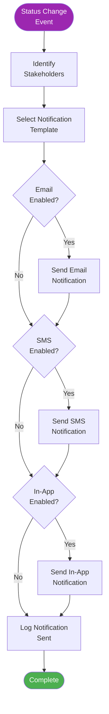
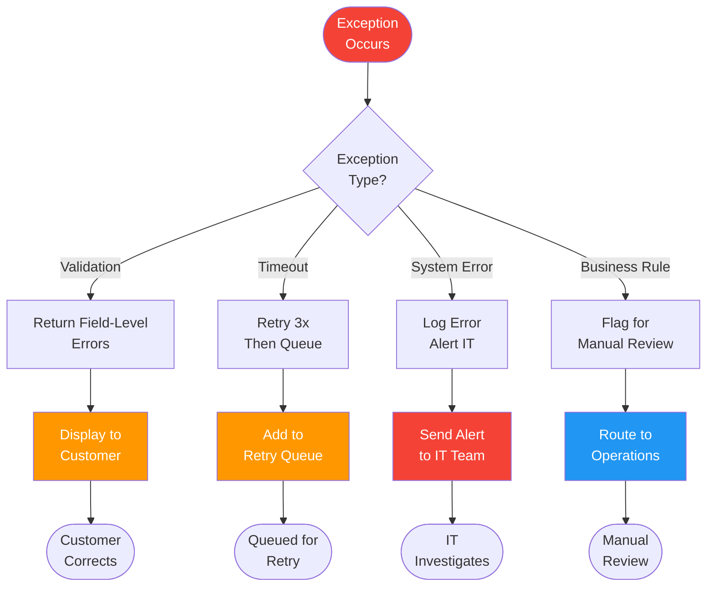

# Activity Diagrams (Requirements)

> **Project:** [Project Name]
> **Version:** [X.Y] | **Status:** [Draft | Under Review | Approved]
> **Last Updated:** [YYYY-MM-DD]

---

## Document Control

| Field | Value |
|-------|-------|
| Document Owner | [Name / Role] |
| Business Analyst | [Name / Role] |

---

## 1. Purpose

> This document contains UML-style activity diagrams that model business processes and workflows at the requirements level. These diagrams complement textual requirements with visual process flows.

## 2. Diagram Index

| # | Diagram | Process Modeled | Related Requirements | Status |
|---|---------|----------------|---------------------|--------|
| AD-01 | [Request Submission Flow] | [Customer submitting a request] | FR-001, FR-002, FR-003 | Draft |
| AD-02 | [Request Processing Flow] | [Operations processing a request] | FR-101 to FR-107 | Draft |
| AD-03 | [Auto-Approval Flow] | [Automated approval logic] | FR-103 | Draft |
| AD-04 | [Notification Flow] | [When and to whom notifications are sent] | FR-201 to FR-205 | Draft |
| AD-05 | [Exception Handling Flow] | [Error and exception scenarios] | FR-002, FR-104 | Draft |

## 3. Activity Diagrams

### AD-01: Request Submission Flow

### AD-02: Request Processing Flow

### AD-03: Auto-Approval Flow

### AD-04: Notification Flow

### AD-05: Exception Handling Flow

## 4. Diagram Legend

| Symbol | Meaning |
|--------|---------|
| Rounded rectangle | Activity / Action |
| Diamond | Decision / Branch |
| Circle (small) | Fork / Join |
| Circle (large, filled) | Start |
| Circle (large, ring) | End |
| Arrow | Flow / Transition |

---

## Related Documents

| Document | Relationship |
|----------|-------------|
| [[Software-Requirements-Specification]] | Requirements modeled here |
| [[Use-Case-Specifications]] | Use case flows visualized here |
| [[User-Stories]] | Story flows visualized here |
| [[Activity-Diagrams]] | Design-level process models |

---

> **Template Standard:** Based on SWEBOK v4, ISO/IEC 19501 (UML)
> **Usage:** Activity diagrams visualize *process flows* — they complement textual requirements. Use them for complex workflows where text alone is unclear. Mermaid format renders in GitHub, Obsidian, and most markdown viewers.
