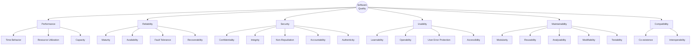

# Nonfunctional Requirements Catalog

> **Project:** [Project Name]
> **Version:** [X.Y] | **Status:** [Draft | Under Review | Approved | Archived]
> **Last Updated:** [YYYY-MM-DD]

---

## Document Control

| Field | Value |
|-------|-------|
| Document Owner | [Name / Role] |
| Technical Lead | [Name / Role] |
| Business Analyst | [Name / Role] |

### Revision History

| Version | Date | Author | Change Description |
|---------|------|--------|--------------------|
| 0.1 | [YYYY-MM-DD] | [Name] | Initial draft |
| 1.0 | [YYYY-MM-DD] | [Name] | Approved version |

### Approvals

| Role | Name | Signature | Date |
|------|------|-----------|------|
| Technical Lead | | | |
| Solution Architect | | | |
| BA Lead | | | |

---

## Table of Contents

1. [Executive Summary](#1-executive-summary)
2. [Quality Model](#2-quality-model)
3. [Performance Requirements](#3-performance-requirements)
4. [Availability & Reliability](#4-availability--reliability)
5. [Security Requirements](#5-security-requirements)
6. [Usability Requirements](#6-usability-requirements)
7. [Scalability & Maintainability](#7-scalability--maintainability)
8. [Compatibility & Portability](#8-compatibility--portability)
9. [Compliance Requirements](#9-compliance-requirements)
10. [NFR Traceability](#10-nfr-traceability)

---

## 1. Executive Summary

| Field | Detail |
|-------|--------|
| Total NFRs | [X] |
| Quality Categories | [8 per ISO 25010] |
| Critical NFRs | [X — must be verified before go-live] |
| Source Standards | [ISO 25010 (SQuaRE), OWASP, NIST, WCAG] |

---

## 2. Quality Model

### 2.1 ISO 25010 Quality Characteristics

```mermaid
flowchart TB
    R(("Software<br>Quality"))
    n1["Performance"]
    R --> n1
    n2["Time Behavior"]
    n1 --> n2
    n3["Resource Utilization"]
    n1 --> n3
    n4["Capacity"]
    n1 --> n4
    n5["Reliability"]
    R --> n5
    n6["Maturity"]
    n5 --> n6
    n7["Availability"]
    n5 --> n7
    n8["Fault Tolerance"]
    n5 --> n8
    n9["Recoverability"]
    n5 --> n9
    n10["Security"]
    R --> n10
    n11["Confidentiality"]
    n10 --> n11
    n12["Integrity"]
    n10 --> n12
    n13["Non-Repudiation"]
    n10 --> n13
    n14["Accountability"]
    n10 --> n14
    n15["Authenticity"]
    n10 --> n15
    n16["Usability"]
    R --> n16
    n17["Learnability"]
    n16 --> n17
    n18["Operability"]
    n16 --> n18
    n19["User Error Protection"]
    n16 --> n19
    n20["Accessibility"]
    n16 --> n20
    n21["Maintainability"]
    R --> n21
    n22["Modularity"]
    n21 --> n22
    n23["Reusability"]
    n21 --> n23
    n24["Analysability"]
    n21 --> n24
    n25["Modifiability"]
    n21 --> n25
    n26["Testability"]
    n21 --> n26
    n27["Compatibility"]
    R --> n27
    n28["Co-existence"]
    n27 --> n28
    n29["Interoperability"]
    n27 --> n29
```

---

## 3. Performance Requirements

| ID | Requirement | Metric | Target | Threshold | Measurement | Priority |
|----|-------------|--------|--------|-----------|-------------|----------|
| PERF-[XXX] | [Page load time] | [Response time] | [<1.5s] | [<3s] | [95th percentile] | 🔴 |
| PERF-[XXX] | [API response time] | [Response time] | [<500ms] | [<1s] | [95th percentile] | 🔴 |
| PERF-[XXX] | [Database query time] | [Response time] | [<200ms] | [<500ms] | [95th percentile] | 🟡 |
| PERF-[XXX] | [Request processing time] | [End-to-end] | [<1 hour] | [<4 hours] | [Average] | 🔴 |
| PERF-[XXX] | [Report generation time] | [Duration] | [<10s] | [<30s] | [Standard report] | 🟡 |
| PERF-[XXX] | [Concurrent users] | [Count] | [100] | [50] | [Without degradation] | 🔴 |
| PERF-[XXX] | [Transaction throughput] | [Requests/hour] | [200] | [100] | [Sustained] | 🟡 |

### Performance Testing Strategy

| Test Type | Tool | Frequency | Pass Criteria |
|-----------|------|-----------|--------------|
| [Load test] | [k6 / JMeter] | [Pre-release] | [All PERF targets met] |
| [Stress test] | [k6 / JMeter] | [Quarterly] | [Graceful degradation] |
| [Endurance test] | [k6 / JMeter] | [Pre-go-live] | [No memory leaks, stable performance] |

---

## 4. Availability & Reliability

| ID | Requirement | Metric | Target | Threshold | Measurement | Priority |
|----|-------------|--------|--------|-----------|-------------|----------|
| REL-[XXX] | [System availability] | [Uptime %] | [[X]%] | [[X]%] | [Monthly] | 🔴 |
| REL-[XXX] | [Recovery Time Objective] | [Duration] | [1 hour] | [4 hours] | [DR test] | 🔴 |
| REL-[XXX] | [Recovery Point Objective] | [Data loss] | [15 minutes] | [1 hour] | [DR test] | 🔴 |
| REL-[XXX] | [Mean Time Between Failures] | [Duration] | [720 hours] | [168 hours] | [Production metrics] | 🟡 |
| REL-[XXX] | [Mean Time To Repair] | [Duration] | [30 minutes] | [2 hours] | [Incident logs] | 🟡 |
| REL-[XXX] | [Planned maintenance window] | [Duration] | [2 hours/month] | [4 hours/month] | [Maintenance log] | 🟡 |
| REL-[XXX] | [Zero-downtime deployment] | [Boolean] | [Yes] | [N/A] | [Deployment process] | 🟡 |

### High Availability Architecture

| Component | Strategy | Failover Time |
|-----------|---------|--------------|
| [Application] | [Multi-instance, load balanced] | [<30 seconds] |
| [Database] | [Primary-replica, auto-failover] | [<60 seconds] |
| [Cache] | [Cluster mode, auto-failover] | [<10 seconds] |
| [File Storage] | [Cross-region replication] | [Automatic] |

---

## 5. Security Requirements

| ID | Requirement | Category | Standard | Priority |
|----|-------------|----------|---------|----------|
| SEC-[XXX] | [MFA for admin users] | Authentication | [OWASP] | 🔴 |
| SEC-[XXX] | [Password policy — 12+ chars, complexity] | Authentication | [NIST SP 800-63B] | 🔴 |
| SEC-[XXX] | [Session timeout — 30 min inactivity] | Session Mgmt | [OWASP] | 🔴 |
| SEC-[XXX] | [RBAC — role-based access control] | Authorization | [ISO/IEC 27001:2022] | 🔴 |
| SEC-[XXX] | [Least privilege principle] | Authorization | [ISO/IEC 27001:2022] | 🔴 |
| SEC-[XXX] | [Data encryption at rest — AES-256] | Cryptography | [NIST SP 800-57] | 🔴 |
| SEC-[XXX] | [Data encryption in transit — TLS 1.3] | Cryptography | [NIST SP 800-52] | 🔴 |
| SEC-[XXX] | [Audit trail — user, action, timestamp, IP] | Audit | [ISO/IEC 27001:2022] | 🔴 |
| SEC-[XXX] | [Input validation — SQL injection, XSS] | Input Validation | [OWASP Top 10] | 🔴 |
| SEC-[XXX] | [API rate limiting — 100 req/min/user] | API Security | [OWASP API] | 🟡 |
| SEC-[XXX] | [CSRF protection] | Web Security | [OWASP] | 🔴 |
| SEC-[XXX] | [Security headers — CSP, HSTS, X-Frame] | Web Security | [OWASP] | 🟡 |
| SEC-[XXX] | [Vulnerability scanning — monthly] | Testing | [OWASP] | 🟡 |
| SEC-[XXX] | [Penetration testing — annual] | Testing | [OWASP] | 🟡 |

---

## 6. Usability Requirements

| ID | Requirement | Metric | Target | Measurement | Priority |
|----|-------------|--------|--------|-------------|----------|
| USA-[XXX] | [Customer task completion time] | [Duration] | [<5 min] | [First-time user test] | 🔴 |
| USA-[XXX] | [Operations task completion time] | [Duration] | [<3 min] | [Trained user test] | 🔴 |
| USA-[XXX] | [User error rate] | [%] | [<X%] | [Usability test] | 🟡 |
| USA-[XXX] | [User satisfaction score] | [SUS score] | [≥X] | [Post-task survey] | 🟡 |
| USA-[XXX] | [Training time — customer] | [Duration] | [<15 min] | [Self-service guide] | 🟡 |
| USA-[XXX] | [Training time — operations] | [Duration] | [<2 days] | [Classroom + hands-on] | 🟡 |
| USA-[XXX] | [Accessibility — WCAG 2.1 AA] | [Conformance] | [AA] | [Automated + manual] | 🔴 |
| USA-[XXX] | [Responsive design] | [Devices] | [Desktop, tablet, mobile] | [Cross-device test] | 🔴 |
| USA-[XXX] | [Browser support] | [Browsers] | [Chrome, Firefox, Safari, Edge — latest 2] | [Cross-browser test] | 🔴 |
| USA-[XXX] | [Multi-language support] | [Languages] | [English, Thai] | [Localization test] | 🟡 |

---

## 7. Scalability & Maintainability

| ID | Requirement | Metric | Target | Measurement | Priority |
|----|-------------|--------|--------|-------------|----------|
| SMA-[XXX] | [Horizontal scaling] | [Capacity] | [10x current volume] | [Load test] | 🟡 |
| SMA-[XXX] | [Vertical scaling] | [Resources] | [Auto-scale CPU/memory] | [Config test] | 🟡 |
| SMA-[XXX] | [Code complexity] | [Cyclomatic] | [<10 per function] | [Static analysis] | 🟡 |
| SMA-[XXX] | [Test coverage] | [Code coverage] | [≥X%] | [Coverage report] | 🟡 |
| SMA-[XXX] | [Deployment frequency] | [Frequency] | [Daily, zero-downtime] | [CI/CD metrics] | 🟡 |
| SMA-[XXX] | [API versioning] | [Compatibility] | [Backward compatible 2 versions] | [API contract test] | 🟡 |
| SMA-[XXX] | [Log structured format] | [Format] | [JSON, with correlation ID] | [Log review] | 🟡 |
| SMA-[XXX] | [Documentation currency] | [Currency] | [Updated within 1 sprint] | [Doc review] | 🟢 |

---

## 8. Compatibility & Portability

| ID | Requirement | Category | Target | Priority |
|----|-------------|----------|--------|----------|
| COM-[XXX] | [ERP integration] | Interoperability | [REST API, bidirectional] | 🔴 |
| COM-[XXX] | [Payment gateway integration] | Interoperability | [REST API, outbound] | 🔴 |
| COM-[XXX] | [Email/SMS service integration] | Interoperability | [REST API, outbound] | 🟡 |
| COM-[XXX] | [Data export — CSV, Excel, PDF] | Portability | [Standard formats] | 🟡 |
| COM-[XXX] | [Data import — CSV, Excel] | Portability | [Standard formats] | 🟡 |
| COM-[XXX] | [Cloud provider portability] | Portability | [Containerized, no vendor-specific services] | 🟢 |

---

## 9. Compliance Requirements

| ID | Requirement | Regulation | Evidence | Priority |
|----|-------------|-----------|---------|----------|
| CMP-[XXX] | [GDPR compliance] | [GDPR] | [Privacy impact assessment, consent management] | 🔴 |
| CMP-[XXX] | [Data retention — 7 years] | [Industry regulation] | [Automated retention policy] | 🔴 |
| CMP-[XXX] | [Audit trail — all actions] | [ISO/IEC 27001:2022] | [Immutable audit log] | 🔴 |
| CMP-[XXX] | [Data sovereignty — in-country] | [Local law] | [Hosting location proof] | 🔴 |
| CMP-[XXX] | [Accessibility — WCAG 2.1 AA] | [ISO/IEC 40500] | [Accessibility audit report] | 🔴 |
| CMP-[XXX] | [PCI-DSS — if payment processing] | [PCI-DSS] | [PCI compliance report] | 🔴 |

---

## 10. NFR Traceability

| NFR ID | Quality Characteristic | SRS Requirement | Design Element | Test Case |
|--------|----------------------|----------------|---------------|-----------|
| PERF-[XXX] | Performance | NFR-[XXX] | [CDN, caching] | PERF-TC-[XXX] |
| REL-[XXX] | Reliability | NFR-[XXX] | [HA architecture] | REL-TC-[XXX] |
| SEC-[XXX] | Security | SEC-[XXX] | [Auth module] | SEC-TC-[XXX] |
| USA-[XXX] | Usability | NFR-[XXX] | [Portal UX] | USA-TC-[XXX] |
| SMA-[XXX] | Maintainability | NFR-[XXX] | [Containerized arch] | SMA-TC-[XXX] |

---

## Related Documents

| Document | Relationship |
|----------|-------------|
| [[Software-Requirements-Specification]] | NFRs are part of the SRS |
| [[System-Requirements-Specification]] | System-level NFRs |
| [[Business-Requirements]] | Business NFRs elaborated here |
| [[Architecture-Decision-Records]] | ADRs capture NFR-driven decisions |
| [[Usability-Test-Plan]] | NFRs drive performance, security, usability testing |

---

> **Template Standard:** Based on SWEBOK v4, ISO/IEC 25010 (SQuaRE), ISO/IEC/IEEE 29148
> **Usage:** This catalog provides *measurable* quality requirements. Each NFR must have a metric, target, threshold, and measurement method. "The system shall be fast" is not an NFR — "Page load time shall be <2 seconds at 95th percentile" is.
