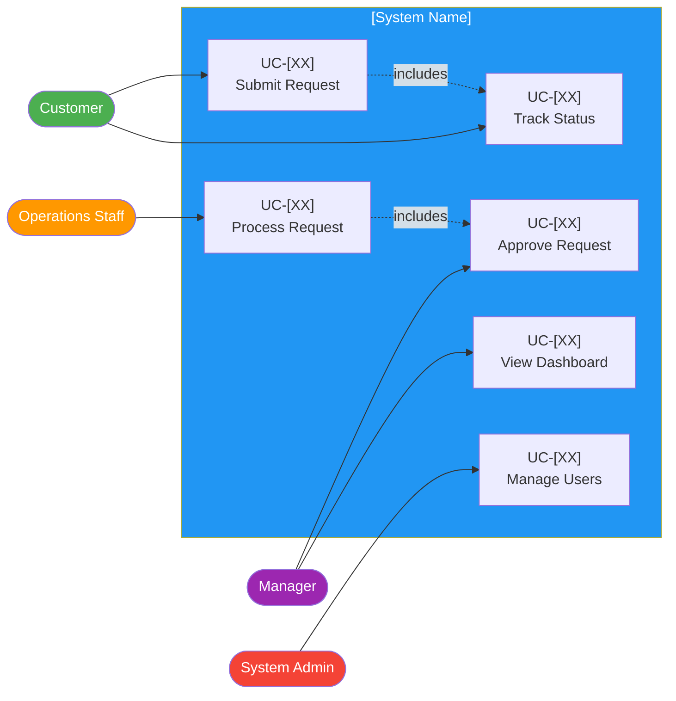

# Use Case Specifications

> **Project:** [Project Name]
> **Version:** [X.Y] | **Status:** [Draft | Under Review | Approved | Archived]
> **Last Updated:** [YYYY-MM-DD]

---

## Document Control

| Field | Value |
|-------|-------|
| Document Owner | [Name / Role] |
| Business Analyst | [Name / Role] |

### Revision History

| Version | Date | Author | Change Description |
|---------|------|--------|--------------------|
| 0.1 | [YYYY-MM-DD] | [Name] | Initial draft |
| 1.0 | [YYYY-MM-DD] | [Name] | Approved version |

---

## 1. Purpose

> This document specifies use cases — actor-goal interactions that describe how users interact with the system to achieve specific outcomes. Each use case includes actors, preconditions, main flow, alternative flows, and postconditions.

## 2. Use Case Diagram

## 3. Use Case Specifications

### UC-[XX]: [Use Case Name]

| Field | Detail |
|-------|--------|
| **Use Case ID** | UC-[XX] |
| **Use Case Name** | [Use Case Name] |
| **Actor(s)** | [Actor] |
| **Goal** | [Actor goal] |
| **Priority** | [🔴 Must Have / 🟡 Should Have / 🟢 Could Have] |
| **Related Requirements** | [FR-XXX, FR-XXX] |

#### Preconditions
- [Precondition]

#### Main Flow (Basic Flow)

| Step | Actor Action | System Response |
|------|-------------|----------------|
| 1 | [Actor action] | [System response] |
| 2 | [Actor action] | [System response] |
| 3 | | [System response] |

#### Alternative Flows

**A1: [Alternative Flow Name] (Step [N])**

| Step | Actor Action | System Response |
|------|-------------|----------------|
| [N]a | [Actor action] | [System response] |
| [N]b | | [System response] |

#### Exception Flows

**E1: [Exception Name] (Step [N])**

| Step | Actor Action | System Response |
|------|-------------|----------------|
| [N]e | [Exception condition] | [System response] |

#### Postconditions
- [Postcondition]
- [Postcondition]

---

## 4. Use Case Summary

| UC ID | Use Case | Actor(s) | Priority | Requirements | Status |
|-------|---------|---------|----------|-------------|--------|
| UC-[XX] | [Use Case Name] | [Actor] | [🔴/🟡/🟢] | FR-[XXX] to FR-[XXX] | Draft |
| UC-[XX] | [Use Case Name] | [Actor] | [🔴/🟡/🟢] | FR-[XXX] | Draft |
| UC-[XX] | [Use Case Name] | [Actor] | [🔴/🟡/🟢] | FR-[XXX] | Draft |
| UC-[XX] | [Use Case Name] | [Actor] | [🔴/🟡/🟢] | FR-[XXX] | Draft |
| UC-[XX] | [Use Case Name] | [Actor] | [🔴/🟡/🟢] | FR-[XXX] | Draft |
| UC-[XX] | [Use Case Name] | [Actor] | [🔴/🟡/🟢] | FR-XXX | Draft |

## 5. Use Case Relationships

| Relationship | From | To | Type | Description |
|-------------|------|-----|------|-------------|
| [includes] | UC-[XX] | UC-[XX] | Include | [Relationship description] |
| [extends] | UC-[XX] | UC-[XX] | Extend | [Relationship description] |
| [generalizes] | — | — | — | [No generalizations] |

---

## Related Documents

| Document | Relationship |
|----------|-------------|
| [[Software-Requirements-Specification]] | Use cases elaborate SRS functional requirements |
| [[User-Stories]] | Agile format for same requirements |
| [[Acceptance-Criteria]] | ACs derived from use case flows |
| [[Sequence-Diagrams]] | Design-level interaction details |
| [[Requirements-Traceability-Matrix]] | Use cases traced in RTM |

---

> **Template Standard:** Based on SWEBOK v4, ISO/IEC 19501 (UML), ISO/IEC/IEEE 29148
> **Usage:** Use cases describe *behavioral interactions* between actors and the system. They complement user stories — use cases for detailed behavioral specifications, user stories for backlog management. Both formats can coexist.
