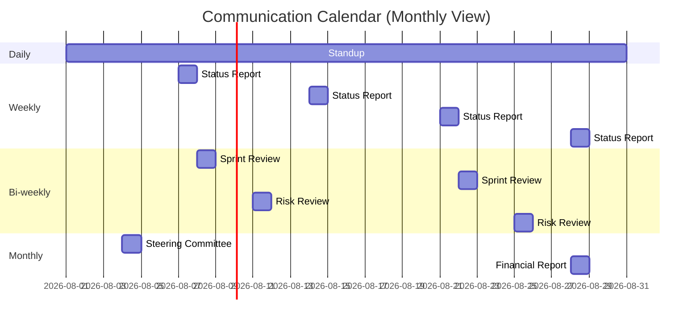

# Communications Management Plan

> **Project:** [Project Name]
> **Version:** [X.Y] | **Status:** [Draft | Under Review | Approved]
> **Last Updated:** [YYYY-MM-DD]

---

## 1. Purpose

> This plan defines how project communications will be planned, structured, implemented, and monitored.

## 2. Communication Matrix

### 2.1 Stakeholder Communication

| Communication | Audience | Purpose | Frequency | Channel | Format | Owner | Duration |
|--------------|---------|---------|-----------|---------|--------|-------|----------|
| [Daily Standup] | [Project team] | [Sync, blockers] | Daily | [Slack/Teams] | [Verbal — 15 min] | [PM] | [15 min] |
| [Sprint Planning] | [PM, BA, Dev, QA] | [Plan sprint work] | Bi-weekly | [Meeting room] | [Workshop] | [PM] | [2 hours] |
| [Sprint Review] | [All stakeholders] | [Demo, feedback] | Bi-weekly | [Meeting + virtual] | [Demo + Q&A] | [PM] | [1 hour] |
| [Sprint Retro] | [Project team] | [Process improvement] | Bi-weekly | [Meeting room] | [Workshop] | [PM] | [45 min] |
| [Weekly Status] | [Sponsor, stakeholders] | [Progress update] | Weekly | [Email] | [Report + dashboard] | [PM] | [Async] |
| [Steering Committee] | [Leadership] | [Strategic decisions] | Monthly | [Meeting room] | [Presentation] | [PM] | [1 hour] |
| [Risk Review] | [PM, BA, TL] | [Risk status] | Bi-weekly | [Meeting] | [Risk register review] | [PM] | [30 min] |
| [Requirements Workshop] | [BA, SMEs, Users] | [Elicitation, validation] | Bi-weekly | [Meeting room] | [Workshop] | [BA] | [2-3 hours] |
| [Town Hall] | [All staff] | [Project awareness] | Quarterly | [Auditorium + virtual] | [Presentation + Q&A] | [PM + Change Mgr] | [1 hour] |
| [Go-Live Communication] | [All stakeholders] | [Launch announcement] | Once | [Email + portal] | [Announcement] | [PM] | [Async] |

### 2.2 Escalation Communication

| Level | Trigger | Communication | Timeline | Channel |
|-------|---------|--------------|----------|---------|
| Level 1 | [Issue within team] | [Team discussion] | [Same day] | [Slack/Teams] |
| Level 2 | [Issue affects schedule/scope] | [PM notification] | [Within 24h] | [Email + meeting] |
| Level 3 | [Issue requires sponsor decision] | [Sponsor briefing] | [Within 48h] | [1:1 meeting] |
| Level 4 | [Issue affects project viability] | [Steering committee] | [Within 1 week] | [Emergency meeting] |

## 3. Reporting

### 3.1 Report Types

| Report | Audience | Frequency | Content | Owner | Channel |
|--------|----------|-----------|---------|-------|---------|
| [Sprint Burndown] | [Project team] | Daily | [Remaining work, blockers] | [TL] | [Jira dashboard] |
| [Sprint Summary] | [All stakeholders] | Bi-weekly | [Completed work, demo, next sprint] | [PM] | [Email] |
| [Weekly Status Report] | [Sponsor, stakeholders] | Weekly | [Progress, risks, issues, decisions needed] | [PM] | [Email] |
| [Monthly Dashboard] | [Steering Committee] | Monthly | [KPIs, milestones, budget, risks] | [PM] | [Presentation] |
| [Phase Gate Report] | [Steering Committee] | Per gate | [Gate criteria, go/no-go recommendation] | [PM] | [Formal report] |
| [Risk Report] | [Sponsor, Steering] | Bi-weekly | [Risk status, changes, recommendations] | [PM] | [Email] |
| [Financial Report] | [Sponsor, Finance] | Monthly | [Budget status, EAC, variances] | [PM] | [Email] |

### 3.2 Status Report Template

```markdown
## Weekly Status Report — [Week of YYYY-MM-DD]

### Summary
- Overall Status: 🟢 On Track / 🟡 At Risk / 🔴 Behind
- Sprint: [X] of [Y] | Velocity: [X] SP completed
- Key Achievement: [What was accomplished]
- Key Risk: [Top risk this week]

### Schedule
- Milestone Status: [On track / X days variance]
- Critical Path: [Status]

### Budget
- Spend This Week: $[X]
- Cumulative: $[X] of $[Y] budget ([Z]%)
- Forecast: [On budget / $X over/under]

### Risks & Issues
| ID | Description | Level | Status |
|----|-------------|-------|--------|
| [R-XXX] | [Description] | [🟠] | [In progress] |

### Decisions Needed
| # | Decision | Deadline | Authority |
|---|---------|----------|-----------|
| 1 | [Decision needed] | [Date] | [Sponsor] |

### Next Week
- [Key activities planned]
- [Milestones expected]
```

## 4. Communication Tools

| Tool | Purpose | Access | Usage |
|------|---------|--------|-------|
| [Slack/Teams] | [Daily communication, quick questions] | [Project team] | [Real-time messaging] |
| [Email] | [Formal communication, reports] | [All stakeholders] | [Async — formal] |
| [Jira] | [Backlog, sprint tracking] | [Project team] | [Work management] |
| [Confluence] | [Documentation, meeting notes] | [All stakeholders] | [Knowledge base] |
| [Zoom/Teams] | [Virtual meetings] | [All stakeholders] | [Video conferencing] |
| [Dashboard] | [Real-time KPIs] | [Management] | [Monitoring] |

## 5. Communication Guidelines

| Guideline | Description |
|----------|-------------|
| [Async-first] | [Default to async; schedule meeting only when discussion needed] |
| [Respect time] | [Meetings start and end on time; agendas sent in advance] |
| [Right channel] | [Quick question → Slack; Formal decision → Email; Discussion → Meeting] |
| [Document decisions] | [All decisions recorded in Confluence with rationale] |
| [No surprises] | [Escalate early; don't let bad news fester] |
| [Audience-aware] | [Technical detail for team; summary for management; plain language for users] |

## 6. Communication Schedule



## 7. Communication Metrics

| Metric | Target | Measurement | Frequency |
|--------|--------|-------------|-----------|
| [Report delivery on time] | [100%] | [Delivery tracking] | [Monthly] |
| [Meeting attendance] | [≥80%] | [Attendance log] | [Per meeting] |
| [Stakeholder satisfaction] | [≥4/5] | [Survey] | [Quarterly] |
| [Escalation response time] | [<24h for Level 2] | [Escalation log] | [Per incident] |
| [Information request response] | [<4 hours] | [Response tracking] | [Per request] |

---

## Related Documents

| Document | Relationship |
|----------|-------------|
| [[Stakeholder-Engagement-Plan]] | Stakeholder engagement strategies |
| [[Project-Management-Plan]] | Parent plan |
| [[Risk-Report]] | Risk communication |
| [[Governance-Approach]] | Escalation framework |

---

> **Template Standard:** Based on PMBOK v8, ISO 21502
> **Usage:** This plan ensures the right information reaches the right people at the right time. Poor communication is a top project failure factor — follow this plan diligently.
