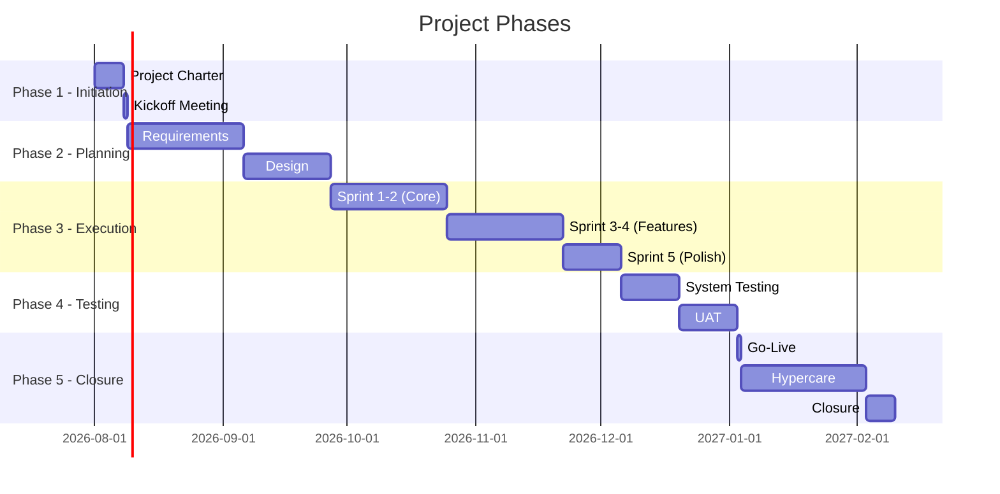
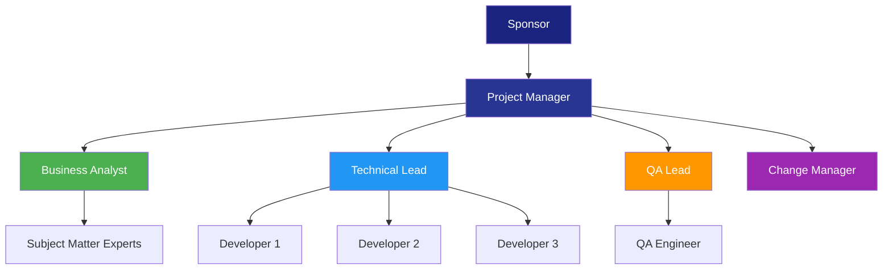

# Project Management Plan

> **Project:** [Project Name]
> **Version:** [X.Y] | **Status:** [Draft | Under Review | Approved | Baselined]
> **Last Updated:** [YYYY-MM-DD]

---

## Document Control

| Field | Value |
|-------|-------|
| Document Owner | [Name / Role] |
| Project Manager | [Name / Role] |
| Sponsor | [Name / Role] |

### Approvals

| Role | Name | Signature | Date |
|------|------|-----------|------|
| Project Sponsor | | | |
| Project Manager | | | |
| Business Owner | | | |
| IT Director | | | |

### Revision History

| Version | Date | Author | Change Description |
|---------|------|--------|--------------------|
| 0.1 | [YYYY-MM-DD] | [Name] | Initial draft |
| 1.0 | [YYYY-MM-DD] | [Name] | Baselined version |

---

## 1. Executive Summary

| Field | Detail |
|-------|--------|
| Project Name | [Name] |
| Project ID | [ID] |
| Sponsor | [Name] |
| PM | [Name] |
| Start Date | [YYYY-MM-DD] |
| End Date | [YYYY-MM-DD] |
| Budget | $[X] |
| Methodology | [Hybrid — Agile + formal gates] |

## 2. Subsidiary Plans

> This plan consolidates the following subsidiary plans. Each is maintained as a separate document.

| # | Subsidiary Plan | Document | Status |
|---|----------------|---------|--------|
| 1 | Scope Management Plan | [[Scope-Management-Plan]] | Draft |
| 2 | Schedule Management Plan | [[Schedule-Management-Plan]] | Draft |
| 3 | Financial Management Plan | [[Financial-Management-Plan]] | Draft |
| 4 | Resource Management Plan | [[Resource-Management-Plan]] | Draft |
| 5 | Risk Management Plan | [[Risk-Management-Plan]] | Draft |
| 6 | Quality Management Plan | [[Quality-Management-Plan]] | Draft |
| 7 | Communications Management Plan | [[Communications-Management-Plan]] | Draft |
| 8 | Stakeholder Engagement Plan | [[Stakeholder-Engagement-Plan]] | Draft |
| 9 | Change Management Plan | [[Change-Strategy]] | Draft |
| 10 | Configuration Management Plan | [[Change-Requests]] | Draft |
| 11 | Procurement Management Plan | [[Procurement-Management-Plan]] | Draft |

## 3. Project Lifecycle

### 3.1 Development Approach

| Aspect | Approach | Rationale |
|--------|---------|-----------|
| **Overall** | [Hybrid — Agile delivery + formal gates] | [Regulatory requires baselines; team is Agile-capable] |
| **Requirements** | [Agile — iterative refinement] | [Requirements will evolve] |
| **Design** | [Formal — architecture review] | [Technical decisions need governance] |
| **Development** | [Agile — 2-week sprints] | [Fast feedback, incremental delivery] |
| **Testing** | [Formal — test plan, test cases] | [Quality gates for go-live] |
| **Deployment** | [Formal — change control] | [Production changes need approval] |

### 3.2 Project Phases

### 3.3 Phase Gates

| Gate | Criteria | Authority | Date |
|------|---------|----------|------|
| **Gate 1** — Requirements | [Requirements baselined, stakeholder sign-off] | [Sponsor] | [YYYY-MM-DD] |
| **Gate 2** — Design | [Architecture approved, design reviewed] | [Sponsor + IT Director] | [YYYY-MM-DD] |
| **Gate 3** — Development | [All features complete, code reviewed, unit tested] | [PM + Tech Lead] | [YYYY-MM-DD] |
| **Gate 4** — Testing | [System test passed, UAT passed, zero critical defects] | [Sponsor + Business Owner] | [YYYY-MM-DD] |
| **Gate 5** — Go-Live | [Readiness assessment passed, rollback plan tested] | [Sponsor] | [YYYY-MM-DD] |
| **Gate 6** — Closure | [Benefits tracking started, lessons learned captured] | [Sponsor] | [YYYY-MM-DD] |

## 4. Project Organization

### 4.1 Team Structure

### 4.2 RACI Matrix

| Activity | Sponsor | PM | BA | TL | QA | Dev |
|----------|---------|-----|-----|-----|-----|-----|
| Project Authorization | **A** | R | I | I | I | I |
| Requirements | I | C | **A** | C | C | I |
| Design | I | C | C | **A** | C | R |
| Development | I | C | C | C | I | **A** |
| Testing | I | C | C | C | **A** | C |
| Go-Live Decision | **A** | R | C | C | C | I |
| Change Control | **A** | R | C | C | C | I |

## 5. Key Performance Indicators

| KPI | Target | Measurement | Frequency |
|-----|--------|-------------|-----------|
| [Schedule Performance Index (SPI)] | [≥0.95] | [Earned Value] | [Weekly] |
| [Cost Performance Index (CPI)] | [≥0.95] | [Earned Value] | [Weekly] |
| [Scope Completion] | [100%] | [Sprint velocity] | [Per sprint] |
| [Defect Density] | [<X per feature] | [Defect report] | [Per sprint] |
| [Stakeholder Satisfaction] | [≥4/5] | [Survey] | [Monthly] |

## 6. Communication Matrix

| Communication | Audience | Frequency | Channel | Owner |
|--------------|----------|-----------|---------|-------|
| [Daily Standup] | [Project team] | Daily | [Slack/Teams] | [PM] |
| [Sprint Review] | [All stakeholders] | Bi-weekly | [Demo + meeting] | [PM] |
| [Status Report] | [Sponsor, stakeholders] | Weekly | [Email] | [PM] |
| [Steering Committee] | [Leadership] | Monthly | [Meeting] | [PM] |
| [Risk Review] | [PM, BA, TL] | Bi-weekly | [Meeting] | [PM] |

## 7. Change Control

| Level | Definition | Authority | Timeline |
|-------|-----------|----------|----------|
| **Minor** | Clarification, no impact | PM | Same day |
| **Moderate** | <10% budget, <2 weeks schedule | CCB | Within 1 week |
| **Major** | >10% budget, >2 weeks schedule | Steering Committee | Within 2 weeks |
| **Emergency** | Critical issue | Sponsor (ratified later) | Immediate |

## 8. Baselines

| Baseline | Version | Date | Approved By |
|----------|---------|------|------------|
| [Scope Baseline] | v1.0 | [YYYY-MM-DD] | [Sponsor] |
| [Schedule Baseline] | v1.0 | [YYYY-MM-DD] | [Sponsor] |
| [Cost Baseline] | v1.0 | [YYYY-MM-DD] | [Sponsor] |

---

## Related Documents

| Document | Relationship |
|----------|-------------|
| [[Project-Charter]] | Authorization source |
| [[WBS-WBS-Dictionary]] | Scope decomposition |
| [[Project-Schedule]] | Timeline detail |
| [[Risk-Register]] | Risk management detail |
| [[Change-Log]] | Change control tracking |

---

> **Template Standard:** Based on PMBOK v8, ISO 21502
> **Usage:** This is the *master plan* — it integrates all subsidiary plans. Keep it at the right level of detail; specifics belong in subsidiary plans. Update when baselines change.
