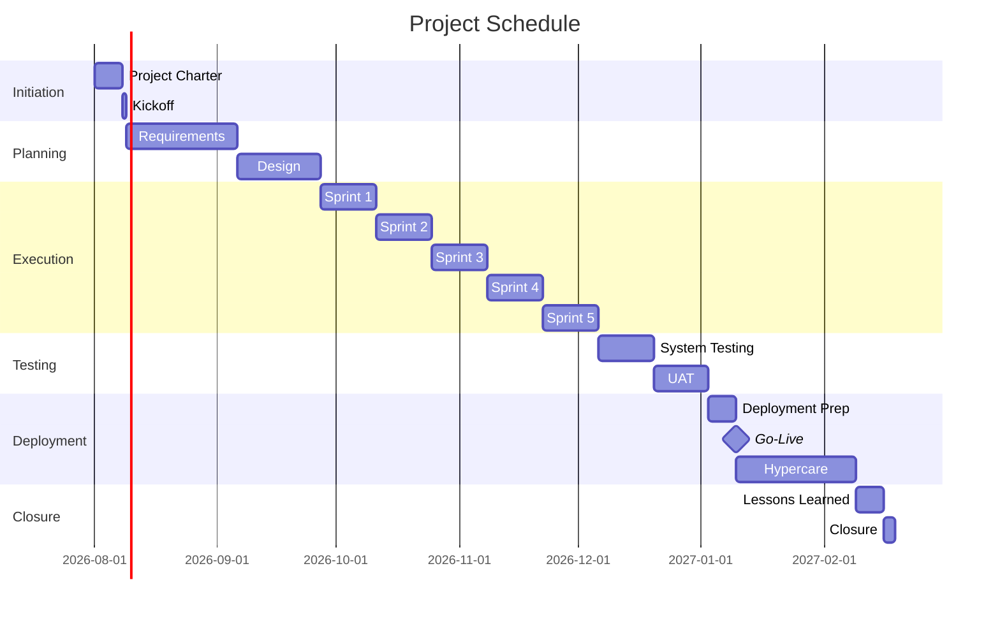

# Schedule Management Plan

> **Project:** [Project Name]
> **Version:** [X.Y] | **Status:** [Draft | Under Review | Approved | Baselined]
> **Last Updated:** [YYYY-MM-DD]

---

## Document Control

| Field | Value |
|-------|-------|
| Document Owner | [Name / Role] |
| Project Manager | [Name / Role] |

### Approvals

| Role | Name | Signature | Date |
|------|------|-----------|------|
| Project Sponsor | | | |
| Project Manager | | | |

---

## 1. Purpose

> This plan defines how the project schedule will be developed, monitored, controlled, and reported.

## 2. Schedule Planning

### 2.1 Scheduling Method

| Aspect | Approach |
|--------|---------|
| **Method** | [Agile sprints with milestone gates] |
| **Tool** | [Jira (sprint tracking) + MS Project / Gantt (milestones)] |
| **Unit** | [Days for milestones; story points for sprint work] |
| **Calendar** | [Monday-Friday, excluding public holidays] |
| **Working Hours** | [8 hours/day, 40 hours/week] |

### 2.2 Schedule Development Process

| Step | Activity | Owner | Timing |
|------|----------|-------|--------|
| 1 | [Define activities from WBS] | [PM] | [Planning phase] |
| 2 | [Sequence activities] | [PM + BA] | [Planning phase] |
| 3 | [Estimate durations] | [PM + TL] | [Planning phase] |
| 4 | [Assign resources] | [PM] | [Planning phase] |
| 5 | [Identify critical path] | [PM] | [Planning phase] |
| 6 | [Baseline schedule] | [PM + Sponsor] | [Gate 1] |

## 3. Project Schedule

### 3.1 High-Level Timeline

### 3.2 Sprint Schedule

| Sprint | Dates | Duration | Focus | Story Points |
|--------|-------|----------|-------|-------------|
| Sprint 1 | [YYYY-MM-DD] to [YYYY-MM-DD] | 2 weeks | [Customer Portal — core] | [20] |
| Sprint 2 | [YYYY-MM-DD] to [YYYY-MM-DD] | 2 weeks | [Customer Portal + Processing] | [20] |
| Sprint 3 | [YYYY-MM-DD] to [YYYY-MM-DD] | 2 weeks | [Processing Engine + Admin] | [20] |
| Sprint 4 | [YYYY-MM-DD] to [YYYY-MM-DD] | 2 weeks | [Admin Portal + Notifications] | [20] |
| Sprint 5 | [YYYY-MM-DD] to [YYYY-MM-DD] | 2 weeks | [Dashboard + Polish] | [20] |

### 3.3 Critical Path

| # | Activity | Duration | Dependencies | Float |
|---|---------|----------|-------------|-------|
| 1 | [Requirements] | [28 days] | [Kickoff] | [0] |
| 2 | [Design] | [21 days] | [Requirements] | [0] |
| 3 | [Sprint 1-5] | [70 days] | [Design] | [0] |
| 4 | [System Testing] | [14 days] | [Sprint 5] | [0] |
| 5 | [UAT] | [14 days] | [System Testing] | [0] |
| 6 | [Go-Live] | [1 day] | [UAT] | [0] |
| **Total Critical Path** | | **[148 days]** | | **[0]** |

## 4. Schedule Monitoring

### 4.1 Schedule Metrics

| Metric | Target | Measurement | Frequency |
|--------|--------|-------------|-----------|
| [Schedule Performance Index (SPI)] | [≥0.95] | [Earned Value] | [Weekly] |
| [Sprint Velocity] | [20 points/sprint] | [Completed story points] | [Per sprint] |
| [Sprint Burndown] | [Linear decline] | [Remaining work per sprint] | [Daily] |
| [Milestone Variance] | [≤5 days] | [Actual vs planned date] | [Per milestone] |
| [Critical Path Float] | [≥0 days] | [Schedule analysis] | [Weekly] |

### 4.2 Schedule Control

| Scenario | Threshold | Action | Authority |
|----------|----------|--------|----------|
| [Sprint velocity < 80% of planned] | [80%] | [Investigate, adjust scope or resources] | [PM] |
| [Milestone delayed > 5 days] | [5 days] | [Escalate to sponsor, recovery plan] | [PM + Sponsor] |
| [Critical path at risk] | [Any delay] | [Immediate recovery action] | [PM] |
| [SPI < 0.90] | [0.90] | [Steering committee review] | [Steering Committee] |

## 5. Schedule Reporting

| Report | Audience | Frequency | Content |
|--------|----------|-----------|---------|
| [Sprint Burndown] | [Project team] | Daily | [Remaining work, blockers] |
| [Sprint Review] | [All stakeholders] | Bi-weekly | [Completed work, demo] |
| [Milestone Report] | [Sponsor] | Per milestone | [Variance, issues, next steps] |
| [Schedule Dashboard] | [Steering Committee] | Monthly | [SPI, milestones, critical path] |

## 6. Schedule Baseline

| Milestone | Baseline Date | Actual Date | Variance |
|----------|--------------|-------------|----------|
| [Project Kickoff] | [YYYY-MM-DD] | | |
| [Requirements Baselined] | [YYYY-MM-DD] | | |
| [Design Approved] | [YYYY-MM-DD] | | |
| [Sprint 1 Complete] | [YYYY-MM-DD] | | |
| [Sprint 2 Complete] | [YYYY-MM-DD] | | |
| [Sprint 3 Complete] | [YYYY-MM-DD] | | |
| [Sprint 4 Complete] | [YYYY-MM-DD] | | |
| [Sprint 5 Complete] | [YYYY-MM-DD] | | |
| [System Testing Complete] | [YYYY-MM-DD] | | |
| [UAT Complete] | [YYYY-MM-DD] | | |
| [Go-Live] | [YYYY-MM-DD] | | |
| [Project Closure] | [YYYY-MM-DD] | | |

---

## Related Documents

| Document | Relationship |
|----------|-------------|
| [[WBS-WBS-Dictionary]] | Work packages being scheduled |
| [[Activity-List]] | Activities within work packages |
| [[Milestone-List]] | Key milestones |
| [[Project-Schedule]] | Detailed schedule |
| [[Project-Management-Plan]] | Parent plan |

---

> **Template Standard:** Based on PMBOK v8, ISO 21502
> **Usage:** This plan defines *how* the schedule is managed, not the schedule itself. The detailed schedule is in [[Project-Schedule]] and tracked in Jira.
