# Schedule Network Diagram

> **Project:** [Project Name]
> **Version:** [X.Y] | **Status:** [Draft | Under Review | Approved | Baselined]
> **Last Updated:** [YYYY-MM-DD]

---

## 1. Purpose

> This diagram shows the logical relationships and dependencies between project activities. It is used to identify the critical path, calculate float, and understand scheduling constraints.

## 2. Network Diagram

```mermaid
flowchart LR
    subgraph INIT["Initiation"]
        A01[ACT-001<br>Charter<br>3d] --> A02[ACT-002<br>Approve<br>2d] --> A03[ACT-003<br>Kickoff<br>1d]
    end

    subgraph PLAN["Planning"]
        A03 --> A04[ACT-004<br>Stakeholder<br>3d]
        A03 --> A05[ACT-005<br>Workshops<br>10d]
        A03 --> A06[ACT-006<br>Interviews<br>5d]
        A05 --> A07[ACT-007<br>BRD<br>5d]
        A06 --> A07
        A07 --> A08[ACT-008<br>SRS<br>7d] --> A09[ACT-009<br>Review<br>3d] --> A10[ACT-010<br>Baseline<br>1d]
        A10 --> A11[ACT-011<br>Architecture<br>7d] --> A12[ACT-012<br>Arch Review<br>2d] --> A13[ACT-013<br>Detail Design<br>10d] --> A14[ACT-014<br>Design Review<br>2d]
    end

    subgraph EXEC["Execution"]
        A14 --> C1[ACT-015<br>Sprint 1<br>10d] --> C1R[Review<br>1d]
        C1R --> C2[ACT-017<br>Sprint 2<br>10d] --> C2R[Review<br>1d]
        C2R --> C3[ACT-019<br>Sprint 3<br>10d] --> C3R[Review<br>1d]
        C3R --> C4[ACT-021<br>Sprint 4<br>10d] --> C4R[Review<br>1d]
        C4R --> C5[ACT-023<br>Sprint 5<br>10d] --> C5R[Review<br>1d]
    end

    subgraph TEST["Testing"]
        C5R --> D1[ACT-025<br>System Test<br>10d] --> D2[ACT-026<br>Integration<br>5d]
        D2 --> D3[ACT-027<br>Performance<br>5d]
        D2 --> D4[ACT-028<br>Security<br>5d]
        D3 --> D5[ACT-029<br>Fix & Retest<br>5d]
        D4 --> D5
        D5 --> D6[ACT-030<br>UAT<br>10d] --> D7[ACT-031<br>Sign-off<br>2d]
    end

    subgraph DEPLOY["Deployment"]
        D7 --> E1[ACT-032<br>Deploy Prep<br>5d] --> E2[ACT-033<br>Migration<br>3d] --> E3[ACT-034<br>Go-Live<br>1d]
        E3 --> E4[ACT-035<br>Training<br>5d]
        E3 --> E5[ACT-036<br>Hypercare<br>20d]
    end

    subgraph CLOSE["Closure"]
        E5 --> F1[ACT-037<br>Lessons<br>5d] --> F2[ACT-038<br>Archive<br>3d] --> F3[ACT-039<br>Close Report<br>2d] --> F4[ACT-040<br>Sign-off<br>1d]
    end

    style INIT fill:#1a237e,color:#fff
    style PLAN fill:#283593,color:#fff
    style EXEC fill:#4CAF50,color:#fff
    style TEST fill:#2196F3,color:#fff
    style DEPLOY fill:#FF9800,color:#fff
    style CLOSE fill:#9C27B0,color:#fff
```

## 3. Dependency Matrix

| Activity | Predecessor | Dependency Type | Lag | Notes |
|----------|-----------|----------------|-----|-------|
| ACT-002 | ACT-001 | Finish-to-Start (FS) | 0 | [Charter must be drafted before approval] |
| ACT-003 | ACT-002 | Finish-to-Start (FS) | 0 | [Charter must be approved before kickoff] |
| ACT-005 | ACT-003 | Finish-to-Start (FS) | 0 | [Kickoff before workshops] |
| ACT-006 | ACT-003 | Finish-to-Start (FS) | 0 | [Kickoff before interviews] |
| ACT-007 | ACT-005, ACT-006 | Finish-to-Start (FS) | 0 | [Both workshops and interviews before BRD] |
| ACT-008 | ACT-007 | Finish-to-Start (FS) | 0 | [BRD before SRS] |
| ACT-009 | ACT-008 | Finish-to-Start (FS) | 0 | [SRS before review] |
| ACT-010 | ACT-009 | Finish-to-Start (FS) | 0 | [Review before baseline] |
| ACT-011 | ACT-010 | Finish-to-Start (FS) | 0 | [Baseline before architecture] |
| ACT-012 | ACT-011 | Finish-to-Start (FS) | 0 | [Architecture before review] |
| ACT-013 | ACT-012 | Finish-to-Start (FS) | 0 | [Architecture review before detail design] |
| ACT-014 | ACT-013 | Finish-to-Start (FS) | 0 | [Detail design before review] |
| ACT-015 | ACT-014 | Finish-to-Start (FS) | 0 | [Design review before Sprint 1] |
| ACT-025 | ACT-024 | Finish-to-Start (FS) | 0 | [Sprint 5 before system testing] |
| ACT-027 | ACT-026 | Finish-to-Start (FS) | 0 | [Integration test before performance test] |
| ACT-028 | ACT-026 | Finish-to-Start (FS) | 0 | [Integration test before security test (parallel)] |
| ACT-029 | ACT-027, ACT-028 | Finish-to-Start (FS) | 0 | [Both tests before fix & retest] |
| ACT-030 | ACT-029 | Finish-to-Start (FS) | 0 | [Fix & retest before UAT] |
| ACT-034 | ACT-033 | Finish-to-Start (FS) | 0 | [Migration before go-live] |

## 4. Critical Path

| # | Activity | Duration | Float | Critical |
|---|---------|----------|-------|----------|
| 1 | ACT-001 | 3d | 0 | ✅ |
| 2 | ACT-002 | 2d | 0 | ✅ |
| 3 | ACT-003 | 1d | 0 | ✅ |
| 4 | ACT-005 | 10d | 0 | ✅ |
| 5 | ACT-007 | 5d | 0 | ✅ |
| 6 | ACT-008 | 7d | 0 | ✅ |
| 7 | ACT-009 | 3d | 0 | ✅ |
| 8 | ACT-010 | 1d | 0 | ✅ |
| 9 | ACT-011 | 7d | 0 | ✅ |
| 10 | ACT-012 | 2d | 0 | ✅ |
| 11 | ACT-013 | 10d | 0 | ✅ |
| 12 | ACT-014 | 2d | 0 | ✅ |
| 13 | ACT-015-024 | 55d | 0 | ✅ |
| 14 | ACT-025 | 10d | 0 | ✅ |
| 15 | ACT-026 | 5d | 0 | ✅ |
| 16 | ACT-027 | 5d | 0 | ✅ |
| 17 | ACT-029 | 5d | 0 | ✅ |
| 18 | ACT-030 | 10d | 0 | ✅ |
| 19 | ACT-031 | 2d | 0 | ✅ |
| 20 | ACT-032 | 5d | 0 | ✅ |
| 21 | ACT-033 | 3d | 0 | ✅ |
| 22 | ACT-034 | 1d | 0 | ✅ |
| **Total** | | **154d** | | |

## 5. Float Analysis

| Activity | Total Float | Free Float | Risk |
|----------|-----------|-----------|------|
| ACT-004 | 5d | 5d | 🟢 Low — can slip without affecting critical path |
| ACT-006 | 5d | 5d | 🟢 Low — can slip without affecting critical path |
| ACT-028 | 5d | 5d | 🟢 Low — parallel with performance testing |
| ACT-035 | 10d | 10d | 🟢 Low — training can extend if needed |

---

## Related Documents

| Document | Relationship |
|----------|-------------|
| [[Project-Schedule]] | Schedule with dates |
| [[Activity-List]] | Activities in this network |
| [[Schedule-Baseline]] | Approved baseline dates |
| [[Schedule-Management-Plan]] | How schedule is managed |

---

> **Template Standard:** Based on PMBOK v8, ISO 21502
> **Usage:** The network diagram shows *dependencies*, not dates. Use it to understand the critical path and identify schedule risks. Activities with zero float are on the critical path — any delay there delays the project.
