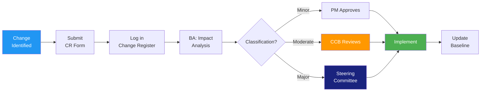

# Scope Management Plan

> **Project:** [Project Name]
> **Version:** [X.Y] | **Status:** [Draft | Under Review | Approved | Baselined]
> **Last Updated:** [YYYY-MM-DD]

---

## Document Control

| Field | Value |
|-------|-------|
| Document Owner | [Name / Role] |
| Project Manager | [Name / Role] |

### Approvals

| Role | Name | Signature | Date |
|------|------|-----------|------|
| Project Sponsor | | | |
| Project Manager | | | |
| Business Owner | | | |

---

## 1. Purpose

> This plan defines how project scope will be defined, developed, monitored, controlled, and validated.

## 2. Scope Planning

### 2.1 How Scope Will Be Defined

| Activity | Method | Owner | Timing |
|----------|--------|-------|--------|
| [Requirements gathering] | [Workshops, interviews, observation] | [BA] | [Phase 2] |
| [Scope statement creation] | [Based on business case + requirements] | [PM + BA] | [Phase 2] |
| [WBS development] | [Decomposition of deliverables] | [PM + BA] | [Phase 2] |
| [Scope baseline approval] | [Sponsor sign-off] | [Sponsor] | [Gate 1] |

### 2.2 Scope Baseline Components

| Component | Document | Version |
|-----------|---------|---------|
| [Project Scope Statement] | [[Project-Scope-Statement]] | v1.0 |
| [WBS] | [[WBS-WBS-Dictionary]] | v1.0 |
| [WBS Dictionary] | [[WBS-WBS-Dictionary]] | v1.0 |

## 3. Scope Validation

### 3.1 How Scope Will Be Validated

| Phase | Validation Method | Authority | Criteria |
|-------|------------------|----------|---------|
| [Requirements] | [Stakeholder review + sign-off] | [Business Owner] | [All requirements reviewed] |
| [Design] | [Architecture review] | [IT Director] | [Design meets requirements] |
| [Development] | [Sprint review + demo] | [Product Owner] | [Features work as specified] |
| [Testing] | [UAT] | [Business Owner] | [Acceptance criteria met] |
| [Go-Live] | [Readiness assessment] | [Sponsor] | [All gates passed] |

### 3.2 Acceptance Criteria

| Deliverable | Acceptance Criteria | Verification Method |
|------------|-------------------|-------------------|
| [Customer Portal] | [All portal FRs verified, UAT passed] | [Test execution] |
| [Admin Portal] | [All admin FRs verified, UAT passed] | [Test execution] |
| [Processing Engine] | [All workflow FRs verified, performance tested] | [Test execution] |
| [Data Migration] | [100% record reconciliation] | [Data validation] |
| [Training] | [90% completion rate] | [Training records] |

## 4. Scope Change Control

### 4.1 Change Control Process

### 4.2 Change Classification

| Level | Criteria | Authority |
|-------|---------|----------|
| **Minor** | Clarification, no cost/schedule impact | PM |
| **Moderate** | <10% budget, <2 weeks schedule | CCB |
| **Major** | >10% budget, >2 weeks schedule | Steering Committee |
| **Emergency** | Critical issue requiring immediate action | Sponsor (ratified later) |

## 5. Scope Monitoring

### 5.1 Scope Metrics

| Metric | Target | Measurement | Frequency |
|--------|--------|-------------|-----------|
| [Scope completion %] | [100% by go-live] | [Deliverables completed / total] | [Weekly] |
| [Scope change count] | [Decreasing trend] | [Change register] | [Monthly] |
| [Scope creep index] | [<10%] | [Added scope / original scope] | [Monthly] |
| [Requirements stability] | [≥85%] | [(Total - Changes) / Total] | [Monthly] |

### 5.2 Scope Creep Prevention

| # | Prevention Measure | Description |
|---|-------------------|-------------|
| 1 | [MoSCoW prioritization] | [Only 🔴 items are mandatory] |
| 2 | [Formal change control] | [All changes through CR process] |
| 3 | [Baseline management] | [Scope baselined at Gate 1] |
| 4 | [Stakeholder education] | [Explain impact of scope changes] |
| 5 | [Phase gate reviews] | [Validate scope at each gate] |

---

## Related Documents

| Document | Relationship |
|----------|-------------|
| [[Project-Scope-Statement]] | Scope definition |
| [[WBS-WBS-Dictionary]] | Scope decomposition |
| [[Requirements-Change-Log]] | Change tracking |
| [[Change-Strategy]] | Change control procedures |
| [[Project-Management-Plan]] | Parent plan |

---

> **Template Standard:** Based on PMBOK v8, ISO 21502
> **Usage:** This plan defines *how* scope is managed, not *what* the scope is. The scope itself is in [[Project-Scope-Statement]] and [[WBS-WBS-Dictionary]].
