# WBS + WBS Dictionary

> **Project:** [Project Name]
> **Version:** [X.Y] | **Status:** [Draft | Under Review | Approved | Baselined]
> **Last Updated:** [YYYY-MM-DD]

---

## Document Control

| Field | Value |
|-------|-------|
| Document Owner | [Name / Role] |
| Project Manager | [Name / Role] |

### Approvals

| Role | Name | Signature | Date |
|------|------|-----------|------|
| Project Sponsor | | | |
| Project Manager | | | |

---

## 1. Purpose

> The Work Breakdown Structure (WBS) decomposes the total scope of work into manageable deliverable-oriented components. The WBS Dictionary provides detailed descriptions of each work package.

## 2. WBS Structure

### 2.1 WBS Tree

```mermaid
flowchart TD
    P[1.0 Project<br>Name] --> A[1.1 Project<br>Management]
    P --> B[1.2 Requirements<br>& Design]
    P --> C[1.3 Development]
    P --> D[1.4 Testing]
    P --> E[1.5 Deployment<br>& Training]
    P --> F[1.6 Project<br>Closure]

    A --> A1[1.1.1 Planning]
    A --> A2[1.1.2 Monitoring]
    A --> A3[1.1.3 Change Control]
    A --> A4[1.1.4 Risk Management]

    B --> B1[1.2.1 Requirements<br>Elicitation]
    B --> B2[1.2.2 Requirements<br>Documentation]
    B --> B3[1.2.3 Architecture<br>Design]
    B --> B4[1.2.4 Detailed<br>Design]

    C --> C1[1.3.1 Customer<br>Portal]
    C --> C2[1.3.2 Admin<br>Portal]
    C --> C3[1.3.3 Processing<br>Engine]
    C --> C4[1.3.4 Integration]
    C --> C5[1.3.5 Data<br>Migration]

    D --> D1[1.4.1 System<br>Testing]
    D --> D2[1.4.2 Integration<br>Testing]
    D --> D3[1.4.3 Performance<br>Testing]
    D --> D4[1.4.4 Security<br>Testing]
    D --> D5[1.4.5 UAT]

    E --> E1[1.5.1 Deployment<br>Preparation]
    E --> E2[1.5.2 Go-Live]
    E --> E3[1.5.3 Training]
    E --> E4[1.5.4 Hypercare]

    F --> F1[1.6.1 Lessons<br>Learned]
    F --> F2[1.6.2 Documentation<br>Archive]
    F --> F3[1.6.3 Project<br>Closure Report]

    style P fill:#1a237e,color:#fff
    style A fill:#283593,color:#fff
    style B fill:#3949ab,color:#fff
    style C fill:#4CAF50,color:#fff
    style D fill:#2196F3,color:#fff
    style E fill:#FF9800,color:#fff
    style F fill:#9C27B0,color:#fff
```

### 2.2 WBS Table

| WBS ID | Element | Level | Parent | Work Package | Deliverable |
|--------|---------|-------|--------|-------------|------------|
| 1.0 | [Project Name] | 0 | — | — | — |
| 1.1 | Project Management | 1 | 1.0 | — | — |
| 1.1.1 | Planning | 2 | 1.1 | ✅ | Project plans |
| 1.1.2 | Monitoring & Control | 2 | 1.1 | ✅ | Status reports |
| 1.1.3 | Change Control | 2 | 1.1 | ✅ | Change register |
| 1.1.4 | Risk Management | 2 | 1.1 | ✅ | Risk register |
| 1.2 | Requirements & Design | 1 | 1.0 | — | — |
| 1.2.1 | Requirements Elicitation | 2 | 1.2 | ✅ | Elicitation results |
| 1.2.2 | Requirements Documentation | 2 | 1.2 | ✅ | SRS, BRD, RTM |
| 1.2.3 | Architecture Design | 2 | 1.2 | ✅ | SAD, ADRs |
| 1.2.4 | Detailed Design | 2 | 1.2 | ✅ | HLD, LLD |
| 1.3 | Development | 1 | 1.0 | — | — |
| 1.3.1 | Customer Portal | 2 | 1.3 | ✅ | Portal application |
| 1.3.2 | Admin Portal | 2 | 1.3 | ✅ | Admin application |
| 1.3.3 | Processing Engine | 2 | 1.3 | ✅ | Backend service |
| 1.3.4 | Integration | 2 | 1.3 | ✅ | Integration layer |
| 1.3.5 | Data Migration | 2 | 1.3 | ✅ | Migrated data |
| 1.4 | Testing | 1 | 1.0 | — | — |
| 1.4.1 | System Testing | 2 | 1.4 | ✅ | Test reports |
| 1.4.2 | Integration Testing | 2 | 1.4 | ✅ | Test reports |
| 1.4.3 | Performance Testing | 2 | 1.4 | ✅ | Performance report |
| 1.4.4 | Security Testing | 2 | 1.4 | ✅ | Security report |
| 1.4.5 | UAT | 2 | 1.4 | ✅ | UAT sign-off |
| 1.5 | Deployment & Training | 1 | 1.0 | — | — |
| 1.5.1 | Deployment Preparation | 2 | 1.5 | ✅ | Deployment plan |
| 1.5.2 | Go-Live | 2 | 1.5 | ✅ | Production system |
| 1.5.3 | Training | 2 | 1.5 | ✅ | Training package |
| 1.5.4 | Hypercare | 2 | 1.5 | ✅ | Support logs |
| 1.6 | Project Closure | 1 | 1.0 | — | — |
| 1.6.1 | Lessons Learned | 2 | 1.6 | ✅ | Lessons register |
| 1.6.2 | Documentation Archive | 2 | 1.6 | ✅ | Archived docs |
| 1.6.3 | Project Closure Report | 2 | 1.6 | ✅ | Closure report |

## 3. WBS Dictionary

### 3.1 Work Package: 1.1.1 Planning

| Field | Detail |
|-------|--------|
| **WBS ID** | 1.1.1 |
| **Name** | Planning |
| **Description** | [Create project management plan, subsidiary plans, and establish baselines] |
| **Deliverable** | [Project Management Plan, subsidiary plans] |
| **Responsible** | [Project Manager] |
| **Estimated Duration** | [2 weeks] |
| **Estimated Cost** | $[X] |
| **Predecessors** | [1.0 — Project authorized] |
| **Successors** | [1.2.1 — Requirements Elicitation] |
| **Acceptance Criteria** | [Plans approved by sponsor] |
| **Risks** | [Stakeholder availability for planning sessions] |

### 3.2 Work Package: 1.3.1 Customer Portal

| Field | Detail |
|-------|--------|
| **WBS ID** | 1.3.1 |
| **Name** | Customer Portal |
| **Description** | [Develop web + mobile responsive portal for customer request submission, status tracking, and account management] |
| **Deliverable** | [Customer Portal application] |
| **Responsible** | [Technical Lead + Developers] |
| **Estimated Duration** | [4 sprints (8 weeks)] |
| **Estimated Cost** | $[X] |
| **Predecessors** | [1.2.4 — Detailed Design] |
| **Successors** | [1.4.1 — System Testing] |
| **Acceptance Criteria** | [All portal FRs verified, UAT passed, WCAG 2.1 AA compliant] |
| **Risks** | [UX complexity, responsive design challenges] |
| **Requirements** | [FR-001 to FR-007] |

> **Repeat this format for each work package**

## 4. WBS Statistics

| Level | Count | Description |
|-------|-------|-------------|
| Level 0 | 1 | [Project] |
| Level 1 | 6 | [Major deliverable areas] |
| Level 2 | 19 | [Work packages] |
| **Total Work Packages** | **19** | |

## 5. WBS Verification Checklist

| # | Check | Status |
|---|-------|--------|
| 1 | [100% rule — WBS covers all scope] | ✅❌ |
| 2 | [Each element is deliverable-oriented] | ✅❌ |
| 3 | [No overlap between elements] | ✅❌ |
| 4 | [Work packages are manageable size] | ✅❌ |
| 5 | [Each work package has clear acceptance criteria] | ✅❌ |
| 6 | [Dependencies between work packages identified] | ✅❌ |
| 7 | [Resources assigned to each work package] | ✅❌ |

---

## Related Documents

| Document | Relationship |
|----------|-------------|
| [[Project-Scope-Statement]] | Scope being decomposed |
| [[Scope-Management-Plan]] | How WBS is managed |
| [[Project-Schedule]] | Timeline for WBS elements |
| [[Activity-List]] | Activities within work packages |
| [[Resource-Management-Plan]] | Resources per work package |

---

> **Template Standard:** Based on PMBOK v8, ISO 21511
> **Usage:** The WBS is the *backbone* of project planning. Every piece of work must map to a WBS element. If work doesn't fit, either the WBS is incomplete or the work is out of scope.
