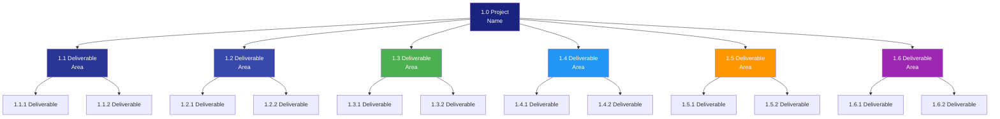

# WBS + WBS Dictionary

> **Project:** [Project Name]
> **Version:** [X.Y] | **Status:** [Draft | Under Review | Approved | Baselined]
> **Last Updated:** [YYYY-MM-DD]

---

## Document Control

| Field | Value |
|-------|-------|
| Document Owner | [Name / Role] |
| Project Manager | [Name / Role] |

### Approvals

| Role | Name | Signature | Date |
|------|------|-----------|------|
| Project Sponsor | | | |
| Project Manager | | | |

---

## 1. Purpose

> The Work Breakdown Structure (WBS) decomposes the total scope of work into manageable deliverable-oriented components. The WBS Dictionary provides detailed descriptions of each work package.

## 2. WBS Structure

### 2.1 WBS Tree

```mermaid
flowchart TD
    P[1.0 Project<br>Name] --> A[1.1 Deliverable<br>Area]
    P --> B[1.2 Deliverable<br>Area]
    P --> C[1.3 Deliverable<br>Area]
    P --> D[1.4 Deliverable<br>Area]
    P --> E[1.5 Deliverable<br>Area]
    P --> F[1.6 Deliverable<br>Area]

    A --> A1[1.1.1 Deliverable]
    A --> A2[1.1.2 Deliverable]

    B --> B1[1.2.1 Deliverable]
    B --> B2[1.2.2 Deliverable]

    C --> C1[1.3.1 Deliverable]
    C --> C2[1.3.2 Deliverable]

    D --> D1[1.4.1 Deliverable]
    D --> D2[1.4.2 Deliverable]

    E --> E1[1.5.1 Deliverable]
    E --> E2[1.5.2 Deliverable]

    F --> F1[1.6.1 Deliverable]
    F --> F2[1.6.2 Deliverable]

    style P fill:#1a237e,color:#fff
    style A fill:#283593,color:#fff
    style B fill:#3949ab,color:#fff
    style C fill:#4CAF50,color:#fff
    style D fill:#2196F3,color:#fff
    style E fill:#FF9800,color:#fff
    style F fill:#9C27B0,color:#fff
```

### 2.2 WBS Table

| WBS ID | Element | Level | Parent | Work Package | Deliverable |
|--------|---------|-------|--------|-------------|------------|
| 1.0 | [Project Name] | 0 | — | — | — |
| 1.1 | [Deliverable Area] | 1 | 1.0 | — | — |
| 1.1.1 | [Deliverable] | 2 | 1.1 | ✅ | [Deliverable] |
| 1.1.2 | [Deliverable] | 2 | 1.1 | ✅ | [Deliverable] |

## 3. WBS Dictionary

### 3.1 Work Package: [WBS ID] [Name]

| Field | Detail |
|-------|--------|
| **WBS ID** | [X.X.X] |
| **Name** | [Work Package Name] |
| **Description** | [What the work package covers] |
| **Deliverable** | [Deliverable produced] |
| **Responsible** | [Role] |
| **Estimated Duration** | [X weeks] |
| **Estimated Cost** | $[X] |
| **Predecessors** | [Predecessor WBS IDs] |
| **Successors** | [Successor WBS IDs] |
| **Acceptance Criteria** | [Criteria for accepting the deliverable] |
| **Risks** | [Key risks for this work package] |

> **Repeat this format for each work package**

## 4. WBS Statistics

| Level | Count | Description |
|-------|-------|-------------|
| Level 0 | 1 | [Project] |
| Level 1 | [N] | [Major deliverable areas] |
| Level 2 | [N] | [Work packages] |
| **Total Work Packages** | **[N]** | |

## 5. WBS Verification Checklist

| # | Check | Status |
|---|-------|--------|
| 1 | [100% rule — WBS covers all scope] | ✅❌ |
| 2 | [Each element is deliverable-oriented] | ✅❌ |
| 3 | [No overlap between elements] | ✅❌ |
| 4 | [Work packages are manageable size] | ✅❌ |
| 5 | [Each work package has clear acceptance criteria] | ✅❌ |
| 6 | [Dependencies between work packages identified] | ✅❌ |
| 7 | [Resources assigned to each work package] | ✅❌ |

---

## Related Documents

| Document | Relationship |
|----------|-------------|
| [[Project-Scope-Statement]] | Scope being decomposed |
| [[Scope-Management-Plan]] | How WBS is managed |
| [[Project-Schedule]] | Timeline for WBS elements |
| [[Activity-List]] | Activities within work packages |
| [[Resource-Management-Plan]] | Resources per work package |

---

> **Template Standard:** Based on PMBOK v8, ISO 21511
> **Usage:** The WBS is the *backbone* of project planning. Every piece of work must map to a WBS element. If work doesn't fit, either the WBS is incomplete or the work is out of scope.