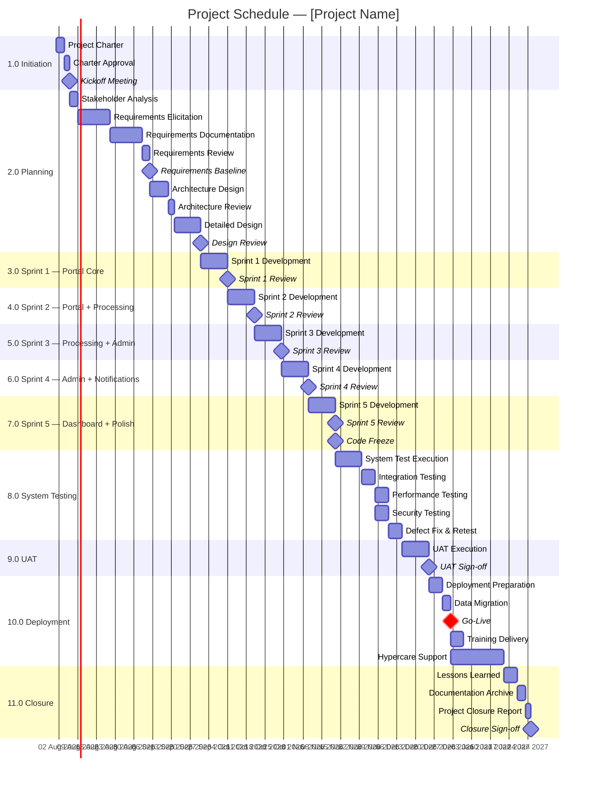
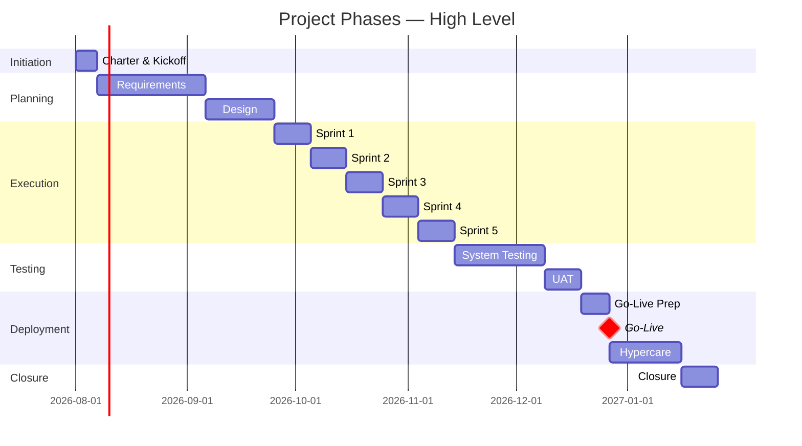
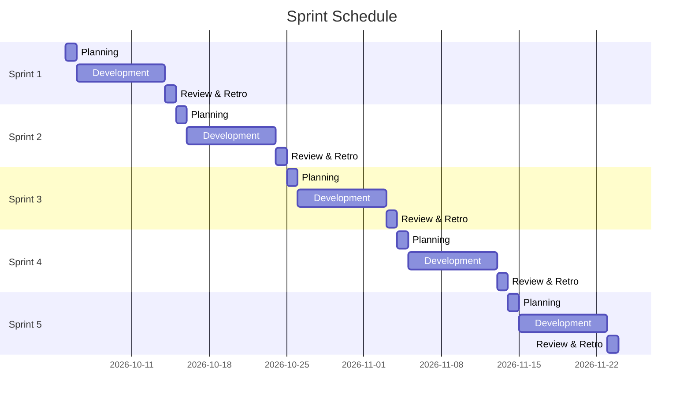
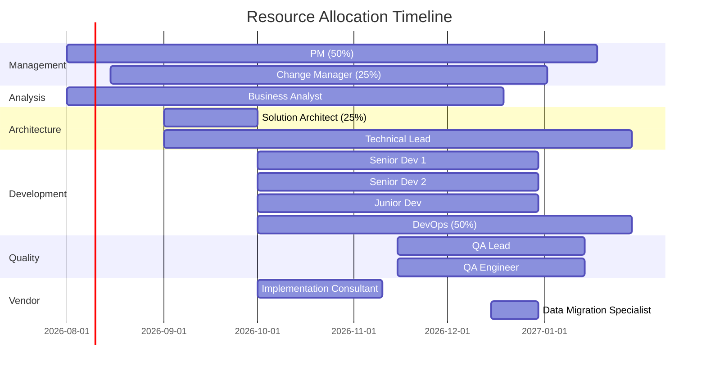
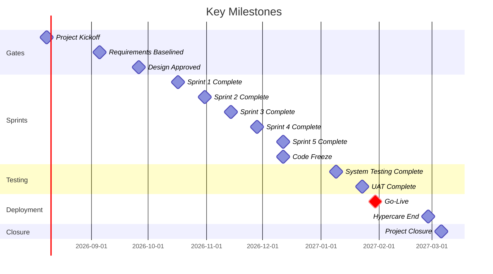
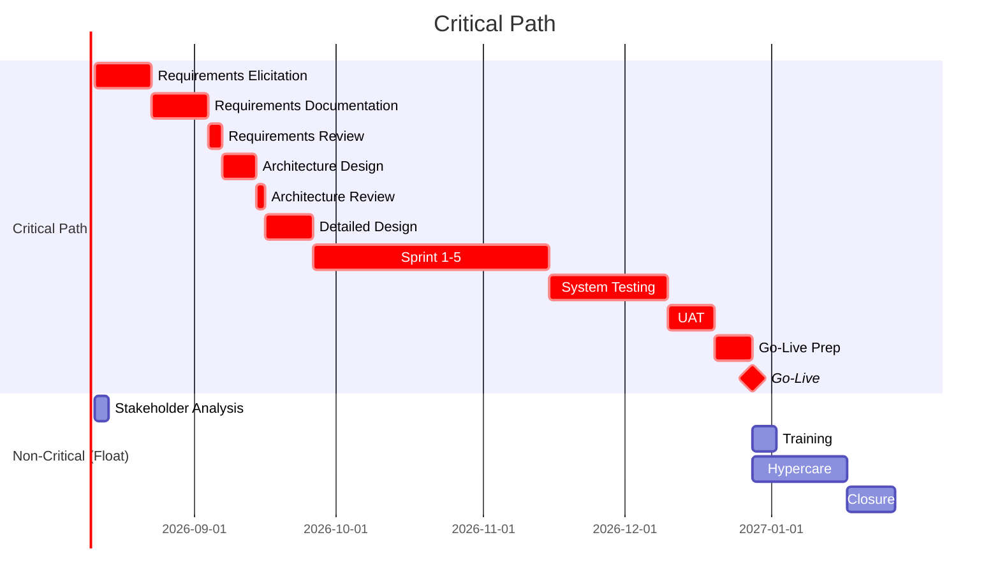

# Gantt Chart / Schedule

> **Project:** [Project Name]
> **Version:** [X.Y] | **Status:** [Draft | Under Review | Approved | Baselined]
> **Last Updated:** [YYYY-MM-DD]

---

## 1. Purpose

> This document provides a visual Gantt chart representation of the project schedule using Mermaid syntax. It renders in GitHub, Obsidian, VS Code, and most markdown viewers.

## 2. Full Project Gantt Chart



## 3. Phase Summary Gantt



## 4. Sprint-Level Gantt



## 5. Resource Gantt



## 6. Milestone Gantt



## 7. Critical Path Gantt



## 8. Gantt Chart Legend

| Element | Meaning |
|---------|---------|
| `task name` | Regular activity |
| `crit, task name` | Critical path activity |
| `milestone` | Zero-duration milestone |
| `milestone, crit` | Critical milestone |
| Arrow `-->` | Dependency (finish-to-start) |
| `after task_id` | Starts after specified task |

## 9. How to Use These Charts

| Viewer | Renders Mermaid? | Notes |
|--------|-----------------|-------|
| [GitHub] | ✅ Yes | [Renders in markdown preview] |
| [Obsidian] | ✅ Yes | [Mermaid plugin built-in] |
| [VS Code] | ✅ Yes | [Mermaid extension required] |
| [GitLab] | ✅ Yes | [Renders in markdown] |
| [Notion] | ✅ Yes | [Mermaid block] |
| [Confluence] | ⚠️ Plugin | [Mermaid plugin required] |
| [Export to PDF] | ⚠️ Via tool | [Use mmdc CLI or Pandoc] |

### Export to Image/PDF

```bash
# Install Mermaid CLI
npm install -g @mermaid-js/mermaid-cli

# Export to PNG
mmdc -i schedule.mmd -o schedule.png

# Export to PDF
mmdc -i schedule.mmd -o schedule.pdf

# Export to SVG
mmdc -i schedule.mmd -o schedule.svg
```

---

## Related Documents

| Document | Relationship |
|----------|-------------|
| [[Project-Schedule]] | Detailed schedule with dates |
| [[Schedule-Baseline]] | Approved baseline dates |
| [[Activity-List]] | Activities being visualized |
| [[Milestone-List]] | Milestones being visualized |
| [[Resource-Management-Plan]] | Resource allocation visualized |
| [[Schedule-Management-Plan]] | How schedule is managed |

---

> **Template Standard:** Based on SWEBOK v4, PMBOK v8
> **Usage:** These Gantt charts provide *visual* schedule representation. Use the Full Project Gantt for comprehensive view, Phase Summary for executive reporting, Sprint Gantt for team planning, and Resource Gantt for capacity management. All charts are Mermaid — they render natively in most markdown viewers.
