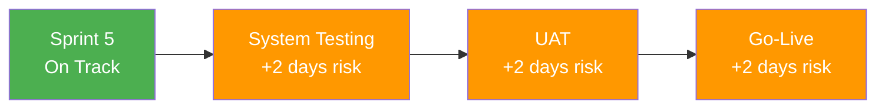

# Schedule Forecasts

> **Project:** [Project Name]
> **Version:** [X.Y] | **Status:** [Active]
> **Last Updated:** [YYYY-MM-DD]

---

## 1. Purpose

> This document provides schedule forecasts — predicted completion dates based on current performance trends.

## 2. Forecast Summary

| Field | Detail |
|-------|--------|
| [Baseline Completion Date] | [YYYY-MM-DD] |
| [Forecast Completion Date] | [YYYY-MM-DD] |
| [Schedule Variance] | [X days early / late] |
| [Schedule Performance Index (SPI)] | [X.XX] |
| [Forecast Confidence] | [High / Medium / Low] |
| [Critical Path Status] | [On track / At risk / Delayed] |

## 3. Milestone Forecasts

| Milestone | Baseline | Forecast | Actual | Variance | SPI | Status |
|----------|---------|---------|--------|---------|-----|--------|
| [Requirements Baselined] | [YYYY-MM-DD] | [YYYY-MM-DD] | [YYYY-MM-DD] | [0 days] | [1.00] | ✅ On Time |
| [Design Approved] | [YYYY-MM-DD] | [YYYY-MM-DD] | [YYYY-MM-DD] | [+2 days] | [0.95] | 🟡 Slightly Late |
| [Sprint 1 Complete] | [YYYY-MM-DD] | [YYYY-MM-DD] | [YYYY-MM-DD] | [0 days] | [1.00] | ✅ On Time |
| [Sprint 2 Complete] | [YYYY-MM-DD] | [YYYY-MM-DD] | [YYYY-MM-DD] | [0 days] | [1.00] | ✅ On Time |
| [Sprint 3 Complete] | [YYYY-MM-DD] | [YYYY-MM-DD] | [YYYY-MM-DD] | [-1 day] | [1.05] | ✅ Early |
| [Sprint 4 Complete] | [YYYY-MM-DD] | [YYYY-MM-DD] | | [0 days] | [1.00] | ⏳ In Progress |
| [Sprint 5 Complete] | [YYYY-MM-DD] | [YYYY-MM-DD] | | [0 days] | [1.00] | ⬜ Not Started |
| [System Testing] | [YYYY-MM-DD] | [YYYY-MM-DD] | | [+2 days] | [0.95] | 🟡 Forecast Late |
| [UAT Complete] | [YYYY-MM-DD] | [YYYY-MM-DD] | | [+2 days] | [0.95] | 🟡 Forecast Late |
| [Go-Live] | [YYYY-MM-DD] | [YYYY-MM-DD] | | [+2 days] | [0.95] | 🟡 Forecast Late |

## 4. Schedule Forecast Methods

| Method | Formula | When to Use | Current Forecast |
|--------|---------|------------|-----------------|
| **SPI-Based** | [Baseline Duration / SPI] | [Typical variances] | [YYYY-MM-DD] |
| **Critical Path** | [Critical path remaining + actual progress] | [Critical path analysis] | [YYYY-MM-DD] |
| **Bottom-Up** | [Re-estimate remaining work] | [Original estimates flawed] | [YYYY-MM-DD] |
| **Sprint Velocity** | [Remaining SP / Average velocity × sprint length] | [Agile projects] | [YYYY-MM-DD] |

### 4.1 Recommended Forecast

| Method | Forecast | Variance | Rationale |
|--------|---------|---------|----------|
| [SPI-Based] | [YYYY-MM-DD] | [+2 days] | [Consistent SPI pattern] |
| [Sprint Velocity] | [YYYY-MM-DD] | [+1 day] | [Velocity stable at 20 SP] |
| **Recommended** | **[YYYY-MM-DD]** | **[+2 days]** | [Conservative — uses SPI] |

## 5. Critical Path Forecast

| Activity | Baseline End | Forecast End | Float | Status |
|----------|-------------|-------------|-------|--------|
| [Sprint 5] | [YYYY-MM-DD] | [YYYY-MM-DD] | [0] | ✅ On Track |
| [System Testing] | [YYYY-MM-DD] | [YYYY-MM-DD] | [0] | 🟡 +2 days |
| [UAT] | [YYYY-MM-DD] | [YYYY-MM-DD] | [0] | 🟡 +2 days |
| [Go-Live] | [YYYY-MM-DD] | [YYYY-MM-DD] | [0] | 🟡 +2 days |

### Critical Path Analysis

## 6. Schedule Trend

| Period | SPI | Forecast Go-Live | Variance | Trend |
|--------|-----|-----------------|---------|-------|
| [Month 1] | [0.90] | [YYYY-MM-DD] | [+5 days] | — |
| [Month 2] | [0.95] | [YYYY-MM-DD] | [+3 days] | ↓ Improving |
| [Month 3] | [1.00] | [YYYY-MM-DD] | [+2 days] | ↓ Improving |
| [Month 4] | [0.98] | [YYYY-MM-DD] | [+2 days] | → Stable |
| **Current** | **[0.98]** | **[YYYY-MM-DD]** | **[+2 days]** | **→ Stable** |

## 7. Schedule Scenarios

| Scenario | Assumption | Forecast | Variance | Probability |
|----------|-----------|---------|---------|-----------|
| **Optimistic** | [SPI improves to 1.0, no blockers] | [YYYY-MM-DD] | [0 days] | [20%] |
| **Base Case** | [SPI stays at 0.98] | [YYYY-MM-DD] | [+2 days] | [60%] |
| **Pessimistic** | [SPI drops to 0.90, blockers occur] | [YYYY-MM-DD] | [+7 days] | [20%] |
| **Expected** | [Weighted average] | [YYYY-MM-DD] | [+2 days] | — |

## 8. Schedule Recovery Options

| Option | Description | Cost | Schedule Recovery | Risk |
|--------|-----------|------|------------------|------|
| [Crashing] | [Add resources to critical path] | [+$X] | [Y days] | [Team coordination] |
| [Fast-tracking] | [Parallel critical path activities] | [None] | [Y days] | [Quality risk] |
| [Scope reduction] | [Defer 🟢 features to Phase 2] | [None] | [Y days] | [Stakeholder impact] |
| [Overtime] | [Extended hours for critical period] | [+$X] | [Y days] | [Team fatigue] |
| **Recommended** | **[Accept +2 day variance]** | **$0** | **N/A** | **None** |

> **Note:** A +2 day variance is within acceptable tolerance. Recovery options are not recommended at this time.

## 9. Schedule Alerts

| Alert | Threshold | Current | Status | Action |
|-------|----------|---------|--------|--------|
| [SPI < 0.90] | [0.90] | [0.98] | 🟢 OK | None |
| [Critical path delay > 5 days] | [5 days] | [2 days] | 🟢 OK | Monitor |
| [Milestone delayed > 3 days] | [3 days] | [2 days] | 🟢 OK | Monitor |
| [Sprint velocity < 80% of planned] | [16 SP] | [20 SP] | 🟢 OK | None |

## 10. Forecast Assumptions

| # | Assumption | Impact if Invalid |
|---|-----------|-------------------|
| 1 | [No scope changes affecting critical path] | [Forecast date changes] |
| 2 | [Team velocity remains stable] | [Forecast date changes] |
| 3 | [No major blockers on critical path] | [Forecast date changes] |
| 4 | [Testing phase duration as planned] | [Forecast date changes] |

---

## Related Documents

| Document | Relationship |
|----------|-------------|
| [[Project-Schedule]] | Baseline schedule |
| [[Schedule-Baseline]] | Approved baseline dates |
| [[Work-Performance-Data]] | Actual progress data |
| [[Work-Performance-Information]] | Schedule analysis |
| [[Earned-Value-Analysis]] | SPI calculations |

---

> **Template Standard:** Based on PMBOK v8, ISO 21502
> **Usage:** Update schedule forecasts monthly or when significant changes occur. Use multiple methods and compare. If forecast exceeds baseline by >5% of total duration, consider recovery options.
