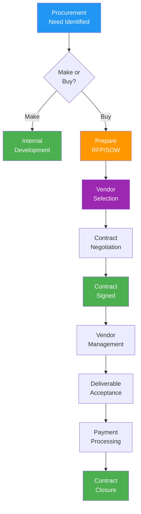

# Procurement Management Plan

> **Project:** [Project Name]
> **Version:** [X.Y] | **Status:** [Draft | Under Review | Approved]
> **Last Updated:** [YYYY-MM-DD]

---

## 1. Purpose

> This plan defines how procurement processes will be managed — from make/buy decisions through vendor selection, contract management, and closure.

## 2. Procurement Strategy

| Aspect | Approach |
|--------|---------|
| [Make/Buy Decision] | [Hybrid — SaaS for platform, custom for differentiators] |
| [Contract Strategy] | [Fixed-price for defined scope; T&M for evolving scope] |
| [Vendor Selection] | [Competitive bid for >$X; Direct award for <$X] |
| [Contract Management] | [PM manages vendor relationships; Procurement manages contracts] |
| [Payment Terms] | [Net 30, milestone-based payments] |

## 3. Procurement Items

| # | Item | Type | Estimated Cost | Procurement Method | Timeline | Status |
|---|------|------|---------------|-------------------|----------|--------|
| 1 | [CRM Platform] | SaaS | $[X]/year | [Direct — existing vendor] | [4 weeks] | ✅ Procured |
| 2 | [Implementation Services] | Service | $[X] | [Competitive bid] | [6 weeks] | ✅ Procured |
| 3 | [Data Migration Services] | Service | $[X] | [Direct — same vendor] | [2 weeks] | ✅ Procured |
| 4 | [Penetration Testing] | Service | $[X] | [Competitive bid] | [4 weeks] | ⏳ In Progress |
| 5 | [Training Development] | Service | $[X] | [Direct — specialist] | [3 weeks] | ⬜ Not Started |
| 6 | [Cloud Infrastructure] | SaaS | $[X]/month | [Existing contract] | [N/A] | ✅ Active |

## 4. Make/Buy Analysis

| Component | Make (Build) | Buy (SaaS/COTS) | Decision | Rationale |
|-----------|-------------|----------------|---------|----------|
| [Core Platform] | [Custom build — 12 months, $X] | [SaaS — 3 months, $Y] | **Buy** | [Faster, lower TCO, vendor support] |
| [Customer Portal] | [Custom build — 2 months, $X] | [SaaS addon — limited customization] | **Make** | [Core differentiator] |
| [Reporting] | [Custom build — 3 months, $X] | [SaaS — built-in] | **Buy** | [SaaS sufficient] |
| [Integration Layer] | [Custom build — 1 month, $X] | [iPaaS — $Y/year] | **Make** | [Simple enough, avoid vendor lock-in] |

## 5. Vendor Management

### 5.1 Vendor Register

| Vendor | Service | Contract Type | Value | Start | End | Status | Risk |
|--------|---------|--------------|-------|-------|-----|--------|------|
| [Vendor A] | [CRM + Implementation] | [Fixed-price SOW] | $[X] | [Date] | [Date] | ✅ Active | 🟢 Low |
| [Vendor B] | [Penetration Testing] | [Fixed-price] | $[X] | [Date] | [Date] | ⏳ Pending | 🟢 Low |
| [Vendor C] | [Cloud Infrastructure] | [Subscription] | $[X]/month | [Date] | [Ongoing] | ✅ Active | 🟢 Low |

### 5.2 Vendor Performance Monitoring

| Metric | Target | Measurement | Frequency |
|--------|--------|-------------|-----------|
| [Deliverable quality] | [Meets acceptance criteria] | [QA verification] | [Per deliverable] |
| [Schedule adherence] | [On time] | [Milestone tracking] | [Monthly] |
| [Budget adherence] | [Within contract] | [Invoice review] | [Monthly] |
| [Communication] | [Responsive, transparent] | [PM assessment] | [Monthly] |
| [Issue resolution] | [<48h for critical] | [Issue log] | [Per issue] |

## 6. Procurement Process

## 7. Contract Types

| Type | When to Use | Risk Allocation | Examples |
|------|------------|----------------|---------|
| **Fixed-Price** | [Well-defined scope] | [Vendor bears cost risk] | [Implementation, migration] |
| **Time & Materials** | [Evolving scope] | [Shared risk] | [Consulting, support] |
| **Subscription** | [Ongoing service] | [Vendor bears operational risk] | [SaaS, hosting] |
| **Cost-Reimbursable** | [High uncertainty] | [Buyer bears cost risk] | [Research, R&D] |

## 8. Procurement Risks

| Risk | Probability | Impact | Mitigation |
|------|-----------|--------|-----------|
| [Vendor delivery delays] | Medium | High | [SLA penalties, milestone payments] |
| [Vendor cost escalation] | Low | Medium | [Fixed-price contracts, price locks] |
| [Vendor bankruptcy] | Low | Critical | [Source code escrow, alternative vendors] |
| [Scope disputes] | Medium | Medium | [Clear SOW, change control process] |

---

## Related Documents

| Document | Relationship |
|----------|-------------|
| [[Procurement-Statement-of-Work]] | Detailed SOW per vendor |
| [[Sourcing-Strategy-Plan]] | Make/buy decisions |
| [[Bid-Documents]] | RFP/RFQ documents |
| [[Source-Selection-Criteria]] | Vendor evaluation criteria |
| [[Contract-Agreement]] | Signed contracts |

---

> **Template Standard:** Based on PMBOK v8, ISO 21502
> **Usage:** This plan defines *how* procurement works. Individual procurement items have their own SOW, bid documents, and contracts. Manage vendors proactively — don't wait for problems to escalate.
