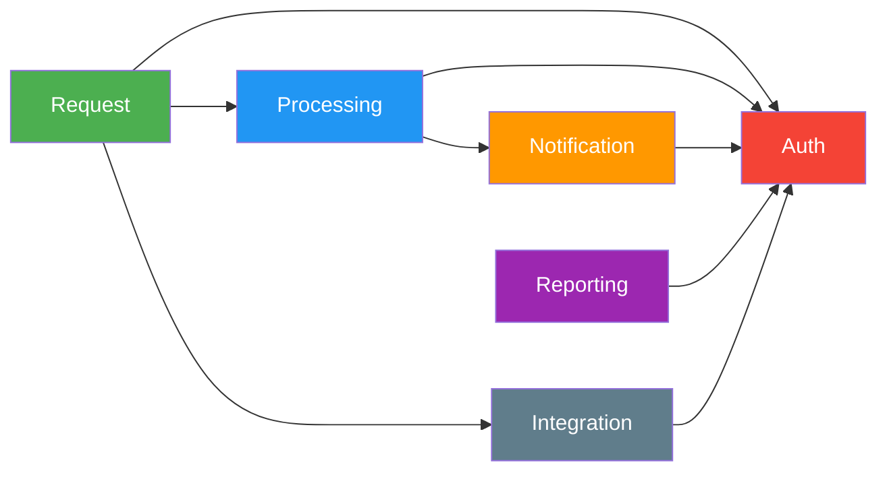

# Architecture Metrics Report

> **Project:** [Project Name]
> **Version:** [X.Y] | **Status:** [Active]
> **Last Updated:** [YYYY-MM-DD]

---

## 1. Purpose

> This report tracks architectural health metrics — coupling, cohesion, complexity, dependency analysis, and technical debt indicators.

## 2. Metrics Dashboard

| Metric | Target | Current | Status | Trend |
|--------|--------|---------|--------|-------|
| [Cyclomatic Complexity (avg)] | [<10] | [X] | 🟢🟡🔴 | ↑↓→ |
| [Coupling Between Objects] | [<5] | [X] | 🟢🟡🔴 | ↑↓→ |
| [Cohesion (LCOM)] | [<0.5] | [X] | 🟢🟡🔴 | ↑↓→ |
| [Code Duplication] | [<5%] | [X%] | 🟢🟡🔴 | ↑↓→ |
| [Technical Debt Ratio] | [<10%] | [X%] | 🟢🟡🔴 | ↑↓→ |
| [Dependency Depth] | [<5 levels] | [X] | 🟢🟡🔴 | ↑↓→ |
| [API Response Time (p95)] | [<2s] | [Xs] | 🟢🟡🔴 | ↑↓→ |
| [Service Availability] | [99.9%] | [X%] | 🟢🟡🔴 | ↑↓→ |

## 3. Code Quality Metrics

### 3.1 Complexity Analysis

| Module | Cyclomatic Complexity | Lines of Code | Methods | Status |
|--------|---------------------|--------------|---------|--------|
| [Request Service] | [X] | [Y] | [Z] | 🟢🟡🔴 |
| [Processing Service] | [X] | [Y] | [Z] | 🟢🟡🔴 |
| [Auth Service] | [X] | [Y] | [Z] | 🟢🟡🔴 |
| [Notification Service] | [X] | [Y] | [Z] | 🟢🟡🔴 |
| [Reporting Service] | [X] | [Y] | [Z] | 🟢🟡🔴 |
| [Integration Service] | [X] | [Y] | [Z] | 🟢🟡🔴 |
| **Average** | **[X]** | **[Y]** | **[Z]** | **🟢🟡🔴** |

### 3.2 Coupling Analysis

| Module | Afferent Coupling (Ca) | Efferent Coupling (Ce) | Instability (Ce/(Ca+Ce)) | Status |
|--------|----------------------|----------------------|-------------------------|--------|
| [Request Service] | [X] | [Y] | [Z] | 🟢🟡🔴 |
| [Processing Service] | [X] | [Y] | [Z] | 🟢🟡🔴 |
| [Auth Service] | [X] | [Y] | [Z] | 🟢🟡🔴 |
| [Notification Service] | [X] | [Y] | [Z] | 🟢🟡🔴 |
| [Reporting Service] | [X] | [Y] | [Z] | 🟢🟡🔴 |
| [Integration Service] | [X] | [Y] | [Z] | 🟢🟡🔴 |

> **Target:** Instability between 0.3 and 0.7 (balanced coupling)

### 3.3 Dependency Graph

## 4. Technical Debt

### 4.1 Debt Inventory

| ID | Area | Description | Severity | Effort to Fix | Impact |
|----|------|-------------|----------|-------------|--------|
| TD-001 | [Code] | [No error handling in integration service] | 🟡 Medium | [2 days] | [Silent failures] |
| TD-002 | [Test] | [Unit test coverage <80% in notification service] | 🟡 Medium | [3 days] | [Regression risk] |
| TD-003 | [Documentation] | [API docs outdated] | 🟢 Low | [1 day] | [Developer friction] |
| TD-004 | [Infrastructure] | [No staging environment parity] | 🟡 Medium | [2 days] | [Environment bugs] |

### 4.2 Debt Trend

| Period | New Debt | Resolved Debt | Net Debt | Trend |
|--------|---------|--------------|---------|-------|
| [Sprint 1] | [2] | [0] | [+2] | ↑ |
| [Sprint 2] | [1] | [1] | [0] | → |
| [Sprint 3] | [1] | [2] | [-1] | ↓ |
| **Total** | **[4]** | **[3]** | **[+1]** | **↓** |

## 5. Architecture Health Score

| Dimension | Weight | Score | Weighted |
|-----------|--------|-------|---------|
| [Code Quality] | [25%] | [X/5] | [X × 0.25] |
| [Coupling] | [20%] | [X/5] | [X × 0.20] |
| [Complexity] | [20%] | [X/5] | [X × 0.20] |
| [Test Coverage] | [15%] | [X/5] | [X × 0.15] |
| [Technical Debt] | [10%] | [X/5] | [X × 0.10] |
| [Documentation] | [10%] | [X/5] | [X × 0.10] |
| **Overall** | **100%** | | **[X/5]** |

## 6. Recommendations

| # | Finding | Recommendation | Priority | Owner |
|---|---------|---------------|----------|-------|
| 1 | [High coupling in Integration Service] | [Introduce anti-corruption layer] | 🟡 | Architect |
| 2 | [Low test coverage in Notification] | [Add unit tests for notification logic] | 🟡 | Dev Team |
| 3 | [Technical debt increasing] | [Allocate 20% sprint capacity for debt reduction] | 🟡 | PM |

---

## Related Documents

| Document | Relationship |
|----------|-------------|
| [[Software-Architecture-Document]] | Architecture being measured |
| [[Quality-Metrics]] | Project-level quality metrics |
| [[Architecture-Metrics-Report]] | Tool-generated code analysis |

---

> **Template Standard:** Based on SWEBOK v4
> **Usage:** Track architecture metrics per sprint. If complexity or coupling trends upward, investigate before it becomes a problem. Good architecture degrades slowly — metrics catch the drift.
