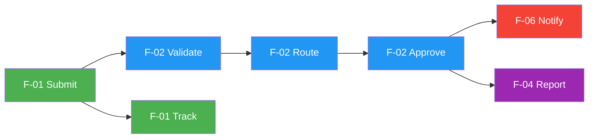

# Functional Architecture

> **Project:** [Project Name]
> **Version:** [X.Y] | **Status:** [Draft | Under Review | Approved]
> **Last Updated:** [YYYY-MM-DD]

---

## 1. Purpose

> This document defines the functional architecture — the decomposition of system functions independent of implementation. It answers: "What must the system do?" without specifying "How."

## 2. Functional Decomposition

```mermaid
flowchart TD
    SYS[System<br>Function] --> F1[Request<br>Management]
    SYS --> F2[Processing<br>& Workflow]
    SYS --> F3[User<br>Management]
    SYS --> F4[Reporting<br>& Analytics]
    SYS --> F5[Integration<br>& Data]
    SYS --> F6[Notification<br>& Communication]

    F1 --> F1.1[Submit<br>Request]
    F1 --> F1.2[Track<br>Status]
    F1 --> F1.3[Manage<br>Profile]
    F1 --> F1.4[Upload<br>Documents]

    F2 --> F2.1[Validate<br>Inputs]
    F2 --> F2.2[Classify &<br>Route]
    F2 --> F2.3[Auto-<br>Approve]
    F2 --> F2.4[Manual<br>Review]
    F2 --> F2.5[Escalate]

    F3 --> F3.1[Authenticate]
    F3 --> F3.2[Authorize]
    F3 --> F3.3[Manage<br>Roles]

    F4 --> F4.1[Dashboard]
    F4 --> F4.2[Standard<br>Reports]
    F4 --> F4.3[Ad-hoc<br>Reports]

    F5 --> F5.1[ERP<br>Sync]
    F5 --> F5.2[Payment<br>Processing]
    F5 --> F5.3[Data<br>Migration]

    F6 --> F6.1[Email<br>Notifications]
    F6 --> F6.2[SMS<br>Notifications]
    F6 --> F6.3[In-App<br>Notifications]

    style SYS fill:#1a237e,color:#fff
    style F1 fill:#4CAF50,color:#fff
    style F2 fill:#2196F3,color:#fff
    style F3 fill:#FF9800,color:#fff
    style F4 fill:#9C27B0,color:#fff
    style F5 fill:#607D8B,color:#fff
    style F6 fill:#f44336,color:#fff
```

## 3. Function Catalog

| Function ID | Function | Description | Priority | Requirements |
|------------|---------|-------------|----------|-------------|
| F-01 | [Request Management] | [All functions related to request lifecycle] | 🔴 | FR-001 to FR-007 |
| F-01.1 | [Submit Request] | [Customer submits request via portal] | 🔴 | FR-001 |
| F-01.2 | [Track Status] | [Customer views request status] | 🔴 | FR-006 |
| F-01.3 | [Manage Profile] | [Customer manages account profile] | 🟡 | FR-005 |
| F-01.4 | [Upload Documents] | [Customer uploads supporting documents] | 🔴 | FR-004 |
| F-02 | [Processing & Workflow] | [All functions related to request processing] | 🔴 | FR-101 to FR-107 |
| F-02.1 | [Validate Inputs] | [Validate request against business rules] | 🔴 | FR-101 |
| F-02.2 | [Classify & Route] | [Auto-classify and route to correct queue] | 🔴 | FR-102 |
| F-02.3 | [Auto-Approve] | [Auto-approve eligible requests] | 🔴 | FR-103 |
| F-02.4 | [Manual Review] | [Staff reviews non-auto-eligible requests] | 🔴 | FR-104 |
| F-02.5 | [Escalate] | [Escalate to manager when needed] | 🟡 | FR-107 |
| F-03 | [User Management] | [Authentication, authorization, roles] | 🔴 | SEC-001 to SEC-005 |
| F-03.1 | [Authenticate] | [Verify user identity] | 🔴 | SEC-001 |
| F-03.2 | [Authorize] | [Verify user permissions] | 🔴 | SEC-004 |
| F-03.3 | [Manage Roles] | [Admin manages user roles] | 🟡 | SEC-004 |
| F-04 | [Reporting & Analytics] | [Dashboards, reports, analytics] | 🟡 | FR-301 to FR-305 |
| F-04.1 | [Dashboard] | [Real-time operational dashboard] | 🟡 | FR-301 |
| F-04.2 | [Standard Reports] | [Pre-built reports] | 🟡 | FR-302 |
| F-04.3 | [Ad-hoc Reports] | [Custom report generation] | 🟢 | FR-303 |
| F-05 | [Integration & Data] | [External system connectivity] | 🔴 | INT-001 to INT-006 |
| F-05.1 | [ERP Sync] | [Bidirectional data sync with ERP] | 🔴 | INT-001 |
| F-05.2 | [Payment Processing] | [Process payments via gateway] | 🔴 | INT-002 |
| F-05.3 | [Data Migration] | [Migrate legacy data] | 🔴 | — |
| F-06 | [Notification & Communication] | [Notifications to stakeholders] | 🟡 | FR-201 to FR-205 |
| F-06.1 | [Email Notifications] | [Send email notifications] | 🔴 | FR-201, FR-202 |
| F-06.2 | [SMS Notifications] | [Send SMS notifications] | 🟡 | FR-203 |
| F-06.3 | [In-App Notifications] | [In-app notification center] | 🟡 | FR-204 |

## 4. Function Allocation

| Function | Logical Component | Physical Component | Status |
|----------|------------------|-------------------|--------|
| F-01 | [Request Service] | [Customer Portal + API] | Planned |
| F-02 | [Processing Service] | [Backend Engine] | Planned |
| F-03 | [Auth Service] | [Identity Provider] | Planned |
| F-04 | [Reporting Service] | [BI Dashboard] | Planned |
| F-05 | [Integration Service] | [API Gateway + Connectors] | Planned |
| F-06 | [Notification Service] | [Email/SMS/In-App] | Planned |

## 5. Function Dependencies

## 6. Function Traceability

| Function | Business Req | System Req | Stakeholder Need |
|----------|-------------|-----------|-----------------|
| F-01 | BR-01 | SYRS-001 | SN-03 |
| F-02 | BR-02, BR-04 | SYRS-002, SYRS-003 | SN-01, SN-08 |
| F-03 | BR-07 | SYRS-006 | SN-06 |
| F-04 | BR-06 | SYRS-008 | SN-05 |
| F-05 | BR-02 | SYRS-009 | SN-09 |
| F-06 | BR-05 | SYRS-007 | SN-04 |

---

## Related Documents

| Document | Relationship |
|----------|-------------|
| [[Logical-Architecture]] | Logical structure derived from functions |
| [[Physical-Architecture]] | Physical allocation of functions |
| [[Software-Requirements-Specification]] | Requirements driving functions |
| [[System-Requirements-Specification]] | System-level requirements |

---

> **Template Standard:** Based on SEBoK v2, ISO/IEC/IEEE 15288, ISO/IEC/IEEE 42010
> **Usage:** The functional architecture answers "What must the system do?" It is independent of technology. Use it as the bridge between requirements and design.
