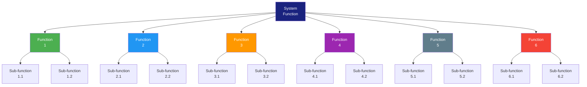
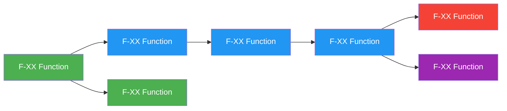

# Functional Architecture

> **Project:** [Project Name]
> **Version:** [X.Y] | **Status:** [Draft | Under Review | Approved]
> **Last Updated:** [YYYY-MM-DD]

---

## 1. Purpose

> This document defines the functional architecture — the decomposition of system functions independent of implementation. It answers: "What must the system do?" without specifying "How."

## 2. Functional Decomposition

```mermaid
flowchart TD
    SYS[System<br>Function] --> F1[Function<br>1]
    SYS --> F2[Function<br>2]
    SYS --> F3[Function<br>3]
    SYS --> F4[Function<br>4]
    SYS --> F5[Function<br>5]
    SYS --> F6[Function<br>6]

    F1 --> F1.1[Sub-function<br>1.1]
    F1 --> F1.2[Sub-function<br>1.2]

    F2 --> F2.1[Sub-function<br>2.1]
    F2 --> F2.2[Sub-function<br>2.2]

    F3 --> F3.1[Sub-function<br>3.1]
    F3 --> F3.2[Sub-function<br>3.2]

    F4 --> F4.1[Sub-function<br>4.1]
    F4 --> F4.2[Sub-function<br>4.2]

    F5 --> F5.1[Sub-function<br>5.1]
    F5 --> F5.2[Sub-function<br>5.2]

    F6 --> F6.1[Sub-function<br>6.1]
    F6 --> F6.2[Sub-function<br>6.2]

    style SYS fill:#1a237e,color:#fff
    style F1 fill:#4CAF50,color:#fff
    style F2 fill:#2196F3,color:#fff
    style F3 fill:#FF9800,color:#fff
    style F4 fill:#9C27B0,color:#fff
    style F5 fill:#607D8B,color:#fff
    style F6 fill:#f44336,color:#fff
```

## 3. Function Catalog

| Function ID | Function | Description | Priority | Requirements |
|------------|---------|-------------|----------|-------------|
| F-[XX] | [Function] | [Description of what the function does] | 🔴 | [FR-XXX] |

## 4. Function Allocation

| Function | Logical Component | Physical Component | Status |
|----------|------------------|-------------------|--------|
| F-[XX] | [Logical Component] | [Physical Component] | Planned |

## 5. Function Dependencies

```mermaid
flowchart LR
    F01[F-XX Function] --> F02[F-XX Function]
    F02 --> F03[F-XX Function]
    F03 --> F04[F-XX Function]
    F04 --> F05[F-XX Function]
    F01 --> F06[F-XX Function]
    F04 --> F07[F-XX Function]

    style F01 fill:#4CAF50,color:#fff
    style F02 fill:#2196F3,color:#fff
    style F03 fill:#2196F3,color:#fff
    style F04 fill:#2196F3,color:#fff
    style F05 fill:#f44336,color:#fff
    style F06 fill:#4CAF50,color:#fff
    style F07 fill:#9C27B0,color:#fff
```

## 6. Function Traceability

| Function | Business Req | System Req | Stakeholder Need |
|----------|-------------|-----------|-----------------|
| F-[XX] | BR-[XX] | SYRS-[XXX] | SN-[XX] |

---

## Related Documents

| Document | Relationship |
|----------|-------------|
| [[Logical-Architecture]] | Logical structure derived from functions |
| [[Physical-Architecture]] | Physical allocation of functions |
| [[Software-Requirements-Specification]] | Requirements driving functions |
| [[System-Requirements-Specification]] | System-level requirements |

---

> **Template Standard:** Based on SEBoK v2, ISO/IEC/IEEE 15288, ISO/IEC/IEEE 42010
> **Usage:** The functional architecture answers "What must the system do?" It is independent of technology. Use it as the bridge between requirements and design.