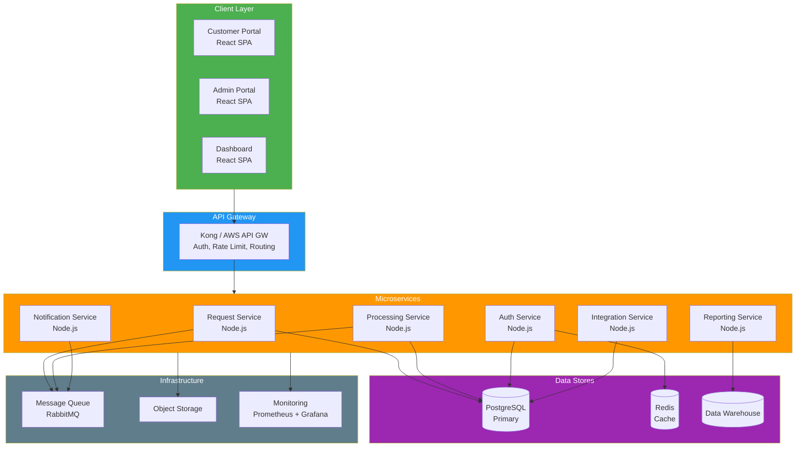
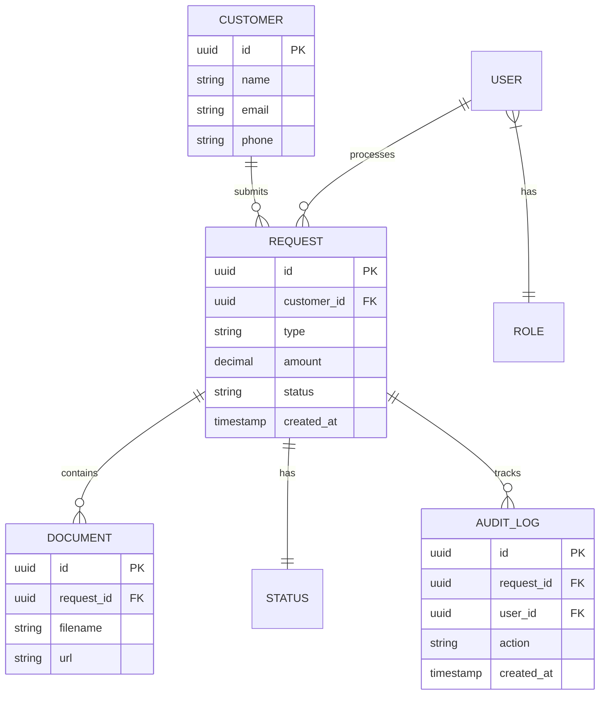

# Software Architecture Document (SAD)

> **Project:** [Project Name]
> **Version:** [X.Y] | **Status:** [Draft | Under Review | Approved | Baselined]
> **Last Updated:** [YYYY-MM-DD]

---

## Document Control

| Field | Value |
|-------|-------|
| Document Owner | [Name / Role] |
| Solution Architect | [Name / Role] |
| Technical Lead | [Name / Role] |

### Approvals

| Role | Name | Signature | Date |
|------|------|-----------|------|
| IT Director | | | |
| Solution Architect | | | |
| Technical Lead | | | |

---

## 1. Introduction

### 1.1 Purpose

> This document describes the software architecture of [System Name] — the fundamental concepts, properties, and characteristics.

### 1.2 Scope

> [What this SRS covers — the software system and its interfaces]

### 1.3 References

| Document | Version |
|---------|---------|
| [[System-Architecture-Description]] | v1.0 |
| [[Logical-Architecture]] | v1.0 |
| [[Physical-Architecture]] | v1.0 |
| [[Software-Requirements-Specification]] | v1.0 |

---

## 2. Architecture Overview

### 2.1 Architectural Style

| Aspect | Choice | Rationale |
|--------|-------|----------|
| [Overall Style] | [Layered + Microservices] | [Separation of concerns, independent scaling] |
| [Communication] | [REST (sync) + Events (async)] | [Flexibility, resilience] |
| [Data Management] | [Database per service] | [Service independence] |
| [Deployment] | [Containerized, cloud-native] | [Scalability, portability] |

### 2.2 High-Level Architecture

---

## 3. Component Design

### 3.1 Request Service

| Aspect | Detail |
|--------|--------|
| [Responsibility] | [Request CRUD, status tracking, document management] |
| [Technology] | [Node.js + Express] |
| [Database] | [PostgreSQL — requests table] |
| [API] | [REST — /api/v1/requests] |
| [Events Produced] | [RequestCreated, RequestUpdated] |
| [Events Consumed] | [RequestApproved, RequestRejected] |

### 3.2 Processing Service

| Aspect | Detail |
|--------|--------|
| [Responsibility] | [Validation, classification, routing, approval] |
| [Technology] | [Node.js + Express] |
| [Database] | [PostgreSQL — rules, queues] |
| [API] | [REST — /api/v1/processing] |
| [Events Produced] | [RequestValidated, RequestApproved, RequestRejected] |
| [Events Consumed] | [RequestCreated] |

### 3.3 Auth Service

| Aspect | Detail |
|--------|--------|
| [Responsibility] | [Authentication, authorization, user management] |
| [Technology] | [Node.js + Passport.js] |
| [Database] | [PostgreSQL — users, roles] |
| [Cache] | [Redis — sessions, tokens] |
| [API] | [REST — /api/v1/auth] |

---

## 4. Data Architecture

### 4.1 Data Model (High-Level)

### 4.2 Data Storage Strategy

| Data Type | Store | Retention | Backup |
|-----------|-------|-----------|--------|
| [Transactional] | [PostgreSQL] | [7 years] | [Daily, cross-region] |
| [Cache] | [Redis] | [24 hours] | [None — rebuild] |
| [Documents] | [S3] | [7 years] | [Cross-region replication] |
| [Analytics] | [Data Warehouse] | [Indefinite] | [Daily] |
| [Audit Logs] | [PostgreSQL — append-only] | [7 years] | [Daily, immutable] |

---

## 5. Security Architecture

### 5.1 Authentication & Authorization

| Layer | Mechanism | Implementation |
|-------|----------|---------------|
| [External Users] | [OAuth2 + JWT] | [Auth Service] |
| [Internal Admins] | [OAuth2 + JWT + MFA] | [Auth Service] |
| [Service-to-Service] | [mTLS + API Keys] | [API Gateway] |

### 5.2 Security Controls

| Control | Implementation | Standard |
|---------|---------------|---------|
| [Encryption at Rest] | [AES-256 via KMS] | [NIST SP 800-57] |
| [Encryption in Transit] | [TLS 1.3] | [NIST SP 800-52] |
| [Input Validation] | [Schema validation, sanitization] | [OWASP] |
| [Rate Limiting] | [100 req/min per user] | [OWASP API] |
| [Audit Logging] | [All actions logged] | [ISO 27001] |
| [WAF] | [OWASP Top 10 rules] | [OWASP] |

---

## 6. Deployment Architecture

| Environment | Purpose | Infrastructure | Scaling |
|------------|---------|---------------|---------|
| [Dev] | [Development] | [Docker Compose] | [Single instance] |
| [Staging] | [Pre-prod testing] | [Cloud — minimal] | [2 instances] |
| [Prod] | [Live system] | [Cloud — full] | [Auto-scale 2-10] |

---

## 7. Quality Attributes

| Attribute | Scenario | Architecture Response | Verification |
|-----------|---------|---------------------|-------------|
| [Performance] | [100 concurrent users] | [Auto-scaling, caching, CDN] | [Load test] |
| [Availability] | [99.9% uptime] | [Multi-AZ, health checks] | [Uptime monitoring] |
| [Security] | [OWASP Top 10] | [WAF, OAuth2, encryption] | [Pen test] |
| [Scalability] | [10x volume] | [Horizontal scaling] | [Load test] |
| [Maintainability] | [Weekly deployments] | [CI/CD, microservices] | [Deployment metrics] |

---

## 8. Architecture Decision Summary

| # | Decision | Rationale | ADR |
|---|---------|----------|-----|
| 1 | [Microservices] | [Independent scaling, team autonomy] | ADR-001 |
| 2 | [PostgreSQL] | [ACID, JSON, managed service] | ADR-002 |
| 3 | [React] | [Team expertise, ecosystem] | ADR-003 |
| 4 | [Node.js] | [Full-stack JS, performance] | ADR-004 |
| 5 | [Event-driven] | [Decoupling, resilience] | ADR-005 |

---

## Related Documents

| Document | Relationship |
|----------|-------------|
| [[System-Architecture-Description]] | System-level architecture |
| [[Logical-Architecture]] | Logical components |
| [[Physical-Architecture]] | Physical deployment |
| [[Architecture-Decision-Records]] | Decision rationale |
| [[Interface-Control-Document]] | Interface specifications |

---

> **Template Standard:** Based on SWEBOK v4, ISO/IEC/IEEE 42010
> **Usage:** The SAD is the *software-level* architecture document. It describes how the software is structured, how components interact, and how quality attributes are achieved. Developers use it as their primary architectural reference.
