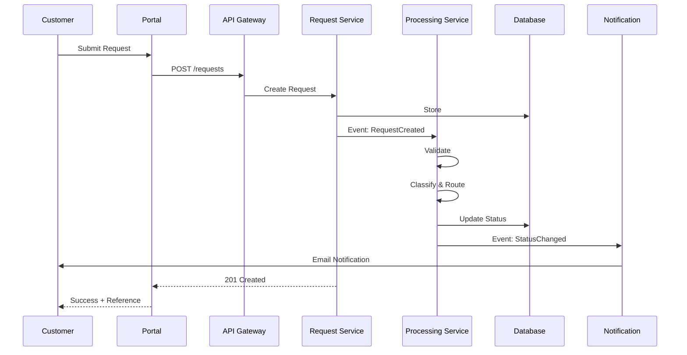

# System Architecture Description

> **Project:** [Project Name]
> **Version:** [X.Y] | **Status:** [Draft | Under Review | Approved]
> **Last Updated:** [YYYY-MM-DD]

---

## 1. Purpose

> This document provides a comprehensive architectural description of the system using multiple views and viewpoints per ISO/IEC/IEEE 42010.

## 2. Architecture Overview

| Field | Detail |
|-------|--------|
| [System Name] | [Name] |
| [Architecture Style] | [Microservices / Layered / Event-Driven] |
| [Primary Pattern] | [Request-Response + Event-Driven for async] |
| [Deployment Model] | [Cloud-native, containerized] |
| [Key Quality Attributes] | [Performance, Security, Scalability, Maintainability] |

## 3. Architecture Views

### 3.1 Logical View (What)

> Shows the system's functional structure — components and their interactions.

See: [[Logical-Architecture]]

### 3.2 Process View (How)

> Shows the system's runtime behavior — concurrency, synchronization, data flow.

### 3.3 Development View (Organization)

> Shows how the system is organized for development — modules, packages, repos.

| Repository | Contents | Team | CI/CD |
|-----------|---------|------|-------|
| [frontend-portal] | [Customer portal — React] | [Frontend] | [GitHub Actions] |
| [frontend-admin] | [Admin portal — React] | [Frontend] | [GitHub Actions] |
| [backend-api] | [API + Services — Node.js] | [Backend] | [GitHub Actions] |
| [backend-worker] | [Background workers — Node.js] | [Backend] | [GitHub Actions] |
| [infra] | [IaC — Terraform] | [DevOps] | [GitHub Actions] |
| [docs] | [Documentation — Markdown] | [All] | [Auto-deploy] |

### 3.4 Physical View (Where)

> Shows how software maps to hardware — deployment, infrastructure.

See: [[Physical-Architecture]]

### 3.5 Scenarios View (Use Cases)

> Shows how the architecture supports key use cases.

| Scenario | Components Involved | Performance | Status |
|----------|-------------------|-------------|--------|
| [Customer submits request] | [Portal, API, Request Service, DB, Notification] | [<5 seconds] | ✅ Designed |
| [Operations processes request] | [Admin, API, Processing Service, DB, Notification] | [<3 minutes] | ✅ Designed |
| [Management views dashboard] | [Dashboard, API, Reporting, DW] | [<2 seconds] | ✅ Designed |
| [Peak load — 120 requests/day] | [All — auto-scaled] | [Same SLA] | ✅ Designed |

## 4. Architecture Principles

| # | Principle | Rationale |
|---|----------|----------|
| 1 | [API-first] | [All functionality exposed via APIs for extensibility] |
| 2 | [Stateless services] | [Enables horizontal scaling and resilience] |
| 3 | [Event-driven async] | [Decouples components, improves resilience] |
| 4 | [Defense in depth] | [Security at every layer] |
| 5 | [Infrastructure as code] | [Repeatable, auditable infrastructure] |
| 6 | [Observability built-in] | [Logs, metrics, traces from day one] |

## 5. Architecture Decisions Summary

| # | Decision | Rationale | ADR |
|---|---------|----------|-----|
| 1 | [Microservices architecture] | [Independent scaling, team autonomy] | ADR-001 |
| 2 | [PostgreSQL as primary DB] | [ACID, JSON support, managed service] | ADR-002 |
| 3 | [React for frontend] | [Team expertise, ecosystem] | ADR-003 |
| 4 | [Node.js for backend] | [Full-stack JS, performance] | ADR-004 |
| 5 | [Event-driven notifications] | [Decoupling, reliability] | ADR-005 |

## 6. Quality Attribute Analysis

| Quality Attribute | Scenario | Architecture Response | Measurement |
|------------------|---------|---------------------|-------------|
| [Performance] | [100 concurrent users] | [Auto-scaling, caching, CDN] | [<2s response] |
| [Availability] | [99.9% uptime] | [Multi-AZ, health checks, failover] | [Monthly uptime] |
| [Security] | [OWASP Top 10] | [WAF, OAuth2, encryption, audit] | [Pen test results] |
| [Scalability] | [10x volume growth] | [Horizontal scaling, stateless] | [Load test] |
| [Maintainability] | [Weekly deployments] | [CI/CD, microservices, IaC] | [Deployment frequency] |

---

## Related Documents

| Document | Relationship |
|----------|-------------|
| [[Functional-Architecture]] | Functions described here |
| [[Logical-Architecture]] | Logical components |
| [[Physical-Architecture]] | Physical deployment |
| [[Architecture-Views-4-1]] | Detailed views |
| [[Architecture-Decision-Records]] | Decision rationale |

---

> **Template Standard:** Based on SEBoK v2, ISO/IEC/IEEE 42010
> **Usage:** This is the *master architecture document* — it references all views. Stakeholders read this for the big picture; detailed views are in separate documents.
