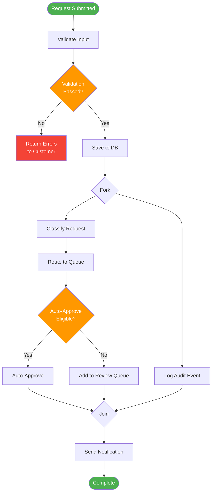
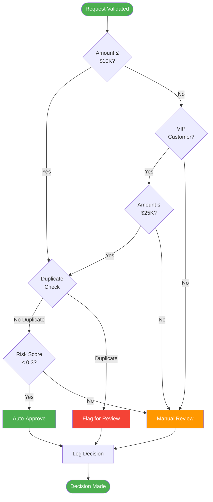
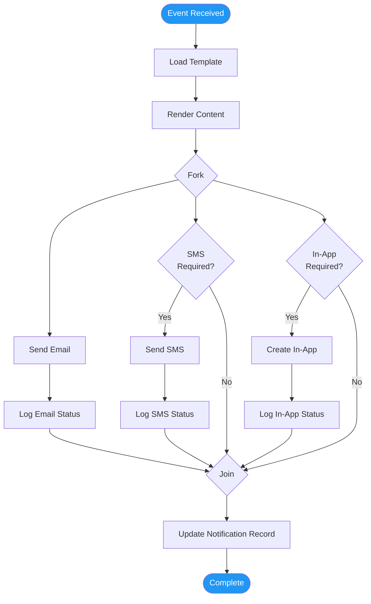
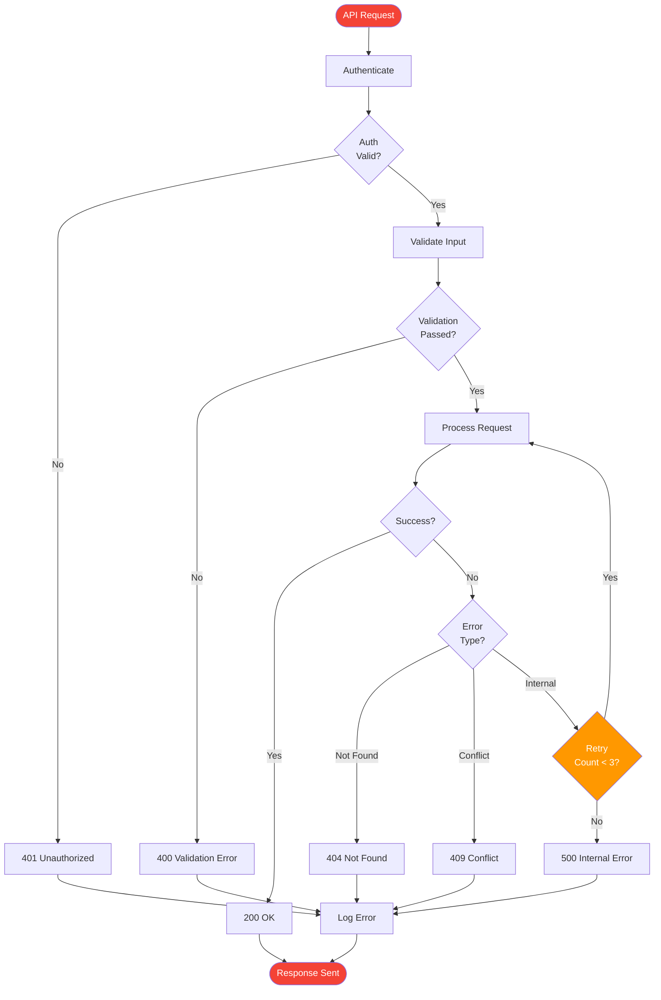

# Activity Diagrams (Design)

> **Project:** [Project Name]
> **Version:** [X.Y] | **Status:** [Draft | Under Review | Approved]
> **Last Updated:** [YYYY-MM-DD]

---

## 1. Purpose

> This document contains activity diagrams showing workflow logic — parallel processing, decision points, and swimlanes at the design level.

## 2. Activity Diagram Index

| # | Activity | Swimlanes | Decision Points | Status |
|---|---------|----------|----------------|--------|
| AD-001 | [Request Processing Pipeline] | [3] | [5] | ✅ Approved |
| AD-002 | [Auto-Approval Logic] | [1] | [4] | ✅ Approved |
| AD-003 | [Notification Dispatch] | [2] | [3] | ✅ Approved |
| AD-004 | [Error Handling Flow] | [2] | [2] | ✅ Approved |

### AD-001: Request Processing Pipeline

### AD-002: Auto-Approval Logic

### AD-003: Notification Dispatch

### AD-004: Error Handling Flow

## 3. Parallel Processing Rules

| Diagram | Fork Point | Parallel Activities | Join Point | Sync Type |
|---------|-----------|-------------------|-----------|----------|
| [AD-001] | [After save] | [Classify + Audit] | [Before notify] | [Join — wait for all] |
| [AD-003] | [After render] | [Email + SMS + In-App] | [After all logs] | [Join — wait for all] |

## 4. Decision Criteria

| Decision | Criteria | True Path | False Path |
|----------|---------|----------|-----------|
| [Validation Passed] | [All required fields valid, business rules pass] | [Classify] | [Return errors] |
| [Auto-Approve Eligible] | [Amount threshold, no duplicate, low risk] | [Auto-approve] | [Manual review] |
| [SMS Required] | [Customer preference + critical status] | [Send SMS] | [Skip] |
| [Retry Count < 3] | [Transient error, count < max] | [Retry] | [500 error] |

---

## Related Documents

| Document | Relationship |
|----------|-------------|
| [[Sequence-Diagrams]] | Interactions within activities |
| [[State-Diagrams]] | State changes triggered by activities |
| [[Low-Level-Design]] | Implementation of workflows |

---

> **Template Standard:** Based on SWEBOK v4, ISO/IEC 19501 (UML)
> **Usage:** Activity diagrams show *workflow* — the order of operations, parallel processing, and decision logic. Use them to verify completeness and identify edge cases.
