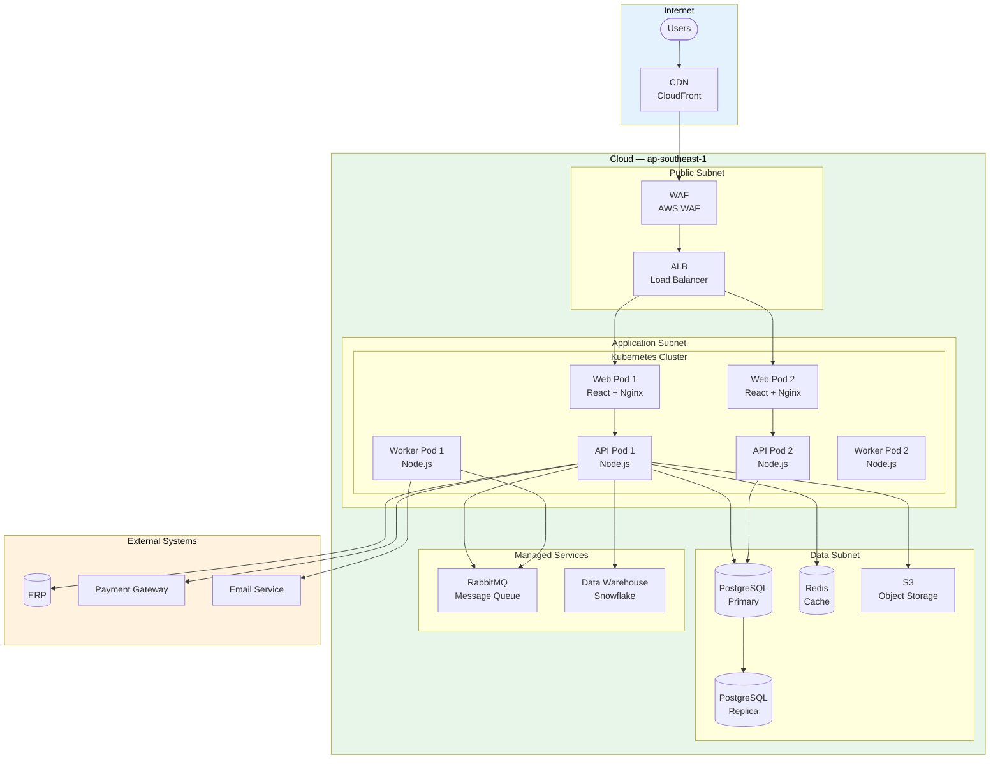
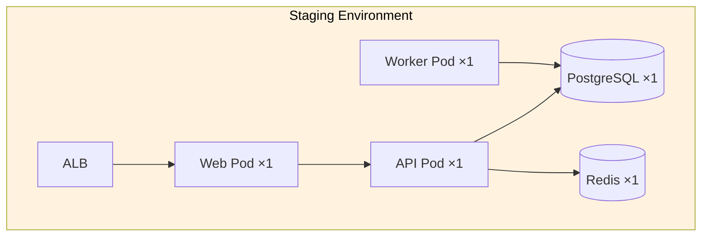

# Deployment Diagrams

> **Project:** [Project Name]
> **Version:** [X.Y] | **Status:** [Draft | Under Review | Approved]
> **Last Updated:** [YYYY-MM-DD]

---

## 1. Purpose

> This document shows the physical deployment of software artifacts on infrastructure nodes.

## 2. Deployment Diagram: Production

## 3. Deployment Diagram: Staging

## 4. Node Specifications

| Node | Type | CPU | Memory | Storage | OS | Count |
|------|------|-----|--------|---------|-----|-------|
| [Web Pod] | [Container] | [0.5 vCPU] | [512 MB] | [Ephemeral] | [Alpine Linux] | [2] |
| [API Pod] | [Container] | [1 vCPU] | [2 GB] | [Ephemeral] | [Alpine Linux] | [2] |
| [Worker Pod] | [Container] | [0.5 vCPU] | [1 GB] | [Ephemeral] | [Alpine Linux] | [2] |
| [PostgreSQL] | [Managed DB] | [2 vCPU] | [8 GB] | [500 GB SSD] | [Managed] | [2 (primary + replica)] |
| [Redis] | [Managed Cache] | [1 vCPU] | [2 GB] | [Ephemeral] | [Managed] | [1 cluster] |
| [RabbitMQ] | [Managed Queue] | [1 vCPU] | [2 GB] | [50 GB SSD] | [Managed] | [1] |

## 5. Artifact Deployment Mapping

| Artifact | Node | Deployment Method | Version |
|---------|------|------------------|---------|
| [portal.war] | [Web Pod] | [Docker image → K8s deployment] | [v1.0] |
| [admin.war] | [Web Pod] | [Docker image → K8s deployment] | [v1.0] |
| [api.jar] | [API Pod] | [Docker image → K8s deployment] | [v1.0] |
| [worker.jar] | [Worker Pod] | [Docker image → K8s deployment] | [v1.0] |
| [nginx.conf] | [Web Pod] | [ConfigMap → mounted] | [v1.0] |
| [db-schema.sql] | [PostgreSQL] | [Migration script → Flyway] | [v1.2] |

## 6. Network Configuration

| From | To | Port | Protocol | Purpose |
|------|-----|------|---------|---------|
| [Internet] | [CDN] | [443] | [HTTPS] | [Static assets] |
| [CDN] | [ALB] | [443] | [HTTPS] | [Dynamic requests] |
| [ALB] | [Web Pods] | [80] | [HTTP] | [Internal routing] |
| [Web Pods] | [API Pods] | [3000] | [HTTP] | [API calls] |
| [API Pods] | [PostgreSQL] | [5432] | [TCP] | [Database] |
| [API Pods] | [Redis] | [6379] | [TCP] | [Cache] |
| [API Pods] | [RabbitMQ] | [5672] | [AMQP] | [Messages] |
| [Worker Pods] | [RabbitMQ] | [5672] | [AMQP] | [Messages] |
| [Worker Pods] | [Email Service] | [587] | [SMTP] | [Notifications] |
| [API Pods] | [ERP] | [443] | [HTTPS] | [Integration] |

## 7. Scaling Configuration

| Component | Min | Max | Scaling Trigger | Cooldown |
|-----------|-----|-----|----------------|----------|
| [Web Pods] | [2] | [4] | [CPU > 70%] | [300s] |
| [API Pods] | [2] | [6] | [CPU > 70% or requests > 100/s] | [300s] |
| [Worker Pods] | [2] | [4] | [Queue depth > 100] | [300s] |
| [PostgreSQL] | [1 primary + 1 replica] | [1 primary + 2 replicas] | [Read load] | [Manual] |

## 8. Environment Comparison

| Aspect | Development | Staging | Production |
|--------|-----------|---------|-----------|
| [Web Pods] | [1] | [1] | [2] |
| [API Pods] | [1] | [1] | [2] |
| [Worker Pods] | [1] | [1] | [2] |
| [PostgreSQL] | [1] | [1] | [2 (primary + replica)] |
| [Redis] | [1] | [1] | [1 cluster] |
| [CDN] | [No] | [No] | [Yes] |
| [WAF] | [No] | [No] | [Yes] |
| [Auto-scaling] | [No] | [No] | [Yes] |
| [Monitoring] | [Basic] | [Full] | [Full + alerting] |

---

## Related Documents

| Document | Relationship |
|----------|-------------|
| [[Physical-Architecture]] | Architecture this deployment implements |
| [[Deployment-Diagrams]] | IaC definitions |
| [[Deployment-Diagrams]] | Deployment procedures |
| [[Deployment-Diagrams]] | Docker/K8s configs |

---

> **Template Standard:** Based on SWEBOK v4, ISO/IEC 19501 (UML)
> **Usage:** Deployment diagrams show *where things run*. Use them for infrastructure planning, capacity planning, and troubleshooting. Keep them in sync with actual infrastructure.
