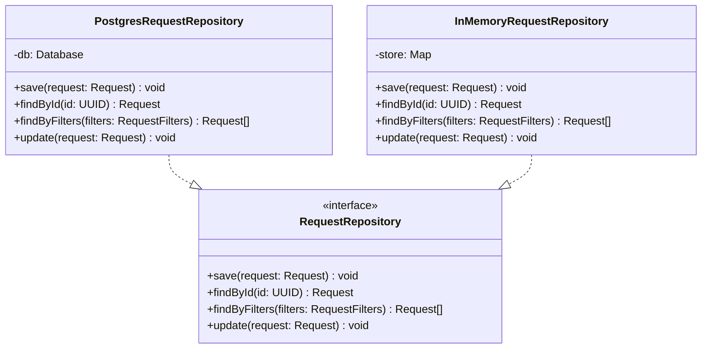
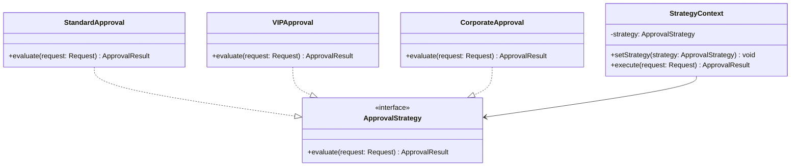

# Design Pattern Catalog

> **Project:** [Project Name]
> **Version:** [X.Y] | **Status:** [Draft | Under Review | Approved]
> **Last Updated:** [YYYY-MM-DD]

---

## 1. Purpose

> This catalog documents design patterns used in the project — the proven solutions to recurring design problems.

## 2. Pattern Categories

| Category | Patterns Used | Purpose |
|----------|-------------|---------|
| [Creational] | [Factory, Builder] | [Object creation] |
| [Structural] | [Adapter, Facade, Decorator] | [Object composition] |
| [Behavioral] | [Strategy, Observer, Command, State] | [Object interaction] |
| [Architectural] | [Repository, CQRS, MVC] | [System structure] |

## 3. Patterns Applied

### 3.1 Repository Pattern

| Field | Detail |
|-------|--------|
| **Category** | [Architectural] |
| **Problem** | [Need to abstract data access from business logic] |
| **Solution** | [Interface between domain and data mapping layers] |
| **Applied To** | [RequestRepository, UserRepository, NotificationRepository] |
| **Benefits** | [Testability (mock repositories), decoupling from DB] |
| **Trade-offs** | [Extra abstraction layer, potential over-engineering] |

**Structure:**

### 3.2 Strategy Pattern

| Field | Detail |
|-------|--------|
| **Category** | [Behavioral] |
| **Problem** | [Different validation/approval strategies per request type] |
| **Solution** | [Define family of algorithms, encapsulate each, make interchangeable] |
| **Applied To** | [ProcessingRule, ApprovalStrategy, NotificationChannel] |
| **Benefits** | [Open/Closed principle, easy to add new strategies] |
| **Trade-offs** | [More classes, client must know which strategy to use] |

**Structure:**

### 3.3 Observer Pattern

| Field | Detail |
|-------|--------|
| **Category** | [Behavioral] |
| **Problem** | [Need to notify multiple services when request status changes] |
| **Solution** | [Define one-to-many dependency so when one object changes state, all dependents are notified] |
| **Applied To** | [EventPublisher, EventSubscriber] |
| **Benefits** | [Loose coupling, open/closed principle] |
| **Trade-offs** [Debugging complexity, event ordering] |

### 3.4 Factory Pattern

| Field | Detail |
|-------|--------|
| **Category** | [Creational] |
| **Problem** | [Need to create different request types without exposing creation logic] |
| **Solution** | [Define interface for creating objects, let subclasses decide which class to instantiate] |
| **Applied To** | [RequestFactory, NotificationFactory] |
| **Benefits** | [Single responsibility, loose coupling] |
| **Trade-offs** | [More classes] |

### 3.5 Command Pattern

| Field | Detail |
|-------|--------|
| **Category** | [Behavioral] |
| **Problem** | [Need to queue, log, and undo operations] |
| **Solution** | [Encapsulate request as object] |
| **Applied To** | [ApproveCommand, RejectCommand, EscalateCommand] |
| **Benefits** | [Undo/redo, logging, queuing] |
| **Trade-offs** | [More classes per operation] |

### 3.6 Adapter Pattern

| Field | Detail |
|-------|--------|
| **Category** | [Structural] |
| **Problem** | [External systems have incompatible interfaces] |
| **Solution** | [Convert interface of a class into another interface clients expect] |
| **Applied To** | [ERPAdapter, PaymentAdapter, EmailAdapter] |
| **Benefits** | [Reuse existing code, interface compatibility] |
| **Trade-offs** | [Extra layer of indirection] |

### 3.7 State Pattern

| Field | Detail |
|-------|--------|
| **Category** | [Behavioral] |
| **Problem** | [Request behavior changes based on its state] |
| **Solution** | [Allow object to alter behavior when internal state changes] |
| **Applied To** | [RequestState: DraftState, SubmittedState, ProcessingState, ApprovedState, RejectedState] |
| **Benefits** | [Eliminates complex conditionals, state transitions explicit] |
| **Trade-offs** | [More classes per state] |

## 4. Pattern Usage Summary

| Pattern | Instances | Complexity | Status |
|---------|----------|-----------|--------|
| [Repository] | [3] | [Low] | ✅ Implemented |
| [Strategy] | [3] | [Medium] | ✅ Implemented |
| [Observer] | [1] | [Medium] | ✅ Implemented |
| [Factory] | [2] | [Low] | ✅ Implemented |
| [Command] | [3] | [Low] | ✅ Implemented |
| [Adapter] | [3] | [Low] | ✅ Implemented |
| [State] | [1] | [Medium] | ✅ Implemented |

## 5. Anti-Patterns Avoided

| Anti-Pattern | Why Bad | Prevention |
|-------------|---------|-----------|
| [God Class] | [Single class does everything] | [SRP — single responsibility] |
| [Spaghetti Code] | [No structure, tangled dependencies] | [Layered architecture] |
| [Golden Hammer] | [Same solution for every problem] | [Evaluate patterns per problem] |
| [Premature Optimization] | [Optimizing before measuring] | [Profile first] |
| [Copy-Paste Programming] | [Duplicated logic] | [Extract to shared module] |

---

## Related Documents

| Document | Relationship |
|----------|-------------|
| [[Class-Diagrams]] | Structure showing pattern application |
| [[Architecture-Patterns-Catalog]] | Architectural patterns |
| [[Design-Rationale]] | Why these patterns were chosen |

---

> **Template Standard:** Based on SWEBOK v4, GoF
> **Usage:** Patterns are *proven solutions* to recurring problems. Use them as a shared vocabulary — "Use the Strategy pattern here" communicates more than explaining the implementation.
