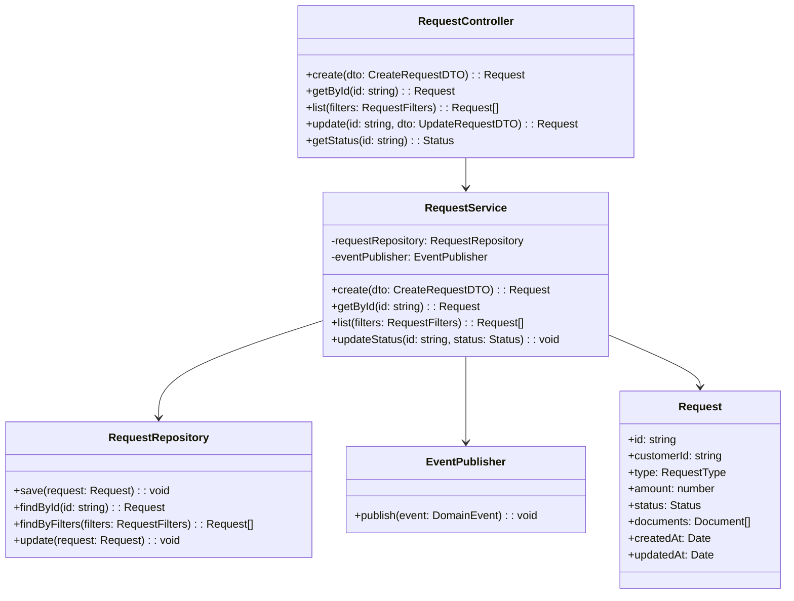
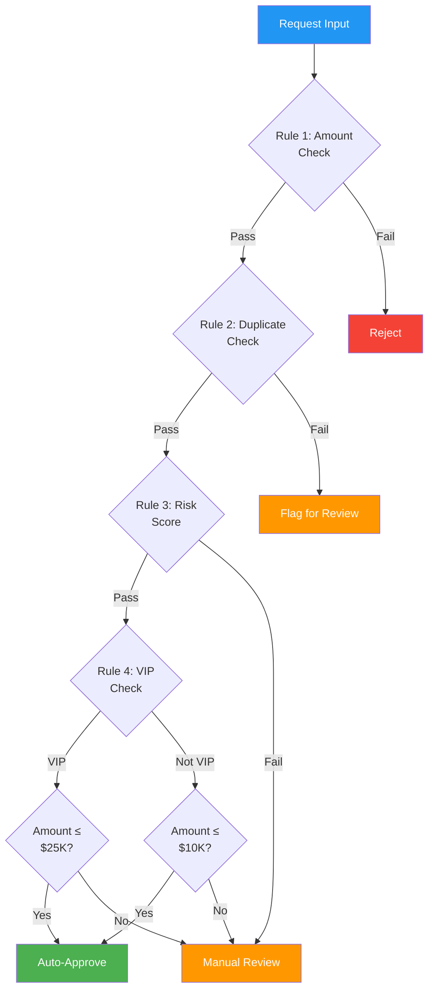

# Low-Level Design (LLD)

> **Project:** [Project Name]
> **Version:** [X.Y] | **Status:** [Draft | Under Review | Approved | Baselined]
> **Last Updated:** [YYYY-MM-DD]

---

## Document Control

| Field | Value |
|-------|-------|
| Document Owner | [Name / Role] |
| Technical Lead | [Name / Role] |

### Approvals

| Role | Name | Signature | Date |
|------|------|-----------|------|
| Technical Lead | | | |
| Solution Architect | | | |

---

## 1. Purpose

> This document provides detailed design specifications — class structures, algorithms, data structures, error handling, and implementation patterns for each module.

## 2. Module Design

### 2.1 Request Service — Detailed Design

#### Class Structure



#### Method Specifications

| Method | Input | Output | Algorithm | Error Handling |
|--------|-------|--------|-----------|---------------|
| [create()] | [CreateRequestDTO] | [Request] | [1. Validate DTO<br>2. Check business rules<br>3. Generate ID<br>4. Save to DB<br>5. Publish RequestCreated event] | [ValidationException, DatabaseException] |
| [getById()] | [string id] | [Request] | [1. Query DB by ID<br>2. Return or throw NotFound] | [NotFoundException] |
| [updateStatus()] | [string id, Status status] | [void] | [1. Load request<br>2. Validate transition<br>3. Update status<br>4. Publish StatusChanged event] | [NotFoundException, InvalidTransitionException] |

#### Error Handling Strategy

| Error Type | HTTP Code | Response | Retry |
|-----------|----------|---------|-------|
| [ValidationException] | [400] | `{ "error": { "code": "VALIDATION_ERROR", "details": [...] } }` | [No] |
| [NotFoundException] | [404] | `{ "error": { "code": "NOT_FOUND", "message": "..." } }` | [No] |
| [UnauthorizedException] | [401] | `{ "error": { "code": "UNAUTHORIZED" } }` | [No] |
| [DatabaseException] | [500] | `{ "error": { "code": "INTERNAL_ERROR" } }` | [Yes — 3x] |
| [EventPublishException] | [500] | `{ "error": { "code": "INTERNAL_ERROR" } }` | [Yes — 3x] |

### 2.2 Processing Service — Detailed Design

#### Rules Engine Design



#### Algorithm: Auto-Approval

```
function evaluateAutoApproval(request):
    // Rule 1: Amount threshold
    if request.amount > AMOUNT_THRESHOLD:
        if not isVIPCustomer(request.customerId):
            return MANUAL_REVIEW
        if request.amount > VIP_THRESHOLD:
            return MANUAL_REVIEW

    // Rule 2: Duplicate check
    if hasDuplicateInLast30Days(request.customerId, request.type):
        return FLAG_FOR_REVIEW

    // Rule 3: Risk score
    riskScore = calculateRiskScore(request)
    if riskScore > RISK_THRESHOLD:
        return MANUAL_REVIEW

    return AUTO_APPROVE
```

### 2.3 Notification Service — Detailed Design

#### Event Processing

| Event | Handler | Actions | Retry | Dead Letter |
|-------|---------|---------|-------|------------|
| [RequestCreated] | [onRequestCreated()] | [Send confirmation email] | [3x exponential] | [Yes] |
| [StatusChanged] | [onStatusChanged()] | [Send status email + SMS if critical] | [3x exponential] | [Yes] |
| [RequestApproved] | [onRequestApproved()] | [Send approval email + SMS] | [3x exponential] | [Yes] |
| [RequestRejected] | [onRequestRejected()] | [Send rejection email with reason] | [3x exponential] | [Yes] |

#### Template Engine

| Template | Variables | Channel | Example |
|----------|----------|---------|---------|
| [request-created] | [customerName, requestId, date] | [Email] | "Your request #XXX has been received" |
| [status-changed] | [customerName, requestId, oldStatus, newStatus] | [Email, SMS] | "Your request #XXX is now Approved" |
| [request-approved] | [customerName, requestId, details] | [Email, SMS] | "Your request #XXX has been approved" |
| [request-rejected] | [customerName, requestId, reason] | [Email] | "Your request #XXX was not approved because..." |

## 3. Database Design (Per Module)

### 3.1 Request Service Schema

```sql
-- Requests table
CREATE TABLE requests (
    id UUID PRIMARY KEY DEFAULT gen_random_uuid(),
    customer_id UUID NOT NULL REFERENCES customers(id),
    type VARCHAR(50) NOT NULL,
    amount DECIMAL(12,2),
    status VARCHAR(20) NOT NULL DEFAULT 'DRAFT',
    description TEXT,
    metadata JSONB,
    created_at TIMESTAMP DEFAULT NOW(),
    updated_at TIMESTAMP DEFAULT NOW(),
    created_by UUID REFERENCES users(id),
    updated_by UUID REFERENCES users(id)
);

-- Indexes
CREATE INDEX idx_requests_customer ON requests(customer_id);
CREATE INDEX idx_requests_status ON requests(status);
CREATE INDEX idx_requests_created ON requests(created_at);
CREATE INDEX idx_requests_type_status ON requests(type, status);
```

### 3.2 Audit Log Schema

```sql
CREATE TABLE audit_log (
    id UUID PRIMARY KEY DEFAULT gen_random_uuid(),
    entity_type VARCHAR(50) NOT NULL,
    entity_id UUID NOT NULL,
    action VARCHAR(50) NOT NULL,
    actor_id UUID,
    actor_type VARCHAR(20),
    changes JSONB,
    ip_address INET,
    user_agent TEXT,
    created_at TIMESTAMP DEFAULT NOW()
);

-- Indexes
CREATE INDEX idx_audit_entity ON audit_log(entity_type, entity_id);
CREATE INDEX idx_audit_actor ON audit_log(actor_id);
CREATE INDEX idx_audit_created ON audit_log(created_at);
```

## 4. API Design (Per Module)

### 4.1 Request Service API

| Method | Path | Request | Response | Auth | Rate Limit |
|--------|------|---------|---------|------|-----------|
| POST | [/api/v1/requests] | [CreateRequestDTO] | [201 + Request] | [JWT] | [100/min] |
| GET | [/api/v1/requests] | [Query params] | [200 + Request[]] | [JWT] | [100/min] |
| GET | [/api/v1/requests/:id] | — | [200 + Request] | [JWT] | [100/min] |
| PUT | [/api/v1/requests/:id] | [UpdateRequestDTO] | [200 + Request] | [JWT] | [100/min] |
| GET | [/api/v1/requests/:id/status] | — | [200 + Status] | [JWT] | [100/min] |

### 4.2 DTO Definitions

```typescript
interface CreateRequestDTO {
  type: RequestType;
  amount: number;
  description?: string;
  documents?: DocumentDTO[];
}

interface Request {
  id: string;
  customerId: string;
  type: RequestType;
  amount: number;
  status: Status;
  description?: string;
  documents: Document[];
  createdAt: Date;
  updatedAt: Date;
}

type Status = 'DRAFT' | 'SUBMITTED' | 'VALIDATING' | 'CLASSIFYING' 
            | 'ROUTED' | 'UNDER_REVIEW' | 'APPROVED' | 'REJECTED';

type RequestType = 'STANDARD' | 'VIP' | 'CORPORATE';
```

## 5. Cross-Cutting Concerns

| Concern | Implementation | Module |
|---------|---------------|--------|
| [Logging] | [Structured JSON, correlation ID] | [All] |
| [Error Handling] | [Global exception handler] | [All] |
| [Validation] | [Zod schemas] | [Request, Processing] |
| [Auth] | [JWT middleware] | [API Gateway] |
| [Rate Limiting] | [Express middleware] | [API Gateway] |
| [Caching] | [Redis cache-aside] | [Auth, Request] |

## 6. Testing Strategy

| Level | Scope | Tool | Coverage Target |
|-------|-------|------|----------------|
| [Unit] | [Individual functions/classes] | [Jest] | [≥80%] |
| [Integration] | [Component interactions] | [Jest + Supertest] | [Key flows] |
| [E2E] | [Full request lifecycle] | [Playwright] | [Critical paths] |

---

## Related Documents

| Document | Relationship |
|----------|-------------|
| [[High-Level-Design]] | Module overview this LLD details |
| [[API-Specification]] | API contracts |
| [[Database-Schema-DDL]] | Database definitions |
| [[Class-Diagrams]] | UML class diagrams |

---

> **Template Standard:** Based on SWEBOK v4
> **Usage:** The LLD is the *implementation blueprint*. Developers code directly from this document. Keep it in sync with code — if the code changes, update the LLD.
