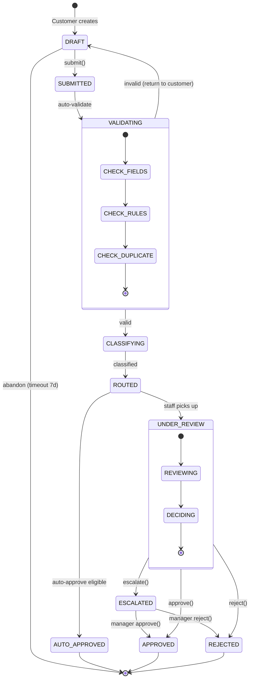
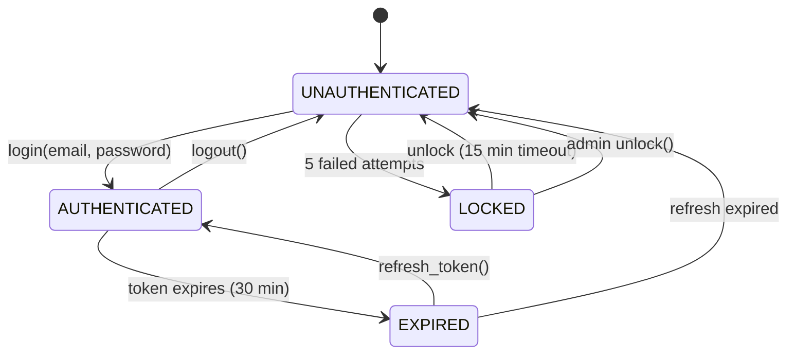
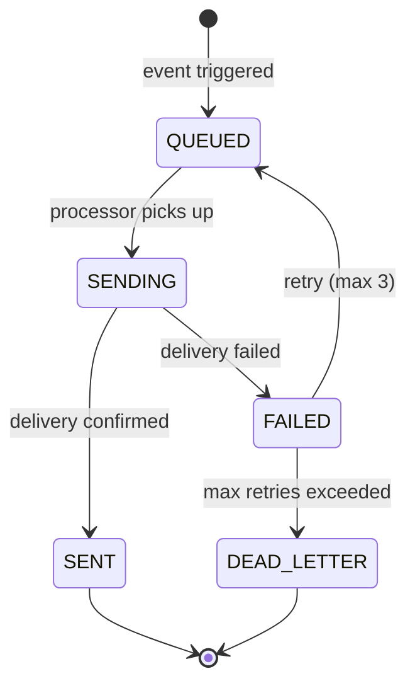
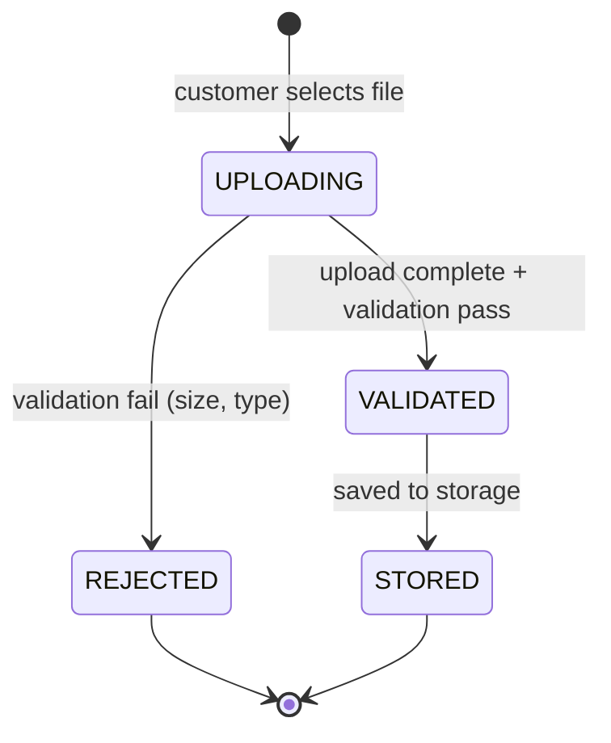

# State Diagrams

> **Project:** [Project Name]
> **Version:** [X.Y] | **Status:** [Draft | Under Review | Approved]
> **Last Updated:** [YYYY-MM-DD]

---

## 1. Purpose

> This document contains UML state diagrams showing the lifecycle of key entities — states, transitions, events, and guards.

## 2. State Diagram Index

| # | Entity | States | Transitions | Status |
|---|--------|--------|-----------|--------|
| ST-001 | [Request] | [8] | [10] | ✅ Approved |
| ST-002 | [User Session] | [4] | [5] | ✅ Approved |
| ST-003 | [Notification] | [4] | [5] | ✅ Approved |
| ST-004 | [Document] | [3] | [3] | ✅ Approved |

## 3. State Diagrams

### ST-001: Request Lifecycle

**State Descriptions:**

| State | Description | Entry Action | Exit Action |
|-------|-----------|-------------|------------|
| [DRAFT] | [Customer is filling the form] | [Create request record] | [Set submitted_at] |
| [SUBMITTED] | [Request submitted, awaiting processing] | [Notify customer] | — |
| [VALIDATING] | [System validating inputs] | [Run validation rules] | [Log validation result] |
| [CLASSIFYING] | [System classifying request type] | [Run classification rules] | [Set classification] |
| [ROUTED] | [Assigned to queue/staff] | [Assign to queue] | — |
| [UNDER_REVIEW] | [Staff reviewing request] | [Notify assigned staff] | — |
| [ESCALATED] | [Escalated to manager] | [Notify manager] | — |
| [AUTO_APPROVED] | [Auto-approved by system] | [Set completed_at, notify] | — |
| [APPROVED] | [Manually approved] | [Set completed_at, notify] | — |
| [REJECTED] | [Rejected] | [Set completed_at, notify with reason] | — |

**Transition Table:**

| From | To | Event | Guard | Action |
|------|-----|-------|-------|--------|
| [DRAFT] | [SUBMITTED] | [submit()] | [All required fields filled] | [Set submitted_at] |
| [SUBMITTED] | [VALIDATING] | [auto-trigger] | — | [Run validation] |
| [VALIDATING] | [CLASSIFYING] | [validation.passed] | [All rules pass] | [Log success] |
| [VALIDATING] | [DRAFT] | [validation.failed] | [Any rule fails] | [Return errors to customer] |
| [CLASSIFYING] | [ROUTED] | [classification.complete] | — | [Assign queue] |
| [ROUTED] | [UNDER_REVIEW] | [staff.open()] | [Staff available] | [Assign to staff] |
| [ROUTED] | [AUTO_APPROVED] | [auto-trigger] | [Eligible for auto-approve] | [Approve, notify] |
| [UNDER_REVIEW] | [APPROVED] | [approve()] | [Staff has permission] | [Set completed_at] |
| [UNDER_REVIEW] | [REJECTED] | [reject(reason)] | [Staff has permission] | [Set completed_at] |
| [UNDER_REVIEW] | [ESCALATED] | [escalate(reason)] | [Staff has permission] | [Notify manager] |
| [ESCALATED] | [APPROVED] | [manager.approve()] | [Manager has permission] | [Set completed_at] |
| [ESCALATED] | [REJECTED] | [manager.reject(reason)] | [Manager has permission] | [Set completed_at] |

### ST-002: User Session

### ST-003: Notification

### ST-004: Document

## 4. State Invariants

| Entity | State | Invariant | Violation Action |
|--------|-------|----------|-----------------|
| [Request] | [APPROVED] | [completed_at must be set] | [System error] |
| [Request] | [REJECTED] | [rejection_reason must not be empty] | [Prevent transition] |
| [Request] | [SUBMITTED] | [amount > 0] | [Prevent submission] |
| [User] | [AUTHENTICATED] | [token must be valid] | [Force re-auth] |
| [Notification] | [SENT] | [sent_at must be set] | [System error] |

---

## Related Documents

| Document | Relationship |
|----------|-------------|
| [[Sequence-Diagrams]] | Interactions between entities |
| [[Class-Diagrams]] | Entity structure |
| [[Low-Level-Design]] | Implementation of state logic |

---

> **Template Standard:** Based on SWEBOK v4, ISO/IEC 19501 (UML)
> **Usage:** State diagrams show *lifecycle* — how an entity changes over time. Use them to verify all states are handled and transitions are valid. They're essential for testing — every state and transition needs a test case.
