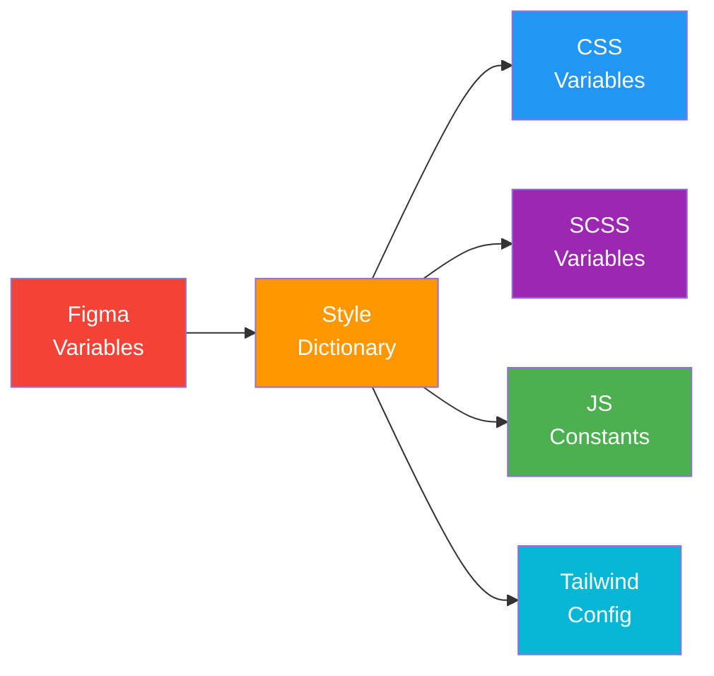

# Design Tokens

> **Project:** [Project Name]
> **Version:** [X.Y] | **Status:** [Draft | Under Review | Approved]
> **Last Updated:** [YYYY-MM-DD]

---

## 1. Purpose

> Design tokens are the single source of truth for design values — colors, typography, spacing, shadows — in a format that can be used by design tools and code.

## 2. Token Format

Design tokens are stored as JSON and compiled to CSS variables, SCSS variables, and Figma variables.

## 3. Color Tokens

```json
{
  "color": {
    "primary": {
      "base": { "value": "#2196F3" },
      "light": { "value": "#64B5F6" },
      "dark": { "value": "#1976D2" }
    },
    "semantic": {
      "success": { "value": "#4CAF50" },
      "warning": { "value": "#FF9800" },
      "error": { "value": "#f44336" },
      "info": { "value": "#2196F3" }
    },
    "neutral": {
      "bg": { "value": "#F5F5F5" },
      "surface": { "value": "#FFFFFF" },
      "text-primary": { "value": "#212121" },
      "text-secondary": { "value": "#757575" },
      "text-disabled": { "value": "#BDBDBD" },
      "border": { "value": "#E0E0E0" }
    }
  }
}
```

## 4. Typography Tokens

```json
{
  "typography": {
    "font-family": { "value": "Inter, sans-serif" },
    "size": {
      "xs": { "value": "12px" },
      "sm": { "value": "14px" },
      "base": { "value": "16px" },
      "lg": { "value": "18px" },
      "xl": { "value": "24px" },
      "2xl": { "value": "32px" }
    },
    "weight": {
      "normal": { "value": "400" },
      "medium": { "value": "500" },
      "semibold": { "value": "600" },
      "bold": { "value": "700" }
    },
    "line-height": {
      "tight": { "value": "1.25" },
      "normal": { "value": "1.5" },
      "relaxed": { "value": "1.75" }
    }
  }
}
```

## 5. Spacing Tokens

```json
{
  "spacing": {
    "xs": { "value": "4px" },
    "sm": { "value": "8px" },
    "md": { "value": "16px" },
    "lg": { "value": "24px" },
    "xl": { "value": "32px" },
    "2xl": { "value": "48px" },
    "3xl": { "value": "64px" }
  }
}
```

## 6. Shadow Tokens

```json
{
  "shadow": {
    "sm": { "value": "0 1px 3px rgba(0,0,0,0.12)" },
    "md": { "value": "0 4px 6px rgba(0,0,0,0.16)" },
    "lg": { "value": "0 10px 20px rgba(0,0,0,0.19)" }
  }
}
```

## 7. Border Radius Tokens

```json
{
  "radius": {
    "sm": { "value": "4px" },
    "md": { "value": "8px" },
    "lg": { "value": "12px" },
    "full": { "value": "9999px" }
  }
}
```

## 8. CSS Output

```css
:root {
  --color-primary: #2196F3;
  --color-primary-light: #64B5F6;
  --color-primary-dark: #1976D2;
  --color-success: #4CAF50;
  --color-warning: #FF9800;
  --color-error: #f44336;
  --color-bg: #F5F5F5;
  --color-surface: #FFFFFF;
  --color-text-primary: #212121;
  --color-text-secondary: #757575;
  --color-border: #E0E0E0;

  --font-family: Inter, sans-serif;
  --text-xs: 12px;
  --text-sm: 14px;
  --text-base: 16px;
  --text-lg: 18px;
  --text-xl: 24px;
  --text-2xl: 32px;

  --space-xs: 4px;
  --space-sm: 8px;
  --space-md: 16px;
  --space-lg: 24px;
  --space-xl: 32px;

  --shadow-sm: 0 1px 3px rgba(0,0,0,0.12);
  --shadow-md: 0 4px 6px rgba(0,0,0,0.16);
  --shadow-lg: 0 10px 20px rgba(0,0,0,0.19);

  --radius-sm: 4px;
  --radius-md: 8px;
  --radius-lg: 12px;
}
```

## 9. Token Pipeline



---

## Related Documents

| Document | Relationship |
|----------|-------------|
| [[Style-Guide]] | Visual standards these tokens implement |
| [[Design-System]] | System these tokens are part of |
| [[Design-Specifications]] | Specs using these tokens |

---

> **Template Standard:** Based on W3C Design Tokens Community Group
> **Usage:** Design tokens are the *bridge* between design and code. Change a token → change everywhere. Use Style Dictionary to compile.
