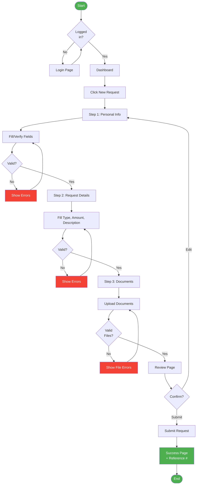
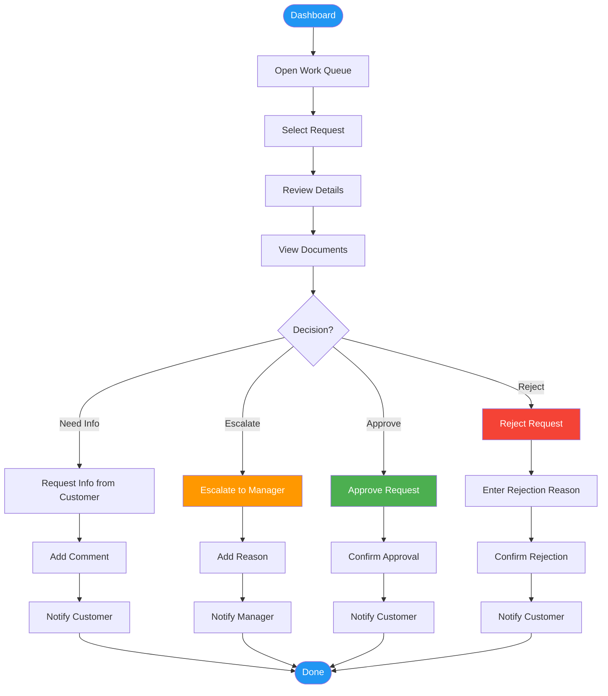
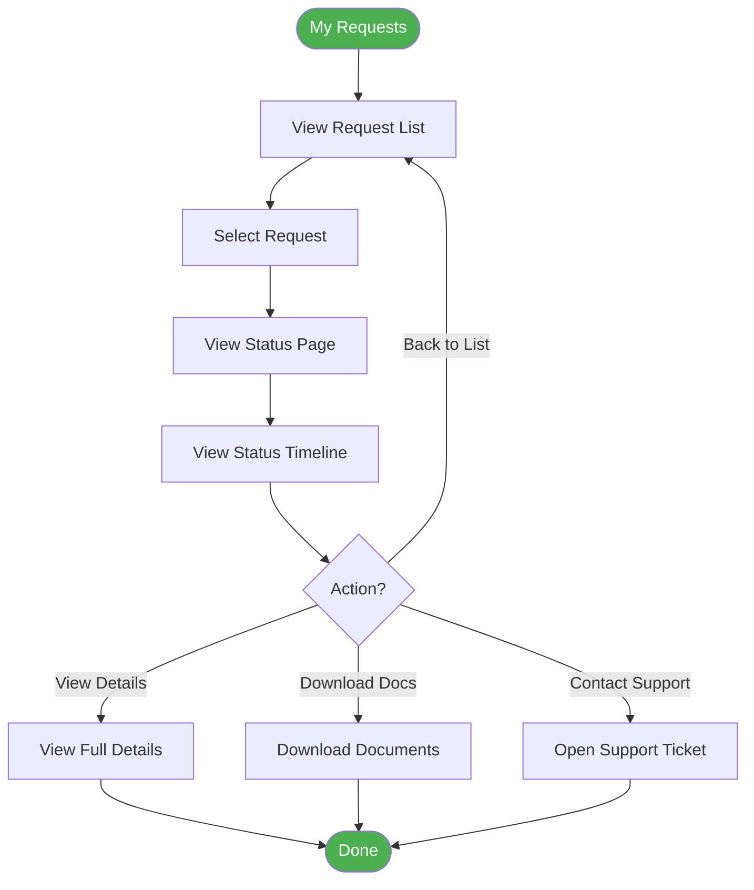
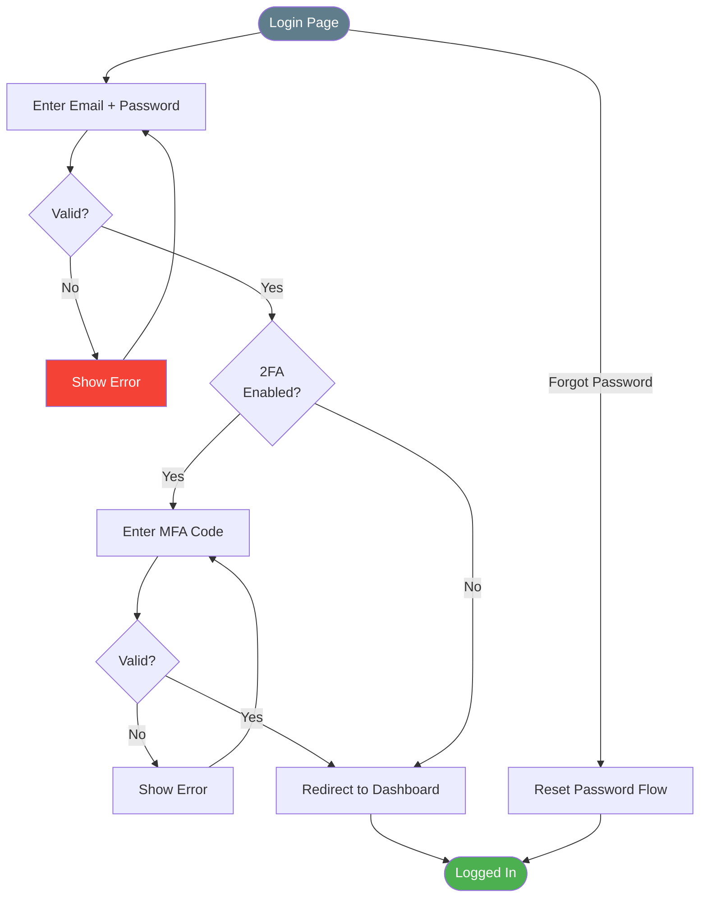

# User Flows

> **Project:** [Project Name]
> **Version:** [X.Y] | **Status:** [Draft | Under Review | Approved]
> **Last Updated:** [YYYY-MM-DD]

---

## 1. Purpose

> User flows diagram the step-by-step paths users take to complete key tasks — showing decisions, branches, and error handling.

## 2. Flow Index

| # | Flow | Persona | Steps | Status |
|---|------|---------|-------|--------|
| UF-001 | [Submit Request] | [Sarah] | [6] | ✅ Approved |
| UF-002 | [Process Request] | [James] | [5] | ✅ Approved |
| UF-003 | [Track Status] | [Sarah] | [3] | ✅ Approved |
| UF-004 | [Login] | [All] | [4] | ✅ Approved |
| UF-005 | [Generate Report] | [Linda] | [4] | ✅ Approved |

## 3. User Flows

### UF-001: Submit Request (Sarah)

### UF-002: Process Request (James)

### UF-003: Track Status (Sarah)

### UF-004: Login (All Users)

## 4. Flow Statistics

| Flow | Steps | Decisions | Error Paths | Avg Time |
|------|-------|----------|------------|---------|
| [Submit Request] | [6] | [5] | [3] | [5-10 min] |
| [Process Request] | [5] | [1] | [0] | [3-5 min] |
| [Track Status] | [3] | [1] | [0] | [1-2 min] |
| [Login] | [4] | [3] | [2] | [30 sec] |
| [Generate Report] | [4] | [2] | [1] | [2-3 min] |

---

## Related Documents

| Document | Relationship |
|----------|-------------|
| [[Information-Architecture]] | Pages these flows traverse |
| [[Wireframes-Low-fi]] | Screen layouts for each step |
| [[Journey-Map]] | Emotional journey behind the flow |

---

> **Template Standard:** Based on ISO 9241-210
> **Usage:** User flows answer "How does the user get from A to B?" Every flow needs a wireframe for each step. Test flows with prototypes before development.
