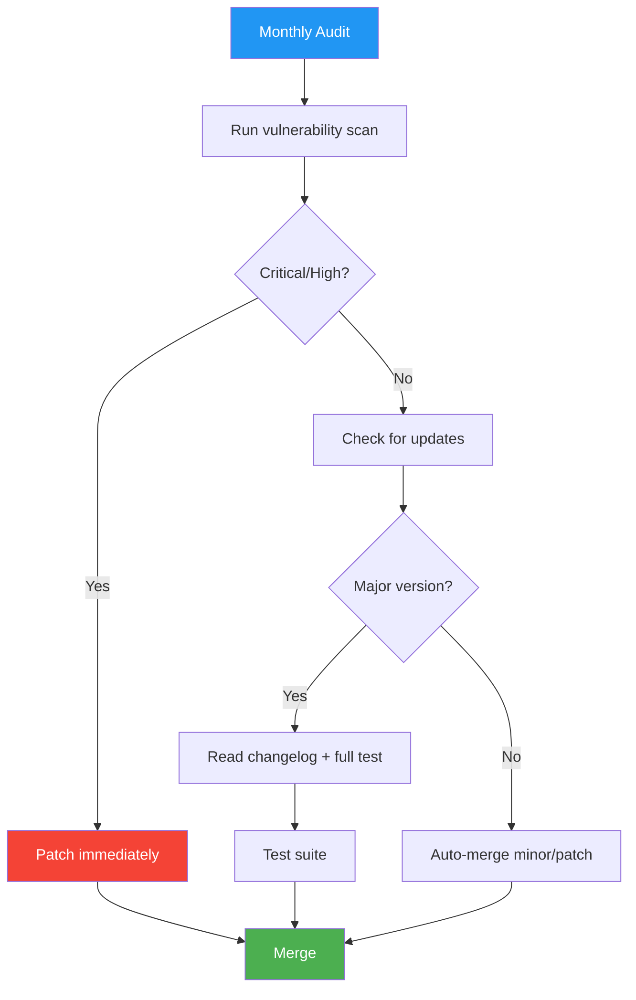

# Dependency Manifest

> **Project:** [Project Name]
> **Version:** [X.Y] | **Status:** [Active]
> **Last Updated:** [YYYY-MM-DD]

---

## 1. Purpose

> Complete inventory of all project dependencies — direct, transitive, and platform-level. Know what you depend on. Audit regularly. Never ship with known vulnerabilities.

## 2. Dependency Overview

| Metric | Count |
|--------|-------|
| Direct Dependencies (implementation) | [X] |
| Dev/Test Dependencies | [X] |
| Transitive Dependencies (approx.) | [X] |
| Known Vulnerabilities | [0] |
| License Issues | [0] |

## 3. Tech-Stack Variants

### 3.1 Java / Gradle — `build.gradle`

```groovy
plugins {
    id 'java'
    id 'org.springframework.boot' version '4.1.0'
    id 'io.spring.dependency-management' version '1.1.7'
}

java {
    toolchain {
        languageVersion = JavaLanguageVersion.of(25)
    }
}

ext {
    set('springCloudVersion', "2025.1.2")  // BOM version pin
}

dependencies {
    // Framework
    implementation 'org.springframework.cloud:spring-cloud-starter-netflix-eureka-server'

    // Observability
    implementation 'org.springframework.boot:spring-boot-starter-actuator'

    // Testing
    testImplementation 'org.springframework.boot:spring-boot-starter-test'
    testRuntimeOnly 'org.junit.platform:junit-platform-launcher'
}

dependencyManagement {
    imports {
        // BOM ensures all Spring Cloud deps are compatible versions
        mavenBom "org.springframework.cloud:spring-cloud-dependencies:${springCloudVersion}"
    }
}
```

**Dependency Table:**

| Dependency | Group:Artifact | Version | License | Purpose |
|-----------|---------------|---------|---------|---------|
| [Library] | [group:artifact] | [X.Y.Z] | [License] | [Why we need it] |

**Spring Cloud BOM Pattern:**
The BOM (`spring-cloud-dependencies`) manages ALL transitive Spring Cloud versions. Declare only top-level starters — the BOM ensures sub-dependencies (Eureka, Jersey, Jackson, Spring Web) are compatible. **Never pin individual Spring Cloud library versions** — let the BOM handle version alignment.

### 3.2 Node.js / TypeScript — `package.json`

```json
{
  "dependencies": {
    "express": "^4.18.2",
    "pg": "^8.11.3",
    "jsonwebtoken": "^9.0.2",
    "zod": "^3.22.4"
  },
  "devDependencies": {
    "typescript": "^5.3.2",
    "jest": "^29.7.0",
    "eslint": "^8.55.0",
    "prettier": "^3.1.0"
  }
}
```

**Dependency Table:**

| Package | Version | License | Purpose | Security |
|---------|---------|---------|---------|:---:|
| [package] | [^X.Y.Z] | [License] | [Purpose] | ✅ |

### 3.3 Go — `go.mod`

```go
module github.com/org/project

go 1.23

require (
    github.com/gin-gonic/gin v1.9.1
    github.com/lib/pq v1.10.9
)
```

**Dependency Table:**

| Module | Version | License | Purpose |
|--------|---------|---------|---------|
| [module] | [vX.Y.Z] | [License] | [Purpose] |

## 4. Key Transitive Dependencies

For Spring Boot projects, document the critical transitive dependencies that the BOM manages:

| Transitive Dep | Purpose | Managed By |
|---------------|---------|-----------|
| [Embedded Server] (Tomcat/Jetty/Netty) | HTTP server | Boot starter |
| [JSON Mapper] (Jackson) | Serialization | Boot BOM |
| [XML Mapper] (xstream) | Legacy format support | Spring Cloud BOM |
| [JAX-RS Client] (Jersey) | HTTP client internals | Spring Cloud BOM |

## 5. Dependency Policy

| Rule | Enforcement | Tool |
|------|-----------|------|
| No known vulnerabilities (Critical/High) | CI blocks merge | `./gradlew dependencyCheckAnalyze` / `npm audit` / `govulncheck` |
| Lock file committed | Required | `build.gradle` + wrapper props / `package-lock.json` / `go.sum` |
| License compliance | Checked in CI | OWASP Dependency-Check / license-checker |
| Major version updates | Manual review + full test | Dependabot / Renovate |
| Transitive dependency overrides | Explicit in manifest | Gradle `constraints` / npm `overrides` / Go `replace` |
| Monthly audit | Scheduled CI job | Cron workflow |

## 6. Dependency Update Process



## 7. Platform-Level Shared Dependencies

For multi-service platforms, prefer shared infrastructure over duplicated dependencies:

| Dependency | Shared? | Where |
|-----------|:---:|-------|
| Database (PostgreSQL) | ✅ Shared | One host-level instance, per-service databases |
| Cache (Valkey/Redis) | ✅ Shared | One host-level instance |
| Service Registry (Eureka) | ✅ Shared | One registry, all services auto-register |
| Identity (Keycloak) | ✅ Shared | One IAM, all services validate JWT locally |
| Object Storage | ✅ Shared | One SeaweedFS/S3 instance |

**Rule:** If every service needs it, it's platform infrastructure — deploy once, share everywhere.

## 8. Minimalism Principle

Justify every dependency. Questions to ask before adding:

1. **Is this already provided by the framework?** Spring Boot includes JSON, HTTP, logging — don't add separate libs
2. **Can we use the platform's shared service instead?** Don't add a DB driver if this service is stateless
3. **Is this truly needed now?** YAGNI — defer until the feature requiring it exists
4. **What's the transitive cost?** One dependency can pull 20 transitive deps

---

## Related Documents

| Document | Relationship |
|----------|-------------|
| [[Build-Scripts]] | Build pipeline that resolves these deps |
| [[SBOM]] | Software bill of materials |
| [[Secure-Coding-Guidelines]] | Security scanning standards |
| [[Architecture-Decision-Records]] | Why we chose these dependencies |

---

> **Template Standard:** Based on SWEBOK v4, OWASP Top 10 (A06:2021)
> **Usage:** Pick the tech-stack variant. Lock versions. Audit regularly. Never ship with known vulnerabilities. The Spring Cloud BOM is the single most important pattern for Java microservices — it prevents version hell across 40+ transitive dependencies. For platform projects, shared infrastructure beats duplicated dependencies.
