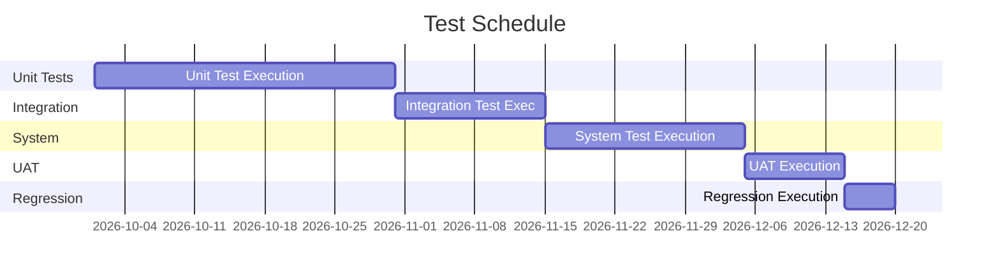

# Test Plan

> **Project:** [Project Name]
> **Version:** [X.Y] | **Status:** [Draft | Under Review | Approved | Baselined]
> **Last Updated:** [YYYY-MM-DD]

---

## Document Control

| Field | Value |
|-------|-------|
| Document Owner | [QA Lead] |
| Approvals | [PM, Tech Lead, QA Lead] |

### Approvals

| Role | Name | Signature | Date |
|------|------|-----------|------|
| Project Manager | | | |
| Technical Lead | | | |
| QA Lead | | | |

---

## 1. Introduction

### 1.1 Purpose

> This plan defines the testing approach, scope, resources, schedule, and deliverables for the project.

### 1.2 Scope

| In Scope | Out of Scope |
|---------|-------------|
| [Functional testing] | [Performance testing — separate plan] |
| [Integration testing] | [Security testing — separate plan] |
| [UAT] | [Disaster recovery testing] |
| [Regression testing] | |

## 2. Test Strategy

> See [[Test-Strategy]] for detailed strategy.

| Level | Type | Automation | Coverage Target |
|-------|------|-----------|----------------|
| [Unit] | [White-box] | [100%] | [≥ 80% code coverage] |
| [Integration] | [Gray-box] | [80%] | [All service interfaces] |
| [System] | [Black-box] | [60%] | [All functional requirements] |
| [UAT] | [Black-box] | [0%] | [All business scenarios] |
| [Regression] | [Black-box] | [100%] | [All critical paths] |

## 3. Test Environment

| Environment | Purpose | URL | Data |
|------------|---------|-----|------|
| [Development] | [Developer testing] | [dev.project.com] | [Synthetic] |
| [Staging] | [Pre-production testing] | [staging.project.com] | [Anonymized prod] |
| [UAT] | [User acceptance testing] | [uat.project.com] | [Anonymized prod] |

## 4. Test Schedule

## 5. Test Resources

| Role | Name | Responsibility |
|------|------|---------------|
| [QA Lead] | [Name] | [Test planning, coordination] |
| [QA Engineer 1] | [Name] | [System testing, automation] |
| [QA Engineer 2] | [Name] | [Integration testing, regression] |
| [Business Analyst] | [Name] | [UAT coordination] |

## 6. Entry, Exit & Suspension Criteria

### 6.1 Entry & Exit Criteria

| Phase | Entry Criteria | Exit Criteria |
|-------|---------------|--------------|
| [Unit] | [Code complete, PR merged] | [≥ 80% coverage, all tests pass] |
| [Integration] | [Unit tests pass, services deployed] | [All interfaces verified] |
| [System] | [Integration tests pass] | [All 🔴 requirements verified] |
| [UAT] | [System tests pass] | [Stakeholder sign-off] |
| [Regression] | [All defects fixed] | [No critical/high defects] |

### 6.2 Suspension Criteria

> Per ISO/IEC/IEEE 29119-3, the test plan must define conditions under which testing is suspended.

| Condition | Trigger | Action |
|-----------|---------|--------|
| [Critical defect blocks testing] | [A 🔴 Critical defect prevents further test execution] | [Suspend affected test phase immediately] |
| [Excessive critical defects] | [> 5 Critical defects found in a single test session] | [Suspend testing, escalate to PM + Tech Lead] |
| [Test environment unavailable] | [Environment down for > 4 hours] | [Suspend testing, notify stakeholders] |
| [Build instability] | [Build fails to deploy or crashes on startup] | [Suspend until stable build provided] |
| [Data corruption] | [Test data corrupted or invalid] | [Suspend until data restored] |

### 6.3 Resumption Requirements

> Per ISO/IEC/IEEE 29119-3, the test plan must define what must be true before testing resumes after suspension.

| Suspension Cause | Resumption Requirement |
|-----------------|----------------------|
| [Critical defect fixed] | [Fix verified, build redeployed, affected tests re-run] |
| [Excessive defects resolved] | [Root cause analysis completed, fixes verified by dev] |
| [Environment restored] | [Environment health check passed, data valid] |
| [Stable build provided] | [Smoke tests passed on new build] |
| [Data restored] | [Data validation complete, test data refreshed] |

## 7. Staffing and Training Needs

> Per ISO/IEC/IEEE 29119-3, the test plan must identify required skills and training.

### 7.1 Test Team Composition

| Role | Count | Required Skills | Assigned |
|------|-------|----------------|----------|
| [QA Lead] | [1] | [Test strategy, planning, coordination, risk assessment] | [Name] |
| [QA Engineer — Automation] | [1] | [Jest, Playwright, CI/CD integration, scripting] | [Name] |
| [QA Engineer — Manual] | [1] | [Test case design, exploratory testing, defect reporting] | [Name] |
| [Business Analyst (UAT)] | [1] | [Business processes, acceptance criteria, stakeholder mgmt] | [Name] |

### 7.2 Training Requirements

| Training | Who | When | Duration |
|----------|-----|------|----------|
| [Domain/Product training] | [All QA] | [Project kickoff] | [2 days] |
| [Automation tools training] | [QA Engineers] | [Before automation starts] | [3 days] |
| [Test management tool] | [All QA] | [Project kickoff] | [0.5 day] |
| [Security testing basics] | [QA Engineers] | [Before security testing] | [1 day] |
| [Accessibility testing (WCAG)] | [QA Engineers] | [Before a11y testing] | [1 day] |

## 8. Defect Management

| Severity | Response Time | Resolution Time | Escalation |
|---------|-------------|----------------|-----------|
| [Critical] | [1 hour] | [4 hours] | [PM + Tech Lead] |
| [High] | [4 hours] | [1 day] | [Tech Lead] |
| [Medium] | [1 day] | [3 days] | — |
| [Low] | [3 days] | [Next sprint] | — |

## 9. Risk & Mitigations

| Risk | Probability | Impact | Mitigation |
|------|-----------|--------|-----------|
| [Test environment unavailable] | [Medium] | [High] | [Backup environment, Docker local] |
| [Test data insufficient] | [Medium] | [Medium] | [Data generation scripts] |
| [Defects found late] | [Medium] | [High] | [Shift-left testing, TDD] |

---

## Related Documents

| Document | Relationship |
|----------|-------------|
| [[Test-Strategy]] | Detailed strategy |
| [[Test-Cases]] | Test case specifications |
| [[Test-Report]] | Test results |

---

> **Template Standard:** Based on SWEBOK v4, ISO/IEC/IEEE 29119-3 (Annex: Test Plan content)
> **Usage:** The test plan is the *contract* for testing. Everyone knows what's tested, when, and by whom. Suspension and resumption criteria protect the team from wasting effort on broken builds.
