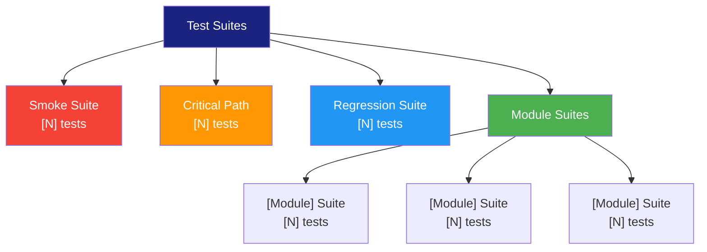

# Test Suite

> **Project:** [Project Name]
> **Version:** [X.Y] | **Status:** [Active]
> **Last Updated:** [YYYY-MM-DD]

---

## 1. Purpose

> Organizes test cases into logical suites — by module, type, or execution priority.

## 2. Suite Structure

## 3. Suite Definitions

### 3.1 Smoke Suite

| Field | Detail |
|-------|--------|
| **Purpose** | [Purpose] |
| **Size** | [N tests] |
| **Execution Time** | [Time] |
| **Frequency** | [Frequency] |
| **Automation** | [X]% |

| # | Test Case | Module | Priority |
|---|----------|--------|---------|
| 1 | [TC-XXX: Test case title] | [Module Name] | [Priority] |

### 3.2 Critical Path Suite

| Field | Detail |
|-------|--------|
| **Purpose** | [Purpose] |
| **Size** | [N tests] |
| **Execution Time** | [Time] |
| **Frequency** | [Frequency] |
| **Automation** | [X]% |

### 3.3 Regression Suite

| Field | Detail |
|-------|--------|
| **Purpose** | [Purpose] |
| **Size** | [N tests] |
| **Execution Time** | [Time] |
| **Frequency** | [Frequency] |
| **Automation** | [X]% |

## 4. Suite Execution Matrix

| Suite | Commit | PR | Nightly | Pre-Release | Post-Deploy |
|-------|--------|-----|---------|------------|------------|
| [Smoke] | ❌ | ❌ | ❌ | ✅ | ✅ |
| [Critical Path] | ❌ | ✅ | ✅ | ✅ | ✅ |
| [Regression] | ❌ | ❌ | ✅ | ✅ | ❌ |
| [Module] | ✅ (changed) | ✅ | ✅ | ✅ | ❌ |

## 5. Suite Metrics

| Suite | Tests | Pass | Fail | Skip | Pass Rate |
|-------|-------|------|------|------|----------|
| [Smoke] | [N] | [N] | [N] | [N] | [X]% |
| [Critical Path] | [N] | [N] | [N] | [N] | [X]% |
| [Regression] | [N] | [N] | [N] | [N] | [X]% |

---

## Related Documents

| Document | Relationship |
|----------|-------------|
| [[Test-Cases]] | Cases organized into suites |
| [[Test-Scripts-Automated]] | Automated execution |
| [[Regression-Test-Suite]] | Regression-specific suite |

---

> **Template Standard:** Based on SWEBOK v4
> **Usage:** Suites are *execution units*. Run the right suite at the right time — smoke for deploys, regression for releases.
