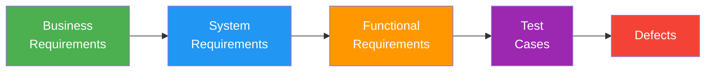

# Traceability Matrix (Req ↔ Tests)

> **Project:** [Project Name]
> **Version:** [X.Y] | **Status:** [Active]
> **Last Updated:** [YYYY-MM-DD]

---

## 1. Purpose

> Bidirectional traceability between requirements and test cases — ensuring every requirement is tested and every test traces to a requirement.

## 2. Traceability Model

## 3. Traceability Matrix

| Req ID | Requirement | Priority | Test Cases | Coverage | Status |
|--------|-------------|---------|-----------|---------|--------|
| [FR-XXX] | [Requirement description] | [Priority] | [TC-XXX, TC-XXX] | [X]% | [Status] |

## 4. Coverage Summary

| Module | Requirements | Tested | Untested | Coverage |
|--------|-------------|--------|---------|---------|
| [Module Name] | [N] | [N] | [N] | [X]% |
| **Total** | **[N]** | **[N]** | **[N]** | **[X]%** |

## 5. Reverse Traceability

| Test Case | Requirement | Module | Automated | Status |
|-----------|-----------|--------|----------|--------|
| [TC-XXX] | [FR-XXX] | [Module Name] | [Yes/No] | [Status] |

## 6. Gap Analysis

| Gap Type | Count | Details |
|---------|-------|--------|
| [Untested requirements] | [N] | [Details] |
| [Orphaned tests] | [N] | [Details] |
| [Requirements without test cases] | [N] | [Details] |

---

## Related Documents

| Document | Relationship |
|----------|-------------|
| [[Test-Cases]] | Test cases in this matrix |
| [[Requirements-Traceability-Matrix]] | Requirements-side traceability |
| [[Software-Requirements-Specification]] | Requirements being traced |

---

> **Template Standard:** Based on SWEBOK v4, ISO/IEC/IEEE 29119
> **Usage:** If a requirement has no test, it's not verified. If a test has no requirement, it's orphaned. Keep this matrix 100%.
