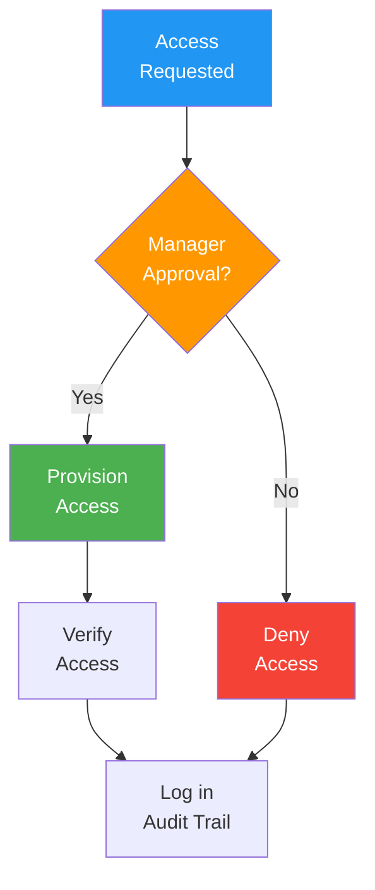

# Access Control Policy

> **Project:** [Project Name]
> **Version:** [X.Y] | **Status:** [Draft | Under Review | Approved]
> **Last Updated:** [YYYY-MM-DD]

---

## 1. Purpose

> Defines how access to systems, data, and resources is controlled — who gets access to what, and under what conditions.

## 2. Access Control Principles

| Principle | Description | Implementation |
|----------|-------------|---------------|
| [Least Privilege] | [Grant minimum access required] | [RBAC with explicit permissions] |
| [Need to Know] | [Access only data required for role] | [Data classification + access controls] |
| [Separation of Duties] | [No single person controls critical process] | [Distinct roles for create/approve] |
| [Zero Trust] | [Verify every request] | [Auth on every endpoint, no implicit trust] |

## 3. Role Definitions

| Role | Description | Access Level | Permissions |
|------|-----------|-------------|------------|
| [Customer] | [End user submitting requests] | [Own data only] | [Create, read own, update own] |
| [Staff] | [Operations processing requests] | [Assigned requests] | [Read assigned, process, comment] |
| [Manager] | [Operations manager] | [Team data] | [Read all, approve, escalate, report] |
| [Admin] | [System administrator] | [Full access] | [All CRUD, user management, config] |
| [Auditor] | [Compliance/audit] | [Read-only all] | [Read all, export, audit log] |

## 4. Permission Matrix

| Resource | Customer | Staff | Manager | Admin | Auditor |
|---------|---------|-------|---------|-------|---------|
| [Own Requests] | [CRU] | [R] | [R] | [CRUD] | [R] |
| [Assigned Requests] | — | [RUDP] | [RUDP] | [CRUD] | [R] |
| [All Requests] | — | — | [R] | [CRUD] | [R] |
| [User Management] | — | — | — | [CRUD] | [R] |
| [System Config] | — | — | — | [CRUD] | [R] |
| [Reports] | [R own] | [R team] | [R all] | [R all] | [R all] |
| [Audit Logs] | — | — | — | [R] | [R] |

> **Legend:** C=Create, R=Read, U=Update, D=Delete, P=Process

## 5. Authentication Requirements

| Requirement | Standard | Implementation |
|------------|---------|---------------|
| [Multi-Factor Authentication] | [Required for all users] | [TOTP / SMS] |
| [Password Policy] | [12+ chars, complexity, 90-day rotation] | [Auth service] |
| [Account Lockout] | [5 failed attempts → 15-min lock] | [Auth service] |
| [Session Timeout] | [30 minutes inactivity] | [Application] |
| [Session Management] | [Secure cookies, HttpOnly, SameSite] | [Express middleware] |

## 6. Access Request Process

## 7. Access Review

| Review Type | Frequency | Scope | Owner |
|------------|----------|-------|-------|
| [User Access Review] | [Quarterly] | [All user accounts] | [Admin] |
| [Privileged Access Review] | [Monthly] | [Admin accounts] | [Security Officer] |
| [Role Review] | [Semi-annually] | [Role definitions] | [Security Officer] |
| [Dormant Account Review] | [Monthly] | [Accounts inactive > 90 days] | [Admin] |

## 8. Privileged Access Management

| Control | Implementation |
|---------|---------------|
| [Admin accounts] | [Separate accounts, not daily-use] |
| [Just-in-time access] | [Temporary elevation, time-limited] |
| [Privileged session recording] | [All admin actions recorded] |
| [Break-glass procedure] | [Emergency access with approval + audit] |

## 9. Access Termination

| Trigger | Action | Timeline |
|---------|--------|---------|
| [Employee departure] | [Disable account, revoke all access] | [Same day] |
| [Role change] | [Review and adjust permissions] | [Within 3 days] |
| [Contractor end] | [Disable account, revoke access] | [Same day] |
| [Security incident] | [Lock account, investigate] | [Immediate] |

---

## Related Documents

| Document | Relationship |
|----------|-------------|
| [[Security-Policy]] | Overall security policy |
| [[ISMS-Documentation]] | ISMS framework |
| [[Authentication-Standard]] | Authentication details |

---

> **Template Standard:** Based on CyBOK v1, ISO/IEC 27001:2022
> **Usage:** Access control is *enforced*, not requested. Every access is logged. Reviews catch drift. Terminations are immediate.
