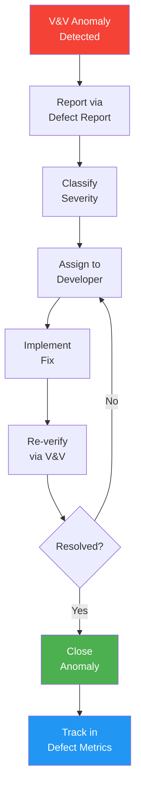
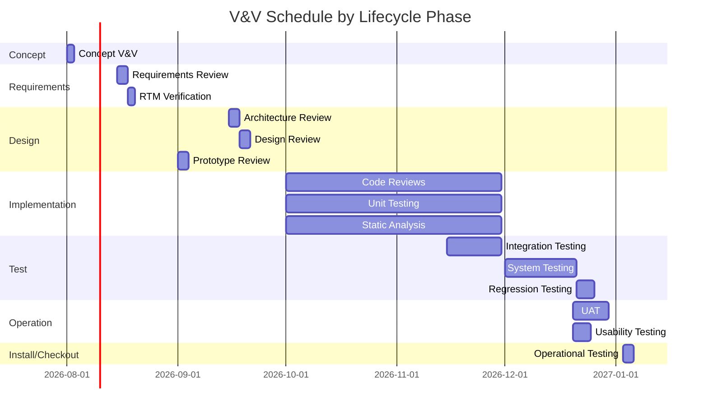

# V&V Plan (Verification & Validation Plan)

> **Project:** [Project Name]
> **Version:** [X.Y] | **Status:** [Draft | Under Review | Approved]
> **Last Updated:** [YYYY-MM-DD]

---

## 1. Purpose

> Defines verification (building right) and validation (building right product) activities, organized by IEEE 1012 lifecycle phases and integrity levels.

---

## 2. Software/System Integrity Level

> Per IEEE 1012-2017, the integrity level (1-4) determines which V&V tasks are mandatory and the rigor required. This must be identified before planning V&V activities.

| Integrity Level | Description | Failure Consequence | Typical Application |
|----------------|-------------|---------------------|---------------------|
| **Level 1: Catastrophic** | Loss of life, total system loss, catastrophic financial loss | [Could result in death or total system failure] | [Aviation, medical devices, nuclear] |
| **Level 2: Critical** | Severe injury, major system damage, major financial loss | [Could result in severe injury or major loss] | [Banking, industrial control, automotive] |
| **Level 3: Marginal** | Minor injury, minor system degradation, recoverable loss | [Could result in minor injury or marginal loss] | [Enterprise software, e-commerce] |
| **Level 4: Negligible** | No injury, no system damage, minimal loss | [No significant impact] | [Internal tools, prototypes] |

**Project Integrity Level Assignment:**

| Field | Value |
|-------|-------|
| **Assigned Integrity Level** | [Level 3: Marginal] |
| **Rationale** | [Enterprise application: no safety risk, but financial impact from downtime] |
| **Implications for V&V** | [Standard V&V tasks required per IEEE 1012 § for Level 3] |
| **V&V Independence Required** | [Technical independence required for Level 2-4; managerial independence required for Level 1-2] |

---

## 3. V&V Independence

> Per IEEE 1012-2017, V&V must have appropriate independence based on the integrity level.

| Independence Type | Required? | Description | Implementation |
|-----------------|-----------|-------------|----------------|
| **Technical Independence** | [Yes/No] | [V&V team has separate technical skills from development] | [QA team reports results independently] |
| **Managerial Independence** | [Yes/No] | [V&V reports to different management chain than development] | [QA reports to Quality Director, not Dev Manager] |
| **Financial Independence** | [Yes/No] | [V&V budget is separate from development budget] | [Separate QA budget line] |

> **Note:** For Integrity Level 1 (Catastrophic), all three independence types are required. For Level 2, technical + managerial. For Level 3-4, technical independence is recommended but not mandatory.

---

## 4. V&V Overview

| Aspect | Verification | Validation |
|--------|-------------|-----------|
| **Question** | [Are we building the product right?] | [Are we building the right product?] |
| **Focus** | [Specifications] | [User needs] |
| **Methods** | [Reviews, inspections, analysis, testing] | [User testing, acceptance, demonstration] |
| **When** | [During development] | [After development] |
| **Output** | [Conformance evidence] | [Acceptance evidence] |

---

## 5. V&V Activities by Lifecycle Phase

> Per IEEE 1012-2017, V&V activities must be organized by lifecycle phase. Each phase has required inputs, tasks, outputs, and review methods.

### 5.1 Concept Phase V&V

| Task | Input | Method | Output | Criteria |
|------|-------|--------|--------|----------|
| [Concept Review] | [Mission Analysis, ConOps] | [Walkthrough] | [Concept V&V Report] | [Concept is feasible, complete] |

### 5.2 Requirements Phase V&V

| Task | Input | Method | Output | Criteria |
|------|-------|--------|--------|----------|
| [Requirements Review] | [SRS, NFR Catalog] | [Inspection] | [Requirements V&V Report] | [Complete, consistent, traceable, testable] |
| [RTM Verification] | [RTM] | [Analysis] | [Traceability confirmation] | [All requirements traced to design + tests] |

### 5.3 Design Phase V&V

| Task | Input | Method | Output | Criteria |
|------|-------|--------|--------|----------|
| [Architecture Review] | [SAD, ADRs] | [Formal review] | [Design V&V Report] | [Architecture meets NFRs] |
| [Design Review] | [HLD, LLD] | [Inspection] | [Design V&V Report] | [Design meets requirements] |
| [Prototype Review] | [Prototype] | [Demonstration] | [Prototype V&V Report] | [Design direction validated] |

### 5.4 Implementation Phase V&V

| Task | Input | Method | Output | Criteria |
|------|-------|--------|--------|----------|
| [Code Review] | [Source code] | [Peer review / Inspection] | [Code V&V Report] | [[Coding-Standards]] compliance] |
| [Unit Testing] | [Unit test code] | [Test] | [Unit Test Results] | [≥ 80% coverage, all tests pass] |
| [Static Analysis] | [Source code] | [Analysis] | [Static Analysis Report] | [0 critical issues] |

### 5.5 Test Phase V&V

| Task | Input | Method | Output | Criteria |
|------|-------|--------|--------|----------|
| [Integration Testing] | [Components] | [Test] | [Integration Test Results] | [All interfaces verified] |
| [System Testing] | [Full system] | [Test] | [System Test Results] | [All 🔴 requirements verified] |
| [Regression Testing] | [Full system] | [Test] | [Regression Test Results] | [No regressions] |

### 5.6 Installation & Checkout Phase V&V

| Task | Input | Method | Output | Criteria |
|------|-------|--------|--------|----------|
| [Deployment Verification] | [Deployed system] | [Test] | [Deployment V&V Report] | [Deployment checklist passed] |
| [Operational Readiness] | [Runbook, SLA] | [Demonstration] | [Readiness Report] | [Runbook verified, monitoring active] |

### 5.7 Operation Phase V&V

| Task | Input | Method | Output | Criteria |
|------|-------|--------|--------|----------|
| [UAT] | [Production system] | [User testing] | [UAT Sign-off] | [Business scenarios pass] |
| [Usability Testing] | [Production system] | [User testing] | [Usability Report] | [SUS ≥ 68] |

### 5.8 Maintenance Phase V&V

| Task | Input | Method | Output | Criteria |
|------|-------|--------|--------|----------|
| [Change Verification] | [Modified system] | [Test + Review] | [Change V&V Report] | [Change meets requirements, no regressions] |
| [Regression Testing] | [Full system] | [Test] | [Regression Results] | [No new defects introduced] |

---

## 6. V&V Matrix

| Requirement | V: Design | V: Code | V: Test | V: UAT | Status |
|-------------|----------|--------|--------|--------|--------|
| [FR-001] | ✅ | ✅ | ✅ | ✅ | ✅ |
| [FR-002] | ✅ | ✅ | ✅ | ✅ | ✅ |
| [FR-101] | ✅ | ✅ | ✅ | ✅ | ✅ |
| [NFR-001] | ✅ | ✅ | ✅ | — | ✅ |
| [NFR-002] | ✅ | ✅ | ✅ | — | ✅ |

---

## 7. Anomaly Resolution and Reporting

> Per IEEE 1012-2017, the V&V plan must define how anomalies found during V&V activities are reported, tracked, and resolved.

| Anomaly Severity | Reporting Timeframe | Escalation |
|-----------------|--------------------|-----------| 
| [Critical] | [Immediate] | [Tech Lead + PM] |
| [High] | [Within 4 hours] | [Tech Lead] |
| [Medium] | [Within 1 day] | [Developer Lead] |
| [Low] | [Within 3 days] | [Backlog] |

**V&V Task Reports Required:**
- [Requirements V&V Report] — results of requirements phase V&V
- [Design V&V Report] — results of design phase V&V
- [Test V&V Report] — results of test phase V&V
- [Anomaly/Defect Reports] — per [[Defect-Report]] template
- [V&V Summary Report] — overall assessment at project completion

---

## 8. V&V Documentation Control

| Document | Controlled By | Version Method | Retention |
|----------|--------------|----------------|-----------|
| [V&V Plan (this document)] | [QA Lead] | [Version in frontmatter] | [Project + 7 years] |
| [V&V Task Reports] | [QA Lead] | [Versioned in repository] | [Project + 7 years] |
| [Anomaly Reports] | [QA] | [Defect tracking system] | [Project + 7 years] |
| [V&V Summary Report] | [QA Lead] | [Versioned in repository] | [Permanent] |

---

## 9. V&V Schedule

---

## Related Documents

| Document | Relationship |
|----------|-------------|
| [[Verification-Reports]] | Verification results |
| [[Validation-Reports]] | Validation results |
| [[SQAP]] | Quality assurance plan |

---

> **Template Standard:** Based on SWEBOK v4, ISO/IEC/IEEE 15288
> **Usage:** V&V is *not* just testing. Verification checks specs; validation checks needs. You need both.
