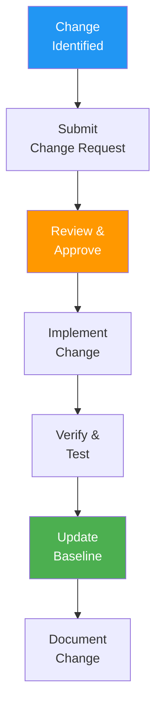
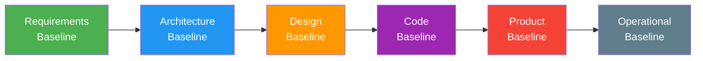
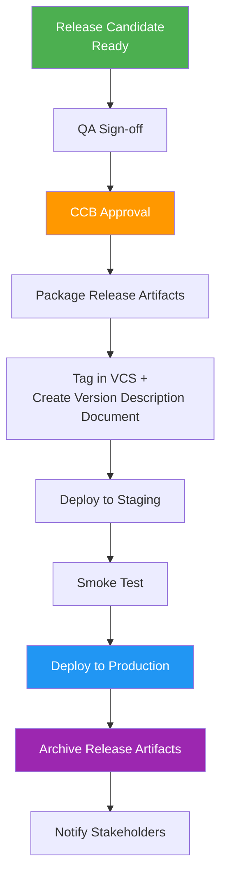

# SCMP (Software Configuration Management Plan)

> **Project:** [Project Name]
> **Version:** [X.Y] | **Status:** [Draft | Under Review | Approved | Baselined]
> **Last Updated:** [YYYY-MM-DD]

---

## Document Control

| Field | Value |
|-------|-------|
| Document Owner | [Configuration Manager] |
| Approvals | [PM, Tech Lead, CM] |

### Approvals

| Role | Name | Signature | Date |
|------|------|-----------|------|
| Project Manager | | | |
| Technical Lead | | | |
| Configuration Manager | | | |

---

## 1. Purpose

> Defines how software configuration items are identified, controlled, tracked, and audited throughout the project lifecycle.

## 2. Configuration Items (CIs)

| CI Type | Examples | Storage | Control |
|---------|---------|--------|--------|
| [Source Code] | [Application code, scripts] | [Git repository] | [Branch strategy] |
| [Documents] | [Plans, specs, reports] | [Repository] | [Version control] |
| [Tests] | [Test cases, scripts] | [Repository] | [Version control] |
| [Infrastructure] | [IaC, configs] | [Repository] | [Version control] |
| [Build Artifacts] | [Docker images, binaries] | [Registry] | [Tagged versions] |
| [Data] | [Migrations, seeds] | [Repository] | [Version control] |

## 3. CI Identification

| CI | Naming Convention | Version Scheme | Example |
|----|------------------|---------------|---------|
| [Source Code] | [project-name] | [SemVer] | [project v1.2.3] |
| [Documents] | [project-doc-type] | [vX.Y] | [project-srs v1.0] |
| [Docker Images] | [registry/project] | [Git SHA + SemVer] | [ghcr.io/org/project:v1.2.3] |
| [API] | [api-vX] | [Major version] | [api-v1] |

## 4. Configuration Control

## 5. Branch Strategy

| Branch | Purpose | Protection | Merge To |
|--------|---------|-----------|---------|
| [main] | [Production-ready code] | [Protected, PR required] | — |
| [develop] | [Integration branch] | [Protected, PR required] | [main] |
| [feature/*] | [Feature development] | [None] | [develop] |
| [hotfix/*] | [Production fixes] | [None] | [main + develop] |
| [release/*] | [Release preparation] | [Protected] | [main] |

## 6. Configuration Status Accounting

| Activity | Tool | Frequency | Report |
|---------|------|----------|--------|
| [CI tracking] | [Git] | [Every commit] | [Commit log] |
| [Build tracking] | [CI/CD] | [Every build] | [Build log] |
| [Deployment tracking] | [Kubernetes] | [Every deploy] | [Deploy log] |
| [Change tracking] | [Change log] | [Every change] | [Change report] |

## 7. Configuration Control Board (CCB)

> Per IEEE 828-2012, a CCB must be defined with clear membership and authority for approving changes to baselined configuration items.

| Field | Detail |
|-------|--------|
| **CCB Name** | [Project Configuration Control Board] |
| **Charter** | Reviews and approves/disapproves all change requests affecting baselined CIs |
| **Quorum** | [Chair + Tech Lead + QA Lead] |
| **Meeting Frequency** | [Weekly / On-demand for urgent changes] |

| Role | Name | Authority |
|------|------|-----------|
| [CCB Chair] | [PM / Delivery Manager] | [Final approval authority] |
| [Technical Lead] | [Name] | [Technical impact assessment] |
| [QA Lead] | [Name] | [Quality impact assessment] |
| [Architect] | [Name] | [Architecture impact assessment] |
| [Security Officer] | [Name] | [Security impact assessment (if applicable)] |

| Decision Type | Authority | Turnaround |
|---------------|----------|------------|
| [Emergency hotfix] | [Tech Lead + CCB Chair] | [< 2 hours] |
| [Standard CR] | [Full CCB] | [Within 1 week] |
| [Major architectural change] | [CCB + Sponsor] | [Within 2 weeks] |

---

## 8. Baseline Definitions

> Per IEEE 828-2012, baselines must be defined with their establishment points in the lifecycle.

| Baseline | Established When | Contents | Approval Required |
|----------|-----------------|----------|-------------------|
| [Requirements Baseline] | [SRS approved] | [SRS, NFR Catalog, RTM] | [Business Owner, BA Lead] |
| [Architecture Baseline] | [SAD approved] | [SAD, ADRs, Architecture Views] | [Architect, Tech Lead] |
| [Design Baseline] | [HLD/LLD approved] | [HLD, LLD, API Specs, ERD] | [Tech Lead, Architect] |
| [Code Baseline (Development)] | [End of sprint] | [Source code, unit tests] | [Tech Lead] |
| [Product Baseline] | [Release approved] | [All CIs: code, tests, docs, configs] | [CCB] |
| [Operational Baseline] | [Deployment to prod] | [Deployed artifacts, IaC, runbooks] | [DevOps Lead] |

---

## 9. Configuration Audits

| Audit | Purpose | Frequency | When |
|-------|---------|----------|------|
| [FCA] | [Verify functional requirements: CI matches functional specs] | [Per release] | [Before deployment] |
| [PCA] | [Verify physical configuration: as-built matches documented design] | [Per release] | [Before deployment] |
| [Status Audit] | [Verify CI status and consistency] | [Monthly] | [Regular review] |
| [In-Process Audit] | [Verify CM process compliance mid-lifecycle] | [Per phase] | [At phase transitions] |

---

## 10. Release Management and Delivery

> Per IEEE 828-2012, the SCMP must address release management and delivery: how CIs are packaged, delivered, and handed off.

### 10.1 Release Packaging

| Release Type | Trigger | Contents | Approval |
|--------------|---------|----------|----------|
| [Major (X.0.0)] | [Significant new features / breaking changes] | [Full system + migration scripts] | [CCB + Sponsor] |
| [Minor (0.X.0)] | [New features, backward-compatible] | [Updated system + release notes] | [CCB] |
| [Patch (0.0.X)] | [Bug fixes only] | [Patched system + changelog] | [Tech Lead] |
| [Hotfix] | [Critical production issue] | [Targeted fix + rollback plan] | [Tech Lead + CCB Chair] |

### 10.2 Release Process

### 10.3 Delivery Artifacts

| Artifact | Description | Storage |
|----------|-------------|---------|
| [Version Description Document] | [[Version-Description-Document]] | [Repository] |
| [Release Notes] | [[Release-Notes]] | [Repository] |
| [Container Image] | [Docker image with tag] | [Container Registry] |
| [Migration Scripts] | [Database migrations] | [Repository] |
| [Rollback Plan] | [[Rollback-Plan]] | [Repository] |

---

## 11. SCM Schedule

| Milestone | CM Activity | Deliverable |
|-----------|-------------|-------------|
| [Project Start] | [Establish CM process, tools, repository] | [SCMP approved] |
| [Requirements Approved] | [Establish Requirements Baseline] | [Baseline record] |
| [Architecture Approved] | [Establish Architecture Baseline] | [Baseline record] |
| [End of Sprint] | [Code baseline, CI/CD status report] | [Sprint CM report] |
| [Pre-Release] | [FCA + PCA audits] | [Audit reports] |
| [Release] | [Product baseline, VDD, release notes] | [Release package] |
| [Post-Deployment] | [Operational baseline, archival] | [Archive confirmation] |

---

## 12. SCM Resources

| Resource Type | Detail |
|---------------|--------|
| [CM Tool] | [Git + GitHub / GitLab / Bitbucket] |
| [CI/CD Tool] | [GitHub Actions / GitLab CI / Jenkins] |
| [Artifact Repository] | [Container registry / Nexus / Artifactory] |
| [CM Personnel] | [Configuration Manager: [Name]] |
| [Training] | [Git workflow training for all new team members] |

---

## 13. SCM Plan Maintenance

| Field | Detail |
|-------|--------|
| [Plan Owner] | [Configuration Manager] |
| [Review Frequency] | [Per release or major process change] |
| [Change Process] | [Changes to this SCMP follow the same CR/CCB process as other CIs] |
| [Version History] | See YAML frontmatter `version` and `last_updated` fields |

---

## Related Documents

| Document | Relationship |
|----------|-------------|
| [[Configuration-Management-Plan]] | Overall CM plan (project-level) |
| [[Baseline-Records]] | Baseline documentation |
| [[Change-Request]] | Change control process |
| [[Version-Description-Document]] | Release contents documentation |
| [[FCA-Report]] | Functional Configuration Audit |
| [[PCA-Report]] | Physical Configuration Audit |

---

> **Template Standard:** Based on SWEBOK v4, IEEE 828-2012 (Annex A)
> **Usage:** If it's not in version control, it doesn't exist. Every change gets a change request. Every release gets audited. The CCB is the gatekeeper: no baseline changes without CCB approval.
