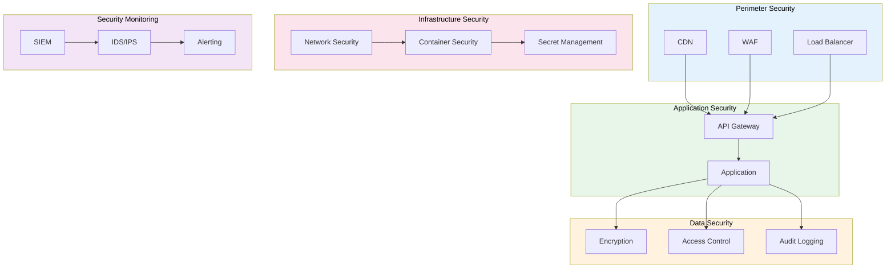

# Security Plan

> **Project:** [Project Name]
> **Version:** [X.Y] | **Status:** [Draft | Under Review | Approved]
> **Last Updated:** [YYYY-MM-DD]

---

## 1. Purpose

> Defines the overall security approach for the system — policies, controls, responsibilities, and monitoring.

## 2. Security Approach

| Aspect | Approach |
|--------|---------|
| [Security Framework] | [ISO/IEC 27001:2022] |
| [Security Lifecycle] | [Secure by design, secure in operation] |
| [Security Testing] | [SAST, SCA, DAST, Pen Test] |
| [Security Monitoring] | [SIEM, IDS/IPS, 24/7 alerting] |
| [Incident Response] | [[Incident-Response-Plan]] |

## 3. Security Architecture

## 4. Security Controls

| Domain | Control | Implementation | Status |
|--------|---------|---------------|--------|
| [Access Control] | [MFA + RBAC] | [Auth service] | ✅ |
| [Data Protection] | [Encryption at rest + transit] | [KMS + TLS 1.3] | ✅ |
| [Application Security] | [SAST + SCA + DAST] | [CI/CD pipeline] | ✅ |
| [Network Security] | [WAF + rate limiting + segmentation] | [Cloud WAF + API GW] | ✅ |
| [Monitoring] | [SIEM + IDS + alerting] | [ELK + Falco] | ✅ |
| [Incident Response] | [IR plan + team] | [[Incident-Response-Plan]] | ✅ |
| [Business Continuity] | [BCP + DR] | [[Business-Continuity-Plan-BCP]] | ✅ |

## 5. Security Responsibilities

| Role | Responsibilities |
|------|-----------------|
| [CISO] | [Security strategy, policy approval] |
| [Security Officer] | [Security implementation, monitoring] |
| [Tech Lead] | [Secure architecture, code review] |
| [DevOps] | [Infrastructure security, CI/CD] |
| [Developers] | [Secure coding, vulnerability remediation] |

## 6. Security Metrics

| Metric | Definition | Target | Current |
|--------|-----------|--------|---------|
| [Critical vulns open] | [Count] | [0] | [X] |
| [MTTR for critical] | [Hours] | [< 48h] | [X] |
| [SAST pass rate] | [%] | [100%] | [X%] |
| [MFA adoption] | [%] | [100%] | [X%] |
| [Compliance score] | [%] | [100%] | [X%] |

## 7. Security Review

| Review | Frequency | Scope | Owner |
|--------|----------|-------|-------|
| [Security architecture review] | [Per release] | [Architecture] | [Security Officer] |
| [Penetration test] | [Annually] | [Full system] | [External vendor] |
| [Security audit] | [Annually] | [Controls] | [Internal audit] |
| [Compliance assessment] | [Annually] | [ISO 27001] | [Security Officer] |

---

## Related Documents

| Document | Relationship |
|----------|-------------|
| [[Security-Policy]] | Security policies |
| [[ISMS-Documentation]] | ISMS framework |
| [[Security-Architecture]] | Security architecture details |

---

> **Template Standard:** Based on SEBoK v2, ISO/IEC 27001:2022
> **Usage:** The security plan is the *security contract*. It defines how we protect the system. Review annually. Update after incidents.
