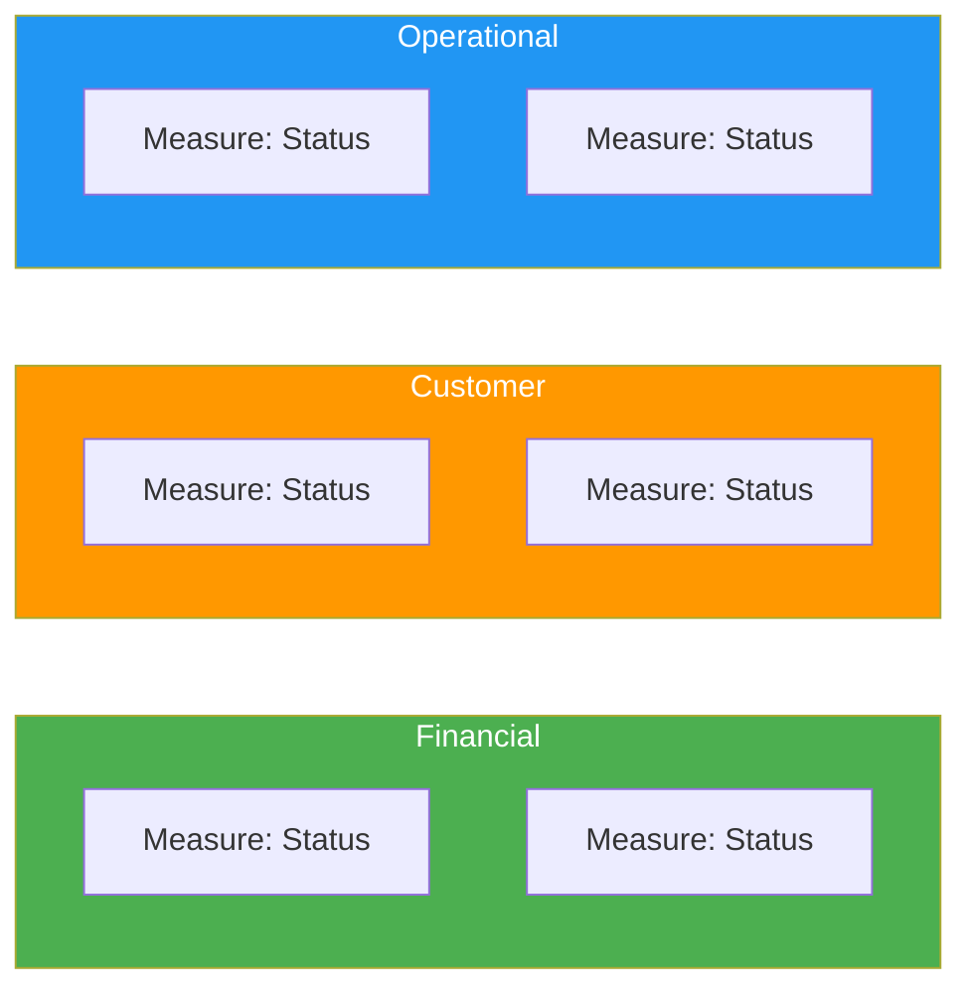

# Solution Performance Analysis

> **Project:** [Project Name]
> **Version:** [X.Y] | **Status:** [Active]
> **Last Updated:** [YYYY-MM-DD]

---

## 1. Purpose

> Analyzes solution performance data — trends, gaps, root causes, and recommendations for improvement.

## 2. Performance Summary

| Category | Measures | Meeting Target | Below Target | Above Target |
|---------|---------|---------------|-------------|-------------|
| [Financial] | [N] | [N] | [N] | [N] |
| [Customer] | [N] | [N] | [N] | [N] |
| [Operational] | [N] | [N] | [N] | [N] |
| **Total** | **[N]** | **[N]** | **[N]** | **[N]** |

## 3. Performance Trends

| Measure | Month 1 | Month 2 | Month 3 | Month 4 | Trend |
|---------|---------|---------|---------|---------|-------|
| [Measure] | [value] | [value] | [value] | [value] | [↑ Improving / ↓ Declining / → Stable] |

## 4. Gap Analysis

| Measure | Target | Actual | Gap | Root Cause | Recommendation |
|---------|--------|--------|-----|-----------|---------------|
| [Measure] | [target] | [actual] | [gap] | [Root cause] | [Recommendation] |

## 5. Variance Analysis

| Measure | Expected | Actual | Variance | Explanation |
|---------|---------|--------|---------|-----------|
| [Measure] | [expected] | [actual] | [variance] | [Explanation] |

## 6. Recommendations

| # | Finding | Recommendation | Priority | Owner |
|---|--------|---------------|---------|-------|
| 1 | [Finding] | [Recommendation] | [🔴 / 🟡 / 🟢] | [Role/Team] |

## 7. Performance Scorecard

---

## Related Documents

| Document | Relationship |
|----------|-------------|
| [[Solution-Performance-Measures]] | Measures being analyzed |
| [[Solution-Limitation]] | Limitations identified |
| [[Recommended-Actions]] | Actions to improve |

---

> **Template Standard:** Based on BABOK v3
> **Usage:** Analysis turns data into insight. Don't just report numbers — explain *why* and recommend *what to do*.