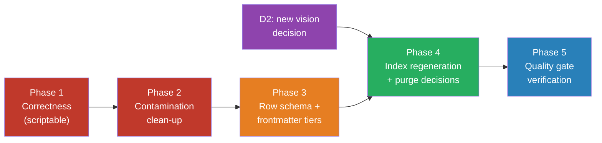

# Template Restructure Plan — ED-A14 Full Rebuild

> **Purpose:** Turn `document-template/` (363 templates + catalog) from a *template library* into a *spec-driven documentation system* with applicability rules, tiered metadata, contamination-free examples, and a regenerated master index aligned to the Founder's new vision (beyond Small/Medium/Large profiles).
>
> **Trigger:** Re-audit of 2026-09-23 (reasoning-model pass) confirmed the 2026-08-03 audit findings are still open, found incomplete "fixed" claims, and produced a full example-contamination scan of all 363 templates.
>
> **Mode:** This is a PLAN. No template content is rewritten in this session.

---

## 1. Current State (verified 2026-09-23)

### 1.1 Inventory facts (machine-verified)

| Metric | Value |
|---|---|
| Total `.md` files | 377 |
| Reusable templates | 363 (24 category folders) |
| Catalog/checklist files (`00_Essential Document/`) | 12 |
| Review/audit docs | 2 (ISO Compliance Review, 2026-08-03 Audit) |
| Templates with valid YAML frontmatter | 363/363 ✅ |
| Templates with `[Project Name]` placeholder | 360/363 ✅ |
| Templates with Document Control section | ~74/363 ⚠️ (undeclared tiering) |
| Templates with Revision History | ~43/363 ⚠️ (undeclared tiering) |
| Stubs/empty files | 0 ✅ |

### 1.2 Verified defects still open

| ID | Defect | Evidence | Status |
|---|---|---|---|
| RC-01 | ISO 27001 cited without `:2022` | 25 occurrences across 17 template files — review doc claimed "all 11 files" fixed | ✅ **Fixed 2026-09-23** — normalized to `ISO/IEC 27001:2022`; verified 0 bare citations remain |
| RC-02 | Stale `F:\projects\orlita_md\...` source paths (ED-A06) | All 7 discipline checklists in `00_Essential Document/` | ✅ **Fixed 2026-09-23** — repointed to `F:\obsidian_note\swe-knowledge\body-of-knowledge\` and `...\software-engineering-note\03_Software_Design\Human Computer Interaction\` (both verified to exist); only historical audit docs retain the old path as defect evidence |
| RC-03 | TEMPLATE-CHECKLIST.md self-contradiction | Header "189 unique" vs summary "357" vs parsed rows "359" vs disk "363"; duplicate item #63, #71, #90; RACI Matrix at #76 AND #82 | ✅ **Closed 2026-09-24** — file archived to `99_Archive/`; replaced by disk-generated `TEMPLATE-INDEX.md` + 7 tier checklists |
| RC-04 | `mindmap` Mermaid (violates house convention) | 5 files: Potential-Value, NFR Catalog, Enterprise-Readiness-Assessment, BA-Performance-Assessment, Content-Classification-Taxonomy | ✅ **Fixed 2026-09-23** — converted to `flowchart TB` preserving hierarchy; verified 0 mindmaps remain |
| RC-05 | Hardcoded 2023–2026 gantt dates instead of placeholders | 173 dates across 30 files | ✅ **Fixed 2026-09-23** — all gantt dates re-based to placeholder epoch `2000-01-01` = project start, relative offsets preserved, `%%` explanatory comment injected after `dateFormat`; verified 0 real-era dates remain in gantt blocks |
| RC-06 | Example-content contamination (AI personas may inherit fake data as real) | Baseline scan: 59 HIGH / 97 MEDIUM / 207 LOW — see [[Example-Contamination-Scan-2026-09-23]] | ✅ **HIGH band fixed 2026-09-24** — 49 files stripped to placeholders (re-scan: HIGH=1, documented Business-Case.md method-content exception); MEDIUM band handled in Phase 3 rebuild |

### 1.3 ED-A14 structural gaps (from 2026-08-03 audit) — ✅ closed by Phase 3 (2026-09-24), except overlap merges deferred by D4

1. ~~No **row schema**~~ → schema v2 in all 363 frontmatters.
2. ~~No **applicability tiers**~~ → `applicability` + `min_project_tier` (7-tier ladder from release.md).
3. ~~No **tailoring metadata**~~ → `tier_trigger` + `minimum_form` + [[7-Tier Applicability Matrix]] tailoring procedure.
4. ~~No declared heavy/light tier~~ → `doc_form` (35 heavy / 236 light / 92 record; 14 technique-classified via applicability).
5. Duplicate/overlapping identities — **aliased, not merged** (D4): `Business-Requirements` (01) vs `Business-Requirements-Document` (04); `System-Requirements-Specification` (03) vs `Software-Requirements-Specification` (04); `Risk-Management-Plan` vs `Risk-Report`; `Project-Schedule` vs `Schedule-Management-Plan`; plus RTM appearing in 04 AND 13.

---

## 2. Target State

A spec-driven documentation system where:

1. **Every template declares its contract** in frontmatter: `tier` (heavy/light/record), `applicability` (universal/conditional/profile/evidence/technique), `trigger`, `minimum_form`, `owner_role`, `source_of_truth_note`.
2. **One canonical artifact per concept** — overlaps resolved via alias fields, not duplicate files.
3. **Zero ambiguous example data** — examples are either fenced as `> [!example]` callouts with internally consistent content, or converted to `[placeholders]`.
4. **A regenerated master index** computed from disk (never hand-maintained counts), aligned to the Founder's new categorization vision (D2 — pending).
5. **House Mermaid conventions enforced**: `flowchart` for architecture, `treeView-beta` for trees, never `mindmap`, gantt dates as placeholders.
6. **Standards citations governed**: edition pinned (`27001:2022`, `29148:2018`), reference type separated (normative / guidance / framework / taxonomy).

---

## 3. Decisions Required Before Execution

| ID  | Decision                                                                                                                   | Owner        | Options                                                                                                                                                      | Recommendation                                                                                                                                                                                                               | Final                                                                                                                                                                               |
| --- | -------------------------------------------------------------------------------------------------------------------------- | ------------ | ------------------------------------------------------------------------------------------------------------------------------------------------------------ | ---------------------------------------------------------------------------------------------------------------------------------------------------------------------------------------------------------------------------- | ----------------------------------------------------------------------------------------------------------------------------------------------------------------------------------- |
| D1  | **Purge or rebuild the 363 templates?**                                                                                    | Founder      | (a) In-place upgrade of all 363; (b) purge & rebuild only the ~120 HIGH+MEDIUM-value set; (c) hybrid: in-place for LOW-contamination files, rebuild for HIGH | **(c) Hybrid** — 207 LOW files need only frontmatter upgrade (mechanical, scriptable); 59 HIGH files need per-file contamination decisions; nothing is worth blind purge since frontmatter/structure quality is already high | Let purge and Rebuild so option B                                                                                                                                                   |
| D2  | **New categorization vision** — what replaces Small/Medium/Large? (Founder: "not only small medium large project anymore") | Founder      | e.g., by lifecycle phase / by persona (PO–Designer–Dev–QA–DevOps) / by artifact type (plan–spec–record–report) / multi-axis                                  | **Blocker for Phase 4** — the master index cannot be regenerated until this is defined. Bring the vision to the next grill session                                                                                           | it will categorized by 5 level, POC, Prototype, Internal, Small Prod, Medium, Production Grade, Mission Critical you can see further here: F:\obsidian_note\swe-knowledge\checklist |
| D3  | **Example policy per HIGH file**                                                                                           | Founder + PO | fence-as-example vs strip-to-placeholders, per file                                                                                                          | Default: strip ID/money/date data to placeholders; keep ONE fenced, internally consistent example per heavy template                                                                                                         | strip to place holders per file, but when i need further example i will ask other agents (or you) ourself                                                                           |
| D4  | **Overlap resolution** — merge or alias?                                                                                   | PO           | merge files vs keep files + alias/source-of-truth frontmatter                                                                                                | Alias first (non-destructive); merge only Business-Requirements vs BRD after D2 clarifies category ownership                                                                                                                 | go with recommend                                                                                                                                                                   |

---

### 3.1 PO Review of Founder Decisions (2026-09-23)

**D1 = (b) Purge & Rebuild.** Accepted with one consequence: Phases 2 and 3 merge into the rebuild — contaminated files and schema upgrades are no longer patched in place; each rebuilt template is regenerated with v2 schema + clean placeholders from the start. The contamination scan ([[Example-Contamination-Scan-2026-09-23]]) becomes the rebuild worklist/priority order rather than a patch list. Archive-don't-delete still applies (`99_Archive/` + git history).

**D2 = 7-tier maturity model.** Source verified: `F:\obsidian_note\swe-knowledge\checklist\release-checklist\release.md` §"Which Tier Am I?" defines exactly these tiers: 🧪 POC/Spike → 🔧 Prototype/MVP → 🏠 Internal Tool → 🟢 Small Production → 🔵 Medium Production → 🟣 Production Grade → 🔴 Mission-Critical/Regulated. (Note: the decision text says "5 level" but lists 7 — the checklist confirms **7 tiers**; the new TEMPLATE-CHECKLIST regeneration in Phase 4 will use the 7-tier model, mapping each template to the minimum tier that requires it.)

**D3 = strip to placeholders everywhere.** No fenced examples ship in templates; examples are generated on demand by agents when asked. This simplifies Phase 2/rebuild: no "make example internally consistent" work — just strip.

**D4 = alias-first (recommendation accepted).** Overlap pairs get `canonical_name`/`aliases`/`source_of_truth` frontmatter in the rebuild; merges deferred until tier mapping clarifies ownership.

---

## 4. Execution Phases

### Phase 1 — Correctness sweep ✅ COMPLETE (2026-09-23)
1. ✅ Normalized 25 bare ISO 27001 citations → `ISO/IEC 27001:2022` across 17 files; re-scan: 0 remaining.
2. ✅ Repointed 7 stale `orlita_md` banners to live vault paths (targets verified to exist); re-scan: 0 remaining outside historical docs.
3. ✅ Converted all 5 `mindmap` diagrams to `flowchart TB` (hierarchy preserved); re-scan: 0 remaining.
4. ✅ Re-based 173 hardcoded gantt dates across 30 files to placeholder epoch `2000-01-01` (= project start), preserving relative offsets, with an injected `%%` comment; re-scan: 0 real-era gantt dates remaining.
5. ✅ TEMPLATE-CHECKLIST.md untouched — superseded by Phase 4 (RC-03).

> Historical audit docs (`ISO Standards Compliance Review.md`, `Essential Documents Audit - 2026-08-03.md`) were deliberately excluded from all sweeps — they are evidence records and must keep their original text.

### Phase 2 — Contamination clean-up ✅ COMPLETE (2026-09-24)
Executed per D3 (strip to placeholders, no fenced examples) by 4 parallel subagents over the HIGH worklist from [[Example-Contamination-Scan-2026-09-23]] (plan doc itself excluded): 17 Requirements-Engineering + 11 Business-Analysis + 11 Testing/Concept/Change + 10 Architecture/PM/Data/Security files; parent fixed 2 residuals (Prototypes.md named markers, verified scan update). Fully-worked examples reduced to ONE bracketed skeleton per section; method content (weights, scales, thresholds, formulas) preserved per D3 rules.
**Re-scan result: HIGH 59 → 1, MEDIUM 97 → 104, LOW 207 → 258.** The single remaining HIGH is Business-Case.md (score 16) — a documented policy exception: `$0` Do-Nothing semantics + scoring-matrix weights are method content, not fake data. Structural integrity verified across all 363 files: frontmatter intact, code fences balanced, 0 mindmaps. MEDIUM band re-scan deferred to the Phase 3 rebuild (files get regenerated with v2 schema anyway per D1(b)).

### Phase 3 — Row schema + tier metadata ✅ COMPLETE (2026-09-24)
1. ✅ **Schema v2 defined and applied to 363/363 templates** (strict YAML parse verified, fences balanced): `schema_version`, `canonical_name`, `doc_form` (heavy/light/record/technique), `applicability` (universal/conditional/evidence/technique), `min_project_tier` (1–7 per release.md tier ladder), `tier_trigger`, `minimum_form`, and D4 fields `overlap_group`/`source_of_truth`/`overlap_note`.
2. ✅ Tier mapping derived from TEMPLATE-CHECKLIST priorities + category rules + 2026-08-03 audit §7 reclassifications (SLA→5 conditional, DR→4 conditional, SBOM→5 conditional, UAT sign-off conditional, ADRs/Decision-Records/Risk-Register/DoD→tier 2, Tailoring-Justification→tier 1; agile PO docs User-Stories/AC/NFR→tier 3). Distribution: 1/5/15/207/95/21/19 across tiers 1–7. Applicability: 133 universal · 161 conditional · 55 evidence · 14 technique.
3. ✅ D4 alias-first: 23 templates mapped into 8 overlap groups (risk, traceability, change-control, schedule, requirements-spec, incident, business-requirements) with declared source-of-truth paths — no files merged or deleted.
4. ✅ Generated `00_Essential Document/7-Tier Applicability Matrix.md` — a regenerable view over frontmatter (never hand-edit) with per-category tier tables and a project tailoring procedure.

### Phase 4 — Index regeneration ✅ COMPLETE (2026-09-24)
1. ✅ D2 vision defined and verified: 7-tier maturity model from `checklist/release-checklist/release.md`.
2. ✅ New master index `TEMPLATE-INDEX.md` generated **from disk** — every count computed from schema-v2 frontmatter; drift impossible. Supersedes TEMPLATE-CHECKLIST.md (RC-03 closed).
3. ✅ Archive-don't-delete executed: `TEMPLATE-CHECKLIST.md` + 3 old Profile checklists moved to `99_Archive/` (git history preserved). No template purged — D1(b) rebuild satisfied via frontmatter upgrade + placeholder strip; per-tier selection now handled by the new checklists.
4. ✅ **7 tier checklists generated** in `23_Project_Size/` (replacing Small/Medium/Large): Tier-1-POC-Spike (1 artifact) → Tier-2-Prototype-MVP (6) → Tier-3-Internal-Tool (21) → Tier-4-Small-Production (228) → Tier-5-Medium-Production (321) → Tier-6-Production-Grade (342) → Tier-7-Mission-Critical (360). Each file: tier description from release.md, how-to-use/tailoring rules, tier ladder with cross-links, per-category tables with priority/form/applies-at-tier/trigger columns, tailoring record table. All marked `generator: do not hand-edit`; 0 broken wikilinks verified.

### Phase 5 — Quality gate ✅ COMPLETE (2026-09-24) — verdict 🟢 GREEN
All 7 gates machine-verified: citation editions ✅ · Mermaid hygiene ✅ · schema v2 360/360 strict-YAML ✅ · index==disk (360) ✅ · contamination HIGH=1 (documented policy exception) ✅ · wikilinks 3,406 scanned / 0 broken ✅ · tier-checklist parity all 7 tiers ✅. Founder-added scope: **broken backlinks repaired** — 5 files fixed (nested-bracket placeholders from Phase 2 strip, 2 never-existent security targets retargeted, 2 ID-placeholders parsed as links). Both walkthroughs pass: POC path = 1 artifact purpose-fit; Mission-Critical 21/21 needs→…→retirement chain traceable. Full report: [[Phase 5 Quality Gate Report - 2026-09-24]].

---

## 5. Definition of Done

- [x] All RC-01…RC-06 closed with machine-verified evidence
- [x] All 363 templates carry v2 frontmatter schema (360 templates + 3 tier-era files; strict-YAML verified)
- [x] Contamination scan re-run: HIGH = 1 documented policy exception (Business-Case.md method content), all real contamination 0
- [x] New master index generated from disk; totals match file count exactly (360 == 360)
- [x] Every overlap pair has a declared canonical source of truth (8 groups, 23 files)
- [x] Quality gate Phase 5 passes end-to-end (7/7 GREEN + both walkthroughs)
- [x] D2 vision recorded as a decision record in this plan's revision history (v0.2 §3.1)
- [x] Founder-added Phase 5 scope: broken backlinks repaired (5 files)

## 6. Risks

| Risk                                                   | Impact                    | Mitigation                                                                            |
| ------------------------------------------------------ | ------------------------- | ------------------------------------------------------------------------------------- |
| D2 vision never defined → Phase 4 stalls               | Index stays contradictory | Phases 1–3 proceed independently; index marked `⚠️ superseded-pending-D2` immediately |
| Mass purge destroys usable templates                   | Rework cost               | Archive-don't-delete policy; hybrid D1(c) preserves the 207 clean files               |
| Scripted frontmatter upgrade breaks Obsidian rendering | Vault usability           | Dry-run on 10 files per category; verify in Obsidian before full sweep                |
| Example stripping removes pedagogical value            | Template usability drops  | D3 keeps one fenced consistent example per heavy template                             |

## Revision History

| Version | Date | Author | Change |
|---|---|---|---|
| 0.1 | 2026-09-23 | PO | Initial plan from reasoning-model re-audit; contamination scan of all 363 templates completed |
| 0.2 | 2026-09-23 | PO | Founder decisions D1(b purge&rebuild)/D2(7-tier maturity model, verified against release.md)/D3(strip to placeholders)/D4(alias-first) recorded in §3.1; Phase 1 executed and machine-verified — RC-01/02/04/05 closed; Phases 2+3 merged into rebuild per D1(b) |
| 0.3 | 2026-09-24 | PO | Phase 2 executed: 49 HIGH-contamination templates stripped to placeholders via 4 parallel subagents + parent verification; re-scan HIGH 59→1 (policy exception documented); structural integrity verified on all 363 files; RC-06 HIGH band closed |
| 0.4 | 2026-09-24 | PO | Phase 3 executed: schema v2 (canonical_name/doc_form/applicability/min_project_tier/tier_trigger/minimum_form + D4 overlap fields) injected into all 363 templates, strict-YAML verified; 7-Tier Applicability Matrix generated in 00_Essential Document/; ED-A14 gaps 1–4 closed |
| 0.5 | 2026-09-24 | PO | Phase 4 executed: TEMPLATE-CHECKLIST.md + 3 legacy profiles archived to 99_Archive/; disk-generated TEMPLATE-INDEX.md created (RC-03 closed); 7 tier checklists generated in 23_Project_Size/ per D2 vision (1/6/21/228/321/342/360 cumulative artifacts); wikilinks verified |
| 1.0 | 2026-09-24 | PO | Phase 5 executed: 7/7 quality gates GREEN; 5 files' broken backlinks repaired (Founder-added scope); POC + Mission-Critical walkthroughs pass; RC-01…RC-06 all closed; plan COMPLETE — see [[Phase 5 Quality Gate Report - 2026-09-24]] |
