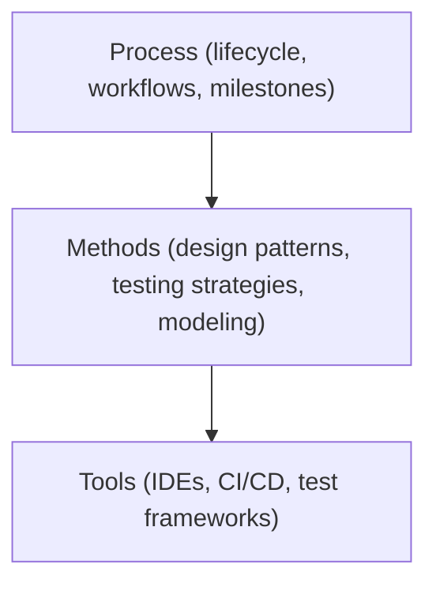
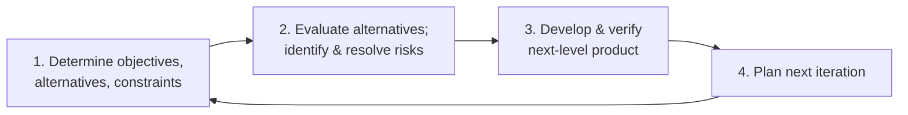
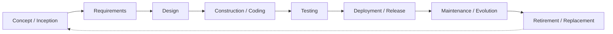

# Software Engineering Fundamentals and Process

> **Source:** *Software Engineering: A Practitioner's Approach* by Roger S. Pressman & Bruce R. Maxim — Ch 1 (Software Engineering) and Ch 2 (Modeling Process and Life Cycle)

---

## Why Software Engineering?

### The Software Problem

Software has become the backbone of virtually every engineered system — from embedded controllers to cloud-scale platforms. Yet the industry consistently faces:

- **Complexity** — Modern software systems contain millions of interacting components
- **Conformity** — Software must adapt to existing business rules, hardware, and legacy systems
- **Changeability** — Requirements shift throughout and after development
- **Invisibility** — Software cannot be visually inspected like physical artifacts

> Software engineering is the application of a **systematic, disciplined, quantifiable** approach to the development, operation, and maintenance of software — i.e., the application of engineering to software. *(IEEE 610.12)*

### What Is "Good" Software?

| Quality Attribute | Description |
|---|---|
| **Correctness** | Software performs exactly as specified |
| **Reliability** | Consistent performance under stated conditions over time |
| **Robustness** | Handles invalid inputs and unexpected conditions gracefully |
| **Performance** | Meets time and resource constraints |
| **Usability** | Easy to learn, efficient to use, satisfying for the user |
| **Maintainability** | Easy to correct, adapt, and enhance |
| **Reusability** | Components can be used in other systems |
| **Portability** | Runs across different platforms/environments |
| **Testability** | Supports efficient fault detection and diagnosis |
| **Security** | Protects data and resists unauthorized access |

> No single attribute dominates — engineering is about **balancing trade-offs** among these qualities for a given context.

---

## A Systems Engineering Perspective

### Systems Thinking

Software rarely exists in isolation. It is part of a larger **system** — hardware, people, processes, data, and other software. A systems approach means:

1. **Define the system boundary** — What is inside vs. outside the software scope?
2. **Identify stakeholders** — Users, operators, maintainers, business owners
3. **Understand system requirements** — Before software requirements, understand the *business need*
4. **Allocate requirements** — Decompose system requirements into hardware, software, data, and procedural components
5. **Interface design** — Define how components communicate across boundaries

### The Engineering Approach

Engineering applies science and mathematics to solve practical problems. Software engineering adopts:

- **Process** — A framework of activities, actions, and tasks
- **Methods** — Technical how-tos (analysis, design, coding, testing techniques)
- **Tools** — Automated or semi-automated support for methods and process

These three layers — process, methods, tools — form the **software engineering technology stack**.



---

## Software Process

### Process Framework

A generic process framework consists of five core activities:

| Activity | Purpose |
|---|---|
| **Communication** | Understand stakeholder goals, requirements, and constraints |
| **Planning** | Define work tasks, milestones, risks, resource allocation |
| **Modeling** | Create representations of requirements and design |
| **Construction** | Code generation and testing |
| **Deployment** | Deliver software to users, collect feedback |

Each activity may involve **umbrella activities** that span the entire lifecycle: project tracking, risk management, quality assurance, configuration management, technical reviews.

### Process Models

A **process model** is a structured set of activities required to develop a software system. Different models suit different project contexts.

---

#### Waterfall Model (Classic / Linear)

```
Requirements → Design → Implementation → Testing → Deployment → Maintenance
```

- **Approach:** Sequential phases; each phase completes before the next begins
- **Strengths:** Simple, well-documented, easy to manage for stable requirements
- **Weaknesses:** Inflexible to change; working software not available until late; high risk for complex/uncertain projects
- **Best fit:** Well-understood requirements, safety-critical regulated environments

---

#### Incremental Model

```
Increment 1: Core features → Deliver
Increment 2: Additional features → Deliver
Increment 3: More features → Deliver
...
```

- **Approach:** Develop software in multiple increments, each adding functionality
- **Strengths:** Early delivery of core capability; user feedback drives later increments; lower risk per increment
- **Weaknesses:** Requires clear core feature definition; architecture must support incremental growth
- **Best fit:** Projects where core needs are clear but full scope is uncertain

---

#### Evolutionary (Iterative) Models

##### Prototyping Model

1. **Quick design** → **Build prototype** → **Customer evaluates** → **Refine or finalize**

- Used when requirements are unclear or stakeholder needs are hard to articulate
- Throwaway prototyping vs. evolutionary prototyping

##### Spiral Model (Boehm)

Each spiral iteration passes through four quadrants:



- **Approach:** Risk-driven; combines iterative development with systematic risk analysis
- **Strengths:** Strong risk management; flexible; supports large-scale complex systems
- **Weaknesses:** Complex to manage; requires risk assessment expertise; expensive
- **Best fit:** Large, high-risk, high-cost projects with evolving requirements

---

#### Concurrent Development Model

- All activities exist **concurrently** but in different states
- Events trigger transitions between states (e.g., requirement change → re-enters design state)
- Useful for projects with ongoing maintenance alongside new feature development

---

#### Agile Models

Agile methods prioritize **individuals and interactions** over processes and tools, **working software** over comprehensive documentation, **customer collaboration** over contract negotiation, **responding to change** over following a plan. *(Agile Manifesto, 2001)*

##### Scrum

| Element | Description |
|---|---|
| **Product Backlog** | Prioritized list of features, defects, enhancements |
| **Sprint** | Time-boxed iteration (2–4 weeks) producing potentially shippable increment |
| **Sprint Planning** | Select items from backlog for the sprint |
| **Daily Scrum** | 15-min standup: what I did, what I'll do, blockers |
| **Sprint Review** | Demo increment to stakeholders |
| **Sprint Retrospective** | Team reflects and improves process |

**Roles:** Product Owner, Scrum Master, Development Team

##### Extreme Programming (XP)

| Practice | Description |
|---|---|
| **Pair Programming** | Two developers at one workstation |
| **TDD** | Write tests before code |
| **Continuous Integration** | Integrate and test multiple times per day |
| **Refactoring** | Continuously improve code structure without changing behavior |
| **Simple Design** | Implement only what is needed now |
| **Collective Ownership** | Any developer can change any code |
| **Planning Game** | Iterative release and iteration planning |
| **On-site Customer** | Real customer available full-time |

##### Kanban

- Visualize workflow on a **Kanban board**
- Limit **work in progress (WIP)** per stage
- Manage flow, make policies explicit, continuously improve

---

## Process Model Comparison

| Model | Flexibility | Risk Mgmt | Early Delivery | Documentation | Best For |
|---|---|---|---|---|---|
| Waterfall | Low | Low | No | Heavy | Stable, regulated projects |
| Incremental | Medium | Medium | Partial | Moderate | Core-clear, scope-growing |
| Spiral | High | High | No | Heavy | Large, high-risk |
| Agile/Scrum | Very High | Low–Med | Yes (each sprint) | Light | Evolving requirements |
| XP | Very High | Low–Med | Yes | Minimal | Small co-located teams |
| Kanban | Very High | Low | Continuous | Light | Maintenance, operations |

---

## Software Life Cycle

The **software life cycle** encompasses all activities from initial concept through retirement:



### Phases in Detail

| Phase | Key Activities | Key Artifacts |
|---|---|---|
| **Inception** | Business case, feasibility, stakeholder identification | Vision document, business case |
| **Requirements** | Elicitation, analysis, specification, validation | SRS (Software Requirements Specification) |
| **Design** | Architecture, component design, interface design, data design | Design documents, diagrams |
| **Construction** | Coding, unit testing, integration | Source code, unit tests |
| **Testing** | System testing, acceptance testing, defect tracking | Test plans, test reports, defect logs |
| **Deployment** | Installation, training, data migration, go-live | Release notes, user guides |
| **Maintenance** | Corrective, adaptive, perfective, preventive changes | Change requests, patches |

### Types of Maintenance

| Type | Description | Example |
|---|---|---|
| **Corrective** | Fix defects | Bug fix for crash on specific input |
| **Adaptive** | Adapt to environment change | Migrate to new OS or database |
| **Perfective** | Improve performance or features | Optimize query response time |
| **Preventive** | Improve maintainability | Refactor legacy code for readability |

> Maintenance typically consumes **60–80%** of total software cost over its lifetime.

---

## Key Takeaways

1. **Software engineering** applies systematic, disciplined, quantifiable methods to software development — not just coding
2. **Quality is multi-dimensional** — correctness, reliability, maintainability, security, and more must be balanced
3. **Systems thinking** ensures software fits the larger business and technical context
4. **Process models** range from rigid (waterfall) to adaptive (agile); the right choice depends on project risk, size, and requirement stability
5. **Agile methods** (Scrum, XP, Kanban) dominate modern practice for iterative, feedback-driven development
6. **The software life cycle** spans inception through retirement — maintenance is the longest and costliest phase
7. **Process + Methods + Tools** form the technology stack of software engineering

---

## Related

- [[Engineering Foundation Overview]] — All engineering foundation topics
- [[../software-engineering-note/10_Software_Engineering_Process/Software Methodology - Overview|Software Engineering Process]] — Detailed methodology notes
- [[../software-engineering-note/11_Software_Engineering_Models_and_Methods/Software Engineering Models and Methods Overview|Models and Methods]] — SWEBOK process models
- [[../software-engineering-note/01_Software_Requirements/Software Requirements Overview|Software Requirements]] — Requirements engineering
- [[01 Physics and Math/09_Math_Stats_and_Economics|09_Math_Stats_and_Economics]] — Economics foundations for cost estimation
