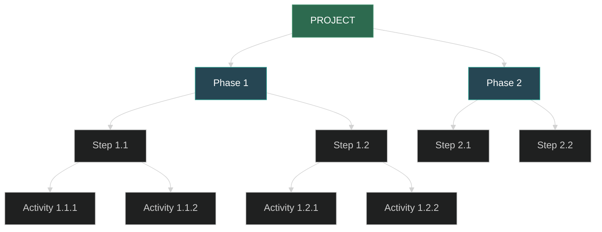

# Project Planning and Management

> *Source: Software Engineering: Theory & Practice, Chapter 3 — Planning and Managing the Project*

Project management is one of the core practices of software engineering. It covers progress tracking, personnel organization, effort estimation, risk management, and project planning. Good project management ensures products are delivered on time, within budget, and at high quality.

---

## 1. Tracking Progress

### Work Breakdown Structure (WBS)

The Work Breakdown Structure decomposes a project into a hierarchy of **Phase → Step → Activity**:



- **Activity** is a measurable event with clear completion criteria
- **Milestone** is a completion marker for activities — used by both customers and developers to track progress
- WBS does not show dependencies between work units or parallelizable tasks

### Activity Graphs

Activity graphs (also called network diagrams) describe dependencies between activities:

- **Nodes** = project milestones
- **Edges** = activities
- **Dashed edges** = dependencies with no actual work

Each activity has four parameters:

| Parameter | Meaning |
|---|---|
| **Precursor** | Event that must complete before activity starts |
| **Duration** | Time required to complete the activity |
| **Due Date** | Contractually specified completion date |
| **Endpoint** | Usually a milestone or deliverable |

### Critical Path Method (CPM)

The Critical Path Method analyzes all paths in the activity graph to determine the shortest project completion time:

- **Real Time:** Estimated time to complete the activity
- **Available Time:** Time allocated in the schedule for that activity
- **Slack / Float** = Available Time − Real Time

```
Slack = Latest Start Time − Earliest Start Time
```

- **Critical Path:** The path where all nodes have zero slack
- The critical path determines the shortest project completion time
- Activities on the critical path have **no margin for error**
- There may be multiple critical paths

### PERT (Program Evaluation and Review Technique)

PERT uses normal probability distributions to handle uncertainty:
- Estimate **optimistic, pessimistic, and most likely** times for each activity
- Expected value = (optimistic + 4 × most likely + pessimistic) / 6
- PERT calculates the probability that the earliest start time matches the planned time
- Best for stable projects with parallel activities; if the project is mostly sequential, almost all activities are on the critical path

### Tracking Tools

| Tool | Function |
|---|---|
| **Gantt Chart** | Displays activities in parallel, uses color/icons to show completion, critical path, float |
| **Resource Load Histogram** | Shows personnel allocation vs actual demand across phases |
| **Budget Tracking Chart** | Compares planned vs actual expenditure |
| **Earned Value** | Comprehensive measure of schedule and cost performance |

> [!warning] Resource Imbalance
> Resource load histograms often reveal uneven staffing: some periods are overloaded, others underloaded. Adjust resource allocation to balance the load.

---

## 2. Project Personnel

### Staff Roles and Characteristics

Key activities in every software project:
1. Requirements analysis
2. System design
3. Program design
4. Program implementation
5. Testing
6. Training
7. Maintenance
8. Quality assurance

> [!tip] Benefits of Separation of Duties
> Assigning different responsibilities to different people provides "checks and balances" that catch defects early in development. For example, an independent testing team has no preconceptions about how the system works internally, making it easier to find design or programming errors.

### Individual Differences

People in the same role may differ in:
- **Ability** — work capability
- **Interest** — job engagement
- **Application experience** — familiarity with the domain
- **Tool/language experience** — proficiency with specific technologies
- **Technique experience** — knowledge of methods and approaches
- **Training** — formal education and professional development
- **Communication ability** — expressing ideas clearly
- **Sharing responsibility** — collaboration skills
- **Management skills** — leadership and coordination

> Sackman, Erikson, and Grant (1968) found that the productivity ratio between the best and worst programmers averaged **10:1**, and there was no simple relationship between experience and performance.

### Communication Paths

$$\text{Communication paths} = \frac{n(n-1)}{2}$$

- 3 people → 3 communication paths
- 10 people → 45 communication paths
- $2^n - 1$ possible team combinations

### Work Styles

Work styles are defined along two dimensions:

| Dimension | Extremes |
|---|---|
| **Communication** | Extroverted (Tell) ←→ Introverted (Ask) |
| **Decision-making** | Rational (Facts) ←→ Intuitive (Feelings) |

Four work styles:

| Style | Characteristics |
|---|---|
| **Rational Extrovert** | Directly expresses ideas, logic-based decisions, efficiency-focused |
| **Rational Introvert** | Gathers complete information before deciding, accuracy-focused |
| **Intuitive Extrovert** | Intuition-based decisions, creative, likes sharing new ideas |
| **Intuitive Introvert** | Intuition-based but gathers information first, relationship-focused |

> [!example] Practical Impact of Work Styles
> If the project falls behind schedule: Kai (rational extrovert) will give you a new timeline; David (intuitive extrovert) will offer multiple catch-up options; Marcel (rational introvert) will ask why it fell behind; Ying (intuitive introvert) will ask how they can help.

### Project Organization

#### Chief Programmer Team

```
        Chief Programmer
       /        |        \
Assistant   Librarian   Administration
  Chief                  Test Team
   |
Senior Programmers
   |
Junior Programmers
```

- One person has full responsibility for system design and development
- **Reduces communication paths:** n-1 (instead of n(n-1)/2)
- Librarian maintains documentation, handles compilation/linking, preliminary testing
- Best for **high-certainty, repetitive, large-scale** projects

#### Egoless Programming

- Everyone shares equal responsibility
- Criticism targets the product/result, not the person
- Democratic decisions, all members vote
- Best for **high-uncertainty, new technology, small-scale** projects

| Highly Structured | Loosely Structured |
|---|---|
| High certainty | Uncertainty |
| Repetitive work | New technology |
| Large projects | Small projects |

> [!note] Structure vs Creativity
> Unstructured teams often produce creative but late results; structured teams produce mediocre but on-time products. Good project management finds a balance between the two.

---

## 3. Effort Estimation

### Cost Components

Project budgets include:
1. **Facilities costs:** Hardware, space, furniture, phone, AC, disk, etc.
2. **Personnel costs** (largest and most uncertain): staff-days of effort
3. **Tool costs:** CASE tools, design tools, testing tools, etc.

> [!info] McCue (1978) Standard
> Minimum programmer workspace: 100 sq ft dedicated area + 30 sq ft horizontal work surface + floor-to-ceiling sound insulation. Programmers protected from phone calls and interruptions are more productive.

### Estimation Accuracy Over Time

```
Uncertainty range
4x ─┐
    │  ╲
2x ─┤    ╲
    │      ╲
1.5x┤        ╲
    │          ╲
1.25x┤           ╲
    │             ╲
x  ─┤               ╲ ← Final accurate value
    └─────────────────────→
    Concept  Req  Detail Design  Accept Software
```

- Early project estimates may deviate by **4x** from actual
- As the project progresses, estimates become more accurate
- Achieving within 10% precision typically only happens near project completion

### Inaccurate Estimate Causes

Lederer and Prasad (1992) surveyed 115 organizations — key causes:
- Frequent user requirements changes
- Omitted tasks
- Users don't understand their own needs
- Insufficient analysis during estimation
- Lack of coordination
- Lack of estimation methods or guidelines

### Expert Judgment

#### Analogy
- Based on actual data from similar projects
- If system A is similar to system B, costs should be similar
- **Limitation:** Projects may seem similar but actually differ significantly

#### Three-Point Estimation
- Optimistic (z), pessimistic (x), most likely (y)
- Estimate = (x + 4y + z) / 6

#### Delphi Method
- Experts independently and secretly make predictions
- Calculate and publish the average
- Experts may choose to revise their estimates
- Repeat until no one revises

#### Wolverton Cost Matrix

| Software Type | Difficulty (OE/OE/OM/OH/NE/NM/NH) |
|---|---|
| Control | 21/27/30/33/40/49 |
| Input/Output | 17/24/27/28/35/43 |
| Algorithm | 15/20/22/25/30/35 |
| Data Management | 24/31/35/37/46/57 |
| Time Critical | 75/75/75/75/75/75 |

- Estimate LOC per module, look up cost per line in matrix, sum

### Algorithmic Methods

General formula:

$$E = (a + bS^c) \cdot m(\vec{X})$$

Where $S$ is system size, $a, b, c$ are constants, $\vec{X}$ is the cost factor vector, and $m$ is the adjustment multiplier.

#### Walston-Felix Model

$$E = 5.25 \cdot S^{0.91}$$

- Based on IBM 60 projects data
- System size: 4,000 ~ 467,000 LOC
- 29 productivity factors (+1/0/-1 weighted)

#### Bailey-Basili Meta-Model

$$E = 5.5 + 0.73 \cdot S^{1.16}$$

- Based on NASA Goddard 18 science projects
- Three adjustment dimensions:
  - **METH (Methodology):** Charts, top-level design, documentation, training (max 45 points)
  - **CPLX (Complexity):** Customer interface, application, process, database complexity (max 35 points)
  - **EXP (Experience):** Programmer qualifications, machine experience, language experience (max 25 points)

### COCOMO II

Boehm's Constructive Cost Model is one of the most important algorithmic models:

$$E = b \cdot S^c \cdot m(\vec{X})$$

#### Three Stages

| Stage | Name | Size Measure | Cost Factors |
|---|---|---|---|
| Stage 1 | Application Composition | Application Points | None |
| Stage 2 | Early Design | Function Points | Simplified set |
| Stage 3 | Post-Architecture | FP or SLOC | Full set |

#### Stage 1: Application Points

1. Count screens, reports, 3GL components
2. Classify by complexity (simple/medium/difficult)
3. Weighted sum = Application Points
4. New application points = AP × (100 − reuse%) / 100
5. Divide by productivity factor = person-months

| Complexity Weight | Simple | Medium | Difficult |
|---|---|---|---|
| Screen | 1 | 2 | 3 |
| Report | 2 | 5 | 8 |
| 3GL component | — | — | 10 |

| Developer Experience | CASE Maturity | Productivity Factor |
|---|---|---|
| Very low | Very low | 4 |
| Low | Low | 7 |
| Nominal | Nominal | 13 |
| High | High | 25 |
| Very high | Very high | 50 |

#### Stage 2 & 3: Scale Factors

The size exponent $c$ ranges from 0.91 to 1.23, depending on:
- **Precedentedness** — familiarity with the project type
- **Flexibility** — degree of requirements flexibility
- **Risk Resolution** — extent of risk identification and resolution
- **Team Cohesion** — how well the team works together
- **Process Maturity** — SEI CMM level

#### Cost Drivers

| Category | Example Factors |
|---|---|
| **Product** | Reliability, database size, documentation needs, reuse requirements, complexity |
| **Platform** | Execution time constraints, main memory constraints, VM volatility |
| **Personnel** | Analyst capability, application experience, programmer capability, language/tool experience |
| **Project** | Tool use, development schedule, multi-site development |

Each cost driver multiplier ranges from approximately 0.71 (very high) to 1.42 (very low).

### Machine Learning Methods

| Method | Characteristics |
|---|---|
| **Neural Networks** | Requires large historical training set; sensitive to topology, learning phase |
| **Regression Trees** | Uses statistical methods for classification and prediction |
| **CBR (Case-Based Reasoning)** | Four steps: identify → retrieve → reuse → revise; more interpretable than neural networks |

### Model Evaluation

| Metric | Meaning | Target |
|---|---|---|
| **PRED(0.25)** | Percentage of projects estimated within 25% of actual | > 75% |
| **MMRE** | Mean Magnitude of Relative Error | ≤ 0.25 (Fair), ≤ 0.10 (Good) |

> [!warning] Model Accuracy Status
> Most models have disappointing PRED and MMRE values. No single model is accurate for all types of development. Kitchenham et al. recommend using estimate/actual ratios directly to assess accuracy.

---

## 4. Risk Management

### What Is a Risk?

Three characteristics of risk (Rook 1993):

1. **Loss / Impact:** The negative effect on the project (time, quality, money, control, understanding loss)
2. **Probability:** Likelihood of the event occurring (0 = impossible, 1 = certain)
3. **Control:** Whether the outcome can be changed

$$\text{Risk Exposure} = \text{Risk Impact} \times \text{Risk Probability}$$

| Term | Definition |
|---|---|
| **Risk Impact** | Loss caused by the risk |
| **Risk Probability** | Likelihood of the risk occurring |
| **Risk Exposure** | Impact × Probability |
| **Problem** | Risk with probability 1 |

**Two sources of risk:**
- **Generic Risks:** Common to all software projects (misunderstanding requirements, losing key personnel, insufficient testing time)
- **Project-Specific Risks:** Threats unique to the project

### Boehm's Top 10 Risk Items

| # | Risk Item | Management Strategy |
|---|---|---|
| 1 | Personnel shortfalls | Top talent assignment; role matching; team building; cross-training |
| 2 | Unrealistic schedule and budget | Multi-source cost estimation; incremental development; requirements trimming |
| 3 | Developing wrong functions | Organizational analysis; user surveys; prototyping |
| 4 | Developing wrong user interface | Prototyping; scenarios; task analysis |
| 5 | Gold plating | Requirements trimming; cost-benefit analysis |
| 6 | Continuous requirements change | High change threshold; information hiding; incremental development |
| 7 | Inadequate external tasks | Reference checks; pre-award audits |
| 8 | Inadequate external components | Benchmarking; compatibility analysis |
| 9 | Real-time performance shortfall | Simulation; benchmarking; prototyping |
| 10 | Exceeding computer science capabilities | Technical analysis; prototyping; reference checks |

### Risk Management Activities

```
Risk Assessment
├── Risk Identification (checklist, decomposition, assumption analysis)
├── Risk Analysis (system dynamics, cost models, performance models)
└── Risk Prioritization (based on Risk Exposure)

Risk Management
├── Risk Reduction
│   ├── Avoid (change requirements)
│   ├── Transfer (allocate to other systems / buy insurance)
│   └── Assume (accept and control with project resources)
├── Risk Planning
│   └── Risk Management Plan
└── Risk Resolution
    └── Risk Mitigation + Monitoring + Reassessment
```

**Risk Reduction Leverage:**

$$\text{Risk Reduction Leverage} = \frac{\text{Exposure}_{before} - \text{Exposure}_{after}}{\text{Cost of Reduction}}$$

### Risk Exposure Example

Decision tree example: Should we perform regression testing?

| Choice | Risk Exposure |
|---|---|
| Perform regression testing | ~$1.875M |
| Skip regression testing | ~$16.875M |

Conclusion: Skipping regression testing has far higher risk exposure than performing it.

---

## 5. The Project Plan

The project plan contains 15 core components:

| # | Component | Description |
|---|---|---|
| 1 | **Project Scope** | System boundary — what's included, what's not |
| 2 | **Project Schedule** | WBS, deliverables, timeline, Gantt chart |
| 3 | **Team Organization** | Personnel assignment, org structure, resource allocation chart |
| 4 | **Technical Description** | Hardware, software, compilers, interfaces, special equipment |
| 5 | **Standards and Processes** | Algorithms, tools, review techniques, design language, coding language, testing techniques |
| 6 | **Quality Assurance Plan** | How reviews, inspections, testing assess quality |
| 7 | **Configuration Management Plan** | Tracking changes to requirements, design, code, test plans, documentation |
| 8 | **Documentation Plan** | Document list, who writes them, when, how they change |
| 9 | **Data Management Plan** | Data collection, storage, manipulation, archival |
| 10 | **Resource Management Plan** | Hardware configuration, disk allocation, backup strategy |
| 11 | **Test Plan** | Test data generation, module testing, integration testing, system testing, regression testing |
| 12 | **Training Plan** | Courses, support software, documentation, student prerequisites |
| 13 | **Security Plan** | Data protection, user protection, hardware protection (confidentiality, availability, integrity) |
| 14 | **Risk Management Plan** | Risk identification, analysis, prioritization, response strategies |
| 15 | **Maintenance Plan** | Code modification, hardware repair, documentation updates, training material updates |

---

## 6. Process Models and Project Management

### Case Study: Digital Alpha AXP

**Enrollment Management Model** — four principles:
1. Establish an appropriate large shared vision
2. Fully delegate and obtain specific commitments from participants
3. Actively check and provide supportive feedback
4. Acknowledge every progress and continue learning

Key practices:
- Single-page master plan (only key business components)
- Single-page design and schedule descriptions
- Regular operational reviews (progress, milestones, critical path events, open issues)
- **Engineers are more recognition-driven than money-driven**

> [!success] Result
> The Alpha project was completed precisely on schedule to the month, with very high quality.

### Case Study: F-16 Aircraft

**Accountability Model:**
- Continuous exchange of "accountings" (reports) and "consequences" between team and stakeholders
- Weekly one-hour team status review
- Each personal action item has clear closure criteria
- **Activity maps** show progress in the context of the overall project
- **Earned Value** as a universal measure to compare progress across different activities
- **Priority issue list** snapshots discussed at weekly reviews

### Anchoring Milestones (Boehm 1996)

Three universal milestones:

| Milestone | Purpose | Content |
|---|---|---|
| **Life-Cycle Objectives (LCO)** | Ensure stakeholders agree on system goals | System boundaries, operating environment, external system interactions, usage scenarios |
| **Life-Cycle Architecture (LCA)** | Define system and software architecture | Architecture choices must address risks in the risk management plan |
| **Initial Operational Capability (IOC)** | System ready | Software ready, site prepared, user team selected and trained |

### Win-Win Spiral Model

Extends the spiral model to encourage stakeholders to reach consensus on next-level goals, alternatives, and constraints:

1. Identify next-level stakeholders
2. Identify stakeholder win conditions
3. Reconcile win conditions
4. Evaluate product and process alternatives
5. Define next-level product and process
6. Verify product and process
7. Review and commit

> [!success] STARS Project Results
> - Cost reduced from $140/LOC to $57/LOC
> - Quality improved from 3 faults/KLOC to 0.035 faults/KLOC

---

## 7. Information Systems Example: COCOMO II Application

Using the Piccadilly television advertising sales system as an example:

**Stage 1 estimation process:**
1. Identify 3 screens + 1 report
2. Rate by complexity (simple/medium/difficult)
3. Look up weight table: NOPS = 9
4. Low developer experience + low CASE maturity → productivity factor = 7
5. Estimate effort = 9 / 7 ≈ **1.29 person-months**

**Stage 2 estimation process:**
1. Evaluate 5 scale factors
2. Calculate scale exponent c = 1.01 + 0.01 × (sum of ratings)
3. Use c to adjust initial estimate
4. Further adjust with cost drivers

---

## 8. Real-Time Example: Ariane-5 Failure

Ariane-5 rocket self-destructed 39 seconds after launch — root cause analysis:

- **Root cause:** Reused the SRI module from Ariane-4, which performed calculations unnecessary after launch in Ariane-5
- **Risk identification failure:** Functional decomposition might have revealed Ariane-4/5 requirement differences
- **Assumption analysis failure:** Did not check SRI assumptions in the new system
- **Risk prioritization:** The high risk exposure of SRI failure should have prompted more careful review

**Possible risk mitigations:**
- Use two SRIs with different designs (avoid common-cause failure)
- Shut down unnecessary SRI calculations before liftoff
- Reassess risks during design or unit testing phase

> [!danger] Lesson
> Even when risk identification fails during the risk assessment phase, continuous risk reassessment can catch problems mid-development. Redesign is expensive, but far less expensive than losing the entire Ariane-5.

---

## Key Concepts Summary

| Concept | Core Point |
|---|---|
| **WBS** | Project decomposition into phases → steps → activities |
| **CPM** | Identify critical path and slack time |
| **PERT** | Probabilistic activity time estimation |
| **Gantt Chart** | Visualize progress and parallelism |
| **Chief Programmer Team** | Hierarchical structure, reduced communication paths |
| **Egoless Programming** | Democratic structure, equal responsibility |
| **COCOMO II** | Three-stage cost estimation model |
| **Risk Exposure** | Impact × Probability |
| **Risk Leverage** | Risk reduction benefit / reduction cost |
| **LCO/LCA/IOC** | Three universal life cycle milestones |

## Related

- [[Engineering Foundation Overview]] — All engineering foundation topics
- [[02 SWE Process/10_SE_Fundamentals_and_Process|10_SE_Fundamentals_and_Process]] — Process models and life cycle
- [[02 SWE Process/12_Requirements_Engineering|12_Requirements_Engineering]] — Requirements that drive project planning
- [[02 SWE Process/18_Evaluation_and_Improvement|18_Evaluation_and_Improvement]] — Process improvement and metrics
