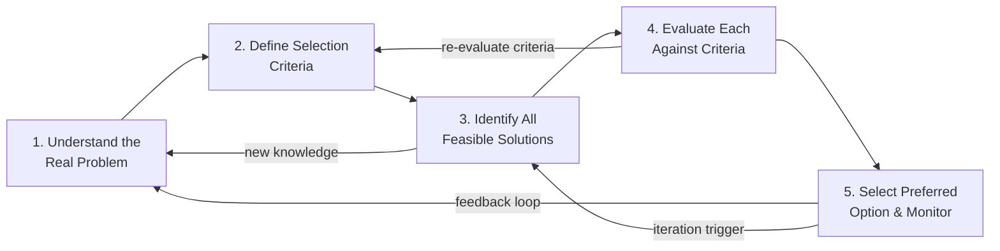
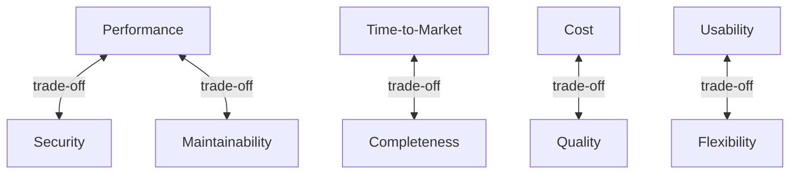
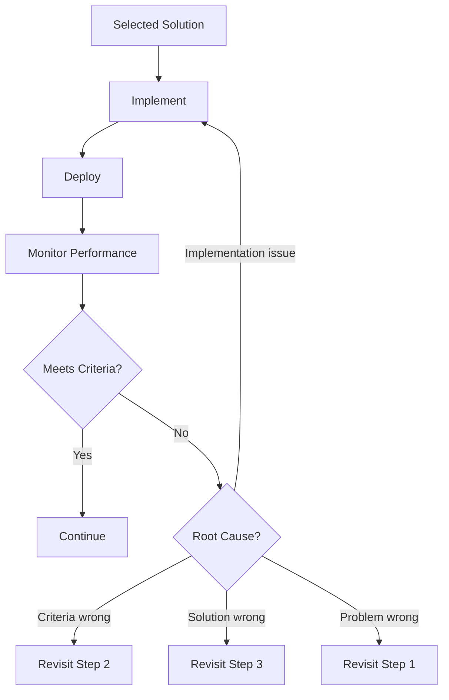

# The Engineering Process

> *Source: SWEBOK v4 Chapter 18, Knowledge Area 18.1*

## Purpose

Engineering, at its core, is not about building things: it is about solving real problems through disciplined decision-making. The engineering process provides a universal five-step framework that applies across every engineering discipline, from bridge-building to software development. Understanding this process separates engineers from technicians and hobbyists.

---

## Engineering vs Science

Before diving into the process, it is essential to distinguish engineering from science:

| Dimension | Science | Engineering |
|---|---|---|
| **Goal** | Understand the natural world | Solve real-world problems |
| **Method** | Hypothesis, experiment, theory | Define, evaluate, decide, build |
| **Output** | Knowledge, laws, models | Products, systems, solutions |
| **Constraint** | What is true | What is feasible, safe, affordable |
| **Success** | Reproducible explanation | Working solution meeting criteria |
| **Orientation** | Discovery | Design and delivery |

> Science asks "why?" and "how does it work?" Engineering asks "what should we build, and how should we build it?"

### The IEEE Definition of Software Engineering

> "The application of a systematic, disciplined, quantifiable approach to the development, operation, and maintenance of software; that is, the application of engineering to software." -- IEEE Standard 610.12-1990

This definition explicitly demands a process: **systematic** (not ad hoc), **disciplined** (following defined steps), and **quantifiable** (measurable and improvable). See [[10_SE_Fundamentals_and_Process]] for further discussion of software engineering as a discipline.

---

## The Five-Step Engineering Process

The engineering process common to all disciplines consists of five fundamental steps. These steps are not strictly linear: knowledge gained at any step may trigger revisiting earlier steps.

### Step 1: Understand the Real Problem

This is the most critical and most frequently skipped step. The fundamental principle is:

> **The problem is not the solution.** A stated requirement is often a solution in disguise. The engineer's job is to uncover the underlying problem.

**Problem Framing** involves:

1. **Identify the real need** -- What is the user actually trying to accomplish? A request for "a faster database" may really be a need for "sub-second response times for customers"
2. **Stakeholder analysis** -- Who is affected? Who has decision authority? Who has veto power? What are their competing interests?
3. **Context analysis** -- What environmental, organizational, and technical constraints exist?
4. **Problem statement** -- A clear, concise statement of the problem that does not presuppose a solution

**Stakeholder Analysis Table:**

| Stakeholder Type | Role | Concerns | Influence |
|---|---|---|---|
| **Primary users** | Direct operators of the system | Usability, reliability, performance | High (requirements) |
| **Secondary users** | Indirect beneficiaries | Value delivery, safety | Medium (acceptance) |
| **Sponsors** | Fund the project | Cost, schedule, ROI | High (go/no-go) |
| **Regulators** | Enforce compliance | Standards, safety, legal | High (constraints) |
| **Maintainers** | Support after delivery | Documentation, testability, simplicity | Medium (long-term cost) |
| **Competitors** | Market context | Differentiation, time-to-market | Low (external pressure) |

**Common Pitfalls in Problem Understanding:**

- **Jumping to solutions** -- "We need a microservices architecture" before understanding the actual scaling problem
- **Listening only to the loudest stakeholder** -- Ignoring silent users who will actually use the system
- **Confusing symptoms with root causes** -- See [[20_Root_Cause_Analysis]] for structured techniques
- **Scope creep** -- The problem boundary expands without deliberate decision

See [[12_Requirements_Engineering]] for detailed techniques on eliciting and validating requirements.

### Step 2: Define Selection Criteria

Before evaluating solutions, the engineer must define what "good" looks like. Selection criteria must be:

- **Quantifiable** where possible (measurable, testable)
- **Stakeholder-aligned** (derived from the problem analysis)
- **Weighted** (not all criteria are equally important)
- **Complete** (covering functional and non-functional aspects)

**Types of Selection Criteria:**

| Category | Examples | Measurement |
|---|---|---|
| **Functional requirements** | Features, capabilities, behaviors | Pass/fail against specifications |
| **Performance** | Throughput, latency, capacity | Benchmark metrics |
| **Quality attributes** | Reliability, security, usability, maintainability | See [[18_Evaluation_and_Improvement]] |
| **Constraints** | Budget, schedule, technology, regulations | Binary compliance |
| **Risk** | Technical risk, schedule risk, market risk | Probability x impact |
| **Sustainability** | Energy consumption, environmental impact, long-term cost | Total cost of ownership |

**Quality Attribute Trade-offs:**

Quality attributes frequently conflict. The engineer must make explicit trade-offs:

See [[14_Design_Principles_and_Patterns]] for how design patterns manage quality attribute trade-offs.

### Step 3: Identify All Feasible Solutions

This step demands creativity and breadth. The engineer must resist the temptation to fixate on the first plausible idea.

**Techniques for Solution Generation:**

| Technique | Description | Best For |
|---|---|---|
| **Brainstorming** | Generate ideas without judgment, then filter | Early exploration, team sessions |
| **TRIZ** | Systematic innovation based on 40 inventive principles | Technical contradictions |
| **Design space exploration** | Map the parameter space of possible designs | Parametric optimization |
| **Technology survey** | Survey existing tools, frameworks, and platforms | Build vs buy decisions |
| **Analogical reasoning** | Borrow solutions from other domains | Novel problems |
| **Morphological analysis** | Decompose the problem into dimensions, combine options | Complex multi-dimensional problems |

**TRIZ (Theory of Inventive Problem Solving):**

TRIZ, developed by Genrich Altshuller, provides 40 inventive principles for resolving technical contradictions. For software engineering, relevant principles include:

- **Segmentation** -- Decompose a monolith into microservices
- **Asymmetry** -- Use different algorithms for different data distributions
- **Dynamicity** -- Auto-scaling, feature flags, runtime configuration
- **Prior action** -- Pre-computation, caching, lazy loading
- **Equipotentiality** -- Move computation to where the data lives

**Morphological Analysis Example (for a web application):**

| Dimension | Option A | Option B | Option C | Option D |
|---|---|---|---|---|
| **Architecture** | Monolith | Microservices | Serverless | Event-driven |
| **Database** | SQL | NoSQL | Graph | NewSQL |
| **Frontend** | SPA | SSR | Hybrid | Mobile-first |
| **Hosting** | On-premise | IaaS | PaaS | Container |
| **Auth** | OAuth2 | SAML | Custom | Passkeys |

This produces 4 x 4 x 4 x 4 x 4 = 1,024 combinations. Not all are feasible; the next steps narrow the field.

### Step 4: Evaluate Each Against Criteria

With solutions identified and criteria defined, the engineer systematically evaluates each option.

**Decision Matrix (Weighted Scoring):**

| Solution | Weight | Criteria A (0.3) | Criteria B (0.25) | Criteria C (0.25) | Criteria D (0.2) | Weighted Score |
|---|---|---|---|---|---|---|
| Option 1 | 30/25/25/20 | 8 | 7 | 6 | 9 | 7.45 |
| Option 2 | 30/25/25/20 | 9 | 5 | 8 | 6 | 7.15 |
| Option 3 | 30/25/25/20 | 6 | 9 | 7 | 7 | 7.15 |

**Pugh Matrix (Concept Selection):**

The Pugh Matrix uses a baseline concept as reference and evaluates alternatives as better (+), same (S), or worse (-) on each criterion:

| Criterion | Baseline (Concept A) | Concept B | Concept C |
|---|---|---|---|
| Performance | Datum | + | - |
| Cost | Datum | - | + |
| Maintainability | Datum | S | + |
| Time-to-market | Datum | + | - |
| **Total +** | -- | 2 | 2 |
| **Total -** | -- | 1 | 1 |
| **Net Score** | -- | +1 | +1 |

**Cost-Benefit Analysis:**

| Factor | Option A | Option B | Option C |
|---|---|---|---|
| **Development cost** | $500K | $800K | $350K |
| **Annual operating cost** | $100K | $60K | $150K |
| **5-year TCO** | $1M | $1.1M | $1.1M |
| **Expected revenue gain** | $2M | $3M | $1.5M |
| **NPV (5-year)** | $1M | $1.9M | $0.4M |
| **ROI** | 100% | 173% | 36% |

**Simulation and Prototyping:**

For complex systems, evaluation may require simulation or prototyping rather than paper analysis. See [[29_Modeling_Simulation_and_Prototyping]] for techniques.

### Step 5: Select the Preferred Option and Monitor

The final step is not merely choosing the winner: it is committing to the decision and establishing feedback mechanisms.

**Post-Selection Activities:**

1. **Document the decision** -- Record what was chosen, why, and what alternatives were rejected. This is the basis of the "decision rationale" or "architecture decision record" (ADR)
2. **Plan for monitoring** -- Define metrics that will tell you if the decision is working
3. **Set iteration triggers** -- Define conditions under which the decision should be revisited (e.g., "if latency exceeds 200ms, reconsider the database choice")
4. **Communicate** -- Ensure all stakeholders understand and accept the decision

**Feedback Loops:**

---

## The Iterative Nature of the Process

A critical insight: the five steps are **not** a waterfall. They are iterative and recursive.

**Iteration Triggers:**

| Trigger | Return To | Example |
|---|---|---|
| New stakeholder requirement | Step 1 | Legal requires GDPR compliance |
| Criteria conflict discovered | Step 2 | Performance and security are mutually exclusive at budget |
| No feasible solution exists | Step 3 | Technology does not support the needed throughput |
| All solutions score poorly | Step 4 | Cost-benefit analysis shows negative ROI for all options |
| Post-deployment failure | Step 1 | Users do not behave as predicted |

This iterative nature is what distinguishes engineering from cookbook problem-solving. See [[17_Delivery_and_Maintenance]] for how this iteration manifests in the software delivery lifecycle.

---

## Engineering Process vs Software Engineering Process

The generic engineering process maps directly to software engineering activities:

| Generic Step | Software Engineering Activity | SWEBOK KA |
|---|---|---|
| Understand the problem | Requirements elicitation and analysis | [[12_Requirements_Engineering]] |
| Define criteria | Quality attribute specification | [[18_Evaluation_and_Improvement]] |
| Identify solutions | Architecture and design | [[13_Software_Architecture]], [[14_Design_Principles_and_Patterns]] |
| Evaluate solutions | Design review, prototyping, simulation | [[16_Testing_Strategies]] |
| Select and monitor | Implementation, deployment, operations | [[17_Delivery_and_Maintenance]] |

**Software-Specific Challenges:**

Unlike physical engineering, software engineering faces unique challenges in each step:

- **Step 1 (Problem)**: Requirements are notoriously difficult to elicit and validate; software problems are often "wicked problems" (see [[27_Engineering_Design]])
- **Step 2 (Criteria)**: Quality attributes are often qualitative and subjective
- **Step 3 (Solutions)**: The design space is essentially infinite; software is not constrained by physical laws
- **Step 4 (Evaluation)**: No physical prototypes; evaluation requires simulation, analysis, or testing
- **Step 5 (Selection)**: Software decisions are easily reversible (in theory), leading to decision paralysis

---

## Process Models and the Five Steps

Different process models implement the five steps differently:

| Process Model | How Steps Are Organized | Iteration Style |
|---|---|---|
| **Waterfall** | Steps performed sequentially | Limited (phase gates) |
| **Incremental** | Steps repeated per increment | Incremental delivery |
| **Iterative** | Steps repeated per iteration | Continuous refinement |
| **Spiral** | Steps per cycle with risk analysis | Risk-driven |
| **Agile/Scrum** | Steps embedded in each sprint | Short iterations, continuous feedback |
| **DevOps** | Steps automated and continuous | Continuous delivery |

See [[10_SE_Fundamentals_and_Process]] for detailed coverage of process models and [[23_Industry_4_and_Continuous_SE]] for modern continuous engineering approaches.

---

## Measurement and the Engineering Process

Measurement is what makes the engineering process "quantifiable." Without measurement, the process degrades into opinion-based decision-making.

**What to Measure at Each Step:**

| Step | Measurement Focus | Examples |
|---|---|---|
| Problem understanding | Completeness of stakeholder coverage | % of stakeholders interviewed, requirement volatility |
| Criteria definition | Criterion testability | % of criteria with quantifiable thresholds |
| Solution identification | Breadth of search | Number of alternatives considered |
| Solution evaluation | Evaluation rigor | Coverage of criteria, sensitivity analysis |
| Post-selection | Operational performance | Defect rates, performance metrics, user satisfaction |

See [[21_Measurement_Theory]] for measurement fundamentals and [[24_Statistical_Inference]] for statistical techniques.

---

## Case Study: Applying the Five Steps

**Scenario:** A healthcare startup needs a patient portal.

| Step | Activity | Outcome |
|---|---|---|
| **1. Problem** | Interview patients, doctors, administrators, regulators | Real problem: patients cannot access their records easily; HIPAA compliance is mandatory |
| **2. Criteria** | Define: security (HIPAA), usability (elderly users), cost ($200K budget), timeline (6 months) | Weighted criteria matrix with 12 criteria |
| **3. Solutions** | Explore: custom build, low-code platform, COTS with customization, hybrid | 6 feasible options identified |
| **4. Evaluate** | Score each option against criteria; build UI prototypes for top 2 | Custom build and low-code platform are top contenders |
| **5. Select** | Choose low-code platform; monitor: if HIPAA compliance gaps found, trigger re-evaluation | Decision record filed; monitoring dashboard created |

---

## Key Takeaways

1. **The engineering process is universal** -- five steps apply to any engineering discipline
2. **Problem before solution** -- the most common engineering failure is solving the wrong problem
3. **Criteria before evaluation** -- you cannot evaluate solutions without knowing what "good" means
4. **Iteration is expected** -- new knowledge triggers revisiting earlier steps
5. **Measurement enables improvement** -- what you cannot measure, you cannot engineer
6. **Documentation is engineering** -- decision rationale captures why choices were made

---

## Related Notes

- [[10_SE_Fundamentals_and_Process]]: Software engineering process models
- [[12_Requirements_Engineering]]: Techniques for understanding the problem (Step 1)
- [[13_Software_Architecture]]: Solution identification and evaluation (Steps 3-4)
- [[14_Design_Principles_and_Patterns]]: Solution design patterns
- [[17_Delivery_and_Maintenance]]: Post-selection monitoring and feedback
- [[18_Evaluation_and_Improvement]]: Criteria definition and evaluation techniques
- [[20_Root_Cause_Analysis]]: Understanding the real problem
- [[21_Measurement_Theory]]: Making the process quantifiable
- [[25_Engineering_Standards_and_Process]]: Standards as process constraints
- [[27_Engineering_Design]]: The design dimension of the engineering process
- [[28_Abstraction_and_Encapsulation]]: How engineers manage complexity
- [[29_Modeling_Simulation_and_Prototyping]]: Tools for solution evaluation
