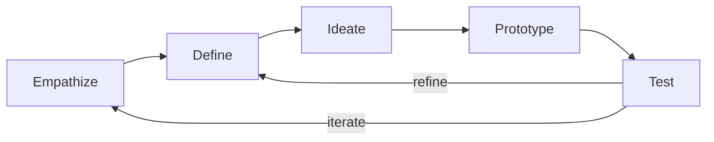
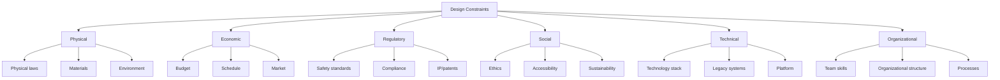
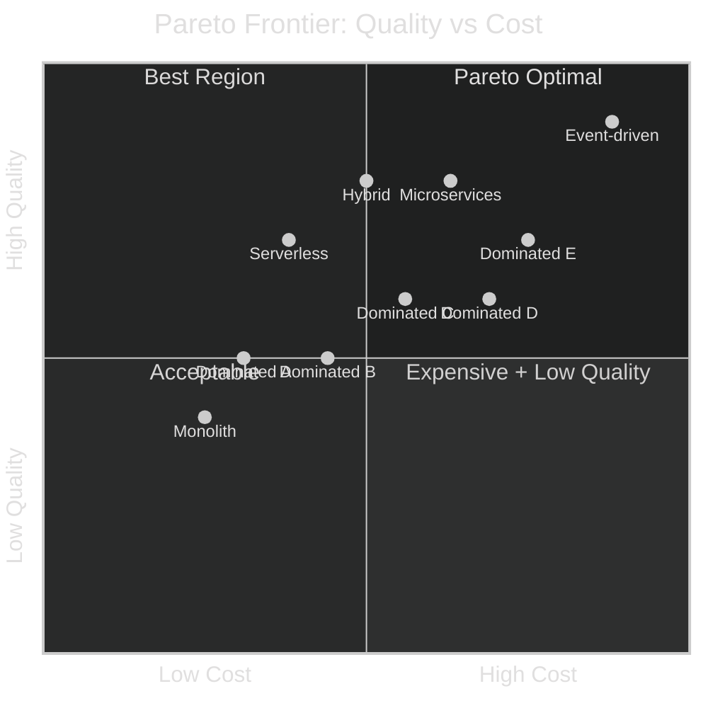

# Engineering Design

> *Source: SWEBOK v4 Chapter 18, Knowledge Area 18.2*

## Purpose

Engineering design is the creative, iterative, decision-making process at the heart of every engineering discipline. It is where understanding of the problem transforms into specification of a solution. This note explores the nature of design, the concept of wicked problems, design thinking, constraints, optimization, and how engineering design relates to software design.

---

## What Is Engineering Design?

Engineering design is an **open-ended, iterative, creative, decision-making, problem-solving activity**. Unlike analysis (which has a single correct answer), design has many possible solutions, and the "best" solution depends on context, constraints, and values.

**Characteristics of Engineering Design:**

| Characteristic | Description |
|---|---|
| **Open-ended** | Multiple valid solutions exist; there is no single correct answer |
| **Iterative** | Designs evolve through cycles of creation, evaluation, and refinement |
| **Creative** | Novel solutions are often required; routine application of known patterns is insufficient |
| **Decision-making** | Every design choice is a decision among alternatives |
| **Problem-solving** | The goal is to solve a real problem, not to produce a document |
| **Constrained** | Solutions must satisfy physical, economic, regulatory, and social constraints |
| **Multidisciplinary** | Design draws on knowledge from many fields |

> "Design is the essence of engineering." -- SWEBOK v4

---

## Wicked Problems

Rittel and Webber (1973) introduced the concept of **wicked problems** in their seminal paper "Dilemmas in a General Theory of Planning." Wicked problems are fundamentally different from "tame" problems that can be solved with known methods.

### Properties of Wicked Problems

| Property | Description | Software Engineering Example |
|---|---|---|
| **Vaguely defined** | The problem cannot be precisely stated until a solution is proposed | "Make the system better" |
| **No stopping rule** | There is no definitive test for completion; you can always improve | When is software "done"? |
| **Solutions are not true/false** | Solutions are better or worse, not right or wrong | Architecture A is "more scalable" than B, but not "correct" |
| **Every solution is a one-shot operation** | You cannot try a solution, observe the result, and try again unchanged | Deploying a system changes the organization |
| **No enumerable set of solutions** | You cannot list all possible solutions and pick the best | The design space is infinite |
| **Every problem is unique** | Each situation has its own combination of constraints and stakeholders | No two enterprise systems are identical |
| **Symptom of another problem** | Solving one problem creates or reveals another | Fixing performance degrades maintainability |

### Wicked Problems in Software Engineering

Software engineering is particularly prone to wicked problems because:

1. **Software is invisible** -- You cannot point to a software architecture and say "that part is wrong" (see [[13_Software_Architecture]])
2. **Requirements are emergent** -- Users do not know what they want until they see a prototype (see [[12_Requirements_Engineering]])
3. **Technology changes rapidly** -- The solution landscape shifts during the project
4. **Human factors dominate** -- Software is built by and for people, with all their complexity

### Strategies for Wicked Problems

| Strategy | Description |
|---|---|
| **Iterative prototyping** | Build, learn, refine: do not try to solve the whole problem at once |
| **Stakeholder engagement** | Involve all affected parties in the design process |
| **Re-framing** | Challenge the problem statement itself; look at the problem from different angles |
| **Satisficing** | Find a solution that is "good enough" rather than optimal (Herbert Simon) |
| **Decomposition** | Break the wicked problem into less-wicked sub-problems |
| **Scenario-based design** | Design for specific use cases rather than abstract requirements |

---

## Design Thinking

Design thinking is a human-centered approach to innovation and problem-solving that has been widely adopted in engineering and software development.

### The Five Stages

| Stage | Activity | Software Engineering Application |
|---|---|---|
| **Empathize** | Observe and engage with users to understand their experiences, needs, and pain points | User interviews, contextual inquiry, personas |
| **Define** | Synthesize findings into a clear problem statement | Problem statement, user stories, requirements |
| **Ideate** | Generate a wide range of creative solutions | Brainstorming, TRIZ, design workshops |
| **Prototype** | Build quick, inexpensive representations of ideas | UI mockups, architectural spikes, proof of concept |
| **Test** | Gather feedback from users on prototypes | Usability testing, A/B testing, beta programs |

### Design Thinking vs Traditional Engineering

| Dimension | Traditional Engineering | Design Thinking |
|---|---|---|
| **Starting point** | Requirements specification | User empathy |
| **Process** | Sequential phases | Iterative cycles |
| **Success metric** | Meets specification | Solves user problem |
| **Risk management** | Upfront analysis | Rapid prototyping |
| **Documentation** | Comprehensive specs | Minimal viable documentation |
| **Failure approach** | Prevent failure | Fail fast, learn fast |

---

## Design Constraints

Every design operates within constraints. Understanding and managing constraints is a core engineering competency.

### Types of Design Constraints

| Constraint Category | Physical Engineering | Software Engineering |
|---|---|---|
| **Physical laws** | Gravity, thermodynamics, electromagnetism | Computability, complexity theory |
| **Materials** | Steel, concrete, polymers | Languages, frameworks, libraries |
| **Cost** | Manufacturing, materials, labor | Development, licensing, infrastructure |
| **Schedule** | Construction time, lead times | Time-to-market, sprint cycles |
| **Regulations** | Building codes, safety standards | GDPR, HIPAA, PCI-DSS, SOX |
| **Safety** | Structural integrity, fire codes | Security, reliability, data protection |
| **Environment** | Weather, geography, climate | Deployment platform, network, scale |

### Constraints as Design Drivers

Constraints are not merely limitations: they are **design drivers** that shape the solution space. A constraint like "must handle 10,000 concurrent users" eliminates entire categories of solutions and drives architectural decisions.

> "Constraints liberate, liberties constrain." -- Runeson (2000)

The paradox: more constraints can make design easier by reducing the solution space, while fewer constraints increase ambiguity and decision burden.

---

## Design Optimization

Engineering design frequently involves optimization: finding the best solution according to defined criteria.

### Multi-Objective Optimization

Real engineering problems rarely have a single objective. More often, multiple competing objectives must be balanced:

| Objective Pair | Trade-off |
|---|---|
| **Performance vs Cost** | Faster systems cost more to build and operate |
| **Security vs Usability** | Stronger security often adds friction |
| **Time-to-market vs Quality** | Faster delivery means less testing |
| **Flexibility vs Simplicity** | More flexible designs are harder to understand |
| **Scalability vs Latency** | Distributed systems scale but add network latency |

### Pareto Frontier

The Pareto frontier represents the set of solutions where no objective can be improved without degrading another:

> Solutions in **quadrant-1** (high quality, high cost) and along the diagonal are **Pareto-optimal**: no objective can improve without degrading another. Solutions in **quadrant-3** are **dominated** by Pareto-optimal solutions.

> The upper line is the **Pareto frontier** (optimal solutions). The lower scatter points are **dominated solutions** where another solution exists that is better on at least one objective and no worse on any other.

**Pareto-optimal solutions** are those on the frontier. Solutions below the frontier are "dominated" -- there exists another solution that is better on at least one objective and no worse on any other.

**Example: Architecture Selection Pareto Analysis**

| Architecture | Performance Score | Cost ($K) | Maintainability Score | Pareto-Optimal? |
|---|---|---|---|---|
| Monolith | 6 | 200 | 4 | No (dominated by Microservices) |
| Microservices | 8 | 500 | 7 | Yes |
| Serverless | 7 | 300 | 6 | Yes |
| Event-driven | 9 | 700 | 5 | Yes |
| Hybrid | 8 | 400 | 6 | Yes |

### Trade-off Surfaces

In problems with more than two objectives, the Pareto frontier becomes a **Pareto surface** in multi-dimensional space. Visualization techniques include:

- **Radar/spider charts** -- Show multiple objectives on axes radiating from a center
- **Parallel coordinate plots** -- Each objective is a vertical axis; solutions are polylines
- **Heat maps** -- Pairwise trade-off visualization

---

## Design for X (DfX)

"Design for X" refers to designing with a specific quality attribute as a primary concern. Each "X" represents a design philosophy:

| DfX Variant | Primary Concern | Techniques |
|---|---|---|
| **Design for Manufacturability (DfM)** | Ease of manufacturing | Standard parts, modular design, automated assembly |
| **Design for Testability (DfT)** | Ease of testing | Built-in self-test, observability, controllability |
| **Design for Sustainability (DfS)** | Environmental impact | Energy efficiency, material selection, lifecycle analysis |
| **Design for Safety (DfSa)** | Safety assurance | Fault tolerance, redundancy, fail-safe design |
| **Design for Maintainability (DfMai)** | Ease of maintenance | Modular design, documentation, diagnostic tools |
| **Design for Usability (DfU)** | User experience | User-centered design, accessibility, consistency |
| **Design for Security (DfSec)** | Security posture | Defense in depth, least privilege, secure defaults |
| **Design for Reliability (DfR)** | Reliability | Redundancy, error handling, graceful degradation |

In software engineering, these DfX principles manifest as architectural quality attributes. See [[14_Design_Principles_and_Patterns]] for design patterns that address specific quality attributes.

---

## Concurrent Engineering

Concurrent engineering (also called simultaneous engineering) is the practice of performing design activities in parallel rather than sequentially.

**Sequential vs Concurrent:**

```mermaid
gantt
    title Sequential vs Concurrent Engineering
    dateFormat X
    axisFormat %s

    section Sequential
    Requirements    :a1, 0, 3
    Architecture    :a2, after a1, 3
    Design          :a3, after a2, 3
    Implementation  :a4, after a3, 3
    Testing         :a5, after a4, 3

    section Concurrent
    Requirements    :b1, 0, 3
    Architecture    :b2, 1, 4
    Design          :b3, 2, 5
    Implementation  :b4, 3, 6
    Testing         :b5, 4, 7
```

**Benefits of Concurrent Engineering:**

- Reduced time-to-market
- Earlier discovery of design conflicts
- Better integration across design domains
- More informed decision-making (designers see downstream constraints early)

**Risks of Concurrent Engineering:**

- Rework if upstream decisions change
- Requires strong communication and coordination
- Higher coordination overhead

In software, concurrent engineering manifests as cross-functional teams, DevOps practices, and shift-left testing. See [[23_Industry_4_and_Continuous_SE]] for modern concurrent engineering approaches.

---

## Engineering Design vs Software Design

While engineering design principles apply to software, there are important differences:

| Dimension | Physical Engineering Design | Software Design |
|---|---|---|
| **Material** | Physical materials with fixed properties | Abstract, malleable "stuff" |
| **Constraints** | Physical laws are absolute | Software constraints are mostly human-imposed |
| **Prototyping** | Expensive, time-consuming | Relatively cheap and fast |
| **Manufacturing** | Separate from design | Compilation/deployment is automated |
| **Failure modes** | Structural, thermal, mechanical | Logical, concurrency, integration |
| **Iteration cost** | High (tooling, materials) | Low (code changes are cheap in theory) |
| **Design artifacts** | Blueprints, CAD models, specifications | Code, UML, architecture documents |
| **Reversibility** | Difficult (once built, hard to change) | Easier (but technical debt accumulates) |

**Shared Goals:**

Despite differences, both share the fundamental goals:
1. Solve the real problem
2. Satisfy all constraints
3. Optimize for multiple objectives
4. Produce a design that can be implemented, tested, and maintained

See [[13_Software_Architecture]] for software-specific design concerns and [[14_Design_Principles_and_Patterns]] for software design patterns.

---

## Design Competency and Accreditation

Engineering accreditation bodies require demonstrated design competency:

| Body | Region | Design Competency Requirement |
|---|---|---|
| **ABET** | United States | "An ability to design systems, components, or processes to meet desired needs" |
| **CEAB** | Canada | "Use engineering design processes to meet specified requirements" |
| **EUR-ACE** | Europe | "Ability to design products, processes, and methods" |
| **Washington Accord** | International | Mutual recognition of design competency standards |

These accreditation standards confirm that design is not an optional skill: it is a core engineering competency that must be taught, practiced, and assessed.

---

## Key Takeaways

1. **Engineering design is creative problem-solving** -- not merely applying known formulas
2. **Wicked problems are the norm** in software engineering -- expect ambiguity and iteration
3. **Design thinking** provides a structured approach to creative design
4. **Constraints drive design** -- they are liberating, not limiting
5. **Multi-objective optimization** requires explicit trade-off analysis (Pareto frontiers)
6. **Design for X** principles ensure specific quality attributes are addressed
7. **Concurrent engineering** reduces time-to-market but requires coordination
8. **Software design shares goals** with physical engineering design but differs in constraints and materials

---

## Related Notes

- [[10_SE_Fundamentals_and_Process]]: Software engineering process context
- [[12_Requirements_Engineering]]: Requirements as design input
- [[13_Software_Architecture]]: High-level software design
- [[14_Design_Principles_and_Patterns]]: Detailed design patterns and principles
- [[16_Testing_Strategies]]: Testing designs and implementations
- [[18_Evaluation_and_Improvement]]: Evaluating design quality
- [[20_Root_Cause_Analysis]]: Understanding design failures
- [[25_Engineering_Standards_and_Process]]: Standards as design constraints
- [[26_The_Engineering_Process]]: The five-step process that includes design
- [[28_Abstraction_and_Encapsulation]]: Key design concepts
- [[29_Modeling_Simulation_and_Prototyping]]: Tools for design evaluation
