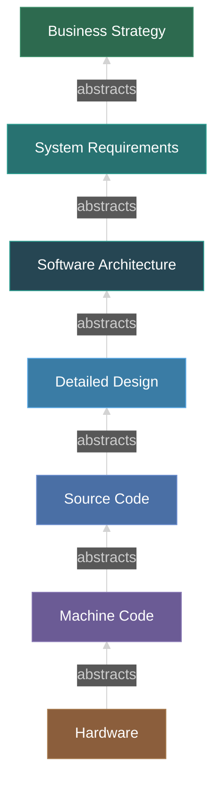
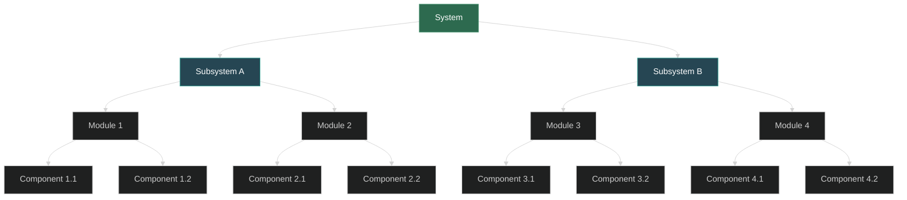
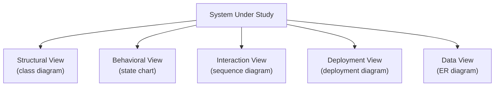

# Abstraction and Encapsulation

> *Source: SWEBOK v4 Chapter 18, Knowledge Area 18.3*

## Purpose

Abstraction and encapsulation are two of the most fundamental concepts in engineering and software engineering. They are the primary mechanisms by which engineers manage complexity: the ability to deal with systems so large and intricate that no single human mind can comprehend all their details simultaneously.

> "The purpose of abstraction is not to be vague, but to create a new semantic level in which one can be absolutely precise." -- Edsger W. Dijkstra (1972)

---

## Abstraction: Definition and Nature

**Abstraction** is both a **process** and a **result**:

- **As a process**: the act of generalization -- reducing information about an object or system to focus on the details relevant to a particular purpose
- **As a result**: the generalized representation that emerges from this process

Abstraction does not mean "simplification" or "loss of detail." It means **selective attention**: choosing which details matter for the current context and suppressing the rest.

**Key Properties of Abstraction:**

| Property | Description |
|---|---|
| **Purposeful** | Abstraction serves a specific goal; different goals produce different abstractions of the same system |
| **Reversible** | You can move between levels of abstraction (abstract and concretize) |
| **Layered** | Abstractions stack on top of each other in hierarchies |
| **Perspectival** | Different observers may abstract the same system differently |
| **Essential** | Without abstraction, engineering of complex systems is impossible |

---

## Abstraction Hierarchies

Abstractions are organized in hierarchies. SWEBOK identifies three types of abstraction hierarchies:

### Sequential (Linear) Abstraction

A linear chain where each level abstracts the one below it:

Each level adds semantic meaning and suppresses implementation detail. This is the most common abstraction hierarchy in software engineering.

### Tree Abstraction

A branching hierarchy where one abstraction at a higher level relates to multiple abstractions at a lower level:

This is the classic decomposition hierarchy. At each level, the engineer sees only the components and their interfaces, not the internal details of each component.

### Many-to-Many Abstraction

Multiple abstractions at the same level illuminate the same system from different perspectives:

These are **alternate abstractions**: each captures different aspects of the same reality. No single abstraction is complete; together they provide a fuller understanding.

> A class diagram, a state chart, and a sequence diagram are three alternate abstractions of the same system. Each illuminates what the others obscure.

---

## Abstraction from Task Decomposition

Abstraction arises naturally when a complex task is decomposed into simpler sub-tasks. Each sub-task becomes an abstraction that hides the complexity of its implementation.

**Example: Online Purchase System**

| Level | Abstraction | Details Hidden |
|---|---|---|
| **Business** | "Customer places order" | All technical implementation |
| **System** | "Process payment" | Payment gateway specifics |
| **Service** | "Charge credit card" | Network protocols, encryption |
| **Component** | "Submit transaction to gateway" | API format, error handling |
| **Code** | `paymentGateway.charge(amount)` | Method implementation, memory management |

At each level, the engineer can reason about the system without being overwhelmed by details from lower levels.

---

## Encapsulation

**Encapsulation** is the complementary concept to abstraction. While abstraction creates levels, encapsulation **protects** them:

> Encapsulation hides details of levels above and below, allowing the engineer to focus on the current level.

**Encapsulation serves two purposes:**

1. **Information hiding** -- Preventing unauthorized access to implementation details
2. **Modularity** -- Enabling independent development and evolution of components

### Information Hiding (Parnas)

David Parnas (1972) introduced the principle of **information hiding**: each module should hide a design decision from all other modules. The module exposes only its interface; its implementation is hidden.

| Aspect | Exposed (Interface) | Hidden (Implementation) |
|---|---|---|
| **What** | What the module does | How it does it |
| **Contract** | Input/output, pre/post conditions | Algorithm, data structures |
| **Change** | Interface should be stable | Implementation can change freely |
| **Access** | Public API | Private internals |

**Information Hiding in Practice:**

```mermaid
graph LR
    A["Client Module"] -->|"interface"| B["Service Module"]
    B -->|"interface"| C["Database"]

    style B fill:#2d3748,stroke:#4a5568

    B -.-|"hidden"| B1["Algorithm choice"]
    B -.-|"hidden"| B2["Data structures"]
    B -.-|"hidden"| B3["Caching strategy"]
    B -.-|"hidden"| B4["Error handling"]
```

The client module interacts with the service module through its interface. It does not know, and should not depend on, how the service module implements its functionality. This enables the service module to change its implementation without affecting clients.

### Interface Design as Encapsulation Boundary

The **interface** is the boundary between what is exposed and what is hidden. Good interface design is critical:

| Interface Quality | Good | Bad |
|---|---|---|
| **Minimal** | Exposes only what clients need | Exposes internal details |
| **Complete** | Supports all required operations | Requires clients to work around limitations |
| **Stable** | Does not change frequently | Breaking changes with every release |
| **Expressive** | Names and signatures convey intent | Cryptic names, inconsistent conventions |
| **Cohesive** | Operations are logically related | Random collection of unrelated operations |

See [[14_Design_Principles_and_Patterns]] for detailed coverage of interface design principles.

---

## Abstraction in Engineering vs Software

Abstraction is used in all engineering disciplines, but the forms differ:

### Physical Engineering Abstractions

| Domain | Abstraction | What It Represents |
|---|---|---|
| **Electrical** | Circuit diagram | Components and connections; hides physical layout |
| **Mechanical** | CAD model | Geometry and dimensions; hides material microstructure |
| **Civil** | Architectural blueprint | Structure and layout; hides construction details |
| **Chemical** | Process flow diagram | Chemical processes; hides equipment internals |
| **Aerospace** | System schematic | Subsystem interactions; hides component details |

### Software Abstractions

| Domain | Abstraction | What It Represents |
|---|---|---|
| **Structural** | UML class diagram | Classes, relationships; hides method implementations |
| **Behavioral** | State chart | State transitions; hides processing logic |
| **Interaction** | Sequence diagram | Message flows; hides object internals |
| **Data** | Entity-relationship diagram | Data model; hides storage implementation |
| **Process** | Data flow diagram | Data transformations; hides algorithm details |
| **Deployment** | Deployment diagram | Physical architecture; hides network configuration |

### Comparison

| Dimension | Physical Engineering | Software Engineering |
|---|---|---|
| **Medium** | Physical artifacts | Abstract information |
| **Fidelity** | Abstractions lose physical detail | Abstractions lose logical detail |
| **Validation** | Physical testing validates abstractions | Testing and review validate abstractions |
| **Standardization** | Well-established conventions (ANSI, ISO) | Evolving conventions (UML, ArchiMate) |
| **Reversibility** | Can build from blueprint | Can generate code from models (MDD) |

---

## Levels of Abstraction in Software

Software engineering operates across a wide spectrum of abstraction levels:

```mermaid
graph TD
    L1["Business/Domain Level"] -->|"requirements"| L2["Requirements Level"]
    L2 -->|"specification"| L3["Architecture Level"]
    L3 -->|"design decisions"| L4["Design Level"]
    L4 -->|"implementation"| L5["Code Level"]
    L5 -->|"compilation"| L6["Executable Level"]
    L6 -->|"execution"| L7["Hardware Level"]

    style L1 fill:#1a365d,stroke:#2a4a7f
    style L2 fill:#1a365d,stroke:#2a4a7f
    style L3 fill:#2d3748,stroke:#4a5568
    style L4 fill:#2d3748,stroke:#4a5568
    style L5 fill:#4a5568,stroke:#718096
    style L6 fill:#4a5568,stroke:#718096
    style L7 fill:#718096,stroke:#a0aec0
```

| Level | Focus | Abstraction | Key Artifacts |
|---|---|---|---|
| **Business** | Business goals and processes | "What does the business need?" | Business case, process models |
| **Requirements** | System behavior and constraints | "What must the system do?" | SRS, user stories, use cases |
| **Architecture** | System structure and quality | "How is the system organized?" | Architecture diagrams, views |
| **Design** | Component internals | "How does each part work?" | Class diagrams, sequence diagrams |
| **Code** | Implementation details | "What does the machine execute?" | Source code, unit tests |
| **Executable** | Runtime behavior | "What is actually running?" | Binaries, containers, processes |
| **Hardware** | Physical execution | "Where does computation happen?" | Servers, networks, storage |

Each level is an abstraction of the level below it. Engineers working at the architecture level should not need to know about hardware details; engineers working at the hardware level should not need to know about business processes.

See [[13_Software_Architecture]] for the architecture level and [[14_Design_Principles_and_Patterns]] for the design level.

---

## Alternate Abstractions

**Alternate abstractions** are multiple representations of the same system, each highlighting different aspects:

| Viewpoint | Representation | What It Reveals |
|---|---|---|
| **Structural** | Class diagram | Components and relationships |
| **Behavioral** | State chart | State transitions and events |
| **Interaction** | Sequence diagram | Message flows between objects |
| **Functional** | Data flow diagram | Data transformations |
| **Physical** | Deployment diagram | Physical distribution |
| **Data** | Entity-relationship diagram | Data model and relationships |

No single representation is complete. The engineer must synthesize multiple views to understand the system.

**Example: A Payment Processing System**

- **Class diagram** shows: PaymentService, PaymentGateway, Transaction, Receipt classes
- **State chart** shows: Transaction states (pending, authorized, captured, refunded, failed)
- **Sequence diagram** shows: The message flow from client to PaymentService to PaymentGateway to bank
- **ER diagram** shows: Transaction, Customer, PaymentMethod entities and relationships

Each view is an alternate abstraction of the same system. Together they provide a complete picture.

---

## Abstraction Mechanisms in Programming

Programming languages provide specific mechanisms for creating and managing abstractions:

| Mechanism | What It Abstracts | Example |
|---|---|---|
| **Variable** | A named memory location | `int counter = 0;` |
| **Function/Method** | A sequence of operations | `calculateTotal(items)` |
| **Class** | Data + operations | `class PaymentService { ... }` |
| **Interface** | Contract without implementation | `interface PaymentGateway { ... }` |
| **Module/Package** | Group of related classes | `com.example.payment` |
| **Service** | Deployable unit of functionality | Payment microservice |
| **API** | System-level interface | REST API, GraphQL schema |

Each mechanism creates an abstraction that hides implementation details behind an interface.

### Abstraction Leaks

An **abstraction leak** occurs when implementation details that should be hidden become visible to clients:

| Leak Type | Example | Consequence |
|---|---|---|
| **Performance leak** | Clients must batch queries to avoid N+1 problem | Clients coupled to storage implementation |
| **Error leak** | Database exception propagated to UI layer | Clients must handle internal errors |
| **Format leak** | Internal data format exposed in API | Changes to format break clients |
| **Timing leak** | Clients depend on synchronous behavior | Cannot switch to async without breaking clients |

> "All non-trivial abstractions, to some degree, are leaky." -- Joel Spolsky

---

## Key Takeaways

1. **Abstraction is essential** for managing complexity in engineering
2. **Dijkstra's insight**: abstraction creates precision, not vagueness
3. **Three hierarchy types**: sequential, tree, and many-to-many
4. **Encapsulation protects** abstraction levels from each other
5. **Information hiding** (Parnas) is the foundation of modular design
6. **Interface design** defines the encapsulation boundary
7. **Alternate abstractions** illuminate different aspects of the same system
8. **Software operates across many abstraction levels** from business to hardware
9. **Abstraction leaks** are inevitable but should be minimized

---

## Related Notes

- [[10_SE_Fundamentals_and_Process]]: Process abstraction levels
- [[13_Software_Architecture]]: Architecture as a high-level abstraction
- [[14_Design_Principles_and_Patterns]]: Design patterns as abstraction mechanisms
- [[15_Coding_Standards_and_Practices]]: Code-level abstraction practices
- [[16_Testing_Strategies]]: Testing at different abstraction levels
- [[21_Measurement_Theory]]: Measuring abstraction quality (coupling, cohesion)
- [[26_The_Engineering_Process]]: How abstraction supports the engineering process
- [[27_Engineering_Design]]: Design as the creation of abstractions
- [[29_Modeling_Simulation_and_Prototyping]]: Models as abstractions of reality
