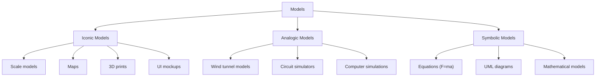
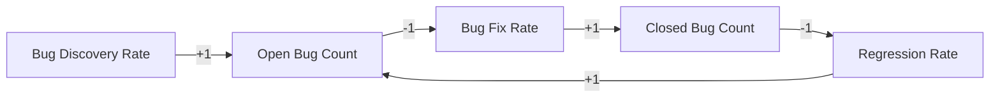
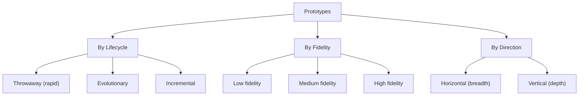
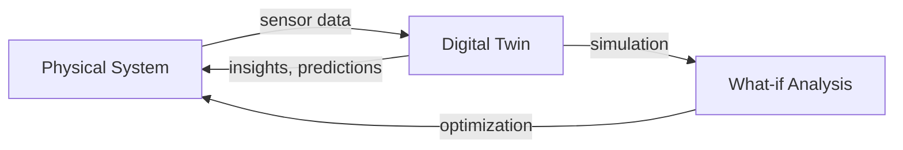
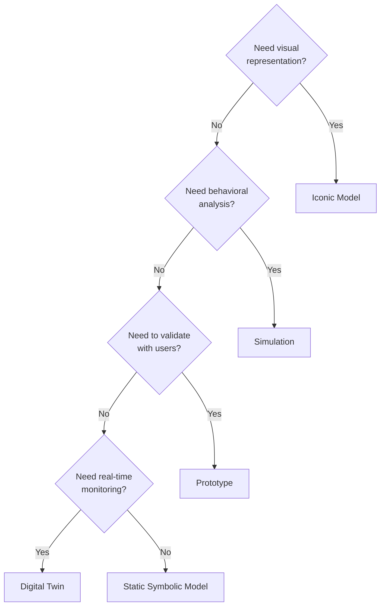

# Modeling, Simulation, and Prototyping

> *Source: SWEBOK v4 Chapter 18, Knowledge Area 18.6*

## Purpose

Engineers cannot always build the real thing to evaluate it. Models, simulations, and prototypes provide ways to explore, evaluate, and validate designs before committing to full implementation. These tools are essential for managing risk, reducing cost, and improving design quality across all engineering disciplines, including software engineering.

---

## Three Types of Models

SWEBOK identifies three fundamental types of models, each representing reality at a different level of fidelity:

### Iconic Models (Visually Equivalent)

Iconic models are **visually similar** to the real thing. They preserve appearance but may not preserve function.

| Model Type | Domain | What It Shows |
|---|---|---|
| **Scale model** | Civil/Mechanical | Physical appearance, proportions, spatial relationships |
| **Map** | Geographic | Terrain, roads, boundaries |
| **3D print** | Manufacturing | Physical form, fit, assembly |
| **UI mockup/wireframe** | Software | Screen layout, navigation flow |
| **Architectural rendering** | Construction | Building appearance, materials |
| **Clay model** | Automotive | Vehicle shape, aesthetics |

**Iconic Models in Software:**

- **Wireframes** -- Low-fidelity screen layouts showing content placement
- **UI mockups** -- Higher-fidelity visual designs showing colors, fonts, icons
- **Storyboards** -- Sequential visual narratives showing user journeys
- **Paper prototypes** -- Hand-drawn screens for quick feedback

| Fidelity Level | Speed to Create | Cost | Feedback Quality |
|---|---|---|---|
| **Paper sketch** | Minutes | None | Layout, flow |
| **Wireframe** | Hours | Low | Structure, navigation |
| **High-fidelity mockup** | Days | Medium | Visual design, branding |
| **Interactive prototype** | Days-Weeks | Medium-High | Interaction, usability |

### Analogic Models (Functionally Equivalent)

Analogic models are **functionally similar** to the real thing. They preserve behavior but may not preserve appearance.

| Model Type | Domain | What It Demonstrates |
|---|---|---|
| **Wind tunnel model** | Aerospace | Aerodynamic behavior |
| **Circuit simulator** | Electrical | Electrical behavior (SPICE) |
| **Computer simulation** | Any | Dynamic behavior over time |
| **Hydraulic model** | Civil | Fluid flow behavior |
| **Thermal model** | Mechanical | Heat transfer behavior |

**Analogic Models in Software:**

- **Performance simulators** -- Model system behavior under load
- **Network simulators** -- Model network traffic and congestion (NS-3, OMNeT++)
- **Discrete event simulators** -- Model queuing systems and workflows
- **Monte Carlo simulations** -- Model stochastic processes

### Symbolic Models (Equations and Higher Abstractions)

Symbolic models use **mathematical or logical notation** to represent reality. They are the highest level of abstraction.

| Model Type | Domain | Example |
|---|---|---|
| **Physics equations** | Physics | F = ma, E = mc^2 |
| **UML diagrams** | Software | Class, sequence, state diagrams |
| **Entity-relationship diagrams** | Data | Database schema |
| **Mathematical optimization** | Operations Research | Linear programming |
| **Statistical models** | Data Science | Regression, classification |
| **Formal specifications** | Software | Z notation, TLA+, Alloy |

**Symbolic Models in Software:**

| Model Type | Notation | What It Models |
|---|---|---|
| **Structural** | UML class diagram | Component relationships |
| **Behavioral** | UML state chart | State transitions |
| **Interaction** | UML sequence diagram | Message flows |
| **Data** | ER diagram | Data entities and relationships |
| **Process** | BPMN | Business processes |
| **Formal** | TLA+, Alloy | System properties and invariants |

---

## Model Comparison

| Dimension | Iconic | Analogic | Symbolic |
|---|---|---|---|
| **Similarity** | Visual | Functional | Abstract |
| **Fidelity to reality** | High (appearance) | High (behavior) | Low (representation) |
| **Cost** | Low-Medium | Medium-High | Low (once defined) |
| **Ease of creation** | Easy-Medium | Medium-Hard | Easy (for simple models) |
| **Analyzability** | Limited | Good | Excellent |
| **Precision** | Low | Medium | High |
| **Best for** | Communication, aesthetics | Behavior exploration | Analysis, formal verification |

---

## Simulation in Engineering

Simulation uses models to study system behavior over time. It is particularly valuable when:

- The real system does not yet exist
- Experimentation on the real system is too expensive or dangerous
- The real system operates on timescales that are too fast or too slow to observe

### Continuous Simulation

Continuous simulation models systems where state variables change continuously over time, typically using differential equations.

**Techniques:**

| Technique | Description | Application |
|---|---|---|
| **Differential equations** | Model rates of change | Physics, control systems |
| **System dynamics** | Model feedback loops and accumulations | Business processes, ecosystems |
| **Finite element analysis** | Model structural behavior | Mechanical, civil engineering |
| **Computational fluid dynamics** | Model fluid flow | Aerospace, chemical engineering |

**System Dynamics Example:**

This feedback loop models the dynamics of software quality: bugs are discovered, fixed, and some fixes introduce regressions. System dynamics simulation can predict steady-state bug counts and identify leverage points.

### Discrete Event Simulation

Discrete event simulation models systems where state changes occur at discrete points in time (events).

**Techniques:**

| Technique | Description | Application |
|---|---|---|
| **Queuing models** | Model waiting lines and service | Server capacity, call centers |
| **Monte Carlo simulation** | Model stochastic processes using random sampling | Risk analysis, estimation |
| **Petri nets** | Model concurrent processes | Workflow analysis, protocol verification |
| **Markov chains** | Model state transitions with probabilities | Reliability, availability |

**Queuing Model for Web Server:**

| Parameter | Value | Meaning |
|---|---|---|
| **Arrival rate (lambda)** | 1000 requests/sec | Incoming traffic |
| **Service rate (mu)** | 1200 requests/sec | Server capacity |
| **Utilization (rho)** | 0.83 | 83% busy |
| **Avg queue length** | 4.17 requests | Waiting requests |
| **Avg response time** | 4.17 ms | Time in system |
| **95th percentile** | ~12 ms | Tail latency |

See [[24_Statistical_Inference]] for Monte Carlo methods and statistical simulation.

### Agent-Based Simulation

Agent-based simulation models systems as collections of autonomous agents that interact according to rules.

| Aspect | Description |
|---|---|
| **Agents** | Autonomous entities with individual behavior rules |
| **Environment** | Shared space where agents interact |
| **Rules** | Local decision rules for each agent |
| **Emergence** | System-level behavior emerges from agent interactions |

**Software Engineering Applications:**

- Modeling developer productivity and team dynamics
- Simulating deployment rollouts and failure propagation
- Modeling user adoption and feature usage patterns
- Simulating microservice architectures with failure scenarios

---

## Simulation for Software Engineering

Simulation is increasingly important in software engineering:

| Simulation Type | What It Models | Tools |
|---|---|---|
| **Performance modeling** | Response time, throughput, resource usage | JMeter, Gatling, Queueing models |
| **Capacity planning** | Infrastructure sizing for projected load | Load testing, queuing theory |
| **Network simulation** | Network protocols, latency, bandwidth | NS-3, OMNeT++, Mininet |
| **Security simulation** | Attack scenarios, vulnerability exploitation | Attack graphs, threat models |
| **Reliability simulation** | Failure rates, availability, MTBF | Fault tree analysis, Markov models |
| **Cost simulation** | Project cost estimation under uncertainty | Monte Carlo, COCOMO |

### Initialization Challenges

Simulation requires careful initialization to produce valid results:

| Challenge | Description | Mitigation |
|---|---|---|
| **Warm-up period** | Simulated system needs time to reach steady state | Discard initial transient data |
| **Initial conditions** | Starting state affects results | Run multiple initializations, compare |
| **Random seed** | Monte Carlo results vary with random seed | Run with multiple seeds, report confidence intervals |
| **Model fidelity** | Simplified models may miss important behaviors | Validate against real-world data |
| **Parameter estimation** | Input parameters may be uncertain | Sensitivity analysis, calibration |

---

## Prototyping

A prototype is a preliminary model of a system, built to explore, evaluate, or communicate a design.

### Types of Prototypes

#### By Lifecycle Intent

| Type | Description | When to Use |
|---|---|---|
| **Throwaway** | Built to answer questions, then discarded | Early exploration, requirement validation |
| **Evolutionary** | Built to evolve into the final system | When requirements are unclear, agile development |
| **Incremental** | Each increment is a working prototype that adds features | Large systems, phased delivery |

#### By Fidelity

| Level | Description | Cost | Feedback |
|---|---|---|---|
| **Low fidelity** | Paper sketches, wireframes | Minutes-hours | Layout, flow, concept |
| **Medium fidelity** | Interactive mockups, clickable designs | Hours-days | Navigation, interaction |
| **High fidelity** | Working code with limited backend | Days-weeks | Realistic behavior, performance |

#### By Direction

| Direction | Description | When to Use |
|---|---|---|
| **Horizontal** | Covers breadth of functionality with shallow depth | UI design, workflow validation |
| **Vertical** | Covers depth of one feature with real implementation | Technical risk, architecture validation |

### Prototyping for Software

| Prototype Type | Purpose | Fidelity | Lifetime |
|---|---|---|---|
| **UI prototype** | Validate user interface design | Low-High | Throwaway or evolutionary |
| **Architectural spike** | Prove a technical approach works | Medium | Throwaway |
| **Proof of concept** | Demonstrate feasibility of an idea | Low-Medium | Throwaway |
| **Minimum viable product (MVP)** | Validate market demand with minimal features | High | Evolutionary |
| **Functional prototype** | Demonstrate specific functionality | Medium-High | Throwaway or incremental |

**Architectural Spike Example:**

An architectural spike might test:
- Can the chosen database handle the expected write throughput?
- Does the authentication library integrate with the identity provider?
- Can the message broker handle the expected message volume?

These are focused, time-boxed experiments that reduce technical risk before committing to a full design. See [[13_Software_Architecture]] for architectural decision-making.

---

## Model Validation and Verification (V&V)

Models themselves must be validated and verified. This is distinct from V&V of the system being modeled.

| Concept | Question | Activity |
|---|---|---|
| **Verification** | "Did we build the model right?" | Check that the model correctly implements its specification |
| **Validation** | "Did we build the right model?" | Check that the model accurately represents reality |

### V&V Techniques for Models

| Technique | Applies To | Description |
|---|---|---|
| **Face validation** | All models | Experts review the model and judge its reasonableness |
| **Historical data validation** | Simulation models | Compare model output to historical data |
| **Sensitivity analysis** | All models | Vary inputs and check if outputs change as expected |
| **Degenerate test** | All models | Set inputs to extreme values and check behavior |
| **Internal validation** | Simulation | Run the model multiple times with different random seeds |
| **Comparison with other models** | All | Compare results with alternative models of the same system |
| **Traces** | All | Follow specific transactions through the model step by step |

**Sensitivity Analysis Example:**

| Parameter | Baseline | +10% | -10% | Sensitivity |
|---|---|---|---|---|
| Arrival rate | 1000 req/s | Response: 5.2ms | Response: 3.1ms | High |
| Service time | 0.8ms | Response: 6.1ms | Response: 2.8ms | High |
| Server count | 8 | Response: 3.8ms | Response: 5.5ms | Medium |
| Network latency | 2ms | Response: 4.3ms | Response: 4.0ms | Low |

Parameters with high sensitivity require more careful estimation.

---

## Digital Twins

A **digital twin** is a dynamic, real-time digital replica of a physical system. Unlike static models, digital twins are continuously synchronized with their physical counterpart.

| Aspect | Description |
|---|---|
| **Real-time sync** | Continuously updated with sensor data from the physical system |
| **Predictive** | Can predict future states and failures |
| **Prescriptive** | Can recommend actions to optimize performance |
| **Simulation** | Can run what-if scenarios without affecting the real system |

**Digital Twins in Software Engineering:**

| Application | Description |
|---|---|
| **Infrastructure twins** | Real-time model of cloud infrastructure, predicting failures and optimizing costs |
| **Application twins** | Model of application behavior, predicting performance degradation |
| **User behavior twins** | Model of user interaction patterns, predicting adoption and churn |
| **Security twins** | Model of attack surface, predicting vulnerability exploitation |

Digital twins represent the convergence of modeling, simulation, and real-time monitoring. They are increasingly important in DevOps and SRE practices.

---

## Choosing the Right Approach

| Question | Use This Approach |
|---|---|
| "What should the screen look like?" | Iconic model (UI mockup) |
| "How will the system behave under load?" | Simulation (performance model) |
| "Is this technical approach feasible?" | Prototype (architectural spike) |
| "What happens if this component fails?" | Simulation (reliability model) |
| "Can users figure out the interface?" | Prototype (UI prototype) |
| "What is the optimal architecture?" | Symbolic model (decision matrix) + simulation |
| "How will the system evolve over time?" | Digital twin |

**Decision Framework:**

---

## Model-Driven Engineering

Model-Driven Engineering (MDE) elevates models from documentation artifacts to primary engineering artifacts:

| Approach | Description | Example |
|---|---|---|
| **Model-Driven Architecture (MDA)** | Generate code from platform-independent models | UML to Java |
| **Domain-Specific Languages (DSLs)** | Custom languages for specific problem domains | SQL, HTML, Terraform |
| **Low-code/No-code** | Visual model-based development | Mendix, OutSystems |
| **Infrastructure as Code** | Model infrastructure declaratively | Terraform, CloudFormation |

MDE represents the ultimate abstraction: the model becomes the source of truth, and the implementation is generated.

---

## Key Takeaways

1. **Three model types**: iconic (visual), analogic (functional), symbolic (abstract)
2. **Simulation** brings models to life: continuous, discrete event, and agent-based
3. **Prototypes** validate designs with users: throwaway, evolutionary, incremental; horizontal, vertical
4. **Model V&V** is critical: verify the model is built right, validate it represents reality
5. **Digital twins** converge modeling, simulation, and real-time monitoring
6. **Choose the right approach** based on what question you need to answer
7. **Model-Driven Engineering** makes models the primary engineering artifact

---

## Related Notes

- [[10_SE_Fundamentals_and_Process]]: Process models as abstractions of the development process
- [[12_Requirements_Engineering]]: Models of requirements
- [[13_Software_Architecture]]: Architectural models and views
- [[14_Design_Principles_and_Patterns]]: Design models (UML)
- [[16_Testing_Strategies]]: Test models and simulation-based testing
- [[18_Evaluation_and_Improvement]]: Models for evaluation
- [[21_Measurement_Theory]]: Measurement models
- [[24_Statistical_Inference]]: Statistical models and Monte Carlo simulation
- [[26_The_Engineering_Process]]: Modeling as part of the engineering process
- [[27_Engineering_Design]]: Prototyping in the design process
- [[28_Abstraction_and_Encapsulation]]: Models as abstractions
